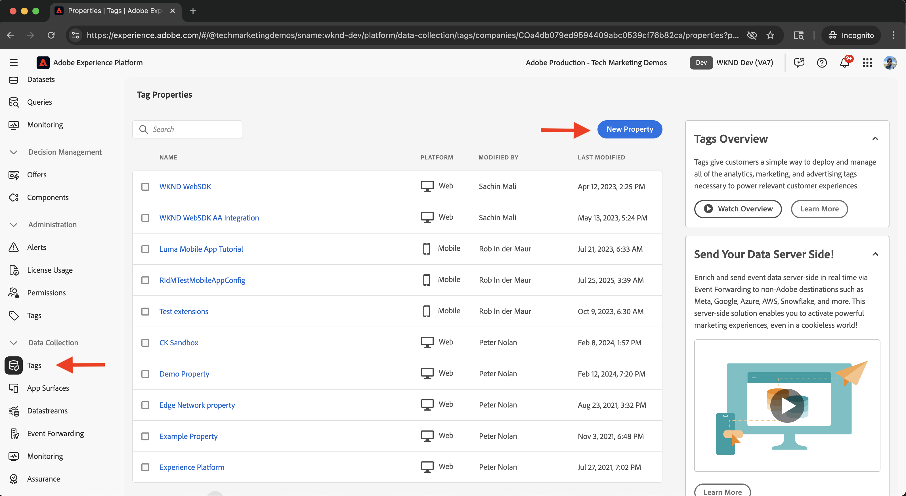
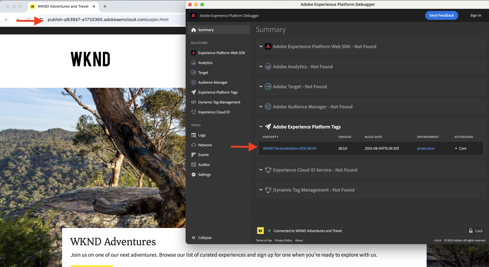

# Tags integreren in Adobe Experience Platform

Leer hoe u AEM as a Cloud Service (AEMCS) kunt integreren met tags in Adobe Experience Platform. Met de integratie Tags (ook wel Launch genoemd) kunt u de Adobe Web SDK implementeren en aangepaste JavaScript voor gegevensverzameling en personalisatie in uw AEM-pagina&#39;s injecteren.

Dankzij de integratie kan uw marketing- of ontwikkelingsteam JavaScript voor personalisatie en gegevensverzameling beheren en implementeren, zonder dat u de AEM-code opnieuw hoeft te implementeren.

## Stappen op hoog niveau

Het integratieproces omvat vier belangrijke stappen die de verbinding tussen AEM en Tags tot stand brengen:

1. **creeer, vorm, en publiceer een bezit van Markeringen in Adobe Experience Platform**
2. **verifieer een configuratie van Adobe IMS voor Markeringen in AEM**
3. **creeer een configuratie van Markeringen in AEM**
4. **pas de configuratie van Markeringen op uw pagina&#39;s van AEM toe**

## Een eigenschap voor tags maken, configureren en publiceren in Adobe Experience Platform

Begin door een bezit van Markeringen in Adobe Experience Platform te creëren. Met deze eigenschap kunt u de implementatie van de Adobe Web SDK en eventuele aangepaste JavaScript beheren die vereist zijn voor personalisatie en gegevensverzameling.

1. Ga naar [&#x200B; Adobe Experience Platform &#x200B;](https://experience.adobe.com/platform), teken binnen met uw Adobe ID, en navigeer aan **Markeringen** van het linkermenu.\
   

2. Klik **Nieuw Bezit** om een nieuw bezit van Markeringen tot stand te brengen.\
   

3. In **creeer Bezit** dialoog, ga het volgende in:
   - **Naam van het Bezit**: Een naam voor uw bezit van Markeringen
   - **Type van Bezit**: Selecteer **Web**
   - **Domein**: Het domein waar u het bezit opstelt (bijvoorbeeld, `.adobeaemcloud.com`)

   Klik **sparen**.

   

4. Open de nieuwe eigenschap. De **uitbreiding van de Kern** zou reeds moeten worden omvat. Later, gaat u de **uitbreiding van SDK van het 0&rbrace; Web toevoegen &lbrace;wanneer vestiging de het gebruiksgeval van de Experimentatie, aangezien het extra configuratie zoals** identiteitskaart van DataStream **vereist.**\
   

5. Publiceer het bezit van Markeringen door naar **het Publiceren Stroom** te gaan en **te klikken voeg Bibliotheek** toe om een plaatsingsbibliotheek tot stand te brengen.
   

6. In **creeer Bibliotheek** dialoog, verstrek:
   - **Naam**: Een naam voor uw bibliotheek
   - **Milieu**: Selecteer **Ontwikkeling**
   - **Veranderingen van het Middel**: Kies **Alle Gewijzigde Middelen** toevoegen

   Klik **sparen &amp; bouwen aan Ontwikkeling**.

   

7. Om de bibliotheek aan productie te publiceren, klik **goedkeuren en publiceren aan Productie**. Zodra het publiceren is voltooid, is het bezit klaar voor gebruik in AEM.\
   

## Een Adobe IMS-configuratie voor tags in AEM controleren

Wanneer een AEMCS-omgeving wordt ingericht, bevat deze automatisch een Adobe IMS-configuratie voor tags, samen met een bijbehorend Adobe Developer Console-project. Deze configuratie zorgt voor veilige API-communicatie tussen AEM en Tags.

1. In AEM, navigeer aan **Hulpmiddelen** > **Veiligheid** > **de Configuraties van Adobe IMS**.\
   

2. Bepaal de plaats van de **1&rbrace; configuratie van de Lancering van Adobe.** Indien beschikbaar, selecteer het en klik **Gezondheid van de Controle** om de verbinding te verifiëren. Je zou een succesreactie moeten zien.\
   

## Een tagconfiguratie maken in AEM

Maak een configuratie Tags in AEM om de benodigde eigenschappen en instellingen voor uw sitepagina&#39;s op te geven.

1. In AEM, ga naar **Hulpmiddelen** > **de Diensten van de Wolk** > **de Configuraties van de Lancering van Adobe**.\
   

2. Selecteer de wortelomslag van uw plaats (bijvoorbeeld, Plaats WKND) en klik **creeer**.\
   

3. Voer in het dialoogvenster het volgende in:
   - **Titel**: Bijvoorbeeld, &quot;de Markeringen van Adobe&quot;
   - **IMS Configuratie**: Selecteer de geverifieerde **configuratie IMS van de Lancering van Adobe**
   - **Bedrijf**: Selecteer het bedrijf verbonden aan uw bezit van Markeringen
   - **Bezit**: Kies het bezit van Markeringen vroeger gecreeerd

   Klik op **Next**.

   

4. Voor demonstratiedoeleinden, houd de standaardwaarden voor **het Opvoeren** en **de milieu&#39;s van de Productie**. Klik **creëren**.\
   

5. Selecteer de onlangs gecreeerde configuratie en klik **publiceren** om het ter beschikking te stellen aan uw plaatspagina&#39;s.\
   

## De configuratie van tags toepassen op uw AEM-site

Pas de configuratie van Markeringen toe om het Web SDK en de verpersoonlijkingslogica in uw plaatspagina&#39;s te injecteren.

1. In AEM, ga naar **Plaatsen**, selecteer uw omslag van de wortelplaats (bijvoorbeeld, Plaats WKND), en klik **Eigenschappen**.\
   

2. In de **dialoog van de Eigenschappen van de Plaats**, open het **Geavanceerde** lusje. Onder **Configuraties**, zorg ervoor `/conf/wknd` voor **de Configuratie van de Wolk** wordt geselecteerd.\
   

## De integratie controleren

Om te bevestigen dat de configuratie van Markeringen correct werkt, kunt u:

1. Controleer de weergavebron van een AEM-publicatiepagina of inspecteer deze met de browsergereedschappen
2. Gebruik [&#x200B; Adobe Experience Platform Debugger &#x200B;](https://chromewebstore.google.com/detail/adobe-experience-platform/bfnnokhpnncpkdmbokanobigaccjkpob) om de injectie van SDK en van JavaScript van het Web te bevestigen

## Aanvullende bronnen

- [&#x200B; overzicht van Adobe Experience Platform Debugger &#x200B;](https://experienceleague.adobe.com/nl/docs/experience-platform/debugger/home)
- [&#x200B; Overzicht van Markeringen &#x200B;](https://experienceleague.adobe.com/nl/docs/experience-platform/tags/home)
