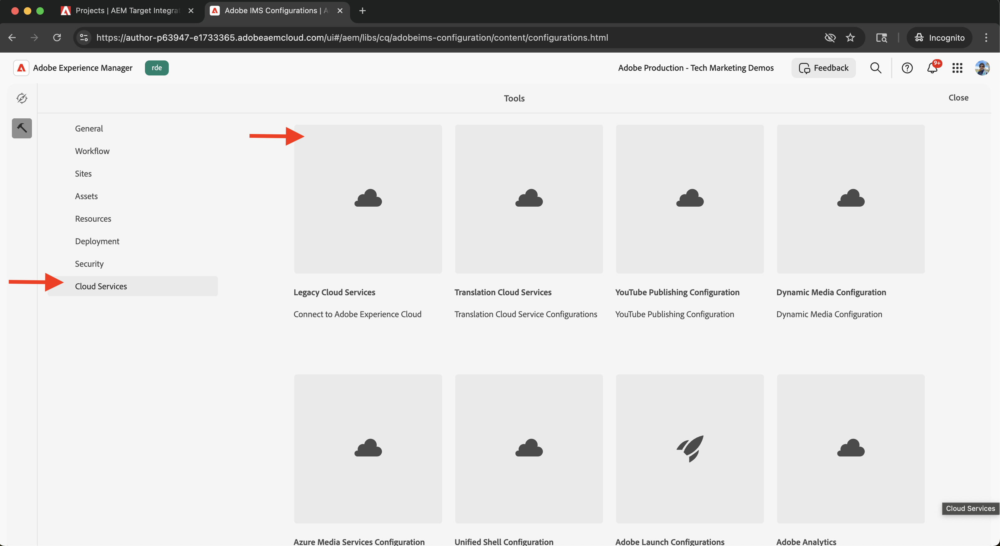
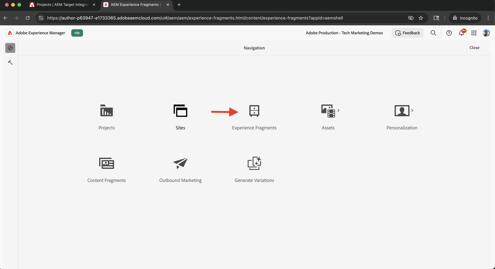

# Adobe Target integreren

Leer hoe u AEM as a Cloud Service (AEMCS) kunt integreren met Adobe Target om persoonlijke inhoud, zoals Experience Fragments, te activeren zoals aanbiedingen in Adobe Target.

Dankzij deze integratie kan uw marketingteam persoonlijke inhoud centraal in AEM maken en beheren. Deze inhoud kan vervolgens naadloos worden geactiveerd als aanbiedingen in Adobe Target.

>[!IMPORTANT]
>
>De integratiestap is optioneel als uw team ervoor kiest om aanbiedingen volledig binnen Adobe Target te beheren, zonder AEM als gecentraliseerde opslagplaats voor inhoud te gebruiken.

## Stappen op hoog niveau

Het integratieproces omvat vier belangrijke stappen die de verbinding tussen AEM en Adobe Target tot stand brengen:

1. **creeer en vorm een project van Adobe Developer Console**
2. **creeer een configuratie van Adobe IMS voor Doel in AEM**
3. **creeer een configuratie van erfenisAdobe Target in AEM**
4. **pas de configuratie van Adobe Target op de Fragmenten van de Ervaring toe**

## Een Adobe Developer Console-project maken en configureren

Om AEM in staat te stellen veilig met Adobe Target te communiceren, moet u een Adobe Developer Console-project configureren met behulp van OAuth server-to-server verificatie. U kunt een bestaand project gebruiken of een nieuw project tot stand brengen.

1. Ga naar [ Adobe Developer Console ](https://developer.adobe.com/console) en teken binnen met uw Adobe ID.

2. Maak een nieuw project of selecteer een bestaand project.\
   

3. Klik **toevoegen API**. In **voeg API** dialoog toe, filter door **Experience Cloud**, selecteer **Adobe Target**, en klik **daarna**.\
   

4. In **vorm API** dialoog, selecteer de **Server-aan-Server** authentificatiemethode en klik **daarna**.\
   

5. In de **Uitgezochte Profiles van het Product** stap, selecteer **Standaard Workspace** en klik **sparen Gevormde API**.\
   

6. In de linkernavigatie, uitgezochte **OAuth Server-aan-Server** en herzie de configuratiedetails. Let op de client-id en het clientgeheim. U hebt deze waarden nodig om de IMS-integratie in AEM te configureren.
   

## Een Adobe IMS-configuratie voor doel maken in AEM

In AEM maakt u een Adobe IMS-configuratie voor Target met behulp van de referenties van de Adobe Developer Console. Met deze configuratie kan AEM verifiëren met de Adobe Target API&#39;s.

1. In AEM, navigeer aan **Hulpmiddelen** > **Veiligheid** en selecteer **Configuraties van Adobe IMS**.\
   

2. Klik **creëren**.\
   

3. Op de **pagina van de Configuratie van de Rekening van Adobe IMS Technische**, ga het volgende in:
   - **Oplossing van de Wolk**: Adobe Target
   - **Titel**: Een etiket voor de configuratie, zoals &quot;Adobe Target&quot;
   - **de Server van de Vergunning**: `https://ims-na1.adobelogin.com`
   - **identiteitskaart van de Cliënt**: Van Adobe Developer Console
   - **Geheim van de Cliënt**: Van Adobe Developer Console
   - **Reikwijdte**: Van Adobe Developer Console
   - **Org identiteitskaart**: Van Adobe Developer Console

   Dan klik **creëren**.

   

4. Selecteer de configuratie en klik **Gezondheid van de Controle** om de verbinding te verifiëren. Een succesbericht bevestigt dat AEM verbinding kan maken met Adobe Target.\
   

## Een verouderde Adobe Target-configuratie maken in AEM

Als u Experience Fragments wilt exporteren als aanbiedingen aan Adobe Target, maakt u een oudere Adobe Target-configuratie in AEM.

1. In AEM, navigeer aan **Hulpmiddelen** > **de Diensten van de Wolk** en selecteer **de Diensten van de Wolk van de Oudere wolk**.\
   

2. In de **Adobe Target** sectie, klik **nu** vormen.\
   

3. In **creeer de dialoog van de Configuratie**, ga een naam zoals &quot;Verouderde Adobe Target&quot;in en klik **creeer**.\
   

4. Voor de **pagina van de Configuratie van de Verouderde Adobe Target**, verstrek het volgende:
   - **Authentificatie**: IMS
   - **Code van de Cliënt**: Uw de cliëntcode van Adobe Target (die in Adobe Target wordt gevonden onder **Beleid** > **Implementatie**)
   - **Configuratie IMS**: De configuratie IMS u vroeger creeerde

   Klik **verbinden met Adobe Target** om de verbinding te bevestigen.

   

## Adobe Target-configuratie toepassen op fragmenten met ervaring

Koppel de Adobe Target-configuratie aan uw Experience Fragments zodat ze kunnen worden geëxporteerd en gebruikt als aanbiedingen in Target.

1. In AEM, ga naar **Fragmenten van de Ervaring**.\
   

2. Selecteer de wortelomslag die uw Fragmenten van de Ervaring (bijvoorbeeld, `WKND Site Fragments`) bevat en **Eigenschappen** klikt.\
   

3. Voor de **pagina van Eigenschappen**, open de **Diensten van de Wolk** tabel. In de **sectie van de Configuraties van Cloud Service**, selecteer uw configuratie van Adobe Target.\
   

4. In de **Adobe Target** sectie die verschijnt, voltooi het volgende:
   - **het Formaat van de Uitvoer van Adobe Target**: HTML
   - **Adobe Target Workspace**: Selecteer de werkruimte aan gebruik (bijvoorbeeld, &quot;Standaard Workspace&quot;)
   - **ExternalAlizer Domains**: Ga de domeinen voor het produceren van externe URLs in

   

5. Klik **sparen &amp; dicht** om de configuratie toe te passen.

## De integratie controleren

Om te bevestigen dat de integratie correct werkt, test de uitvoerfunctionaliteit:

1. Maak in AEM een nieuw Ervingspatroon of open een bestaand fragment. Klik **Uitvoer aan Adobe Target** van de toolbar.\
   

2. In Adobe Target, ga naar de **sectie van Aanbiedingen** en verifieer dat het Fragment van de Ervaring als aanbieding verschijnt.\
   

## Aanvullende bronnen

- [ overzicht van doel API ](https://experienceleague.adobe.com/en/docs/target-dev/developer/api/target-api-overview)
- [ Aanbieding van het Doel ](https://experienceleague.adobe.com/en/docs/target/using/experiences/offers/manage-content)
- [ Adobe Developer Console ](https://developer.adobe.com/developer-console/docs/guides/)
- [ Fragmenten van de Ervaring in AEM ](https://experienceleague.adobe.com/en/docs/experience-manager-learn/sites/experience-fragments/experience-fragments-feature-video-use)
