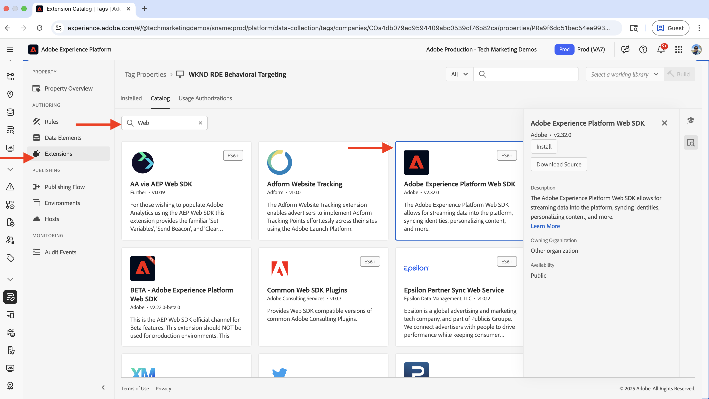
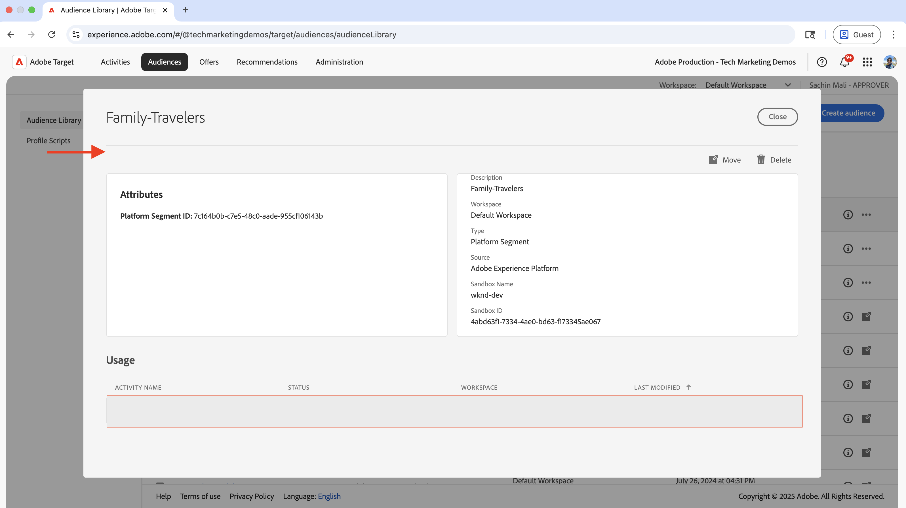
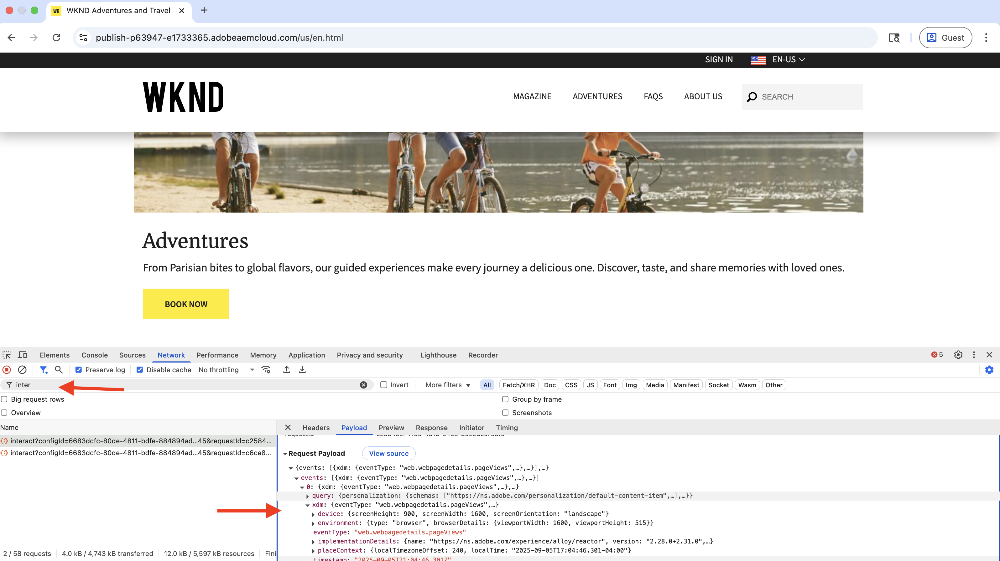

# Gedragingen

Leer hoe u inhoud kunt aanpassen op basis van gebruikersgedrag met Adobe Experience Platform (AEP) en Adobe Target.

Het richten van het gedrag helpt u volgende-paginagrootte leveren die op gebruikersgedrag zoals de pagina&#39;s wordt gebaseerd die zij hebben bezocht, de producten of de categorieën zij hebben doorzocht. Veelvoorkomende scenario&#39;s zijn:

- **Hoofdsectie Personalization**: Vertoning gepersonaliseerde heldinhoud op de volgende pagina die op de het doorbladeren van de gebruiker activiteit wordt gebaseerd
- **Aanpassing van het Element van de Inhoud**: De hoofdlijnen, beelden, of knopen van call-to-action van de verandering die op de het doorbladeren van de gebruiker activiteit worden gebaseerd
- **Aanpassing van de Inhoud van de Pagina**: wijzig de volledige paginacontent die op de het doorbladeren van de gebruiker activiteit wordt gebaseerd

## Hoofdlettergebruik demo

In dit leerprogramma, toont het proces aan hoe **anonieme gebruikers** die of _Bali Surf Camp_, _Riverside Camping_ hebben bezocht, of _het Schrapen_ adventure pagina&#39;s zien een gepersonaliseerde held boven de **Volgende sectie van avonturen** op de WKND homepage.


Voor demodoeleinden, zijn de gebruikers met dit het doorbladeren gedrag gecategoriseerd als **de Reizigers van de Familie** publiek.

### Live demo

Bezoek de [&#x200B; website van Enablement WKND &#x200B;](https://wknd.enablementadobe.com/us/en.html) om gedrag te zien richtend in actie. Op de site worden drie verschillende ervaringen met gedragstoewijzing getoond:

- **Pagina van het Huis**: Wanneer de gebruikers de homepage na het doorbladeren van of _Balli Surf Camp_, _Riverside Camping_, of _Tahoe Skiing_ adventure pagina&#39;s bezoeken, zijn zij gecategoriseerd als het **Familie Reiders** publiek en zie een gepersonaliseerde heldsectie boven de _Volgende Vennoten  Adventures_ .

- **Pagina van het Avontuur**: Wanneer de gebruikers _Balli Surf Camp_ of _Camp Surf in Costa Rica_ avontuurpagina&#39;s bekijken, worden zij gecategoriseerd als **het Opoverlevende publiek van de Rente** en zien een gepersonaliseerde heldensectie op de avontuurpagina.

- **Pagina van het Tijdschrift**: Wanneer de gebruikers _drie of meer_ artikelen lezen, zijn zij gecategoriseerd als **het publiek van de Lezers van het Tijdschrift** en zien een gepersonaliseerde heldensectie op de tijdschriftpagina.

>[!VIDEO](https://video.tv.adobe.com/v/3474001/?learn=on&enablevpops)

>[!TIP]
>
>Het eerste publiek gebruikt **Edge** evaluatie voor verpersoonlijking in real time, terwijl het tweede en derde publiek **de 3&rbrace; evaluatie van de Partij &lbrace;voor verpersoonlijking gebruiken, die voor het terugkeren van bezoekers ideaal is.**

## Vereisten

Voordat u verdergaat met de gedrags-gebruikscase, moet u het volgende voltooien:

- [&#x200B; integreer Adobe Target &#x200B;](../setup/integrate-adobe-target.md): Laat teams toe om gepersonaliseerde inhoud centraal in AEM tot stand te brengen en te beheren en het als aanbiedingen in Adobe Target te activeren.
- [&#x200B; integreer Markeringen in Adobe Experience Platform &#x200B;](../setup/integrate-adobe-tags.md): Staat teams toe om JavaScript voor verpersoonlijking en gegevensinzameling te beheren en op te stellen zonder het moeten AEM code opnieuw opstellen.

Zijn ook vertrouwd met [&#x200B; de Identiteitsdienst van Adobe Experience Cloud (ECID) &#x200B;](https://experienceleague.adobe.com/nl/docs/id-service/using/home) en [&#x200B; Adobe Experience Platform &#x200B;](https://experienceleague.adobe.com/nl/docs/experience-platform/landing/home) concepten, zoals Schema, Datastream, Soorten, Identiteiten, en Profielen.

Hoewel u eenvoudig publiek kunt maken in Adobe Target, biedt Adobe Experience Platform (AEP) de moderne aanpak voor het maken en beheren van soorten publiek en het samenstellen van complete klantprofielen met behulp van diverse gegevensbronnen, zoals gedrags- en transactiegegevens.

## Stappen op hoog niveau

Het proces voor instellen van gedragstoewijzingen omvat stappen in Adobe Experience Platform, AEM en Adobe Target.

1. **in Adobe Experience Platform:**
   1. Een schema maken en configureren
   2. Een gegevensset maken en configureren
   3. Een DataStream maken en configureren
   4. Een tagedigenschap maken en configureren
   5. Samenvoegingsbeleid voor profiel configureren
   6. Adobe Target-bestemming instellen (V2)
   7. Een publiek maken en configureren

2. **in AEM:**
   1. Aangepaste aanbiedingen maken met Experience Fragment
   2. De eigenschap Tags integreren en injecteren in AEM-pagina&#39;s
   3. Integreer Adobe Target en exporteer persoonlijke aanbiedingen naar Adobe Target

3. **in Adobe Target:**
   1. Het publiek en de aanbiedingen controleren
   2. Een activiteit maken en configureren

4. **verifieer het gedrag richtend implementatie op uw pagina&#39;s van AEM**

De AEP-oplossingen worden gebruikt om gedragsgegevens te verzamelen, te beheren en te oogsten om een publiek te maken. Deze doelgroepen worden vervolgens in Adobe Target geactiveerd. Met behulp van activiteiten in Adobe Target worden persoonlijke ervaringen opgedaan bij gebruikers die voldoen aan de criteria voor het publiek.

## Adobe Experience Platform-stappen

Als u een publiek wilt maken dat is gebaseerd op gedragsgegevens, is het nodig gegevens te verzamelen en op te slaan wanneer gebruikers uw website bezoeken of ermee werken. In dit voorbeeld, om een gebruiker te categoriseren als **het publiek van de Reizigers van de Familie**, moet de gegevens van de paginamening worden verzameld. Het proces begint in de Adobe Experience Platform om de noodzakelijke componenten op te zetten om deze gegevens te verzamelen.

Login aan [&#x200B; Adobe Experience Cloud &#x200B;](https://experience.adobe.com/) en navigeer aan **Experience Platform** van de Schakelaar van de Toepassing of de Snelle sectie van de Toegang.


### Een schema maken en configureren

Een schema definieert de structuur en indeling van gegevens die u verzamelt in Adobe Experience Platform. Het zorgt voor gegevensconsistentie en stelt u in staat een zinvol publiek te maken op basis van gestandaardiseerde gegevensvelden. Voor gedrag het richten, is een schema nodig dat paginameningsgebeurtenissen en gebruikersinteractie kan vangen.

Maak een schema voor het verzamelen van paginaweergavegegevens voor gedragstoewijzing.

- In de **Adobe Experience Platform** homepage, klik **Schema&#39;s** van de linkernavigatie en klik **creeer schema**.

  

- In **creeer Schema** tovenaar, voor **de details van het Schema** stap, selecteer de **optie van de Gebeurtenis van de Ervaring** en klik **daarna**.

  

- Voor **Naam en overzicht** stap, ga het volgende in:
   - **de vertoningsnaam van het Schema**: WKND-RDE-Gedrag-Gericht
   - **Geselecteerde Klasse**: XDM ExperienceEvent

  

- Werk het schema als volgt bij:
   - **voeg gebiedsgroep** toe: AEP Web SDK ExperienceEvent
   - **Profiel**: laat toe

  

- Klik **sparen** om het schema tot stand te brengen.

### Creeer en vorm een Dataset

Een dataset is een container voor gegevens die een specifiek schema volgen. Het fungeert als opslaglocatie waar gedragsgegevens worden verzameld en geordend. De dataset moet voor Profiel worden toegelaten om publieksverwezenlijking en verpersoonlijking toe te staan.

Laten wij een dataset tot stand brengen om de gegevens van de paginamening op te slaan.

- In **Adobe Experience Platform**, klik **Datasets** van de linkernavigatie en klik **Create dataset**.
  

- In **creeer dataset** stap, **creeer dataset van schema** optie en klik **daarna**.
  

- In **creeer dataset van schema** tovenaar, voor **Uitgezochte schema** stap, selecteer **WKND-RDE-Gedrag-gericht** schema en klik **daarna**.
  

- Voor **vorm dataset** stap, ga het volgende in:
   - **Naam**: WKND-RDE-Gedrag-gericht
   - **Beschrijving**: Dataset om de gegevens van de paginamening op te slaan

  

  Klik **Afwerking** om de dataset tot stand te brengen.

- Werk de dataset als volgt bij:
   - **Profiel**: laat toe

  

### Een DataStream maken en configureren

Een gegevensstroom is een configuratie die bepaalt hoe de gegevens van uw website aan Adobe Experience Platform via het Web SDK stromen. Het fungeert als een brug tussen uw website en het platform en zorgt ervoor dat gegevens correct zijn opgemaakt en naar de juiste gegevenssets worden gerouteerd. Voor het gericht zijn op gedrag, moeten wij de specifieke diensten zoals de Segmentatie van Edge en de Doelen van Personalization toelaten.

Laten we een gegevensstroom maken om paginaweergavegegevens via het web-SDK naar Experience Platform te verzenden.

- In **Adobe Experience Platform**, klik **Datastreams** van de linkernavigatie en klik **creeer datastream**.

- In de **Nieuwe gegevensstroom** stap, ga het volgende in:
   - **Naam**: WKND-RDE-Gedrag-gericht
   - **Beschrijving**: DataStream om de gegevens van de paginamening naar Experience Platform te verzenden
   - **het Schema van de Toewijzing**: WKND-RDE-Gedrag-Gericht
Klik **sparen** om de gegevensstroom tot stand te brengen.

  

- Zodra de DataStream wordt gecreeerd, klik **voegt de Dienst** toe.

   toe

- In **voeg de stap van de Dienst** toe, selecteer **Adobe Experience Platform** van dropdown en ga het volgende in:
   - **Dataset van de Gebeurtenis**: WKND-RDE-Gedrag-gericht
   - **Dataset van het Profiel**: WKND-RDE-Gedrag-gericht
   - **Offer Decisioning**: Laat toe
   - **de Segmentatie van Edge**: laat toe
   - **de Doelen van Personalization**: Laat toe

  Klik **sparen** om de dienst toe te voegen.

  

- In **voeg de stap van de Dienst** toe, selecteer **Adobe Target** van dropdown en ga **identiteitskaart van het Milieu van het Doel** in. U kunt identiteitskaart van het Milieu van het Doel in Adobe Target onder **Beleid** vinden > **Milieu&#39;s**. Klik **sparen** om de dienst toe te voegen.
  

### Een eigenschap voor een tag maken en configureren

Een eigenschap Tags is een container voor JavaScript-code die gegevens van uw website verzamelt en naar Adobe Experience Platform verzendt. Deze laag fungeert als de laag voor gegevensverzameling waarin gebruikersinteracties en paginaweergaven worden vastgelegd. Voor gedragsgerichte gericht, verzamelen wij specifieke paginadetails zoals paginanaam, URL, plaatssectie, en gastheernaam om betekenisvolle publiek tot stand te brengen.

Laten we een eigenschap Codes maken die paginaweergavegegevens vastlegt wanneer gebruikers uw website bezoeken.

In dit geval worden de paginagegevens zoals de paginanaam, de URL, de sitesectie en de hostnaam verzameld. Deze details worden gebruikt om gedragspubliek tot stand te brengen.

U kunt het bezit van Markeringen bijwerken u in de [&#x200B; creeerde stap van de Markeringen van Adobe &#x200B;](../setup/integrate-adobe-tags.md) integreert. Om het echter eenvoudig te houden, wordt een nieuwe eigenschap Codes gemaakt.

#### Eigenschap Codes maken

Voer de volgende stappen uit om een eigenschap Codes te maken:

- In **Adobe Experience Platform**, klik **Markeringen** van de linkernavigatie en klik het **Nieuwe Bezit** knoop.
  

- In **creeer Bezit** dialoog, ga het volgende in:
   - **Naam van het Bezit**: WKND-RDE-Gedrag-gericht
   - **Type van Bezit**: Selecteer **Web**
   - **Domein**: Het domein waar u het bezit opstelt (bijvoorbeeld, `.adobeaemcloud.com`)

  Klik **sparen** om het bezit tot stand te brengen.

  

- Open het nieuwe bezit, en klik **Uitbreidingen** van de linkernavigatie, en klik de **Catalogus** tabel. Onderzoek naar **SDK van het Web** en klik **installeer** knoop.
  

- In **installeer de dialoog van de Uitbreiding**, selecteer **Datastream** u vroeger creeerde en **klik sparen**.
  

#### Gegevenselementen toevoegen

De elementen van gegevens zijn variabelen die specifieke gegevenspunten van uw website vangen en hen voor gebruik in regels en andere configuraties van Markeringen ter beschikking stellen. Ze fungeren als de bouwstenen voor gegevensverzameling, zodat u zinvolle informatie uit gebruikersinteracties en paginaweergaven kunt extraheren. Voor gedragsgerichte doelframes moeten paginagegevens zoals hostnaam, sitesectie en paginanaam worden vastgelegd om publiekssegmenten te maken.

Maak de volgende gegevenselementen om de belangrijke paginadetails vast te leggen.

- Klik {de Elementen van 0} Gegevens **van de linkernavigatie en klik** creëren Nieuw Element van Gegevens **knoop.**
  

- In **creeer Nieuwe dialoog van het Element van Gegevens**, ga het volgende in:
   - **Naam**: De Naam van de gastheer
   - **Uitbreiding**: Selecteer **Kern**
   - **het Type van Element van Gegevens**: Selecteer **Douane Code**
   - **Open de knoop van de Redacteur** en ga het volgende codefragment in:

     ```javascript
     if(window && window.location && window.location.hostname) {
         return window.location.hostname;
     }
     ```

  

- U kunt ook de volgende gegevenselementen maken:

   - **Naam**: Sectie van de Plaats
   - **Uitbreiding**: Selecteer **Kern**
   - **het Type van Element van Gegevens**: Selecteer **Douane Code**
   - **Open de knoop van de Redacteur** en ga het volgende codefragment in:

     ```javascript
     if(event && event.component && event.component.hasOwnProperty('repo:path')) {
         let pagePath = event.component['repo:path'];
     
         let siteSection = '';
     
         //Check for html String in URL.
         if (pagePath.indexOf('.html') > -1) { 
         siteSection = pagePath.substring(0, pagePath.lastIndexOf('.html'));
     
         //replace slash with colon
         siteSection = siteSection.replaceAll('/', ':');
     
         //remove `:content`
         siteSection = siteSection.replaceAll(':content:','');
         }
     
         return siteSection 
     }        
     ```

   - **Naam**: De Naam van de pagina
   - **Uitbreiding**: Selecteer **Kern**
   - **het Type van Element van Gegevens**: Selecteer **Douane Code**
   - **Open de knoop van de Redacteur** en ga het volgende codefragment in:

     ```javascript
     if(event && event.component && event.component.hasOwnProperty('dc:title')) {
         // return value of 'dc:title' from the data layer Page object, which is propagated via 'cmp:show' event
         return event.component['dc:title'];
     }        
     ```

- Daarna, creeer een gegevenselement van **Variabele** type. Dit gegevenselement wordt gevuld met de paginagegevens voordat het naar de Experience Platform wordt verzonden.

   - **Naam**: XDM-Variabele Voorproef
   - **Uitbreiding**: Selecteer **SDK van het Web van Adobe Experience Platform**
   - **Type van Gegevens**: Selecteer **Variabele**

  In het rechterpaneel,

   - **Sandbox**: Selecteer uw zandbak
   - **Schema**: Selecteer **WKND-RDE-Gedrag-Gericht** schema

  Klik **sparen** om het gegevenselement tot stand te brengen.

  

- In uw **lijst van Elementen van 0&rbrace; Gegevens &lbrace;, zou u vier gegevenselementen moeten hebben:**

  

#### Regels toevoegen

Regels bepalen wanneer en hoe gegevens worden verzameld en naar Adobe Experience Platform worden verzonden. Ze fungeren als de logische laag die bepaalt wat er gebeurt wanneer specifieke gebeurtenissen op uw website plaatsvinden. Voor gedrag het richten, worden de regels gecreeerd die de gebeurtenissen van de opnamemening vangen en gegevenselementen vullen met de verzamelde informatie alvorens het naar het platform te verzenden.

Creeer een regel om het **XDM-Variabele 1&rbrace; gegevenselement van de Voorproef te bevolken gebruikend de andere gegevenselementen alvorens het naar Experience Platform te verzenden.** De regel wordt geactiveerd wanneer een gebruiker door de WKND-website bladert.

- Klik **Regels** van de linkernavigatie en klik **creeer Nieuwe knoop van de Regel**.
  

- In **creeer Nieuwe dialoog van de Regel**, ga het volgende in:

   - **Naam**: alle pagina&#39;s - op lading

   - Voor de **sectie van Gebeurtenissen**, voegt de klik **&#x200B;**&#x200B;toe om de **tovenaar van de Configuratie van de Gebeurtenis** te openen.
      - **Uitbreiding**: Selecteer **Kern**
      - **Type van Gebeurtenis**: Selecteer **Douane Code**
      - **Open de knoop van de Redacteur** en ga het volgende codefragment in:

        ```javascript
        var pageShownEventHandler = function(evt) {
            // defensive coding to avoid a null pointer exception
            if(evt.hasOwnProperty("eventInfo") && evt.eventInfo.hasOwnProperty("path")) {
                //trigger Launch Rule and pass event
                console.debug("cmp:show event: " + evt.eventInfo.path);
                var event = {
                    //include the path of the component that triggered the event
                    path: evt.eventInfo.path,
                    //get the state of the component that triggered the event
                    component: window.adobeDataLayer.getState(evt.eventInfo.path)
                };
        
                //Trigger the Launch Rule, passing in the new 'event' object
                // the 'event' obj can now be referenced by the reserved name 'event' by other Launch data elements
                // i.e 'event.component['someKey']'
                trigger(event);
            }
        }
        
        //set the namespace to avoid a potential race condition
        window.adobeDataLayer = window.adobeDataLayer || [];
        
        //push the event listener for cmp:show into the data layer
        window.adobeDataLayer.push(function (dl) {
            //add event listener for 'cmp:show' and callback to the 'pageShownEventHandler' function
            dl.addEventListener("cmp:show", pageShownEventHandler);
        });
        ```

   - Voor de **Voorwaarden** sectie, klik **&#x200B;**&#x200B;toevoegen om de **Tovenaar van de Configuratie van de Voorwaarde** te openen.
      - **Logische Type**: Selecteer **Regelmatig**
      - **Uitbreiding**: Selecteer **Kern**
      - **Type van Voorwaarde**: Selecteer **Douane Code**
      - **Open de knoop van de Redacteur** en ga het volgende codefragment in:

        ```javascript
        if(event && event.component && event.component.hasOwnProperty('@type') && event.component.hasOwnProperty('xdm:template')) {
            console.log('The cmp:show event is from PAGE HANDLE IT');
            return true;
        }else{
            console.log('The cmp:show event is NOT from PAGE IGNORE IT');
            return false;
        }            
        ```

   - Voor de **sectie van Acties**, klik **&#x200B;**&#x200B;toevoegen om de **tovenaar van de Configuratie van de Actie** te openen.
      - **Uitbreiding**: Selecteer **SDK van het Web van Adobe Experience Platform**
      - **Type van Actie**: Selecteer **veranderlijke Update**
      - Kaart het **Web** > **webPageDetails** > **naam** aan het **7&rbrace; gegevenselement van de Naam van de Pagina &lbrace;**

        

      - Eveneens, kaart de **server** aan het **de gegevenselement van de Naam van de Gastheer** en **siteSection** aan het **de gegevenselement van de Sectie van de Plaats**. Voor **pageView** > **waarde** gaat `1` binnen, om op een gebeurtenis van de paginamening te wijzen.

      - Klik **houden Veranderingen** om de actieconfiguratie te bewaren.

   - Opnieuw, klik **toevoegen** om een andere actie toe te voegen en de **tovenaar van de Configuratie van de Actie** te openen.
      - **Uitbreiding**: Selecteer **SDK van het Web van Adobe Experience Platform**
      - **Type van Actie**: Selecteer **verzenden gebeurtenis**
      - In de 0&rbrace; sectie van Gegevens van het juiste paneel **, kaart** XDM-Variabele het gegevenselement van de Voorproef **aan het** Web Web Webpagedetails de Mening van de Pagina **type.**

     

      - Ook, in de 1&rbrace; sectie van Personalization van het juiste paneel **&lbrace;, controleer** visuele verpersoonlijkingsbesluiten **optie teruggeven.**  Dan, klik **houden Veranderingen** om de actie te bewaren.

     

   - Klik **houden Veranderingen** om de regel te bewaren.

- Uw regel moet er als volgt uitzien:

  

De bovengenoemde stappen van de regelverwezenlijking hebben een behoorlijk aantal details zo zorgvuldig zijn terwijl het creëren van de regel. Het zou complex kunnen klinken maar herinner deze configuratiestappen maken het stop en spel zonder het moeten bijwerken van de code van AEM en het heropstellen van de toepassing.

#### Bibliotheek toevoegen en publiceren

Een bibliotheek is een verzameling van al uw configuraties van tags (gegevenselementen, regels, extensies) die worden gemaakt en geïmplementeerd op uw website. Alles wordt samengevoegd, zodat de gegevensverzameling goed werkt. De bibliotheek wordt gepubliceerd om de regels voor gegevensverzameling actief te maken op uw website.

- Klik **het Publiceren Stroom** van de linkernavigatie en klik **toevoegen Bibliotheek** knoop.
   toe

- In **voeg Bibliotheek** dialoog toe, ga het volgende in:
   - **Naam**: 1.0
   - **Milieu**: Selecteer **Ontwikkeling**
   - Klik **toevoegen Alle Gewijzigde Middelen** om alle middelen te selecteren.

  Klik **sparen &amp; bouwen aan Ontwikkeling** om de bibliotheek tot stand te brengen.

   toe

- Zodra de bibliotheek voor de **ontwikkeling** wordt gebouwd zwemweg, klik de ellipsen (drie punten) en selecteer **goedkeuren en publiceren aan Productie** optie.
  

Gefeliciteerd! U hebt de eigenschap Codes gemaakt met de regel om paginagegevens te verzamelen en naar Experience Platform te verzenden. Dit is de fundamentele stap om gedragsvormen tot stand te brengen.

### Samenvoegingsbeleid voor profiel configureren

Een samenvoegingsbeleid bepaalt hoe de klantengegevens van veelvoudige bronnen in één enkel profiel worden verenigd. Het bepaalt welke gegevens belangrijkheid nemen wanneer er conflicten zijn, verzekerend u een volledige en verenigbare mening van elke klant voor gedrag het richten hebt.

Voor dit gebruiksgeval, wordt een fusiebeleid gecreeerd of bijgewerkt dat:

- **Gebrek samenvoegbeleid**: laat toe
- **actief-op-Edge het Beleid van de Fusie**: laat toe

Voer de volgende stappen uit om een samenvoegbeleid te maken:

- In **Adobe Experience Platform**, klik **Profielen** van de linkernavigatie en klik het **Beleid van de Fusie** tabel.

  

- U kunt een bestaand samenvoegingsbeleid gebruiken, maar voor dit leerprogramma, wordt een nieuw fusiebeleid gecreeerd met de volgende configuratie:

  

- Zorg ervoor om zowel **Standaard fusiebeleid** als **toe te laten actief-op-Edge de opties van het Beleid van de Fusie**. Deze montages zorgen ervoor dat uw gedragsgegevens behoorlijk verenigd en beschikbaar voor publieksevaluatie in real time zijn.

### Adobe Target-bestemming instellen (V2)

Met de Adobe Target-bestemming (V2) kunt u het in Experience Platform gemaakte gedragspubliek rechtstreeks in Adobe Target activeren. Dankzij deze verbinding kan uw gedragspubliek worden gebruikt voor personalisatieactiviteiten in Adobe Target.

- In **Adobe Experience Platform**, klik **Doelen** van de linkernavigatie en klik het **lusje van de Catalogus** en filter door **Personalization** en selecteer **(v2) Adobe Target** bestemming.

  

- In **activeer de stap van Doelen**, verstrek een naam voor de bestemming en klik **verbind met bestemmings** knoop.
  

- In de **sectie van de Details van de Bestemming**, ga het volgende in:
   - **Naam**: WKND-RDE-Gedrag-gericht-Bestemming
   - **Beschrijving**: Doel voor gedrag gericht publiek
   - **Datastream**: Selecteer **Datastream** die u vroeger creeerde
   - **Workspace**: Selecteer uw werkruimte van Adobe Target

  

- Klik **daarna** en voltooi de bestemmingsconfiguratie.

Zodra gevormd, staat deze bestemming u toe om gedragspubliek van Experience Platform aan Adobe Target voor gebruik in verpersoonlijkingsactiviteiten te activeren.

### Een publiek maken en configureren

Een publiek definieert een specifieke groep gebruikers op basis van hun gedragspatronen en kenmerken. In deze stap, wordt het publiek van de &quot;Familie Reizigers&quot;gecreeerd gebruikend de gedragsgegevensregels.

Voer de volgende stappen uit om een publiek te maken:

- In **Adobe Experience Platform**, klik **Soorten publiek** van de linkernavigatie en klik **creëren de knoop van het Publiek**.
  

- In **creeer de dialoog van het publiek**, selecteer de **bouwstijl** optie en klik **creeer** knoop.
  

- In **creeer** stap, ga het volgende in:
   - **Naam**: De Reiders van de Familie
   - **Beschrijving**: Gebruikers die familievriendelijke avontuurpagina&#39;s hebben bezocht
   - **methode van de Evaluatie**: Selecteer **Edge** (voor kijkevaluatie in real time)

  

- Dan, klik het **lusje van Gebeurtenissen** en navigeer aan het **Web** > **de Details van de Pagina van het Web** en sleep en laat vallen het **&#x200B;**&#x200B;gebied URL aan de **sectie van de Regels van de Gebeurtenis**. Sleep het **URL** gebied twee meer keer aan de **sectie van de Regels van de Gebeurtenis**. Voer de volgende waarden in:
   - **URL**: Uitgezocht **bevat** optie en gaat `riverside-camping-australia` in
   - **URL**: Uitgezocht **bevat** optie en gaat `bali-surf-camp` in
   - **URL**: Uitgezocht **bevat** optie en gaat `gastronomic-marais-tour` in

  

- In de **sectie van Gebeurtenissen**, selecteer **vandaag** optie. Uw publiek zou als dit moeten kijken:

  

- Herzie het publiek en klik **activeren aan bestemming** knoop.

  

- In **activeer aan bestemmings** dialoog, selecteer de bestemming van Adobe Target u vroeger creeerde en volg de stappen om het publiek te activeren.

  

- Er zijn nog geen gegevens in AEP, dus het aantal gebruikers is 0. Zodra de gebruikers beginnen de website te bezoeken, worden de gegevens verzameld en het aantal gebruikers stijgt.

  

Gefeliciteerd! U hebt het publiek gemaakt en geactiveerd naar de Adobe Target-bestemming.

Hiermee worden de Adobe Experience Platform-stappen voltooid en is het proces gereed om de persoonlijke ervaring in AEM te creëren en in Adobe Target te gebruiken.

## AEM-stappen

In AEM is de eigenschap Codes geïntegreerd om gegevens van de paginaweergave te verzamelen en naar Experience Platform te verzenden. Adobe Target is ook geïntegreerd en gepersonaliseerde aanbiedingen worden gecreeerd voor het **1&rbrace; publiek van de Reizigers van de Familie.** Met deze stappen kan AEM werken met de gedraggericht instellen die in Experience Platform zijn gemaakt.

We beginnen met het aanmelden bij de AEM Author-service om de gepersonaliseerde inhoud te maken en te configureren.

- Login aan [&#x200B; Adobe Experience Cloud &#x200B;](https://experience.adobe.com/) en navigeer aan **Experience Manager** van de Schakelaar van de Toepassing of de Snelle sectie van de Toegang.

  

- Navigeer aan uw milieu van de Auteur van AEM en klik de **knoop van Plaatsen**.
  

### De eigenschap Tags integreren en injecteren in AEM-pagina&#39;s

Deze stap integreert het bezit van Markeringen dat eerder in uw AEM pagina&#39;s werd gecreeerd, toelatend gegevensinzameling voor gedrags het richten. Met de eigenschap Codes worden de paginaweergavegegevens automatisch vastgelegd en naar Experience Platform verzonden wanneer gebruikers uw website bezoeken.

Om het bezit van Markeringen in de pagina&#39;s van AEM te integreren, volg de stappen van [&#x200B; Tags in Adobe Experience Platform &#x200B;](../setup/integrate-adobe-tags.md) integreren.

Zorg ervoor om het **WKND-RDE-Behavioral-Targeting** bezit van Markeringen te gebruiken dat vroeger, niet een verschillend bezit werd gecreeerd.


Als de eigenschap Tags eenmaal is geïntegreerd, worden gedragsgegevens van uw AEM-pagina&#39;s verzameld en naar Experience Platform verzonden voor het maken van een publiek.

### Adobe Target integreren en persoonlijke aanbiedingen exporteren naar Adobe Target

Deze stap integreert Adobe Target met AEM en maakt het mogelijk om gepersonaliseerde inhoud (Experience Fragments) naar Adobe Target te exporteren. Dankzij deze verbinding kan Adobe Target de in AEM gemaakte inhoud gebruiken voor personalisatieactiviteiten met het in Experience Platform gemaakte gedragspubliek.

Om Adobe Target te integreren en de **publieksaanbiedingen van de Familie uit te voeren** aan Adobe Target, volg de stappen van [&#x200B; integreren Adobe Target in Adobe Experience Platform &#x200B;](../setup/integrate-adobe-target.md).

Zorg ervoor dat de configuratie van het Doel op de Fragments van de Ervaring wordt toegepast zodat kunnen zij naar Adobe Target voor gebruik in verpersoonlijkingsactiviteiten worden uitgevoerd.


Als u de functie eenmaal hebt geïntegreerd, kunt u Experience Fragments exporteren van AEM naar Adobe Target, waar ze worden gebruikt als persoonlijke aanbiedingen voor het soort gedragspatroon.

### Aangepaste aanbiedingen voor het doelpubliek maken

De Fragmenten van de ervaring zijn herbruikbare inhoudscomponenten die aan Adobe Target als gepersonaliseerde aanbiedingen kunnen worden uitgevoerd. Voor gedrag het richten, wordt de inhoud gecreeerd specifiek voor het **Reisers van de Familie** publiek dat wordt getoond wanneer de gebruikers de gedragscriteria aanpassen.

Creeer een nieuw Fragment van de Ervaring met gepersonaliseerde inhoud voor het publiek van de Reiders van de Familie.

- In AEM, klik **Fragmenten van de Ervaring**

  

- Navigeer aan de **omslag van Fragmenten van de Plaats WKND**, dan navigeer aan **Gekenmerkte** subfolder en klik **creeer** knoop.

  

- In **creeer de dialoog van het Fragment van de Ervaring**, het Malplaatje van de Variatie van het Web en klik daarna **&#x200B;**.

  

- Maak het nieuwe, gemaakte fragment Ervaring door een onderdeel Teaser toe te voegen en pas het aan met inhoud die relevant is voor familieleden. Voeg een boeiende kop, beschrijving en call-to-action toe die een beroep doet op gezinnen die geïnteresseerd zijn in avontuurreizen.

  

- Selecteer het authored Fragment van de Ervaring en klik de **Uitvoer aan Adobe Target** knoop.

  

Gefeliciteerd! U hebt authored en de **1&rbrace; publieksaanbiedingen van de Reizigers van de Familie &lbrace;aan Adobe Target uitgevoerd.** Het Experience Fragment is nu beschikbaar in Adobe Target als een persoonlijke aanbieding die kan worden gebruikt in personalisatieactiviteiten.

## Adobe Target-stappen

In Adobe Target wordt gecontroleerd of het in Experience Platform gecreëerde gedragspubliek en de vanuit AEM geëxporteerde persoonlijke aanbiedingen goed beschikbaar zijn. Vervolgens wordt een activiteit gemaakt die het doelpubliek combineert met de gepersonaliseerde inhoud om de gedragspatingervaring te bieden.

- Login aan [&#x200B; Adobe Experience Cloud &#x200B;](https://experience.adobe.com/) en navigeer aan **Adobe Target** van de Schakelaar van de Toepassing of de Snelle sectie van de Toegang.

  

### De soorten publiek en aanbiedingen verifiëren

Voordat de personalisatieactiviteit wordt gecreëerd, wordt gecontroleerd of het gedragspubliek van Experience Platform en de persoonlijke aanbiedingen van AEM op de juiste wijze beschikbaar zijn in Adobe Target. Dit zorgt ervoor dat alle componenten die nodig zijn voor het bepalen van het gedrag aanwezig zijn.

- In Adobe Target, klik **Soorten publiek** en verifieer dat het publiek van de Reizigers van de Familie wordt gecreeerd.

  

- Door op het publiek te klikken, kunt u de publieksdetails zien en verifiëren het behoorlijk wordt gevormd.

  

- Daarna, klik **Aanbiedingen** en verifieer dat de uitgevoerde aanbieding van AEM bestaat. In mijn geval, wordt de aanbieding (of het Fragment van de Ervaring) genoemd **A Staart van Avontuur voor de Gehele Familie**.

  

### Een activiteit maken en configureren

Een activiteit in Adobe Target is een verpersoonlijkingscampagne die bepaalt wanneer en hoe de gepersonaliseerde inhoud aan specifiek publiek wordt geleverd. Voor het gericht zijn op gedrag, wordt een activiteit gecreeerd die de gepersonaliseerde aanbieding aan gebruikers toont die de het publiekscriteria van de Reizigers van de Familie aanpassen.

Nu, wordt een activiteit gecreeerd om de gepersonaliseerde ervaring aan de homepage voor het **publiek van de Reizigers van de Familie te leveren 0&rbrace;.**

- In Adobe Target, klik **Activiteiten** en klik **creeer de knoop van de Activiteit** en selecteer **Ervaring richtend** activiteitstype.
  

- In **creeer Ervaring richtend de dialoog van de Activiteit**, selecteer het **Web** type en **Visuele** composer optie, en ga de WKND pagina URL van het plaatshuis in. Klik **creëren** knoop om de activiteit tot stand te brengen.

  

- In de redacteur, selecteer het **publiek van de Familie 1&rbrace; reizigers en voeg** een Smaakje van Avontuur voor de Hele Familie **aanbieding vóór de** Volgende sectie van het Avontuur **toe.** Zie de onderstaande schermafbeelding ter referentie.

  

- Klik **daarna** en vorm de **Doelen en sectie van Montages** met aangewezen doelstellingen en metriek, dan activeer het om de veranderingen levend te duwen.

  

Gefeliciteerd! U hebt gecreeerd en de activiteit gelanceerd om de gepersonaliseerde ervaring aan het **1&rbrace; publiek van de Reizigers van de Familie op de WKND homepage van de plaats te leveren.** De activiteit is nu live en toont gepersonaliseerde inhoud aan gebruikers die aan de gedragscriteria voldoen.

## Verifieer de implementatie van het gedrag gericht op uw AEM-pagina&#39;s

Nu de volledige gedraggericht richtingsstroom is ingesteld, wordt geverifieerd dat alles correct werkt. Dit verificatieproces zorgt ervoor dat gegevensverzameling, publieksevaluatie en personalisatie naar behoren functioneren.

Verifieer het gedrag gericht op implementatie op uw AEM pagina&#39;s.

- Bezoek de gepubliceerde plaats (bijvoorbeeld, de [&#x200B; website van Enablement WKND &#x200B;](https://wknd.enablementadobe.com/us/en.html)) en doorblader of _Bali Surf Camp_ of _Riverside Camping_ of _het Schommelen van het Trappen_ adventure pagina&#39;s. Zorg ervoor dat u ten minste 30 seconden op de pagina doorbrengt om de gebeurtenis Paginaweergave te activeren en dat de gegevens kunnen worden verzameld.

- Dan, herzie de homepage, en u zou de gepersonaliseerde ervaring voor het **Reeksreiziger** publiek van de Familie vóór de **Volgende sectie van het Avontuur** moeten zien.

  

- Open de de ontwikkelaarshulpmiddelen van uw browser en controleer het **Netwerk** lusje. Filter op `interact` om de Web SDK-aanvraag te zoeken. Het verzoek zou de Web SDK gebeurtenisdetails moeten tonen.

  

- De reactie zou de verpersoonlijkingsbesluiten moeten omvatten die door Adobe Target worden genomen, die u op wijzen in het **1&rbrace; publiek van de Reizigers van de Familie &lbrace;zijn.**

  

Gefeliciteerd! U hebt de implementatie van de gedragstoewijzing gecontroleerd op uw AEM-pagina&#39;s. De volledige stroom van gegevensinzameling aan publieksevaluatie aan personalisatie werkt nu correct.

## Live demo

Om het gedrag te zien richtend in actie, bezoek de [&#x200B; website van Enablement WKND &#x200B;](https://wknd.enablementadobe.com/us/en.html). Er zijn drie verschillende ervaringen met gedragingen gericht op gebruik:

- **Pagina van het Huis**: Voor het publiek van de Reizigers van de Familie, wordt een gepersonaliseerde heldaanbieding getoond boven de _Volgende Adventures_ sectie. Wanneer een gebruiker de homepage bezoekt en of _Bali Surf Camp_ of _Riverside Camping_ of _Tahoe Skiing_ avontuurpagina&#39;s heeft bezocht, wordt de gebruiker gecategoriseerd als **de Reizigers van de Familie** publiek. Het publiekstype is **Edge**, zodat gebeurt de evaluatie in real time.

- **Pagina van het Avontuur**: Voor het Opleven van liefhebbers, wordt de avontuurpagina getoond met een gepersonaliseerde heldensectie. Wanneer een gebruiker _Bali Surf Camp_ of _Camp Surf in Costa Rica_ avontuurpagina&#39;s bekijkt, wordt de gebruiker gecategoriseerd als **Opkomende Rente** publiek. Het publiekstype is **Partij**, zodat is de evaluatie niet in real time maar over een periode zoals een dag. Het is handig om bezoekers te retourneren.

  

- **Pagina van het Tijdschrift**: Voor de lezers van het Tijdschrift, wordt de tijdschriftpagina getoond met een gepersonaliseerde heldensectie. Wanneer een gebruiker _drie of meer_ artikelen leest, wordt de gebruiker gecategoriseerd als **de lezers van de Lezers van het Tijdschrift** publiek. Het publiekstype is **Partij**, zodat is de evaluatie niet in real time maar over een periode zoals een dag. Het is handig om bezoekers te retourneren.

  

Het eerste publiek gebruikt **Edge** evaluatie voor verpersoonlijking in real time, terwijl het tweede en derde publiek **de 3&rbrace; evaluatie van de Partij &lbrace;voor verpersoonlijking gebruiken, die voor het terugkeren van bezoekers ideaal is.**


## Aanvullende bronnen

- [&#x200B; SDK van het Web van Adobe Experience Platform &#x200B;](https://experienceleague.adobe.com/nl/docs/experience-platform/web-sdk/home)
- [&#x200B; Overzicht van gegevensstromen &#x200B;](https://experienceleague.adobe.com/nl/docs/experience-platform/datastreams/overview)
- [&#x200B; Visuele Composer van de Ervaring (VEC) &#x200B;](https://experienceleague.adobe.com/nl/docs/target/using/experiences/vec/visual-experience-composer)
- [&#x200B; de segmentatie van Edge &#x200B;](https://experienceleague.adobe.com/nl/docs/experience-platform/segmentation/methods/edge-segmentation)
- [&#x200B; types van Publiek &#x200B;](https://experienceleague.adobe.com/nl/docs/experience-platform/segmentation/types/overview)
- [&#x200B; verbinding van Adobe Target &#x200B;](https://experienceleague.adobe.com/nl/docs/experience-platform/destinations/catalog/personalization/adobe-target-connection)
