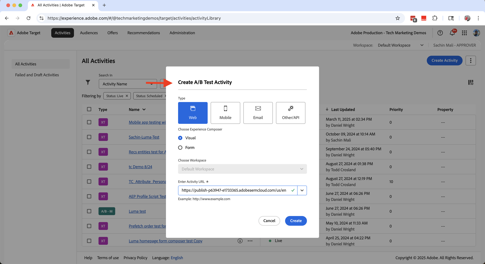
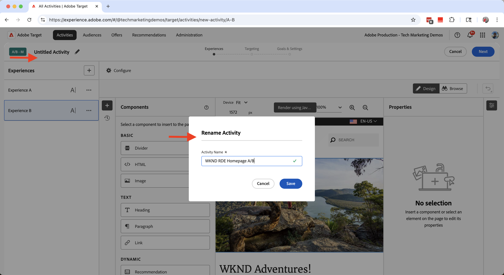
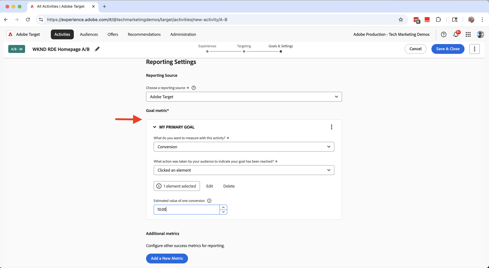
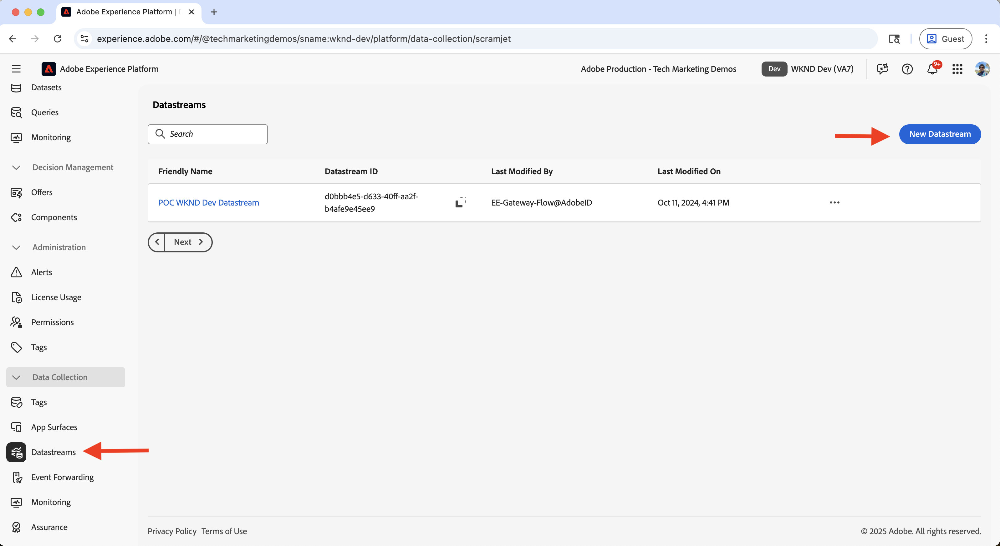
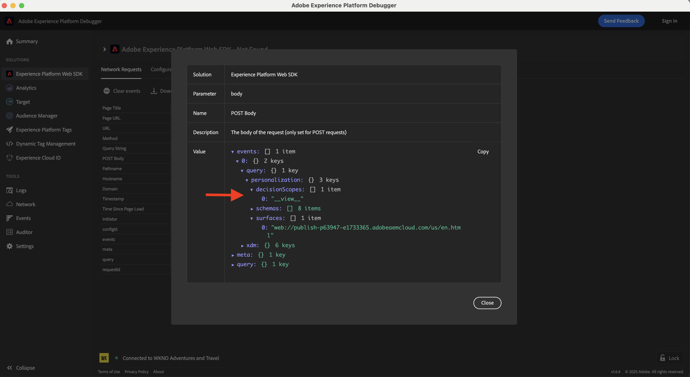

# Experimentatie (A/B-test)

Leer hoe u verschillende inhoudvariaties op een AEM as a Cloud Service-website (AEMCS) test met Adobe Target.

A/B het testen helpt u verschillende versies van inhoud vergelijken om te bepalen welke beter in het bereiken van uw bedrijfsdoelstellingen presteert. Veelvoorkomende scenario&#39;s zijn:

- Variaties in kopregels, afbeeldingen of call-to-action-knoppen op een bestemmingspagina testen
- Verschillende lay-outs of ontwerpen vergelijken voor een productdetailpagina
- Promotieaanbiedingen of kortingsstrategieën evalueren

## Hoofdlettergebruik demo

In dit leerprogramma, vormt u A/B het testen voor **Camping in het Fragment van de Ervaring van West Australië** (XF) op de website WKND. U maakt drie XF-variaties en beheert de A/B-test via Adobe Target.

De variaties worden weergegeven op de WKND-homepage, zodat u de prestaties kunt meten en kunt bepalen welke versie een betere betrokkenheid en conversies mogelijk maakt.

Bezoek de [ website van Enablement WKND ](https://wknd.enablementadobe.com/us/en.html) om de test A/B in actie te zien.

## Vereisten

Voordat u verder gaat met deze proefperiode, moet u controleren of u het volgende hebt voltooid:

- [ integreer Adobe Target ](../setup/integrate-adobe-target.md): Laat uw team toe om gepersonaliseerde inhoud centraal in AEM tot stand te brengen en te beheren en het als aanbiedingen in Adobe Target te activeren.
- [ integreer Markeringen in Adobe Experience Platform ](../setup/integrate-adobe-tags.md): Staat uw team toe om JavaScript voor verpersoonlijking en gegevensinzameling te beheren en op te stellen zonder het moeten AEM code opnieuw opstellen.

## Stappen op hoog niveau

Het installatieproces voor A/B-tests omvat zes hoofdstappen voor het maken en configureren van het experiment:

1. **creeer inhoudsvariaties in AEM**
2. **de Uitvoer de variaties als aanbiedingen aan Adobe Target**
3. **creeer een A/B testactiviteit in Adobe Target**
4. **creeer en vorm een DataStream in Adobe Experience Platform**
5. **werk het bezit van Markeringen met de uitbreiding van SDK van het Web** bij
6. **verifieer de A/B testimplementatie op uw pagina&#39;s van AEM**

## Inhoudsvariaties maken in AEM

In dit voorbeeld, gebruikt u **Camping in het Fragment van de Ervaring van West Australië** (XF) van het project van AEM WKND om drie variaties tot stand te brengen, die op de WKND website homepage voor het testen A/B zullen worden gebruikt.

1. In AEM, klik de **kaart van de Fragmenten van de Ervaring 0}, navigeer aan** Camping in West Australië **, en klik** uitgeven **.**
   

1. In de redacteur, onder de **sectie van Variaties**, klik **creeert**, en selecteert **Verandering**.\
   

1. In **creeer de dialoog van de Variatie**:
   - **Malplaatje**: Het Malplaatje van de Variatie van het Web van het Fragment van de ervaring
   - **Titel**: Bijvoorbeeld, &quot;van het Net&quot;

   Klik **Gedaan**.

   

1. Auteur de variatie door de **1} component van het Teken van de hoofdvariatie te kopiëren, dan de inhoud (b.v., werk de titel en het beeld bij) aan.**\
   

   >[!TIP]
   >U kunt [ gebruiken produceert Variaties ](https://experience.adobe.com/aem/generate-variations/) om nieuwe variaties van hoofdXF snel tot stand te brengen.

1. Herhaal de stappen om een andere variatie tot stand te brengen (bijvoorbeeld &quot;Wandering the Wild&quot;).\
   

   Er zijn nu drie ervaringsfragmentvariaties voor A/B-tests.

1. Voordat u variaties weergeeft met Adobe Target, moet u het bestaande statische tasje verwijderen van de startpagina. Hiermee voorkomt u dubbele inhoud, aangezien de Experience Fragment-variaties dynamisch via Target worden geïnjecteerd.

   - Navigeer aan **Engelse** homepage `/content/wknd/language-masters/en`
   - In de redacteur, schrap **Camping in de 1} lasercomponent van West Australië {.**\
     

1. Leer de veranderingen in de **V.S. > Engelse** homepage (`/content/wknd/us/en`) uit om de updates te verspreiden.\
   

1. Publiceer de **V.S. > Engelse** homepage om de updates levend te maken.\
   

## De variaties als voorstellen exporteren naar Adobe Target

Exporteer de Experience Fragment-variaties zodat ze kunnen worden gebruikt als aanbiedingen in Adobe Target voor de A/B-test.

1. In AEM, navigeer aan **Camping in West Australië**, selecteer de drie variaties, en klik **Uitvoer aan Adobe Target**.\
   

2. In Adobe Target, ga naar **Aanbiedingen** en bevestig de variaties zijn ingevoerd.\
   

## Een testactiviteit A/B maken in Adobe Target

Maak nu een A/B-testactiviteit om het experiment op de startpagina uit te voeren.

1. Installeer de [ Visuele het Uitgeven van Helper van Adobe Experience Cloud ](https://chromewebstore.google.com/detail/adobe-experience-cloud-vi/kgmjjkfjacffaebgpkpcllakjifppnca) uitbreiding van Chrome.

1. In Adobe Target, navigeer aan **Activiteiten** en klik **creeer Activiteit**.\
   

1. In **creeer A/B de dialoog van de Activiteit van de Test**, ga het volgende in:
   - **Type**: Web
   - **Composer**: Visuele
   - **Activiteit URL**: b.v., `https://wknd.enablementadobe.com/us/en.html`

   Klik **creëren**.

   

1. Wijzig de naam van de activiteit in iets zinvols (bijvoorbeeld &quot;WKND Homepage A/B Test&quot;).\
    anders

1. In **Ervaring A**, voeg de **component van het Fragment van de Ervaring** boven de **Recente artikelen** sectie toe.\
   

1. In de componentendialoog, klik **Uitgezocht een Aanbieding**.\
   

1. Kies **Camping in de Westerse Australische** variatie en klik **toevoegen**.\
   

1. Herhaal voor **Ervaring B** en **C**, selecterend **van het Net** en **het Wanderen van het Vrij** respectievelijk.\
    toe

1. In de **het richten** sectie, bevestig het verkeer gelijkmatig over alle ervaringen wordt verdeeld.\
   

1. In **Doelen &amp; Montages**, bepaal uw succes metrisch (b.v., klikt CTA op het Fragment van de Ervaring).\
   

1. Klik **activeren** in de hoger-juiste hoek om de test te lanceren.\
   

## Een gegevensstroom maken en configureren in Adobe Experience Platform

Als u de Adobe Web SDK wilt verbinden met Adobe Target, maakt u een DataStream in Adobe Experience Platform. De DataStream doet dienst als verpletterende laag tussen het Web SDK en Adobe Target.

1. In Adobe Experience Platform, navigeer aan **Datastreams** en klik **Create DataStream**.\
   

1. In **creeer de dialoog van DataStream**, ga a **Naam** voor uw DataStream in en klik **sparen**.\
    in

1. Zodra de DataStream wordt gecreeerd, klik **voegt de Dienst** toe.\
    toe

1. In **voeg de stap van de Dienst** toe, selecteer **Adobe Target** van dropdown en ga **identiteitskaart van het Milieu van het Doel** in. U kunt identiteitskaart van het Milieu van het Doel in Adobe Target onder **Beleid** vinden > **Milieu&#39;s**. Klik **sparen** om de dienst toe te voegen.\
   

1. Herzie de gegevens DataStream om te verifiëren dat de dienst van Adobe Target vermeld en correct gevormd is.\
   

## De eigenschap Codes bijwerken met de extensie Web SDK

Om verpersoonlijkings en gegevensinzamelingsgebeurtenissen van de pagina&#39;s van AEM te verzenden, voeg de uitbreiding van SDK van het Web aan uw bezit van Markeringen toe en vorm een regel die op paginading teweegbrengt.

1. In Adobe Experience Platform, navigeer aan **Markeringen** en open het bezit u in [ creeerde integreer de Markeringen van Adobe ](../setup/integrate-adobe-tags.md) stap.
   

1. Van het linkermenu, klik **Uitbreidingen**, schakelaar aan het **lusje van de Catalogus**, en onderzoek naar **SDK van het Web**. Klik **installeren** in het rechterpaneel.\
   

1. In **installeer de dialoog van de Uitbreiding**, selecteer **Datastream** u vroeger creeerde en **klik sparen**.\
   

1. Na het installeren, verifieer dat zowel **SDK van het Web van Adobe Experience Platform** als **de uitbreidingen van de Kern** onder **Geïnstalleerde** tabel verschijnen.\
   

1. Vervolgens configureert u een regel om de Web SDK-gebeurtenis te verzenden wanneer de bibliotheek wordt geladen. Navigeer aan **Regels** van het linkermenu en klik **creeer Nieuwe Regel**.

   

   >[!TIP]
   >
   >Met een regel kunt u bepalen wanneer en hoe tags worden geactiveerd op basis van gebruikersinteracties of browsergebeurtenissen.

1. In **creeer het scherm van de Regel**, ga een regelnaam (bijvoorbeeld, `All Pages - Library Loaded - Send Event`) in en klik **+ voegt** onder de **sectie van Gebeurtenissen** toe.
   

1. In de **dialoog van de Configuratie van de Gebeurtenis**:
   - **Uitbreiding**: Selecteer **Kern**
   - **Type van Gebeurtenis**: Selecteer **Geladen Bibliotheek (de Boven van de Pagina)**
   - **Naam**: Ga `Core - Library Loaded (Page Top)` binnen

   Klik **houden Veranderingen** om de gebeurtenis te bewaren.

   

1. Onder de **sectie van Acties**, klik **+** toevoegen om de actie te bepalen die voorkomt wanneer de gebeurtenis brandt.

1. In de **dialoog van de Configuratie van de Actie**:
   - **Uitbreiding**: Selecteer **SDK van het Web van Adobe Experience Platform**
   - **Type van Actie**: Selecteer **verzenden Gebeurtenis**
   - **Naam**: Selecteer **SDK van het Web van AEP - verzend Gebeurtenis**

   

1. In de 1} sectie van Personalization van het juiste paneel **{, controleer** visuele verpersoonlijkingsbesluiten **optie teruggeven.** Dan, klik **houden Veranderingen** om de actie te bewaren.\
   

   >[!TIP]
   >
   >   Met deze actie wordt een AEP Web SDK-gebeurtenis verzonden wanneer de pagina wordt geladen, zodat Adobe Target gepersonaliseerde inhoud kan leveren.

1. Herzie de voltooide regel en klik **sparen**.
   

1. Om de veranderingen toe te passen, ga naar **het Publiceren Stroom**, voeg de bijgewerkte regel aan a **Bibliotheek** toe.\
   

1. Tot slot promoot de bibliotheek aan **Productie**.
   

## De testimplementatie voor A/B op uw AEM-pagina&#39;s controleren

Nadat de activiteit actief is en de tagbibliotheek voor productie is gepubliceerd, kunt u de A/B-test op uw AEM-pagina&#39;s verifiëren.

1. Bezoek de gepubliceerde plaats (bijvoorbeeld, [ website van Enablement WKND ](https://wknd.enablementadobe.com/us/en.html)) en neem waar welke variatie wordt getoond. Probeer het vanuit een andere browser of een ander mobiel apparaat te openen om alternatieve variaties te zien.
   

1. Open de de ontwikkelaarshulpmiddelen van uw browser en controleer het **Netwerk** lusje. Filter op `interact` om de Web SDK-aanvraag te zoeken. Het verzoek zou de de gebeurtenisdetails van SDK van het Web moeten.

   

Het antwoord moet ook de personalisatiebesluiten van Adobe Target omvatten, waarin wordt aangegeven welke variatie is toegepast.\

1. Alternatief, kunt u de [ uitbreiding van Adobe Experience Platform Debugger ](https://chromewebstore.google.com/detail/adobe-experience-platform/bfnnokhpnncpkdmbokanobigaccjkpob) Chrome gebruiken om de gebeurtenissen van SDK van het Web te inspecteren.
   

## Live demo

Om de test A/B in actie te zien, bezoek de [ website van Enablement WKND ](https://wknd.enablementadobe.com/us/en.html) en neem waar hoe de verschillende variaties van het Fragment van de Ervaring op de homepage worden getoond.

## Aanvullende bronnen

- [ A/B het overzicht van de Test ](https://experienceleague.adobe.com/en/docs/target/using/activities/abtest/test-ab)
- [ SDK van het Web van Adobe Experience Platform ](https://experienceleague.adobe.com/en/docs/experience-platform/web-sdk/home)
- [ Overzicht van gegevensstromen ](https://experienceleague.adobe.com/en/docs/experience-platform/datastreams/overview)
- [ Visuele Composer van de Ervaring (VEC) ](https://experienceleague.adobe.com/en/docs/target/using/experiences/vec/visual-experience-composer)