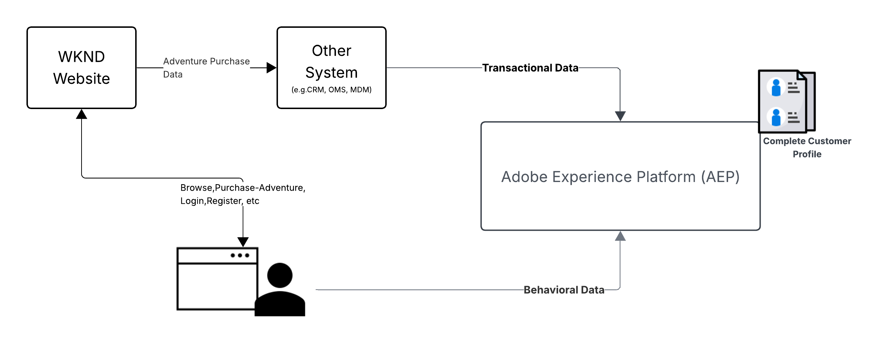
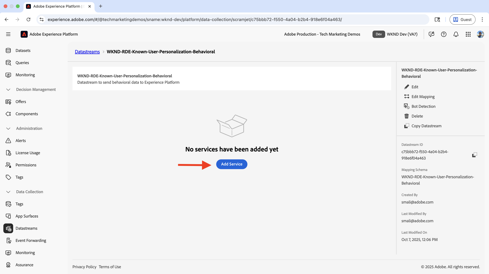
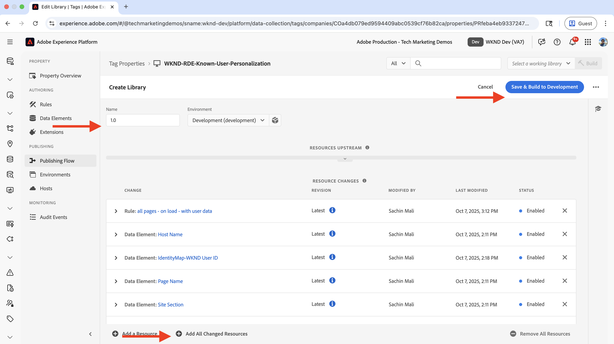
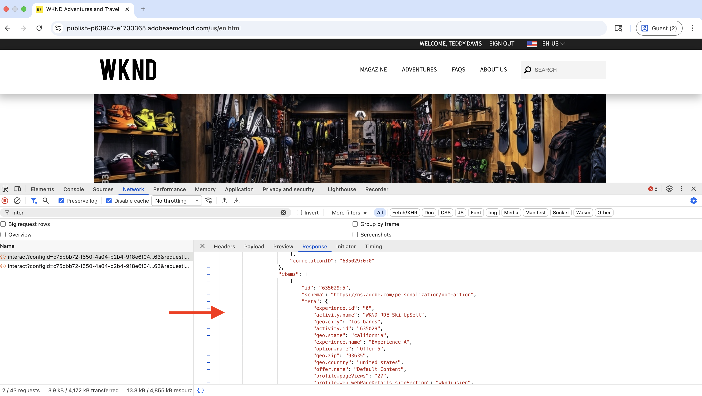

# Verpersoonlijking van bekende gebruikers

Leer hoe te om inhoud aan te passen die op bekende-gebruikersgegevens zoals aankoopgeschiedenis, de gegevens van CRM, of andere gegevens wordt gebaseerd die over de gebruiker worden verzameld.

De bekende-gebruiker verpersoonlijking helpt u persoonlijke ervaringen aan gebruikers leveren die op gegevens worden gebaseerd die u over hen hebt verzameld. De _gebruikersgegevens konden via verschillende systemen_ of kanalen zoals website, mobiele app, vraagcentrum, enz. worden verzameld. Dit _gegeven wordt dan verbonden samen om een volledig gebruikersprofiel_ tot stand te brengen en gebruikt om de ervaringen te personaliseren.

Veelvoorkomende scenario&#39;s zijn:

- **verpersoonlijking van de Inhoud**: Vertoning gepersonaliseerde ervaringen die op de het profielgegevens van de gebruiker worden gebaseerd. Geef bijvoorbeeld een persoonlijke held weer op de homepage op basis van de aankoopgeschiedenis van de gebruiker.
- **Upsell en dwars-verkoop**: De vertoning gepersonaliseerde upsell en dwars-verkoopt aanbevelingen die op de de aankoopgeschiedenis van de gebruiker worden gebaseerd. Geef bijvoorbeeld een gepersonaliseerde upsellaanbeveling weer voor de aankoopgeschiedenis van de gebruiker.
- **Loyalty programma**: De gepersonaliseerde de programmavoordelen van de vertoning van de loyaliteit die op de de aankoopgeschiedenis van de gebruiker worden gebaseerd. Bijvoorbeeld, toon een gepersonaliseerd voordeel van het loyaliteitsprogramma voor de de aankoopgeschiedenis van de gebruiker.

Uw organisatie kan verschillende gebruiksgevallen voor bekende-gebruikersverpersoonlijking hebben. Het bovenstaande zijn slechts enkele voorbeelden.

## Voorbeeld van gebruik


In dit leerprogramma, dat de [&#x200B; plaats van steekproefWKND &#x200B;](https://github.com/adobe/aem-guides-wknd) gebruikt, toont het proces aan hoe **het programma opende gebruikers** die om het even welk **Ski** avontuur hebben gekocht een gepersonaliseerde held op de **WKND homepage** zien.

De heldenervaring probeert _het essentiële skimateriaal aan de gebruikers op te heffen die om het even welk_ Ski **avontuur hebben gekocht.** De gebruikers die geen **Ski** avontuur hebben gekocht zien de standaardheldinhoud. De ervaring van de held is dus gepersonaliseerd voor de gebruikers op basis van hun aankoopgeschiedenis en aanmeldingsstatus. Om deze verpersoonlijking toe te laten, worden de gegevens van verschillende systemen verbonden aan het creëren van een volledig klantenprofiel en gebruikt voor verpersoonlijkingsactiviteiten.


### Gebruikersgegevensbeheer op verschillende systemen

Voor demodoeleinden, veronderstel dat de WKND gebruikersgegevens in de volgende systemen zijn. Elk systeem slaat verschillende soorten gegevens op die in twee categorieën kunnen worden geclassificeerd:

- **gedragsgegevens**: Vangt gebruikersinteractie en activiteiten op digitale kanalen (paginameningen, klikken, plaatsnavigatie, login status, het doorbladeren patronen)
- **Transactionele gegevens**: Verslagen voltooide bedrijfstransacties en informatie van het klantenprofiel (aankopen, orde geschiedenis, profieldetails, voorkeur)

| Systeem | Doel | Welke gegevens worden opgeslagen? | Gegevenstype |
|------|------|------|------|
| AEM | Inhoudsbeheersysteem (CMS), aanbiedingen en boekingen voor avontuur en aanmeldingsfunctionaliteit | Gebruikersinteracties: paginaweergaven, aanmeldingsstatus, sitenavigatie. Minimale gebruikers-id&#39;s, zoals gebruikersnaam, naam en e-mail. | Gedragsgegevens |
| Andere systemen | Gebruikersprofiel en transactiebestanden aanschaffen als een volledig recordsysteem. | Volledige klantprofielen: gebruikersnaam, naam, adres, telefoonnummer, koopgeschiedenis, ordergegevens, voorkeuren. | Transactiegegevens |

Het andere systeem zou een Systeem van Order Management (OMS), het Systeem van het Beheer van de Verhouding van de Klant (CRM), het Hoofdsysteem van het Gegevensbeheer (MDM), of een ander systeem kunnen zijn dat de transactionele gegevens opslaat.

Men veronderstelt ook dat de plaats WKND een Gebruikersinterface (UI) heeft die gebruikers toestaat om de **avonturen** te kopen/te boeken. De AEM is geïntegreerd met het andere systeem voor het opslaan van gegevens over de aanschaf van avontuurtjes. Bovendien heeft de gebruiker vóór of tijdens de aankoop een account op de WKND-site gemaakt.

Het logische diagram toont de gebruikersinteractie met de WKND-site en hoe gedrags- en transactiegegevens worden verzameld en in de Experience Platform worden ingevoerd.



Dit is een oververeenvoudigde versie om het concept bekende-gebruiker personalisatie aan te tonen. In een real-world scenario, zou u veelvoudige systemen kunnen hebben waarin het gedrag en de transactionele gegevens worden verzameld en worden opgeslagen.

### Toetsen

- **Verdeelde gegevensopslag**: De gegevens van de gebruiker worden opgeslagen over veelvoudige systemen - AEM slaat minimale gebruikersgegevens (gebruiker identiteitskaart, naam, e-mail) voor login functionaliteit op, terwijl andere systemen (OMS, CRM, MDM) volledig gebruikersprofiel en transactiegegevens zoals aankoopgeschiedenis handhaven.
- **Identiteitsstitching**: De systemen worden verbonden gebruikend een gemeenschappelijk herkenningsteken (WKND gebruikers ID - `wkndUserId`) dat uniek gebruikers over verschillende platforms en kanalen identificeert.
- **Volledige profielverwezenlijking**: Het doel is gebruikersgegevens van deze verdeelde systemen te verbinden om een verenigd klantenprofiel tot stand te brengen, dat dan wordt gebruikt om gepersonaliseerde ervaringen te leveren.

Uw gebruiksscenario kan verschillende systemen en gegevensopslag hebben. De sleutel is een gemeenschappelijke herkenningsteken te identificeren die uniek gebruikers over verschillende platforms en kanalen identificeert.

## Vereisten

Voordat u verdergaat met de Gebruikszaak voor bekende gebruikers, moet u het volgende hebben voltooid:

- [&#x200B; integreer Adobe Target &#x200B;](../setup/integrate-adobe-target.md): Laat teams toe om gepersonaliseerde inhoud centraal in AEM tot stand te brengen en te beheren en het als aanbiedingen in Adobe Target te activeren.
- [&#x200B; integreer Markeringen in Adobe Experience Platform &#x200B;](../setup/integrate-adobe-tags.md): Staat teams toe om JavaScript voor verpersoonlijking en gegevensinzameling te beheren en op te stellen zonder het moeten AEM code opnieuw opstellen.

Ook vertrouwd met [&#x200B; de Identiteitsdienst van Adobe Experience Cloud (ECID) &#x200B;](https://experienceleague.adobe.com/en/docs/id-service/using/home) en [&#x200B; Adobe Experience Platform &#x200B;](https://experienceleague.adobe.com/en/docs/experience-platform/landing/home) concepten, zoals Schema, Dataset, Datasstream, Soorten, Identiteiten, en Profielen.

In deze zelfstudie leert u meer over identiteit stitching en maakt u een klantprofiel in Adobe Experience Platform. Aldus, het combineren van de gedragsgegevens met de transactiegegevens om een volledig klantenprofiel tot stand te brengen.

## Stappen op hoog niveau

Het proces voor het instellen van de bekende gebruikersinstellingen omvat stappen in Adobe Experience Platform, AEM en Adobe Target.

1. **in Adobe Experience Platform:**
   1. Creeer _Namespace van de Identiteit_ voor WKND gebruiker - identiteitskaart (`wkndUserId`)
   1. Creeer en vorm twee (het Model van Gegevens van de Ervaring) schema&#39;s XDM - gestandaardiseerde gegevensstructuren die bepalen hoe het gegeven wordt georganiseerd en bevestigd - voor de gedragsgegevens en voor de transactionele gegevens
   1. Creeer en vorm twee datasets, één voor de gedragsgegevens en één voor de transactiegegevens
   1. Een DataStream maken en configureren
   1. Een tagedigenschap maken en configureren
   1. Samenvoegingsbeleid voor profiel configureren
   1. Adobe Target-bestemming instellen (V2)

2. **in AEM:**
   1. Verbeter de functionaliteit voor aanmelding bij de WKND-site om de gebruikers-id op te slaan in de sessieopslag van de browser.
   1. De eigenschap Tags integreren en injecteren in AEM-pagina&#39;s
   1. Gegevensverzameling op AEM-pagina&#39;s verifiëren
   1. Adobe Target integreren
   1. Aangepaste aanbiedingen maken

3. **in Adobe Experience Platform:**
   1. De gedragsgegevens en het maken van profielen controleren
   1. De transactiegegevens verzamelen
   1. Gedrag en transactiegegevenskoppeling verifiëren
   1. Een publiek maken en configureren
   1. Het publiek naar Adobe Target activeren

4. **in Adobe Target:**
   1. Het publiek en de aanbiedingen controleren
   1. Een activiteit maken en configureren

5. **verifieer de bekende-gebruikersverpersoonlijkingsimplementatie op uw pagina&#39;s van AEM**

De Adobe Experience Platform (AEP) gebruikt verschillende oplossingen om de gebruikersgegevens te verzamelen, te beheren, te identificeren en aan te sluiten op verschillende systemen. Met behulp van de gegevens van de gebruiker worden de doelgroepen gemaakt en geactiveerd in Adobe Target. Met behulp van activiteiten in Adobe Target worden persoonlijke ervaringen opgedaan bij gebruikers die voldoen aan de criteria voor het publiek.

## Adobe Experience Platform instellen

Om een volledig klantprofiel te maken, is het nodig om zowel gedragsgegevens (paginaweergavegegevens) als transactiegegevens (WKND Adventure-aankopen) te verzamelen en op te slaan. De gedragsgegevens worden verzameld gebruikend het bezit van Markeringen en de transactiegegevens worden verzameld gebruikend het systeem van de Aankoop van het avontuur WKND.

De transactiegegevens worden vervolgens opgenomen in de Experience Platform en gekoppeld aan de gedragsgegevens om een volledig klantprofiel te maken.

In dit voorbeeld, om een gebruiker te categoriseren die om het even welk **Ski** avontuur heeft gekocht, zijn de gegevens van de paginamening samen met hun gegevens van de avontuuraankoop nodig. De gegevens worden samengevoegd gebruikend WKND gebruiker - identiteitskaart (`wkndUserId`), die een gemeenschappelijke herkenningsteken over systemen is.

Laten we beginnen door u aan te melden bij de Adobe Experience Platform om de benodigde componenten in te stellen voor het verzamelen en koppelen van de gegevens.

Login aan [&#x200B; Adobe Experience Cloud &#x200B;](https://experience.adobe.com/) en navigeer aan **Experience Platform** van de Schakelaar van de Toepassing of de Snelle sectie van de Toegang.


### Naamruimte identiteit maken

Een naamruimte voor identiteiten is een logische container die context aan identiteiten biedt, zodat Experience Platform begrijpt welk ID-systeem wordt gebruikt (bijvoorbeeld e-mail, CRM-id of loyalty-id). Als u twee of meer afzonderlijke stukken profielgegevens wilt koppelen, wordt een naamruimte voor identiteit gebruikt. Wanneer beide afzonderlijke stukken profielgegevens dezelfde waarde hebben voor een kenmerk en dezelfde naamruimte delen, worden ze aan elkaar gekoppeld. Om een attribuut als identiteit te kwalificeren die attributen stitching, zij moeten van zelfde namespace zijn.

In dit voorbeeld, is WKND gebruiker - identiteitskaart (`wkndUserId`) het gemeenschappelijke herkenningsteken over gedrags en transactionele gegevens. Aan de hand van deze gemeenschappelijke id worden de gegevens samengevoegd om een volledig klantprofiel te maken.

Laten we een naamruimte voor de WKND-gebruikers-id maken (`wkndUserId`).

- In **Adobe Experience Platform**, klik **Identiteiten** van de linkernavigatie. Dan klik **creeer identiteit namespace** knoop van het hoogste recht.

  

- In **creeer identiteit namespace** dialoog, ga het volgende in:
   - **Naam van de Vertoning**: Gebruiker van WKND - identiteitskaart
   - **Beschrijving**: Gebruiker - identiteitskaart of gebruikersbenaming van de het programma geopende gebruiker WKND
   - **selecteer een type**: Individuele dwars-apparaat identiteitskaart

  Klik **creëren** om identiteit te creëren namespace.

  

### Schema&#39;s maken

Een schema definieert de structuur en indeling van gegevens die u verzamelt in Adobe Experience Platform. Het zorgt voor gegevensconsistentie en stelt u in staat een zinvol publiek te maken op basis van gestandaardiseerde gegevensvelden. Voor bekende-gebruiker verpersoonlijking, zijn twee schema&#39;s nodig, voor de gedragsgegevens en voor de transactiegegevens.

#### Gedragsgegevensschema

Maak eerst een schema voor het verzamelen van gedragsgegevens, zoals gebeurtenissen in de paginaweergave en gebruikersinteracties.

- In **Adobe Experience Platform**, klik **Schema&#39;s** van de linkernavigatie, klik **creeer schema** knoop van het hoogste recht. Dan selecteer de **Handmatige** optie en klik de **Uitgezochte** knoop.

  

- In **creeer Schema** tovenaar, voor **de details van het Schema** stap, selecteer de **optie van de Gebeurtenis van de Ervaring** (voor tijd-reeksgegevens zoals paginameningen, klikken, en gebruikersinteractie) en klik **daarna**.

  

- Voor **Naam en overzicht** stap, ga het volgende in:
   - **de vertoningsnaam van het Schema**: WKND-RDE-Known-Gebruiker-Personalization-Gedrag
   - **Geselecteerde Klasse**: XDM ExperienceEvent

  

- Werk het schema als volgt bij:
   - **voeg gebiedsgroep** toe: AEP Web SDK ExperienceEvent
   - **Profiel**: laat toe

  Klik **sparen** om het schema tot stand te brengen.

  

- Als u wilt weten of de gebruiker is aangemeld (geverifieerd) of anoniem is, voegt u een aangepast veld toe aan het schema. In dit gebruiksgeval, is het doel de inhoud voor gekende-gebruikers te personaliseren die om het even welk **avontuur van 0&rbrace; Ski &lbrace;hebben gekocht.** Daarom is het belangrijk om te bepalen of de gebruiker is aangemeld (geverifieerd) of anoniem is.


   - Klik op de knop **+** naast de schemanaam.
   - In de **eigenschappen van het Gebied** sectie, ga het volgende in:
      - **Naam van het Gebied**: wkndLoginStatus
      - **Naam van de Vertoning**: De Status van de Login van WKND
      - **Type**: Koord
      - **wijs aan** toe: De groep van het Gebied > `wknd-user-details`

     De rol neer en klikt **past** knoop toe.

     

- Het uiteindelijke schema met gedragsgegevens moet er als volgt uitzien:

  

#### Transactioneel gegevensschema

Daarna, creeer een schema om de transactiegegevens zoals de aankopen van het avontuur van WKND te verzamelen.

- In **creeer Schema** tovenaar, voor **de details van het Schema** stap, selecteer de **Individuele optie van het Profiel** (voor op verslag-gebaseerde gegevens zoals klantenattributen, voorkeur, en koopgeschiedenis) en klik **daarna**.

  

- Voor **Naam en overzicht** stap, ga het volgende in:
   - **de vertoningsnaam van het Schema**: WKND-RDE-Known-Gebruiker-Personalization-Transactional
   - **Geselecteerde Klasse**: Individueel Profiel XDM

  

- Als u de WKND Adventure-aankoopgegevens van een gebruiker wilt opslaan, moet u eerst een aangepast veld toevoegen dat als id voor de aankoop fungeert. Herinner me, WKND gebruiker - identiteitskaart (`wkndUserId`) is het gemeenschappelijke herkenningsteken over systemen.
   - Klik op de knop **+** naast de schemanaam.
   - In de **eigenschappen van het Gebied** sectie, ga het volgende in:
      - **Naam van het Gebied**: wkndUserId
      - **Naam van de Vertoning**: De Gebruiker van WKND ID
      - **Type**: Koord
      - **wijs aan** toe: De groep van het Gebied > `wknd-user-purchase-details`

  

   - De rol neer, controleert **Identiteit**, controleert **Primaire identiteit** (het belangrijkste herkenningsteken wordt gebruikt om gegevens van verschillende bronnen in een verenigd profiel) en in **Identiteitsnaamruimte** dropdown uitgezochte **Gebruiker van WKND** te stikken. Tot slot klik **toepassen** knoop.

  

- Na het toevoegen van het douane primaire identiteitsgebied, zou het schema als dit moeten kijken:

  

- U kunt ook de volgende velden toevoegen om aanvullende gegevens over de aankoop van gebruikers en avontuur op te slaan:

  | Veldnaam | Weergavenaam | Type | Toewijzen aan |
  |----------|------------|----|---------|
  | adventurePurchased | Aangeschafte avontuur | String | Veldgroep > `wknd-user-purchase-details` |
  | adventurePurchaseAmount | Aankoopbedrag voor avontuur | Dubbel | Veldgroep > `wknd-user-purchase-details` |
  | adventurePurchaseQuantity | Aankoophoeveelheid avontuur | Geheel | Veldgroep > `wknd-user-purchase-details` |
  | adventurePurchaseDate | Aankoopdatum avontuur | Datum | Veldgroep > `wknd-user-purchase-details` |
  | adventureStartDate | Begindatum avontuur | Datum | Veldgroep > `wknd-user-purchase-details` |
  | adventureEndDate | Einddatum avontuur | Datum | Veldgroep > `wknd-user-purchase-details` |
  | firstName | Voornaam | String | Veldgroep > `wknd-user-purchase-details` |
  | lastName | Achternaam | String | Veldgroep > `wknd-user-purchase-details` |
  | email | E-mail | E-mailadres | Veldgroep > `wknd-user-purchase-details` |
  | telefoon | Telefoon | Object | Veldgroep > `wknd-user-purchase-details` |
  | sekse | Geslacht | String | Veldgroep > `wknd-user-purchase-details` |
  | ouderdom | Leeftijd | Geheel | Veldgroep > `wknd-user-purchase-details` |
  | adres | Adres | String | Veldgroep > `wknd-user-purchase-details` |
  | stad | Plaats | String | Veldgroep > `wknd-user-purchase-details` |
  | state | Staat | String | Veldgroep > `wknd-user-purchase-details` |
  | land | Land | String | Veldgroep > `wknd-user-purchase-details` |
  | zipCode | Postcode | String | Veldgroep > `wknd-user-purchase-details` |

  

- Profiel inschakelen voor het schema.

   toe

U hebt nu beide schema&#39;s voor de gedrags- en transactiegegevens gemaakt.

### Datasets maken en configureren

Een dataset is een container voor gegevens die een specifiek schema volgen. In dit voorbeeld, creeer twee datasets, voor de gedragsgegevens en voor de transactionele gegevens.

#### Gegevensset gedragsgegevens

- In **Adobe Experience Platform**, klik **Datasets** van de linkernavigatie, klik de **Create dataset** knoop van het hoogste recht. Dan selecteer de **op schema-Gebaseerde** optie en klik **daarna**.

  

- Voor **Uitgezochte schema** stap, selecteer **WKND-RDE-Known-Gebruiker-Personalization-Gedrag** schema en klik **daarna**.

  

- Voor **vorm dataset** stap, ga het volgende in:
   - **Naam**: WKND-RDE-Known-user-Personalization-Behavioral
   - **Beschrijving**: Dataset voor de gedragsgegevens zoals paginameningen met gebruikerslogin status.

  

  Klik **Afwerking** om de dataset tot stand te brengen.

- Wissel de **schakelaar van het Profiel** om de dataset voor Profiel toe te laten.

   toe

#### Gegevensset over transactionele gegevens

- Herhaal de zelfde stappen voor de transactie gegevensdataset. Het enige verschil is het schema en de datasetnaam.

   - **Schema**: WKND-RDE-Known-user-Personalization-Transaction
   - **Dataset**: WKND-RDE-Known-user-Personalization-Transaction
   - **Beschrijving**: Dataset voor de transactiegegevens zoals de aankopen van het avontuur van WKND.
   - **Profiel**: laat toe

  De definitieve gegevensreeks van transactionele gegevens zou als dit moeten kijken:

  

Als beide gegevenssets zijn geïnstalleerd, kunt u nu een gegevensstroom maken om gegevensstroom van uw website naar Experience Platform mogelijk te maken.

### Een DataStream maken en configureren

Een gegevensstroom is een configuratie die bepaalt hoe de gegevens van uw website aan Adobe Experience Platform via het Web SDK stromen. Deze fungeert als een Bridge tussen uw website en het platform, zodat de gegevens correct zijn opgemaakt en naar de juiste gegevenssets worden geleid. Voor bekende-gebruiker verpersoonlijking, laat de diensten zoals de Segmentatie van Edge en de Doelen van Personalization toe.

Laten wij een gegevensstroom tot stand brengen om _gedrags_ (en niet transactie) gegevens naar Experience Platform via het Web SDK te verzenden.

- In **Adobe Experience Platform**, klik **Datastreams** van de linkernavigatie en klik **creeer datastream**.

  

- In de **Nieuwe gegevensstroom** stap, ga het volgende in:

   - **Naam**: WKND-RDE-Known-user-Personalization-Behavioral
   - **Beschrijving**: DataStream om gedragsgegevens naar Experience Platform te verzenden
   - **het Schema van de afbeelding**: WKND-RDE-Known-User-Personalization-Behavioral

  

  Klik **sparen** om de gegevensstroom tot stand te brengen.

- Zodra de DataStream wordt gecreeerd, klik **voegt de Dienst** toe.

   toe

- In **voeg de stap van de Dienst** toe, selecteer **Adobe Experience Platform** van dropdown en ga het volgende in:
   - **Dataset van de Gebeurtenis**: WKND-RDE-Known-user-Personalization-Behavioral
   - **Dataset van het Profiel**: WKND-RDE-Known-Gebruiker-Personalization-Gedrag
   - **Offer Decisioning**: Laat toe (staat Adobe Target toe om gepersonaliseerde aanbiedingen in real time te verzoeken en te leveren)
   - **de Segmentatie van Edge**: laat (evalueert publiek in real time bij het randnetwerk voor directe verpersoonlijking) toe
   - **de Doelen van Personalization**: Laat toe (staat publiek het delen met verpersoonlijkingshulpmiddelen zoals Adobe Target toe)

  Klik **sparen** om de dienst toe te voegen.

  

- In **voeg de stap van de Dienst** toe, selecteer **Adobe Target** van dropdown en ga **identiteitskaart van het Milieu van het Doel** in. U kunt identiteitskaart van het Milieu van het Doel in Adobe Target onder **Beleid** vinden > **Milieu&#39;s**. Klik **sparen** om de dienst toe te voegen.
  

- De uiteindelijke gegevensstroom moet er als volgt uitzien:

  

De datastream is nu geconfigureerd om gedragsgegevens via de Web SDK naar Experience Platform te verzenden.

Merk op dat het _transactie_ gegeven in Experience Platform wordt opgenomen gebruikend partijopname (een methode om grote datasets bij geplande intervallen eerder dan in real time te uploaden). De gegevens van de Adventure aankoop van WKND worden verzameld gebruikend de plaats WKND en in het andere systeem (bijvoorbeeld, OMS of CRM of MDM) opgeslagen. De gegevens worden vervolgens via batch-inname in Experience Platform opgenomen.

Het is ook mogelijk om die gegevens rechtstreeks van de website naar Experience Platform in te voeren, wat niet in deze zelfstudie wordt behandeld. De gebruikscase wil het proces benadrukken om de gebruikersgegevens over systemen te stikken en een volledig klantprofiel tot stand te brengen.

## Een eigenschap voor tags maken en configureren

Een eigenschap Tags is een container voor JavaScript-code die gegevens van uw website verzamelt en naar Adobe Experience Platform verzendt. Deze laag fungeert als de laag voor gegevensverzameling waarin gebruikersinteracties en paginaweergaven worden vastgelegd. Voor bekende gebruikersverpersoonlijking, samen met de gegevens van de paginamening (bijvoorbeeld, paginanaam, URL, plaatssectie, en gastheernaam), worden de gebruikerslogin status en WKND gebruiker - identiteitskaart ook verzameld. De WKND-gebruikers-id (`wkndUserId`) wordt verzonden als onderdeel van het object Identity Map.

Laten we een eigenschap Codes maken die de paginaweergavegegevens en de aanmeldingsstatus van de gebruiker + gebruikers-id (indien aangemeld) vastlegt wanneer gebruikers de WKND-site bezoeken.

U kunt het bezit van Markeringen bijwerken u in de [&#x200B; creeerde stap van de Markeringen van Adobe &#x200B;](../setup/integrate-adobe-tags.md) integreert. Om het echter eenvoudig te houden, wordt een nieuwe eigenschap Codes gemaakt.

### Eigenschap Codes maken

- In **Adobe Experience Platform**, klik **Markeringen** van de linkernavigatie en klik het **Nieuwe Bezit** knoop.

  

- In **creeer Bezit** dialoog, ga het volgende in:
   - **Naam van het Bezit**: WKND-RDE-Known-user-Personalization
   - **Type van Bezit**: Selecteer **Web**
   - **Domein**: Het domein waar u het bezit opstelt (bijvoorbeeld, `adobeaemcloud.com`)

  Klik **sparen** om het bezit tot stand te brengen.

  

- Open het nieuwe bezit, en klik **Uitbreidingen** van de linkernavigatie, en klik de **Catalogus** tabel. Onderzoek naar **SDK van het Web** en klik **installeer** knoop.
  

- In **installeer de dialoog van de Uitbreiding**, selecteer **Datastream** u vroeger creeerde en **klik sparen**.
  

#### Gegevenselementen toevoegen

De elementen van gegevens zijn variabelen die specifieke gegevenspunten van uw website vangen en hen voor gebruik in regels en andere configuraties van Markeringen ter beschikking stellen. Ze fungeren als de bouwstenen voor gegevensverzameling, zodat u zinvolle informatie uit gebruikersinteracties en paginaweergaven kunt extraheren. Voor bekende gebruikers-verpersoonlijking, moeten de paginadetails zoals gastheernaam, plaatssectie, en paginanaam worden gevangen om publiekssegmenten tot stand te brengen. De aanmeldingsstatus van de gebruiker en de WKND-gebruikers-id (indien aangemeld) moeten samen met deze status worden vastgelegd.

Maak de volgende gegevenselementen om de belangrijke paginadetails vast te leggen.

- Klik {de Elementen van 0} Gegevens **van de linkernavigatie en klik** creëren Nieuw Element van Gegevens **knoop.**
  

- In **creeer Nieuwe dialoog van het Element van Gegevens**, ga het volgende in:
   - **Naam**: De Naam van de gastheer
   - **Uitbreiding**: Selecteer **Kern**
   - **het Type van Element van Gegevens**: Selecteer **Douane Code**
   - **Open de knoop van de Redacteur** en ga het volgende codefragment in:

     ```javascript
     if(window && window.location && window.location.hostname) {
         return window.location.hostname;
     }        
     ```

  

- U kunt ook de volgende gegevenselementen maken:

   - **Naam**: Sectie van de Plaats
   - **Uitbreiding**: Selecteer **Kern**
   - **het Type van Element van Gegevens**: Selecteer **Douane Code**
   - **Open de knoop van de Redacteur** en ga het volgende codefragment in:

     ```javascript
     if(event && event.component && event.component.hasOwnProperty('repo:path')) {
         let pagePath = event.component['repo:path'];
     
         let siteSection = '';
     
         //Check of html String in URL.
         if (pagePath.indexOf('.html') > -1) { 
         siteSection = pagePath.substring(0, pagePath.lastIndexOf('.html'));
     
         //replace slash with colon
         siteSection = siteSection.replaceAll('/', ':');
     
         //remove `:content`
         siteSection = siteSection.replaceAll(':content:','');
         }
     
         return siteSection 
     }        
     ```

  

   - **Naam**: De Naam van de pagina
   - **Uitbreiding**: Selecteer **Kern**
   - **het Type van Element van Gegevens**: Selecteer **Douane Code**
   - **Open de knoop van de Redacteur** en ga het volgende codefragment in:

     ```javascript
     if(event && event.component && event.component.hasOwnProperty('dc:title')) {
         // return value of 'dc:title' from the data layer Page object, which is propogated via 'cmp:show' event
         return event.component['dc:title'];
     }
     ```

  


   - **Naam**: De Gebruiker van WKND ID
   - **Uitbreiding**: Selecteer **Kern**
   - **het Type van Element van Gegevens**: Selecteer **Douane Code**
   - **Open de knoop van de Redacteur** en ga het volgende codefragment in:

     ```javascript
     // Data element for WKND User ID
     if(event && event.user && event.user.userId) {
         console.log('UserID:', event.user.userId);
         return event.user.userId;
     } else {
         console.log('UserID:');
         return "";
     }        
     ```

  


   - **Naam**: De Status van de Gebruiker van WKND
   - **Uitbreiding**: Selecteer **Kern**
   - **het Type van Element van Gegevens**: Selecteer **Douane Code**
   - **Open de knoop van de Redacteur** en ga het volgende codefragment in:

     ```javascript
     // Data element for user login status
     if(event && event.user && event.user.status) {
         console.log('User status:', event.user.status);
         return event.user.status;
     } else {
         console.log('User status:anonymous');
         return 'anonymous';
     }        
     ```

  

- Daarna, creeer een gegevenselement van **het kaarttype van de Identiteit**. Identiteitskaart is een standaardXDM structuur die veelvoudige gebruikers herkenningstekens opslaat en hen verbindt samen, toelatend identiteit het stitching over systemen. Dit gegevenselement wordt gebruikt om de WKND-gebruikers-id (indien aangemeld) op te slaan als onderdeel van het object Identity Map.

   - **Naam**: Identiteitskaart-WKND Gebruiker - identiteitskaart
   - **Uitbreiding**: Selecteer **SDK van het Web van Adobe Experience Platform**
   - **Type van Gegevens**: Selecteer **kaart van de Identiteit**

  In het rechterpaneel,
   - **Namespace**: Selecteer **wKnodUserId**
   - **identiteitskaart**: Selecteer **WKND gebruikersidentiteitskaart** gegevenselement
   - **de staat van de Authentificatie**: Selecteer **Authenticated**
   - **Primair**: Selecteer **waar**


  Klik **sparen** om het gegevenselement tot stand te brengen.

  

- Daarna, creeer een gegevenselement van **Variabele** type. Dit gegevenselement wordt gevuld met de paginagegevens voordat het naar de Experience Platform wordt verzonden.

   - **Naam**: XDM-Variabele Voorproef
   - **Uitbreiding**: Selecteer **SDK van het Web van Adobe Experience Platform**
   - **Type van Gegevens**: Selecteer **Variabele**

  In het rechterpaneel,
   - **Sandbox**: Selecteer uw zandbak
   - **Schema**: Selecteer het **WKND-RDE-Known-Gebruiker-Personalization** schema

  Klik **sparen** om het gegevenselement tot stand te brengen.

  

   - De laatste gegevenselementen moeten er als volgt uitzien:

     

#### Regels toevoegen

Regels bepalen wanneer en hoe gegevens worden verzameld en naar Adobe Experience Platform worden verzonden. Ze fungeren als de logische laag die bepaalt wat er gebeurt wanneer specifieke gebeurtenissen op uw website plaatsvinden. Voor bekende-gebruiker verpersoonlijking, creeer regels om de gegevens van de paginaaregave en gebruikerslogin status + gebruiker - identiteitskaart (indien het programma geopend) te vangen wanneer de gebruikers de plaats WKND bezoeken.

Creeer een regel om het **XDM-Variabele 1&rbrace; gegevenselement van de Voorproef te bevolken gebruikend de andere gegevenselementen alvorens het naar Experience Platform te verzenden.** De regel wordt geactiveerd wanneer een gebruiker door de WKND-website bladert.

- Klik **Regels** van de linkernavigatie en klik **creeer Nieuwe knoop van de Regel**.
  

- In **creeer Nieuwe dialoog van de Regel**, ga het volgende in:
   - **Naam**: alle pagina&#39;s - op lading - met gebruikersgegevens

   - Voor de **sectie van Gebeurtenissen**, voegt de klik **&#x200B;**&#x200B;toe om de **tovenaar van de Configuratie van de Gebeurtenis** te openen.
      - **Uitbreiding**: Selecteer **Kern**
      - **Type van Gebeurtenis**: Selecteer **Douane Code**
      - **Open de knoop van de Redacteur** en ga het volgende codefragment in:

     ```javascript
     var pageShownEventHandler = function(evt) {
         // defensive coding to avoid a null pointer exception
         if(evt.hasOwnProperty("eventInfo") && evt.eventInfo.hasOwnProperty("path")) {
             //trigger Launch Rule and pass event
             console.debug("cmp:show event: " + evt.eventInfo.path);
     
             // Get user data from session storage
             var userData = getUserDataFromSession();
     
             var event = {
                 //include the path of the component that triggered the event
                 path: evt.eventInfo.path,
                 //get the state of the component that triggered the event
                 component: window.adobeDataLayer.getState(evt.eventInfo.path),
                 //include user data in the event
                 user: userData
             };
     
             //Trigger the Launch Rule, passing in the new 'event' object
             trigger(event);
         }
     }
     
     /**
      * Get user data from session storage
     */
     function getUserDataFromSession() {
         var userData = {
             userId: null,
             status: 'anonymous'
         };
     
         try {
             var cachedUserState = sessionStorage.getItem('wknd_user_state');
     
             if (cachedUserState) {
                 var userState = JSON.parse(cachedUserState);
                 var userInfo = userState.data;
     
                 // Validate user data structure before transformation
                 if (userInfo && typeof userInfo === 'object' && userInfo.hasOwnProperty('authorizableId')) {
                     // Transform AEM user data to minimal AEP format
                     userData = {
                         userId: userInfo.authorizableId !== 'anonymous' ? userInfo.authorizableId : null,
                         status: userInfo.authorizableId === 'anonymous' ? 'anonymous' : 'authenticated',
                     };
     
                     //console.log('User details from session storage:', userData.username || 'Anonymous');
                 } else {
                     console.warn('Invalid user data structure in session storage');
                     console.log('Using anonymous user data');
                 }
             } else {
                 console.log('No user data in session storage, using anonymous');
             }
         } catch (e) {
             console.warn('Failed to read user data from session storage:', e);
             console.log('Using anonymous user data');
         }
     
         return userData;
     }
     
     //set the namespace to avoid a potential race condition
     window.adobeDataLayer = window.adobeDataLayer || [];
     
     //push the event listener for cmp:show into the data layer
     window.adobeDataLayer.push(function (dl) {
         //add event listener for 'cmp:show' and callback to the 'pageShownEventHandler' function
         dl.addEventListener("cmp:show", pageShownEventHandler);
     });
     ```

     De functie `getUserDataFromSession` wordt gebruikt om de aanmeldingsstatus van de gebruiker en de WKND-gebruikersnaam (indien aangemeld) op te halen uit de sessieopslag. De AEM-code is verantwoordelijk voor het invullen van de sessieopslag met de aanmeldingsstatus van de gebruiker en de WKND-gebruikersnaam. In de specifieke stap voor AEM hebt u de functionaliteit voor aanmelding bij de WKND-site verbeterd en de gebruikers-id opgeslagen in de sessieopslag van de browser.

   - Voor de **Voorwaarden** sectie, klik **&#x200B;**&#x200B;toevoegen om de **Tovenaar van de Configuratie van de Voorwaarde** te openen.
      - **Logische Type**: Selecteer **Regelmatig**
      - **Uitbreiding**: Selecteer **Kern**
      - **Type van Voorwaarde**: Selecteer **Douane Code**
      - **Open de knoop van de Redacteur** en ga het volgende codefragment in:

     ```javascript
     if(event && event.component && event.component.hasOwnProperty('@type') && event.component.hasOwnProperty('xdm:template')) {
         console.log('The cmp:show event is from PAGE HANDLE IT');
         return true;
     } else {
         console.log('The event is NOT from PAGE - IGNORE IT');
         return false;
     }
     ```

   - Voor de **sectie van Acties**, klik **&#x200B;**&#x200B;toevoegen om de **tovenaar van de Configuratie van de Actie** te openen.
      - **Uitbreiding**: Selecteer **SDK van het Web van Adobe Experience Platform**
      - **Type van Actie**: Selecteer **veranderlijke Update**

      - Wijs de XDM gebieden aan de gegevenselementen toe:

        | XDM-veld | Gegevenselement |
        |----------|------------|
        | web.webPageDetails.name | Paginanaam |
        | web.webPageDetails.server | Hostnaam |
        | web.webPageDetails.siteSection | Sectie Site |
        | web.webPageDetails.value | 1 |
        | identityMap | IdentityMap-WKND-gebruikersnaam |
        | _$UW_NAMESPACE$.wkndLoginStatus | WKND-gebruikersstatus |

     

      - Klik **houden Veranderingen** om de actieconfiguratie te bewaren.

   - Klik nogmaals op Toevoegen om een andere handeling toe te voegen en open de wizard Handeling configureren.

      - **Uitbreiding**: Selecteer **SDK van het Web van Adobe Experience Platform**
      - **Type van Actie**: Selecteer **verzenden gebeurtenis**
      - In de 0&rbrace; sectie van Gegevens van het juiste paneel **, kaart** XDM-Variabele het gegevenselement van de Voorproef **aan het** Web Web Webpagedetails de Mening van de Pagina **type.**

     

   - Ook, in de 1&rbrace; sectie van Personalization van het juiste paneel **&lbrace;, controleer** visuele verpersoonlijkingsbesluiten **optie teruggeven.** Dan klik **houden Veranderingen** om de actie te bewaren.

     

- Uw regel moet er als volgt uitzien:

  

De regel is nu geconfigureerd voor het verzenden van paginaweergavegegevens en gebruikersaanmeldingsstatus + gebruikersnaam (indien aangemeld) naar Experience Platform.

De bovengenoemde stappen van de regelverwezenlijking hebben een behoorlijk aantal details zo zorgvuldig zijn terwijl het creëren van de regel. Het zou complex kunnen klinken maar herinner deze configuratiestappen maken het stop en spel zonder het moeten bijwerken van de code van AEM en het heropstellen van de toepassing.

#### Tagenbibliotheek toevoegen en publiceren

Een bibliotheek is een verzameling van al uw configuraties van tags (gegevenselementen, regels, extensies) die worden gemaakt en geïmplementeerd op uw website. Alles wordt samengevoegd, zodat de gegevensverzameling goed werkt. Voor bekende verpersoonlijking-gebruiker, wordt de bibliotheek gepubliceerd om de regels van de gegevensinzameling op uw website actief te maken.

- Klik **het Publiceren Stroom** van de linkernavigatie en klik **toevoegen Bibliotheek** knoop.
   toe

- In **voeg Bibliotheek** dialoog toe, ga het volgende in:
   - **Naam**: 1.0
   - **Milieu**: Selecteer **Ontwikkeling**
   - Klik **toevoegen Alle Gewijzigde Middelen** om alle middelen te selecteren.

  Klik **sparen &amp; bouwen aan Ontwikkeling** om de bibliotheek tot stand te brengen.

   toe

- Om de bibliotheek aan productie te publiceren, klik **goedkeuren en publiceren aan Productie**. Zodra het publiceren is voltooid, is het bezit klaar voor gebruik in AEM.
  

De bibliotheek is nu gepubliceerd en klaar om gegevens van uw AEM-pagina&#39;s te verzamelen.

### Samenvoegingsbeleid voor profiel configureren

Een samenvoegingsbeleid bepaalt hoe de klantengegevens van veelvoudige bronnen in één enkel profiel worden verenigd. Het bepaalt welke gegevens belangrijkheid nemen wanneer er conflicten zijn, die u een volledige en verenigbare mening van elke klant voor bekende-gebruikersverpersoonlijking verzekeren.

- In **Adobe Experience Platform**, klik **Profielen** van de linkernavigatie en klik het **Beleid van de Fusie** tabel.

  

Voor dit gebruik wordt een samenvoegbeleid gemaakt. U kunt echter een bestaand samenvoegingsbeleid gebruiken als u dat hebt. Zorg ervoor om zowel **Standaard samenvoegbeleid** als **toe te laten actief-op-Edge de opties van het Beleid van de Fusie** (dat profielgegevens toelaat om bij het randnetwerk voor verpersoonlijkingsbesluiten in real time beschikbaar te zijn).

Deze montages zorgen ervoor dat uw gedrag en transactionele gegevens behoorlijk verenigd en beschikbaar voor publieksevaluatie in real time zijn.


### Adobe Target-bestemming instellen (V2)

Met de Adobe Target-bestemming (V2) kunt u het publiek dat in Experience Platform is gemaakt, rechtstreeks in Adobe Target activeren. Met deze verbinding kunnen gebruikers worden gebruikt voor personalisatieactiviteiten in Adobe Target.

- In **Adobe Experience Platform**, klik **Doelen** van de linkernavigatie en klik de **Catalogus** tabel. Onderzoek naar **Personalization** en selecteer **(v2) Adobe Target** bestemming.

  

- In **activeer de stap van Doelen**, verstrek een naam voor de bestemming en klik **verbind met bestemmings** knoop.
  

- In de **sectie van de Details van de Bestemming**, ga het volgende in:
   - **Naam**: WKND-RDE-Known-user-Personalization-Destination
   - **Beschrijving**: Doel voor de bekende-gebruikersverpersoonlijking
   - **Datastream**: Selecteer **Datastream** die u vroeger creeerde
   - **Workspace**: Selecteer uw werkruimte van Adobe Target

  

- Klik **daarna** en voltooi de bestemmingsconfiguratie.

  

Zodra gevormd, staat deze bestemming u toe om publiek te activeren dat in Experience Platform aan Adobe Target voor gebruik in verpersoonlijkingsactiviteiten wordt gecreeerd.

## AEM instellen

In de volgende stappen verbetert u de functionaliteit voor aanmelding op de WKND-site om de gebruikers-id op te slaan in de sessieopslag van de browser en de eigenschap Tags te integreren en te injecteren in AEM-pagina&#39;s.

De eigenschap tags wordt geïnjecteerd in AEM-pagina&#39;s om de paginaweergavegegevens en de aanmeldingsstatus van de gebruiker + de gebruikersnaam (indien aangemeld) te verzamelen wanneer gebruikers de WKND-site bezoeken. Dankzij de Adobe Target-integratie kunt u persoonlijke aanbiedingen exporteren naar Adobe Target.

### De aanmeldingsfunctionaliteit voor de WKND-site verbeteren

Om de functionaliteit van de de plaatsaanmelding van WKND te verbeteren, kloon het [&#x200B; WKND plaatsproject &#x200B;](https://github.com/adobe/aem-guides-wknd) van GitHub, creeer een nieuwe eigenschaptak, en open het in uw favoriete winde.

```shell
$ mkdir -p ~/Code
$ git clone git@github.com:adobe/aem-guides-wknd.git
$ cd aem-guides-wknd
$ git checkout -b feature/known-user-personalization
```

- Ga naar de module `ui.frontend` en open het bestand `ui.frontend/src/main/webpack/components/form/sign-in-buttons/sign-in-buttons.js` . Controleer de code nadat AJAX `currentuser.json` heeft aangeroepen, of de knop Aanmelden of Afmelden wordt weergegeven op basis van de gebruikersaanmeldingsstatus.

- Werk de code bij om de gebruikers-id op te slaan in de sessieopslag van de browser en optimaliseer de code om te voorkomen dat u meerdere AJAX-aanroepen uitvoert naar `currentuser.json` .

  ```javascript
  import jQuery from "jquery";
  
  jQuery(function($) {
      "use strict";
  
      (function() {
          const currentUserUrl = $('.wknd-sign-in-buttons').data('current-user-url'),
              signIn = $('[href="#sign-in"]'),
              signOut = $('[href="#sign-out"]'),
              greetingLabel = $('#wkndGreetingLabel'),
              greetingText = greetingLabel.text(),
              body = $('body');
  
          // Cache configuration
          const CACHE_KEY = 'wknd_user_state';
          const CACHE_DURATION = 5 * 60 * 1000; // 5 minutes in milliseconds
  
          /**
           * Get cached user state from session storage
           */
          function getCachedUserState() {
              try {
                  const cached = sessionStorage.getItem(CACHE_KEY);
                  if (cached) {
                      const userState = JSON.parse(cached);
                      const now = Date.now();
  
                      // Check if cache is still valid
                      if (userState.timestamp && (now - userState.timestamp) < CACHE_DURATION) {
                          return userState.data;
                      } else {
                          // Cache expired, remove it
                          sessionStorage.removeItem(CACHE_KEY);
                      }
                  }
              } catch (e) {
                  console.warn('Failed to read cached user state:', e);
                  sessionStorage.removeItem(CACHE_KEY);
              }
              return null;
          }
  
          /**
           * Cache user state in session storage
           */
          function cacheUserState(userData) {
              try {
                  const userState = {
                      data: userData,
                      timestamp: Date.now()
                  };
                  sessionStorage.setItem(CACHE_KEY, JSON.stringify(userState));
              } catch (e) {
                  console.warn('Failed to cache user state:', e);
              }
          }
  
          /**
           * Clear cached user state
           */
          function clearCachedUserState() {
              try {
                  sessionStorage.removeItem(CACHE_KEY);
              } catch (e) {
                  console.warn('Failed to clear cached user state:', e);
              }
          }
  
          /**
           * Update UI based on user state
           */
          function updateUI(userData) {
              const isAnonymous = 'anonymous' === userData.authorizableId;
  
              if(isAnonymous) {
                  signIn.show();
                  signOut.hide();
                  greetingLabel.hide();
                  body.addClass('anonymous');
              } else {
                  signIn.hide();
                  signOut.show();
                  greetingLabel.text(greetingText + ", " + userData.name);
                  greetingLabel.show();
                  body.removeClass('anonymous');
              }
          }
  
          /**
           * Fetch user data from AEM endpoint
           */
          function fetchUserData() {
              return $.getJSON(currentUserUrl + "?nocache=" + new Date().getTime())
                  .fail(function(xhr, status, error) {
                      console.error('Failed to fetch user data:', error);
                      updateUI({ authorizableId: 'anonymous' });
                  });
          }
  
          /**
           * Initialize user state (check cache first, then fetch if needed)
           */
          function initializeUserState() {
              const cachedUserState = getCachedUserState();
  
              if (cachedUserState) {
                  updateUI(cachedUserState);
              } else {
                  fetchUserData().done(function(currentUser) {
                      updateUI(currentUser);
                      cacheUserState(currentUser);
                  });
              }
          }
  
          // Initialize user state
          initializeUserState();
  
          // Clear cache on sign-in/sign-out clicks
          $(document).on('click', '[href="#sign-in"], [href="#sign-out"]', function() {
              clearCachedUserState();
          });
  
          // Clear cache when modal is shown
          $('body').on('wknd-modal-show', function() {
              clearCachedUserState();
          });
  
          // Clear cache when on dedicated sign-in page
          if (window.location.pathname.includes('/sign-in') || window.location.pathname.includes('/errors/sign-in')) {
              clearCachedUserState();
          }
  
          // Clear cache when sign-in form is submitted
          $(document).on('submit', 'form[id*="sign-in"], form[action*="login"]', function() {
              clearCachedUserState();
          });
  
          // Clear cache on successful login redirect
          const urlParams = new URLSearchParams(window.location.search);
          if (urlParams.has('login') || urlParams.has('success') || window.location.hash === '#login-success') {
              clearCachedUserState();
          }
  
          // Debug function for testing
          window.debugUserState = function() {
              console.log('Cache:', sessionStorage.getItem('wknd_user_state'));
              clearCachedUserState();
              initializeUserState();
          };
  
      })();
  });
  ```

  Merk op dat de het bezitsregel van Markeringen op de gebruiker - identiteitskaart baseert die in de browser zittingsopslag wordt opgeslagen. De sleutel `wknd_user_state` is een gemeenschappelijk contract tussen de code van AEM en de het bezitsregel van Markeringen voor het opslaan van en het terugwinnen van gebruikersidentiteitskaart

- Verifieer plaatselijk veranderingen door het project te bouwen en het in werking te stellen plaatselijk.

  ```shell
  $ mvn clean install -PautoInstallSinglePackage
  ```

  Login die `asmith/asmith` gebruikt (of een andere gebruiker u) geloofsbrieven creeerde, zijn zij inbegrepen [&#x200B; &#x200B;](https://github.com/adobe/aem-guides-wknd/blob/main/ui.content.sample/src/main/content/jcr_root/home/users/wknd/l28HasMYWAMHAaGkv-Lj/.content.xml) in het `aem-guides-wknd` project.

  

  In mijn geval heb ik een nieuwe gebruiker gemaakt met de id `teddy` voor testdoeleinden.

- Nadat u hebt bevestigd dat de gebruiker-id is opgeslagen in de sessieopslag van de browser (met de ontwikkelaarsgereedschappen van de browser), past u de wijzigingen toe op de externe opslagruimte van Adobe Cloud Manager en drukt u deze door.

  ```shell
  $ git add .
  $ git commit -m "Enhance the WKND site Login functionality to store the user ID in browser's session storage"
  $ git push adobe-origin feature/known-user-personalization
  ```

- Implementeer de wijzigingen in de AEM as a Cloud Service-omgeving met behulp van Cloud Manager-pijpleidingen of met behulp van de AEM RDE-opdracht.

### Tags-eigenschap integreren en in AEM-pagina&#39;s injecteren

Deze stap integreert het bezit van Markeringen dat eerder in uw pagina&#39;s van AEM werd gecreeerd, toelatend gegevensinzameling voor bekende-gebruikersverpersoonlijking. Met de eigenschap Codes worden automatisch de paginaweergavegegevens en de aanmeldingsstatus van de gebruiker + de gebruikersnaam (indien aangemeld) vastgelegd wanneer gebruikers de WKND-site bezoeken.

Om het bezit van Markeringen in de pagina&#39;s van AEM te integreren, volg de stappen van [&#x200B; Tags in Adobe Experience Platform &#x200B;](../setup/integrate-adobe-tags.md) integreren.

Zorg ervoor om het **WKND-RDE-Known-Gebruiker-Personalization** bezit van Markeringen te gebruiken dat vroeger, niet een verschillend bezit werd gecreeerd.


Als de eigenschap Tags eenmaal is geïntegreerd, worden bekende gebruikersaanpassingsgegevens van uw AEM-pagina&#39;s verzameld en naar Experience Platform verzonden voor het maken van een publiek.

### Gegevensverzameling op AEM-pagina&#39;s verifiëren

Om de gegevensinzameling van de pagina&#39;s van AEM te verifiëren, kunt u de ontwikkelaarshulpmiddelen van browser gebruiken om de netwerkverzoeken te inspecteren en de gegevens te zien die naar Experience Platform worden verzonden. U kunt [&#x200B; Debugger van Experience Platform &#x200B;](https://chromewebstore.google.com/detail/adobe-experience-platform/bfnnokhpnncpkdmbokanobigaccjkpob) ook gebruiken om de gegevensinzameling te verifiëren.

- Navigeer in de browser naar de WKND-site die wordt geïmplementeerd in uw AEM as a Cloud Service-omgeving. Als u anoniem bent, kunt u vergelijkbare verzoeken voor gegevensverzameling weergeven.

  

- Als u zich aanmeldt met `asmith/asmith` -referenties, worden vergelijkbare verzoeken om gegevensverzameling weergegeven.

  

De variabelen `identityMap` en `_YOUR_NAMESPACE.wkndLoginStatus` zijn ingesteld op respectievelijk de gebruikers-id en de aanmeldingsstatus.

### Adobe Target integreren

Deze stap integreert Adobe Target met AEM en maakt het mogelijk om gepersonaliseerde inhoud (Experience Fragments) naar Adobe Target te exporteren. Met deze verbinding kan Adobe Target de in AEM gemaakte inhoud gebruiken voor verpersoonlijkingsactiviteiten met het bekende publiek dat in Experience Platform is gemaakt.

Om Adobe Target te integreren en de **WKND-RDE-Known-Gebruiker-Personalization** publieksaanbiedingen naar Adobe Target uit te voeren, volg de stappen van [&#x200B; integreren Adobe Target in Adobe Experience Platform &#x200B;](../setup/integrate-adobe-target.md).

Zorg ervoor dat de configuratie van het Doel op de Fragments van de Ervaring wordt toegepast zodat kunnen zij naar Adobe Target voor gebruik in verpersoonlijkingsactiviteiten worden uitgevoerd.


Zodra geïntegreerd, kunt u de Fragments van de Ervaring van AEM naar Adobe Target uitvoeren, waar zij als gepersonaliseerde aanbiedingen voor het bekende-gebruikerspubliek worden gebruikt.

### Aangepaste aanbiedingen maken

De Fragmenten van de ervaring zijn herbruikbare inhoudscomponenten die aan Adobe Target als gepersonaliseerde aanbiedingen kunnen worden uitgevoerd. Voor bekende-gebruikersverpersoonlijking, onderverkoop __ het skimateriaal door een nieuw Fragment van de Ervaring te creëren.

- In AEM, klik **Fragmenten van de Ervaring** en navigeer aan de **omslag van de Fragmenten van de Plaats WKND**. Maak op de gewenste locatie een nieuw ervaringsfragment.

  

- Maak het fragment Ervaring door een component Teaser toe te voegen en pas het aan met inhoud relevant voor het upselling van de skiapparatuur.

  

- Exporteer het ervaringsfragment naar Adobe Target.

  

Je persoonlijke voorstel is nu beschikbaar in Adobe Target voor gebruik in activiteiten.

## Adobe Experience Platform instellen

Reviseer de Adobe Experience Platform om te controleren of de gedragsgegevens zijn verzameld en er verwante profielen worden gemaakt. Dan neem de transactiegegevens op, verifieer gedrag en transactionele gegevens stitching, creeer en vorm een Publiek, en activeer het Publiek aan Adobe Target.

### Gedragsgegevens en profielontwerp controleren

Controleer of de gedragsgegevens zijn verzameld en de bijbehorende profielen zijn gemaakt.

- In Adobe Experience Platform, klik **Datasets** en open **WKND-RDE-Known-user-Personalization-Behavioral** dataset. Controleer of de ingevoerde gegevensstatussen geldig zijn.

  

- Om de profielen te verifiëren worden gecreeerd, klik **Profielen** van de linkernavigatie. Dan navigeer aan **doorbladert** lusje en filter gebruikend de volgende criteria:
   - **beleid van de Fusie**: $UW_MERGE_POLICY_NAME
   - **Identiteitsnaamruimte**: ECID (identiteitskaart van Experience Cloud, een uniek herkenningsteken automatisch die door Adobe aan browser van elke bezoeker wordt toegewezen)
   - **waarde van de Identiteit**: Vind gebruikend de ontwikkelaarshulpmiddelen van browser of Debugger van Experience Platform. Dit is de cookie-waarde AMCV_$NAMESPACE$ zonder het voorvoegsel `MCMID|` .

  

- Klik, **Mening** knoop.
  

- Klik op het profiel. De details van het profiel worden weergegeven.
  

  In mijn geval heb ik mijn WKND-site benaderd vanuit twee verschillende browsers, dus er zijn twee ECID&#39;s gekoppeld aan gebruiker `teddy` . De gegevens van beide ECID&#39;s zijn aan elkaar gekoppeld om het profiel te maken. U bent begonnen de macht van identiteitsstitching te realiseren en hoe het wordt gebruikt om een volledig klantenprofiel tot stand te brengen. Snel worden de transactiegegevens gekoppeld aan de gedragsgegevens om een volledig klantprofiel te maken.

- Klik op het **lusje van Gebeurtenissen**, zou u de gebeurtenissen met betrekking tot het profiel moeten zien.
  

### De transactiegegevens verzamelen

Vervolgens neemt u de dummy transactiegegevens op in Experience Platform. In dit voorbeeld, worden de transactiegegevens opgeslagen in het andere systeem (bijvoorbeeld, OMS of CRM of MDM) en in Experience Platform opgenomen gebruikend partijopname. De transactiegegevens bevatten de WKND-gebruikers-id, die wordt gebruikt om de gedrags- en transactiegegevens aan elkaar te koppelen.

- In Adobe Experience Platform, klik **Datasets** en open de **WKND-RDE-Known-user-Personalization-Transactionele** dataset.

  

- In het juiste paneel, zoek **TOEVOEGEN GEGEVENSsectie** en sleep het {[&#x200B; dossier 2} ski-adventure-purchase-data.json aan het. &#x200B;](../assets/use-cases/known-user-personalization/ski-adventure-purchase-data.json) Dit dossier bevat de dummy transactionele gegevens voor de aankopen van het Adventure WKND. In een echt wereldscenario, wordt dit gegeven opgenomen van het andere systeem (bijvoorbeeld, OMS of CRM of MDM) gebruikend de partij of het stromen ingestie.

   toe

- Wacht tot de gegevensverwerking is voltooid.

  

- Zodra de gegevensverwerking volledig is, vernieuw de datasetpagina.

  

### Gedrag en transactiegegevenskoppeling verifiëren

Vervolgens verifieert u het gedrag en de transactionele gegevensstitching, het belangrijkste onderdeel van de bekende gebruikersidentificatiegebruikscase. Vergeet niet dat de gebruikers-id van de WKND-site de algemene id in alle systemen is en wordt gebruikt om de gegevens aan elkaar te koppelen. In dit voorbeeld wordt de gebruiker-id `teddy` gebruikt om de gegevens aan te sluiten.

- Klik **Profielen** van de linkernavigatie. Dan navigeer aan **doorbladert** lusje en filter gebruikend de volgende criteria:
   - **beleid van de Fusie**: $UW_MERGE_POLICY_NAME
   - **Identiteitsnaamruimte**: ECID
   - **waarde van de Identiteit**: Gebruik de zelfde waarde ECID die u gebruikte om de gedragsgegevens en het bijbehorende profiel te filtreren.

  

- Klik op het profiel. De details van het profiel worden weergegeven. De transactiegegevens zijn gekoppeld aan de gedragsgegevens om het volledige klantprofiel te maken.

  

- Klik op het **lusje van Attributen**, zou u de transactie en gedragsgegevensdetails verbonden aan het profiel moeten zien.
  

- Klik op de **verbinding van de identiteitsgrafiek van de Mening** om de identiteitsgrafiek van het profiel te zien.
  

Gefeliciteerd! U hebt de gedrags- en transactiegegevens gekoppeld om een volledig klantprofiel te maken.

Identiteitsstitching is een krachtig vermogen dat tot een volledig klantenprofiel door gegevens van veelvoudige systemen te combineren leidt. Voor demo-doeleinden worden slechts twee systemen gebruikt om de gegevens aan te sluiten. In een echt scenario, zou u veelvoudige systemen zoals Mobiele App, het Centrum van de Vraag, Chatbot, Punt van de Verkoop, enz. kunnen hebben. die de gegevens verzamelen en opslaan in hun respectieve systemen. Gebruikend het gemeenschappelijke herkenningsteken, worden de gegevens vastgemaakt samen om een volledig klantenprofiel tot stand te brengen en voor verpersoonlijkingsactiviteiten gebruikt. Deze benadering moderniseert de klantenervaring door gepersonaliseerde ervaringen aan de gebruikers te leveren, die statische, one-size-past-al inhoud met op maat gemaakte ervaringen vervangen die op individuele klantenprofielen worden gebaseerd.

#### Opzoeken van profiel met WKND-gebruikersnaam

Het is mogelijk om het profiel op te zoeken met de WKND-gebruikersnaam (niet de ECID) in Experience Platform.

- Klik **Profielen** van de linkernavigatie. Dan navigeer aan **doorbladert** lusje en filter gebruikend de volgende criteria:
   - **beleid van de Fusie**: $UW_MERGE_POLICY_NAME
   - **Identiteitsnaamruimte**: Gebruiker van WKND - identiteitskaart
   - **waarde van de Identiteit**: `teddy` of `asmith` of een andere gebruiker - identiteitskaart die u hebt gebruikt.

  

- Klik op het profiel. Dezelfde profieldetails worden weergegeven als in de vorige stap.
  

### Een publiek maken en configureren

Een publiek definieert een specifieke groep gebruikers op basis van hun gedrags- en transactiegegevens. In dit voorbeeld, wordt een publiek gecreeerd dat gebruikers kwalificeert die om het even welk **Ski** avontuur hebben gekocht en aan de plaats WKND het programma geopend.

Voer de volgende stappen uit om een publiek te maken:

- In Adobe Experience Platform, klik **Soorten publiek** van de linkernavigatie en klik **creëren de knoop van het Publiek**. Dan selecteer de **bouwstijl-regel** optie en klik **creeer** knoop.
  

- In **creeer** stap, ga het volgende in:
   - **Naam**: UpSell-Ski-Apparaat-aan-Voor authentiek verklaard
   - **Beschrijving**: De gebruikers die het programma worden geopend en om het even welk ski-avontuur hebben gekocht
   - **de methode van de Evaluatie**: Selecteer **Edge** (evalueert publiekslidmaatschap in real time aangezien de gebruikers doorbladeren, toelatend onmiddellijke verpersoonlijking)

  

- Dan klik het **lusje van Attributen** en navigeer aan de **Techmarketing demos** (of uw $NAMESPACE$) gebiedsgroep. De belemmering en laat vallen het **Aangeschafte avontuur** gebied aan het **Begin bouwend** sectie. Voer de volgende gegevens in:

  **Aangeschafte avontuur**: Selecteer **bevat** en ga de waarde **ski** in.

  

- Dan, schakelaar aan het **lusje van Gebeurtenissen** en navigeer aan de **techmarketingdemos** (of uw $NAMESPACE$) gebiedsgroep. De belemmering en laat vallen het **gebied van de Status van de Login 0&rbrace; WKND &lbrace;aan de** sectie van Gebeurtenissen **.** Voer de volgende gegevens in:

  **WKND Login Status**: Uitgezochte **evenaart** en gaat de voor authentiek verklaarde waarde **&#x200B;**&#x200B;in.

  Ook, selecteer **vandaag** optie.

  

- Herzie het publiek en klik **activeren aan bestemming** knoop.

  

- In **activeer aan bestemmings** dialoog, selecteer de bestemming van Adobe Target u vroeger creeerde en volg de stappen om het publiek te activeren. Klik **daarna** en voltooi de bestemmingsconfiguratie.

  

Gefeliciteerd! U hebt het publiek gemaakt en geactiveerd naar de Adobe Target-bestemming.

## Adobe Target instellen

In Adobe Target worden het in Experience Platform gecreëerde publiek en de persoonlijke aanbiedingen die vanuit AEM worden geëxporteerd, gecontroleerd op correcte beschikbaarheid. Dan, wordt een activiteit gecreeerd die het doelpubliek met de gepersonaliseerde inhoud combineert om de bekende-gebruikersverpersoonlijkingservaring te leveren.

- Login aan Adobe Experience Cloud en navigeer aan **Adobe Target** van de Schakelaar van de Toepassing of de Snelle sectie van de Toegang.

  

### Soorten publiek en aanbiedingen verifiëren

Controleer of het publiek en de aanbiedingen in Adobe Target correct beschikbaar zijn.

- In Adobe Target, klik **Soorten publiek** en verifieer dat het **UpSell-Ski-Apparaat-aan-Voor authentiek verklaard** publiek wordt gecreeerd.

  

- Door op het publiek te klikken, kunt u de publieksdetails zien en verifiëren het behoorlijk wordt gevormd.

  

- Klik **Aanbiedingen** en verifieer dat de geëxporteerde aanbieding van AEM bestaat. In mijn geval, wordt de aanbieding (of het Fragment van de Ervaring) geroepen **moet Punten voor Ski** hebben.

  

  Hiermee worden de integratieacties in Adobe Experience Platform, AEM en Adobe Target gevalideerd.

### Een activiteit maken en configureren

Een activiteit in Adobe Target is een verpersoonlijkingscampagne die bepaalt wanneer en hoe de gepersonaliseerde inhoud aan specifiek publiek wordt geleverd. Voor bekende personalisatie van de gebruiker, wordt een activiteit gecreeerd die het skiversnelling aanbod aan de gebruikers toont die het programma worden geopend en om het even welk ski avontuur hebben gekocht.

- In Adobe Target, klik **Activiteiten** en klik **creeer de knoop van de Activiteit** en selecteer **Ervaring richtend** activiteitstype.
  

- In **creeer Ervaring richtend de dialoog van de Activiteit**, selecteer het **Web** type en **Visuele** composer optie (een redacteur van WYSIWYG die u tot gepersonaliseerde ervaringen direct op uw website) laat leiden en test, en ga de WKND pagina van het plaatshuis URL in. Klik **creëren** knoop om de activiteit tot stand te brengen.

  

- In de redacteur, selecteer **UpSell-Ski-Apparaat-aan-Voor authentiek verklaard** publiek en voeg **toe moet Punten voor Ski** aanbieding in plaats van de hoogste heldeninhoud hebben. Zie de onderstaande schermafbeelding ter referentie.

  

- Klik **daarna** en vorm de **Doelen en sectie van Montages** met aangewezen doelstellingen en metriek, dan activeer het om de veranderingen levend te duwen.

  

Gefeliciteerd! U bent allen geplaatst om de bekende-gebruikersverpersoonlijkingservaring aan de gebruikers te leveren die het programma worden geopend en om het even welk ski avontuur hebben gekocht.

## Verifieer de bekende verpersoonlijkingsimplementatie

Het is tijd om de bekende-gebruiker personalisatie implementatie op uw plaats te verifiëren WKND.

- Bezoek de homepage van de WKND-site. Als u niet bent aangemeld, wordt de standaardhoofdinhoud weergegeven.

  

- Als u zich aanmeldt met `teddy/teddy` (of `asmith/asmith` ) referenties, wordt de inhoud van de gepersonaliseerde hoofdafbeelding weergegeven.

  

- Open de de ontwikkelaarshulpmiddelen van uw browser en controleer het **Netwerk** lusje. Filter op `interact` om de Web SDK-aanvraag te zoeken. In het verzoek/de reactie moeten de Web SDK-gebeurtenis en Adobe Target-beslissingsdetails worden weergegeven.

  De uitvoer van het verzoek moet er als volgt uitzien:
  

  De uitvoer van de reactie moet er als volgt uitzien:

  

Gefeliciteerd! U bent een expert in het aanbieden van de bekende personalisatie-ervaring van de gebruiker door een volledig klantprofiel op te bouwen gebruikend de verbonden gegevens over systemen.

## Aanvullende bronnen

- [&#x200B; SDK van het Web van Adobe Experience Platform &#x200B;](https://experienceleague.adobe.com/en/docs/experience-platform/web-sdk/home)
- [&#x200B; Overzicht van gegevensstromen &#x200B;](https://experienceleague.adobe.com/en/docs/experience-platform/datastreams/overview)
- [&#x200B; Visuele Composer van de Ervaring (VEC) &#x200B;](https://experienceleague.adobe.com/en/docs/target/using/experiences/vec/visual-experience-composer)
- [&#x200B; de segmentatie van Edge &#x200B;](https://experienceleague.adobe.com/en/docs/experience-platform/segmentation/methods/edge-segmentation)
- [&#x200B; types van Publiek &#x200B;](https://experienceleague.adobe.com/en/docs/experience-platform/segmentation/types/overview)
- [&#x200B; verbinding van Adobe Target &#x200B;](https://experienceleague.adobe.com/en/docs/experience-platform/destinations/catalog/personalization/adobe-target-connection)
