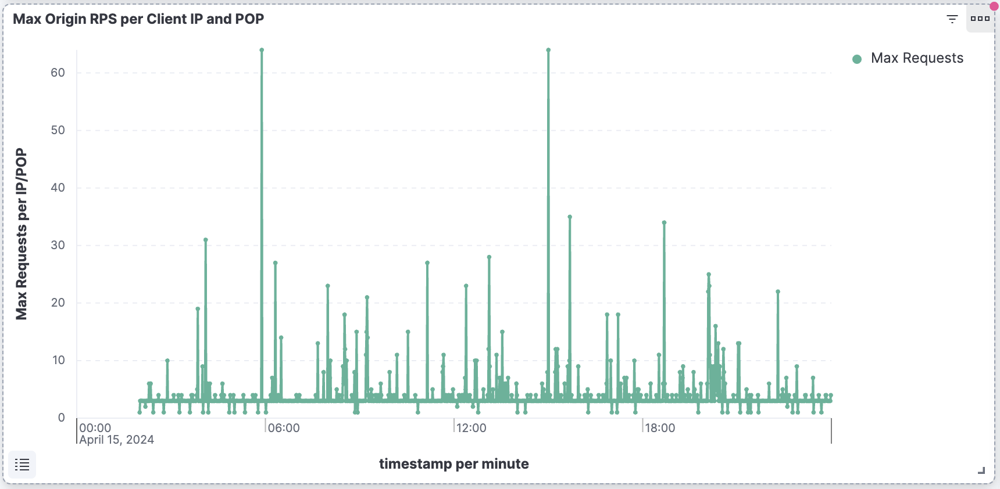

# Het blokkeren Dos en de aanvallen van DDoS gebruikend de regels van de verkeersfilter

Leer hoe te ontkenning van de Dienst (Dos) en Verspreide Ontkenning van de aanvallen van de Dienst (DDoS) gebruikend **regels van de het verkeersfilter van de tariefgrens 1} en andere strategieën bij AEM as a Cloud Service (AEMCS) beheerde CDN blokkeren.** Deze aanvallen veroorzaken verkeerspikes bij CDN en potentieel bij de de Publish dienst van AEM (alias oorsprong) en kunnen plaatsontvankelijkheid en beschikbaarheid beïnvloeden.

Dit leerprogramma dient als gids op _hoe te om uw verkeerspatronen te analyseren en tariefgrens [ regels van de verkeersfilter ](https://experienceleague.adobe.com/en/docs/experience-manager-cloud-service/content/security/traffic-filter-rules-including-waf) te vormen_ om die aanvallen te verlichten. Het leerprogramma beschrijft ook hoe te om [ alarm ](https://experienceleague.adobe.com/en/docs/experience-manager-cloud-service/content/security/traffic-filter-rules-including-waf#traffic-filter-rules-alerts) te vormen zodat u wordt meegedeeld wanneer er een vermoedelijke aanval is.

## Bescherming

Laten we de standaard DoS-beveiliging voor uw AEM-website begrijpen:

- **Caching:** met goed caching beleid, is het effect van een aanval DDoS beperkter omdat CDN de meeste verzoeken verhindert naar de oorsprong te gaan en prestatiesdegradatie te veroorzaken.
- **Autoscaling:** de auteur en publiceert de diensten autoscale van AEM om verkeerspikes te behandelen, hoewel zij nog door plotselinge, massale verhogingen van verkeer kunnen worden beïnvloed.
- **Blokkerend:** Adobe CDN blokkeert verkeer aan de oorsprong als het een Adobe-bepaald tarief van een bepaald IP adres, per CDN PoP (Punt van Aanwezigheid) overschrijdt.
- **het Alarm:** het Centrum van Acties verzendt een verkeerspiek bij het bericht van de oorsprongsalarm wanneer het verkeer een bepaald tarief overschrijdt. Deze waakzame brand weg wanneer het verkeer aan om het even welk bepaalde CDN PoP een _Adobe-bepaalde_ verzoektarief per IP adres overschrijdt. Zie [ Alarm van de Regels van de Filter van het Verkeer ](https://experienceleague.adobe.com/en/docs/experience-manager-cloud-service/content/security/traffic-filter-rules-including-waf#traffic-filter-rules-alerts) voor meer details.

Deze ingebouwde bescherming zou als basislijn voor de capaciteit van een organisatie moeten worden beschouwd om het prestatieseffect van een aanval te minimaliseren DDoS. Aangezien elke website verschillende prestatieskenmerken heeft en kan zien dat de prestatiesdegradatie alvorens de Adobe-bepaalde tariefgrens wordt voldaan, wordt het geadviseerd om de standaardbescherming door _klantenconfiguratie_ uit te breiden.

Laten we eens kijken naar enkele aanvullende, aanbevolen maatregelen die klanten kunnen nemen om hun websites te beschermen tegen aanvallen van Digital Publishing Suite:

- Declareer **de regels van de het verkeersfilter van de tariefgrens** om verkeer te blokkeren dat een bepaald tarief van één enkel IP adres, per PoP overschrijdt. Dit is doorgaans een lagere drempelwaarde dan de door Adobe gedefinieerde tarieflimiet.
- Vorm **alarm** op de regels van de het verkeersfilter van de tariefgrens door een &quot;waakzame actie&quot;zodat wanneer de regel wordt teweeggebracht, wordt een bericht van het Centrum van Acties verzonden.
- Verhoog geheim voorgeheugendekking door **verzoektransformaties** te verklaren om vraagparameters te negeren.

### Snelheidlimiet verkeersregelvariaties {#rate-limit-variations}

Er zijn twee variaties van tarief grensverkeersregels:

1. Edge - blokverzoeken die op het tarief van al verkeer (met inbegrip van dat van CDN geheim voorgeheugen) worden gebaseerd, voor bepaalde IP, per PoP.
1. Oorsprong - blokverzoeken die op het tarief van verkeer worden gebaseerd dat voor de oorsprong, voor een bepaald IP, per PoP wordt bestemd.

## Klantenreis

De onderstaande stappen weerspiegelen het proces dat klanten waarschijnlijk zullen doorlopen om hun websites te beschermen.

1. Erken de behoefte aan een regel van de het verkeersfilter van de snelheidsbeperking. Dit kan het gevolg zijn van het ontvangen van een Adobe-verkeersspike buiten de doos bij de oorsprongswaarschuwing, of het kan een pro-actieve beslissing zijn om voorzorgsmaatregelen te nemen om het risico van een succesvolle DDoS te verminderen.
1. Analyseer verkeerspatronen gebruikend een dashboard, als uw plaats reeds levend is, om de optimale drempels voor uw regels van de de filterfilter van de tariefgrens te bepalen. Als uw site nog niet actief is, kiest u waarden op basis van uw verkeersverwachtingen.
1. Gebruikend de waarden van de vorige stap, vorm de regels van de de filterfilter van de snelheidsgrensverkeer. Zorg ervoor dat u de bijbehorende waarschuwingen inschakelt, zodat u op de hoogte wordt gesteld wanneer de drempelwaarde is bereikt.
1. Ontvang berichten van de de filterregels van het verkeersfilter wanneer de verkeerspikes voorkomen, die u van waardevol inzicht voorzien over of uw organisatie potentieel door kwaadwillige actoren wordt gericht.
1. Indien nodig handelen over de waarschuwing. Analyseer het verkeer om te bepalen als de piek wettige verzoeken eerder dan een aanval weerspiegelt. Verhoog de drempels als het verkeer wettig is, of lager hen als niet.

De rest van deze zelfstudie begeleidt u door dit proces.

## Het erkennen van de behoefte om regels te vormen {#recognize-the-need}

Zoals eerder vermeld, blokkeert Adobe door gebrek verkeer bij CDN dat een bepaald tarief overschrijdt, echter, sommige websites kunnen degraded prestaties onder die drempel ervaren. Aldus, zouden de regels van de het verkeersfilter van de tariefgrens moeten worden gevormd.

Idealiter configureert u de regels voordat u live gaat naar productie. In de praktijk, verklaren vele organisaties reactief regels slechts één keer gealarmeerd aan een verkeerspiek die op een waarschijnlijke aanval wijst.

Adobe verzendt een verkeerspiek bij oorsprongsalarm als [ Bericht van het Centrum van Acties ](https://experienceleague.adobe.com/en/docs/experience-manager-cloud-service/content/operations/actions-center) wanneer een standaarddrempel van verkeer van één enkel IP adres, voor bepaalde PoP wordt overschreden. Als u zulk een alarm ontving, wordt het geadviseerd om een regel van de de verkeersfilter van de tariefgrens te vormen. Dit standaardalarm is verschillend van het alarm dat uitdrukkelijk door klanten moet worden toegelaten wanneer het bepalen van de regels van de verkeersfilter, die u over in een toekomstige sectie zult leren.

## Verkeerspatronen analyseren {#analyze-traffic}

Als uw site al actief is, kunt u de verkeerspatronen analyseren met CDN-logboeken en door Adobe verschafte dashboards.

- **Dashboard van het Verkeer CDN**: verstrekt inzichten in het verkeer via CDN en het verzoektarief van de Oorsprong, 4xx en 5xx foutentarieven, en niet in cache geplaatste verzoeken. Verstrekt ook maximum CND en de verzoeken van de Oorsprong per seconde per cliëntIP adres en meer inzichten om de configuraties te optimaliseren CDN.

- **CDN de Verhouding van het Actief van het Geheime voorgeheugen CDN**: verstrekt inzichten in de totale verhouding van de geheim voorgeheugenslag en het totale aantal verzoeken door HIT, PASS, en status MISS. Bevat ook URL&#39;s met de hoogste HIT-, PASS- en MISS-adressen.

Vorm het dashboard tooling gebruikend _één van de volgende opties_:

### ELK - dashboardgereedschappen configureren

Het **Elasticsearch, Logstash, en Kibana (ELK)** dashboardhulpmiddel dat door Adobe wordt verstrekt kan worden gebruikt om de CDN- logboeken te analyseren. Dit tooling omvat een dashboard dat de verkeerspatronen visualiseert, makend het gemakkelijker om de optimale drempels voor uw regels van de de filterfilter van de tariefgrens te bepalen.

- Kloon de [ AEMCS-CDN-Logboek-Analyse-Tooling ](https://github.com/adobe/AEMCS-CDN-Log-Analysis-Tooling) bewaarplaats GitHub.
- Opstelling het tooling door [ te volgen hoe te opstelling de de container ](https://github.com/adobe/AEMCS-CDN-Log-Analysis-Tooling/blob/main/ELK/README.md#how-to-set-up-the-elk-docker-containerhow-to-setup-the-elk-docker-container) stappen van de container van het Docker ELK.
- Als onderdeel van de instelling importeert u het `traffic-filter-rules-analysis-dashboard.ndjson` -bestand om de gegevens te visualiseren. Het _dashboard van het Verkeer 0} CDN {omvat visualisaties die het maximumaantal verzoeken per IP/POP bij CDN Edge en Oorsprong tonen._
- Van de [ 2} kaart van de Milieu&#39;s van Cloud Manager ](https://my.cloudmanager.adobe.com/) _, download de AEMCS CDN van de Publish dienst van CDN._

  

  >[!TIP]
  >
  > Het kan tot 5 minuten duren voor de nieuwe verzoeken om in de CDN- logboeken te verschijnen.

### Splunk - het vormen dashboard tooling

De klanten die [ Logboek van de Splunk hebben toegelaten ](https://experienceleague.adobe.com/en/docs/experience-manager-cloud-service/content/implementing/developing/logging#splunk-logs) kunnen nieuwe dashboards tot stand brengen om de verkeerspatronen te analyseren.

Om dashboards in Splunk tot stand te brengen, volg [ Splunk dashboards voor de Analyse van het Logboek AEMCS CDN ](https://github.com/adobe/AEMCS-CDN-Log-Analysis-Tooling/blob/main/Splunk/README.md#splunk-dashboards-for-aemcs-cdn-log-analysis) stappen.

### Gegevens bekijken

De volgende visualisaties zijn beschikbaar in de dashboards van de Elk en van de Sprong:

- **Edge RPS per Cliënt IP en POP**: Deze visualisatie toont het maximumaantal verzoeken per IP/POP **bij CDN Edge**. De piek in visualisatie wijst op het maximumverzoekaantal.

  **ELK Dashboard**:
  

  **Splunk Dashboard**:
  

- **Oorsprong RPS per Cliënt IP en POP**: Deze visualisatie toont het maximumaantal verzoeken per IP/POP **bij de oorsprong**. De piek in visualisatie wijst op het maximumverzoekaantal.

  **ELK Dashboard**:
  

  **Splunk Dashboard**:
  

## Drempelwaarden kiezen

De drempelwaarden voor de regels van de het verkeersfilter van de snelheidsgrens moeten op bovengenoemde analyse worden gebaseerd en ervoor zorgen dat het legitieme verkeer niet wordt geblokkeerd. Zie de volgende tabel voor hulp bij het kiezen van drempelwaarden:

| Variatie | Waarde |
| :--------- | :------- |
| Oorsprong | Neem de hoogste waarde van de Max Verzoeken van de Oorsprong per IP/POP onder **normale** verkeersvoorwaarden (namelijk niet het tarief op het tijdstip van een DDoS) en verhoog het met een veelvoud |
| Edge | Neem de hoogste waarde van de Max Verzoeken van Edge per IP/POP onder **normale** verkeersvoorwaarden (namelijk niet het tarief op het tijdstip van een DDoS) en verhoog het met een veelvoud |

De te gebruiken veelvoud hangt van uw verwachtingen van normale pieken in verkeer toe te schrijven aan organisch verkeer, campagnes, en andere gebeurtenissen af. Een veelvoud tussen 5 en 10 kan redelijk zijn.

Als uw site nog niet actief is, zijn er geen gegevens om te analyseren en moet u een getrainde schatting maken van de juiste waarden die u moet instellen voor de regels voor het beperken van het verkeer. Bijvoorbeeld:

| Variatie | Waarde |
|------------------------------ |:-----------:|
| Edge | 500 |
| Oorsprong | 100 |

## Regels configureren {#configure-rules}

Vorm de **regels van de het verkeersfilter van de tariefgrens** in het dossier van uw AEM project `/config/cdn.yaml`, met waarden die op de bespreking hierboven worden gebaseerd. Indien nodig, raadpleeg uw team van de Veiligheid van het Web om ervoor te zorgen de tariefgrenswaarden aangewezen zijn en geen wettig verkeer blokkeren.

Verwijs naar [ creeer regels in uw project van AEM ](https://experienceleague.adobe.com/en/docs/experience-manager-learn/cloud-service/security/traffic-filter-and-waf-rules/how-to-setup#create-rules-in-your-aem-project) voor meer details.

```yaml
kind: CDN
version: '1'
metadata:
  envTypes:
    - dev
    - stage
    - prod
data:
  trafficFilters:
    rules:
    ...
    #  Prevent attack at edge by blocking client for 5 minutes if they make more than 500 requests per second on average
      - name: prevent-dos-attacks-edge
        when:
          reqProperty: tier
          in: ["author","publish"]
        rateLimit:
          limit: 500 # replace with the appropriate value
          window: 10 # compute the average over 10s
          penalty: 300 # block IP for 5 minutes
          count: all # count all requests
          groupBy:
            - reqProperty: clientIp
        action:
          type: log
          alert: true
    #  Prevent attack at origin by blocking client for 5 minutes if they make more than 100 requests per second on average
      - name: prevent-dos-attacks-origin
        when:
          reqProperty: tier
          in: ["author","publish"]
        rateLimit:
          limit: 100 # replace with the appropriate value
          window: 10 # compute the average over 10s
          penalty: 300 # block IP for 5 minutes
          count: fetches # count only fetches
          groupBy:
            - reqProperty: clientIp
        action:
          type: log
          alert: true
```

Merk op dat zowel de oorsprong als de randregels worden verklaard, en dat het waakzame bezit aan `true` wordt geplaatst zodat kunt u alarm ontvangen wanneer de drempel wordt bereikt, die op een aanval wijzen.

Men adviseert dat het handelingstype aan logboek aanvankelijk wordt geplaatst zodat kunt u verkeer voor een paar uren of dagen controleren, ervoor zorgen dat het wettige verkeer deze tarieven niet overschrijdt. Schakel na een paar dagen over naar de blokmodus.

Voer de volgende stappen uit om de wijzigingen in uw AEMCS-omgeving te implementeren:

- Leg de bovenstaande wijzigingen vast en duw op deze naar uw Cloud Manager Git-opslagplaats.
- Implementeer de wijzigingen in de AEMCS-omgeving met de Cloud Manager Config-pijplijn. Verwijs [ opstellen regels door Cloud Manager ](https://experienceleague.adobe.com/en/docs/experience-manager-learn/cloud-service/security/traffic-filter-and-waf-rules/how-to-setup#deploy-rules-through-cloud-manager) voor meer details.
- Om de **regel van de het verkeersfilter van de tariefgrens** te verifiëren werkt zoals verwacht, kunt u een aanval simuleren zoals die in de [ 3} sectie van de Simulatie van de Aanval wordt beschreven. ](#attack-simulation) Beperk het aantal aanvragen tot een waarde die hoger is dan de grenswaarde voor het tarief die in de regel is ingesteld.

### Transformatieregels voor aanvragen configureren {#configure-request-transform-rules}

Naast de regels van de het verkeersfilter van de tariefgrens, wordt het geadviseerd om [ verzoektransformaties ](https://experienceleague.adobe.com/en/docs/experience-manager-cloud-service/content/implementing/content-delivery/cdn-configuring-traffic#request-transformations) aan unset vraagparameters te gebruiken niet nodig door de toepassing om manieren te minimaliseren om het geheime voorgeheugen door geheim voorgeheugenopstellende technieken te mijden. Als u bijvoorbeeld alleen parameters `search` en `campaignId` query wilt toestaan, kan de volgende regel worden gedeclareerd:

```yaml
kind: "CDN"
version: "1"
metadata:
  envTypes:
    - dev
    - stage
    - prod
data:
  requestTransformations:
    rules:
      - name: unset-all-query-params-except-those-needed
        when:
          reqProperty: tier
          in: ["publish"]
        actions:
          - type: unset
            queryParamMatch: ^(?!search$|campaignId$).*$
```

## Waarschuwingen over verkeersfilterregels ontvangen {#receiving-alerts}

Zoals hierboven vermeld, als de regel van de verkeersfilter *alarm omvat: waar*, wordt een alarm ontvangen wanneer de regel wordt aangepast.

## Actie inzake signaleringen {#acting-on-alerts}

Soms is de waarschuwing informatief, wat je een idee geeft van de frequentie van aanvallen. Het is nuttig om uw CDN gegevens te analyseren gebruikend het dashboard hierboven beschreven, om te bevestigen dat de verkeerspiek aan een aanval, en niet alleen een verhoging van wettig verkeersvolume is toe te schrijven. Als dat het geval is, kunt u de drempelwaarde verhogen.

## Aanvalsimulatie{#attack-simulation}

Deze sectie beschrijft methodes om een aanval van Dos te simuleren, die kan worden gebruikt om gegevens voor de dashboards te produceren die in dit leerprogramma worden gebruikt en te bevestigen dat om het even welke gevormde regels met succes aanvallen blokkeren.

>[!CAUTION]
>
> Voer deze stappen niet uit in een productieomgeving. De volgende stappen dienen alleen voor simulatiedoeleinden.
>
>Als u een alarm die op een piek in verkeer wijst ontving, ga aan de [ Analyserende sectie van verkeerspatronen ](#analyzing-traffic-patterns) te werk.

Om een aanval te simuleren, kunnen de hulpmiddelen zoals [ Apache Benchmark ](https://httpd.apache.org/docs/2.4/programs/ab.html), [ Apache JMeter ](https://jmeter.apache.org/), [ Vegeta ](https://github.com/tsenart/vegeta), en anderen worden gebruikt.

### Edge-verzoeken

Gebruikend het volgende [ bevel van groente ](https://github.com/tsenart/vegeta) kunt u vele verzoeken aan uw website doen:

```shell
$ echo "GET https://<YOUR-WEBSITE-DOMAIN>" | vegeta attack -rate=120 -duration=60s | vegeta report
```

Het bovenstaande bevel maakt 120 verzoeken om 5 seconden en output een rapport. Ervan uitgaande dat de snelheid van de website niet beperkt is, kan dit tot een toename van het verkeer leiden.

### Oorsprongsverzoeken

Als u de CDN-cache wilt overslaan en aanvragen bij de oorspronkelijke server wilt indienen (AEM-publicatieservice), kunt u een unieke queryparameter aan de URL toevoegen. Verwijs naar het manuscript van steekproefApache JMeter van de [ Simulate Dos- aanval gebruikend manuscript JMeter ](https://experienceleague.adobe.com/en/docs/experience-manager-learn/foundation/security/modsecurity-crs-dos-attack-protection#simulate-dos-attack-using-jmeter-script)

