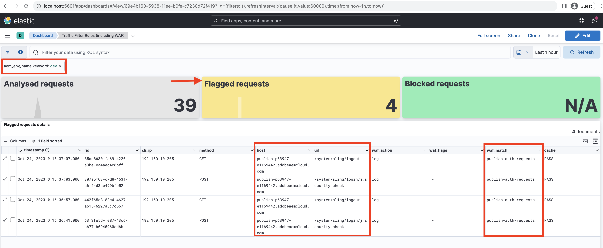

# Bewaking van gevoelige verzoeken

Leer hoe te om gevoelige verzoeken te controleren door hen te registreren gebruikend de regels van de verkeersfilter in AEM as a Cloud Service.

Het registreren laat u toe om verkeerspatronen te observeren zonder eind - gebruikers of de diensten te beïnvloeden en is een cruciale eerste stap alvorens het blokkeren regels uit te voeren.

Dit leerprogramma toont aan hoe te **logboekverzoeken van login WKND en logout wegen** tegen de publicatiedienst van AEM.

## Waarom en wanneer om verzoeken te registreren

Het registreren van specifieke verzoeken is een laag-risico, high-value praktijk om te begrijpen hoe de gebruikers-en potentieel kwaadwillige actoren-met uw toepassing van AEM in wisselwerking staan. Het is vooral nuttig alvorens het blokkeren van regels af te dwingen, die u het vertrouwen geven om uw veiligheidshouding te verfijnen zonder wettig verkeer te verstoren.

De gemeenschappelijke scenario&#39;s voor registreren omvatten:

- Het effect en het bereik van een regel valideren voordat de regel wordt omgezet in de `block` -modus.
- Bewaking van aanmeldings-/logout-paden en eindpunten voor verificatie voor ongebruikelijke patronen of pogingen tot het afdwingen van ongewenste geluiden.
- Bijhouden van toegang met hoge frequentie tot API-eindpunten voor mogelijk misbruik of DoS-activiteit.
- Vaststellen van basislijnen voor beide gedrag alvorens strengere controles toe te passen.
- In het geval van veiligheidsincidenten, verstrek forensische gegevens om de aard van de aanval en de beïnvloede middelen te begrijpen.

## Vereisten

Alvorens te werk te gaan, zorg ervoor dat u de vereiste opstelling zoals die in [ wordt beschreven hoe te opstellingsverkeersfilter en de regels van WAF ](../setup.md) leerprogramma hebt voltooid. Ook, dat u hebt gekloond en het [ Project van de Plaatsen van AEM WKND ](https://github.com/adobe/aem-guides-wknd) aan uw milieu van AEM opgesteld.

## Voorbeeld: Logboekaanmelding met WKND en aanmeldverzoeken

In dit voorbeeld, creeert u een regel van de verkeersfilter aan logboekverzoeken die aan login WKND en logout wegen op de de Publish dienst van AEM worden gemaakt. Het helpt u authentificatiepogingen controleren en potentiële veiligheidskwesties identificeren.

- Voeg de volgende regel toe aan het WKND-projectbestand `/config/cdn.yaml` .

```yaml
kind: "CDN"
version: "1"
metadata:
  envTypes: ["dev", "stage", "prod"]
data:
  trafficFilters:
    rules:
    # On AEM Publish service log WKND Login and Logout requests
    - name: publish-auth-requests
      when:
        allOf:
          - reqProperty: tier
            matches: publish
          - reqProperty: path
            in:
              - /system/sling/login/j_security_check
              - /system/sling/logout
      action: log   
```

- Leg de wijzigingen vast en duw deze naar de Cloud Manager Git-opslagplaats.

- Stel de veranderingen in het milieu van AEM op gebruikend de Cloud Manager config pijpleiding [ vroeger gecreeerd ](../setup.md#deploy-rules-using-adobe-cloud-manager).

- Test de regel door u aan te melden en af te melden bij de WKND-site van uw programma (bijvoorbeeld `https://publish-pXXXX-eYYYY.adobeaemcloud.com/us/en.html` ). U kunt `asmith/asmith` gebruiken als gebruikersnaam en wachtwoord.

  

## Analyseren

Analyseer de resultaten van de `publish-auth-requests` regel door de logboeken AEMCS CDN van Cloud Manager te downloaden en [ het Tooling van de Analyse van het Logboek te gebruiken AEMCS CDN ](../setup.md#setup-the-elastic-dashboard-tool).

- Van [ Cloud Manager ](https://my.cloudmanager.adobe.com/) **de kaart van Milieu&#39;s**, download de **publiceren** CDN van de dienst van AEMCS logboeken.

  

  >[!TIP]
  >
  > Het kan tot 5 minuten duren voor de nieuwe verzoeken om in de CDN- logboeken te verschijnen.

- Kopieer het gedownloade logbestand (bijvoorbeeld `publish_cdn_2023-10-24.log` in de onderstaande schermafbeelding) naar de map `logs/dev` van het project voor het gereedschap Elastisch dashboard.

  

- Vernieuw de gereedschapspagina Elastic dashboard.
   - In de hoogste **Globale filter** sectie, geef de `aem_env_name.keyword` filter uit en selecteer de `dev` milieuwaarde.

     

   - Als u het tijdsinterval wilt wijzigen, klikt u op het kalenderpictogram in de rechterbovenhoek en selecteert u het gewenste tijdinterval.

     {het Interval van de Tijd van het Hulpmiddel 0} ELK 

- Herzie de bijgewerkte versie van het dashboard **geanalyseerde verzoeken**, **Vervroegingen met vlag**, en **Gegrafeerde verzoeken details** panelen. Voor passende CDN logboekingangen, zou het de waarden van de cliëntIP van elke ingang (cli_ip), gastheer, url, actie (waf_action), en regel-naam (waf_match) moeten tonen.

  
