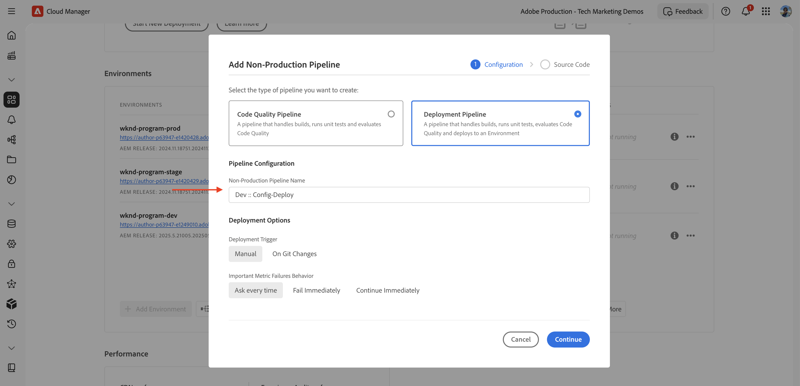

# Hoe te om de regels van de verkeersfilter met inbegrip van de regels van WAF te plaatsen

Leer **hoe te opstelling** de regels van de verkeersfilter met inbegrip van de regels van de Firewall van de Toepassing van het Web (WAF). In deze zelfstudie stellen we de basis in voor volgende zelfstudies, waarbij u regels configureert en implementeert, gevolgd door het testen en analyseren van de resultaten.

Om het opstellingsproces aan te tonen, gebruikt het leerprogramma het [ Project van de Plaatsen van AEM WKND ](https://github.com/adobe/aem-guides-wknd).

>[!VIDEO](https://video.tv.adobe.com/v/3469395/?quality=12&learn=on)

## Overzicht van setup

De voorbereidingen voor volgende zelfstudies zijn als volgt:

- _Creërend regels_ binnen uw project van AEM in de `config` omslag
- _het Opstellen van regels_ gebruikend de Adobe Cloud Manager config pijpleiding.
- _het Testen regels_ met hulpmiddelen zoals Kromme, Vegeta, en Nikto
- _Analyserend resultaten_ gebruikend het Tooling van de Analyse van het Logboek AEMCS CDN

## Regels maken in uw AEM-project

Om de **standaard** en **WAF** regels van de verkeersfilter binnen uw project van AEM te bepalen, volg deze stappen:

1. Maak op het hoofdniveau van uw AEM-project een map met de naam `config` .

2. Maak in de map `config` een bestand met de naam `cdn.yaml` .

3. Gebruik de volgende metagegevensstructuur in `cdn.yaml` :

```yaml
kind: "CDN"
version: "1"
metadata:
  envTypes: ["dev", "stage", "prod"]
data:
  trafficFilters:
    rules:
```


In het [ volgende leerprogramma ](#next-steps), leert u hoe te om Adobe toe te voegen **geadviseerde standaardverkeersfilter en de regels van WAF** aan het bovengenoemde dossier als stevige stichting voor uw implementatie.

## Regels implementeren met Adobe Cloud Manager

Volg de volgende stappen om de regels te implementeren:

1. Login aan [ my.cloudmanager.adobe.com ](https://my.cloudmanager.adobe.com/) en selecteert uw programma.

2. Van de **pagina van het Overzicht van het Programma**, ga naar de **Pijpleidingen** kaart en klik **+ voeg** toe om een nieuwe pijpleiding tot stand te brengen.

   

3. In de pijplijntovenaar:

   - **Type**: De Pijpleiding van de Plaatsing
   - **Naam van de Pijpleiding**: Dev-Config

   

4. Configuratie Source-code:

   - **Code om** op te stellen: Gerichte plaatsing
   - **omvatten**: Config
   - **Milieu van de Plaatsing**: bijvoorbeeld, `wknd-program-dev`
   - **Bewaarplaats**: De repo van de Bewaarplaats van de Git (bijvoorbeeld, `wknd-site`)
   - **Tak van de Git**: Uw werkende tak
   - **Plaats van de Code**: `/config`

   

5. Herzie de pijpleidingsconfiguratie en klik **sparen**.

In het [ volgende leerprogramma ](#next-steps), leert u hoe te om de pijpleiding aan uw milieu van AEM op te stellen.

## Regels testen met gereedschappen

Om de doeltreffendheid van uw standaardverkeersfilter en de regels van WAF te testen, kunt u diverse hulpmiddelen gebruiken om verzoeken te simuleren en te analyseren hoe uw regels antwoorden.

Controleer of de volgende gereedschappen op uw lokale computer zijn geïnstalleerd of volg de instructies om ze te installeren:

- [ Kromme ](https://curl.se/): De verzoek/de reactiestroom van de test.
- [ Vegeta ](https://github.com/tsenart/vegeta): Simuleer hoge verzoeklading (het testen van Dos).
- [ Nikto ](https://github.com/sullo/nikto/wiki): Scan voor kwetsbaarheid.

U kunt de installatie verifiëren gebruikend de volgende bevelen:

```shell
# Curl version check
$ curl --version

# Vegeta version check
$ vegeta -version

# Nikto version check
$ cd <PATH-OF-CLONED-REPO>/program
$ ./nikto.pl -Version
```

In het [ volgende leerprogramma ](#next-steps), leert u hoe te om deze hulpmiddelen te gebruiken om hoge verzoekladingen en kwaadwillige verzoeken te simuleren om de doeltreffendheid van uw verkeersfilter en de regels van WAF te testen.

## Resultaten analyseren

Voer de volgende stappen uit als voorbereiding op het analyseren van de resultaten:

1. Installeer de **Tooling van de Analyse van het Logboek AEMCS CDN** om de patronen te visualiseren en te analyseren gebruikend pre-gebouwde dashboards.

2. Voer **CDN logboekregistratie** door logboeken van Cloud Manager UI uit te downloaden. U kunt logbestanden ook rechtstreeks doorsturen naar een ondersteunde gehoste logbestemming, zoals Splunk of Elasticsearch.

### AEMCS CDN-blokanalyse

Om de resultaten van uw verkeersfilter en de regels van WAF te analyseren, kunt u het **Tooling van de Analyse van het Logboek gebruiken AEMCS CDN**. Deze tooling verstrekt vooraf gebouwde dashboards voor het visualiseren van CDN verkeer en de activiteit van WAF door het leveraging van logboeken die van AEMCS CDN worden verzameld.

De Tooling van de Analyse van het Logboek van AEMCS CDN steunt twee observability platforms, **ELK** (Elasticsearch, Logstash, Kibana) en **Splunk**.

Het is mogelijk om het Logboek te gebruiken door:sturen eigenschap om uw logboeken aan een ontvangen ELK of de dienst van het het logboekregistreren van het Splunk te stromen, waar u een dashboard kunt installeren om de standaardverkeersfilter en de regels van de het verkeersfilter van WAF te visualiseren en te analyseren. Voor deze zelfstudie stelt u het dashboard echter in op een lokale ELK-instantie die op uw computer is geïnstalleerd.

1. Kloon de [ AEMCS-CDN-Logboek-Analyse-Tooling ](https://github.com/adobe/AEMCS-CDN-Log-Analysis-Tooling) bewaarplaats.

2. Volg de [ ELK handleiding van de de containeropstelling van de Dok ](https://github.com/adobe/AEMCS-CDN-Log-Analysis-Tooling/blob/main/ELK/README.md) om de stapel van de ELK plaatselijk te installeren en te vormen.

3. Gebruikend de dashboards van ELK, kunt u metriek zoals IP verzoeken, geblokkeerd verkeer, de patronen van URI, en veiligheidsalarm onderzoeken.

   

>[!NOTE]
> 
> Als de logboeken nog niet van AEMCS CDN worden opgenomen, verschijnen de dashboards leeg.

### Inname van CDN-logbestanden

Ga als volgt te werk om CDN-logbestanden in te voeren in de ELK-stapel:

- Van [ Cloud Manager ](https://my.cloudmanager.adobe.com/) **de kaart van Milieu&#39;s**, download de **publiceren** CDN van de dienst van AEMCS logboeken.

  

  >[!TIP]
  >
  > Het kan tot 5 minuten duren voor de nieuwe verzoeken om in de CDN- logboeken te verschijnen.

- Kopieer het gedownloade logbestand (bijvoorbeeld `publish_cdn_2025-06-06.log` in de onderstaande schermafbeelding) naar de map `logs/dev` van het project voor het gereedschap Elastisch dashboard.

  {width="800" zoomable="yes"}

- Vernieuw de gereedschapspagina Elastic dashboard.
   - In de hoogste **Globale filter** sectie, geef de `aem_env_name.keyword` filter uit en selecteer de `dev` milieuwaarde.

     

   - Als u het tijdsinterval wilt wijzigen, klikt u op het kalenderpictogram in de rechterbovenhoek en selecteert u het gewenste tijdinterval.

- In het [ volgende leerprogramma ](#next-steps), leert u hoe te om de resultaten van de standaardverkeersfilter en de regels van de het verkeersfilter van WAF te analyseren gebruikend de pre-gebouwde dashboards in de stapel van ELK.

  

## Samenvatting

U hebt met succes de voorbereidingen getroffen voor het uitvoeren van de regels van de verkeersfilter met inbegrip van de regels van WAF in AEM as a Cloud Service. U creeerde een structuur van het configuratiedossier, pijpleiding voor plaatsing, en voorbereide hulpmiddelen voor het testen en het analyseren van de resultaten.

## Volgende stappen

Leer hoe u de door Adobe aanbevolen regels implementeert met behulp van de volgende zelfstudies:

<!-- CARDS
{target = _self}

* ./use-cases/using-traffic-filter-rules.md
  {title = Protecting AEM websites using standard traffic filter rules}
  {description = Learn how to protect AEM websites from DoS, DDoS and bot abuse using Adobe-recommended standard traffic filter rules in AEM as a Cloud Service.}
  {image = ./assets/use-cases/using-traffic-filter-rules.png}
  {cta = Apply Rules}

* ./use-cases/using-waf-rules.md
  {title = Protecting AEM websites using WAF traffic filter rules}
  {description = Learn how to protect AEM websites from sophisticated threats including DoS, DDoS, and bot abuse using Adobe-recommended Web Application Firewall (WAF) traffic filter rules in AEM as a Cloud Service.}
  {image = ./assets/use-cases/using-waf-rules.png}
  {cta = Activate WAF}
-->
<!-- START CARDS HTML - DO NOT MODIFY BY HAND -->
<div class="columns">
    <div class="column is-half-tablet is-half-desktop is-one-third-widescreen" aria-label="Protecting AEM websites using standard traffic filter rules">
        <div class="card" style="height: 100%; display: flex; flex-direction: column; height: 100%;">
            <div class="card-image">
                <figure class="image x-is-16by9">
                    <a href="./use-cases/using-traffic-filter-rules.md" title="AEM-websites beveiligen met de standaardregels voor verkeersfilters" target="_self" rel="referrer">
                        
                    </a>
                </figure>
            </div>
            <div class="card-content is-padded-small" style="display: flex; flex-direction: column; flex-grow: 1; justify-content: space-between;">
                <div class="top-card-content">
                    <p class="headline is-size-6 has-text-weight-bold">
                        <a href="./use-cases/using-traffic-filter-rules.md" target="_self" rel="referrer" title="AEM-websites beveiligen met de standaardregels voor verkeersfilters"> Beschermend de websites van AEM gebruikend de standaardregels van de verkeersfilter </a>
                    </p>
                    <p class="is-size-6">Leer hoe u AEM-websites kunt beschermen tegen DoS, DDoS en beide misbruiken met behulp van door Adobe aanbevolen standaardverkeersfilterregels in AEM as a Cloud Service.</p>
                </div>
                <a href="./use-cases/using-traffic-filter-rules.md" target="_self" rel="referrer" class="spectrum-Button spectrum-Button--outline spectrum-Button--primary spectrum-Button--sizeM" style="align-self: flex-start; margin-top: 1rem;">
                    <span class="spectrum-Button-label has-no-wrap has-text-weight-bold"> pas Regels </span> toe
                </a>
            </div>
        </div>
    </div>
    <div class="column is-half-tablet is-half-desktop is-one-third-widescreen" aria-label="Protecting AEM websites using WAF traffic filter rules">
        <div class="card" style="height: 100%; display: flex; flex-direction: column; height: 100%;">
            <div class="card-image">
                <figure class="image x-is-16by9">
                    <a href="./use-cases/using-waf-rules.md" title="AEM-websites beveiligen met WAF-regels voor verkeersfilters" target="_self" rel="referrer">
                        
                    </a>
                </figure>
            </div>
            <div class="card-content is-padded-small" style="display: flex; flex-direction: column; flex-grow: 1; justify-content: space-between;">
                <div class="top-card-content">
                    <p class="headline is-size-6 has-text-weight-bold">
                        <a href="./use-cases/using-waf-rules.md" target="_self" rel="referrer" title="AEM-websites beveiligen met WAF-regels voor verkeersfilters"> Beschermend de websites van AEM gebruikend de regels van de het verkeersfilter van WAF </a>
                    </p>
                    <p class="is-size-6">Leer hoe u AEM-websites kunt beschermen tegen geavanceerde bedreigingen, zoals DoS, DDoS en beide misbruiken met WAF (Adobe-Recommended Web Application Firewall), verkeersfilterregels in AEM as a Cloud Service.</p>
                </div>
                <a href="./use-cases/using-waf-rules.md" target="_self" rel="referrer" class="spectrum-Button spectrum-Button--outline spectrum-Button--primary spectrum-Button--sizeM" style="align-self: flex-start; margin-top: 1rem;">
                    <span class="spectrum-Button-label has-no-wrap has-text-weight-bold"> activeer WAF </span>
                </a>
            </div>
        </div>
    </div>
</div>
<!-- END CARDS HTML - DO NOT MODIFY BY HAND -->

## Gevallen voor geavanceerd gebruik

Buiten de Adobe-geadviseerde standaard verkeersfilter en de regels van WAF, kunt u geavanceerde scenario&#39;s uitvoeren om specifieke bedrijfsvereisten te bereiken. Deze scenario&#39;s omvatten:

<!-- CARDS
{target = _self}

* ./how-to/request-logging.md

* ./how-to/request-blocking.md

* ./how-to/request-transformation.md
-->
<!-- START CARDS HTML - DO NOT MODIFY BY HAND -->
<div class="columns">
    <div class="column is-half-tablet is-half-desktop is-one-third-widescreen" aria-label="Monitoring sensitive requests">
        <div class="card" style="height: 100%; display: flex; flex-direction: column; height: 100%;">
            <div class="card-image">
                <figure class="image x-is-16by9">
                    <a href="./how-to/request-logging.md" title="Bewaking van gevoelige verzoeken" target="_self" rel="referrer">
                        
                    </a>
                </figure>
            </div>
            <div class="card-content is-padded-small" style="display: flex; flex-direction: column; flex-grow: 1; justify-content: space-between;">
                <div class="top-card-content">
                    <p class="headline is-size-6 has-text-weight-bold">
                        <a href="./how-to/request-logging.md" target="_self" rel="referrer" title="Bewaking van gevoelige verzoeken"> Bewaking gevoelige verzoeken </a>
                    </p>
                    <p class="is-size-6">Leer hoe te om gevoelige verzoeken te controleren door hen te registreren gebruikend de regels van de verkeersfilter in AEM as a Cloud Service.</p>
                </div>
                <a href="./how-to/request-logging.md" target="_self" rel="referrer" class="spectrum-Button spectrum-Button--outline spectrum-Button--primary spectrum-Button--sizeM" style="align-self: flex-start; margin-top: 1rem;">
                    <span class="spectrum-Button-label has-no-wrap has-text-weight-bold"> Leer meer </span>
                </a>
            </div>
        </div>
    </div>
    <div class="column is-half-tablet is-half-desktop is-one-third-widescreen" aria-label="Restricting access">
        <div class="card" style="height: 100%; display: flex; flex-direction: column; height: 100%;">
            <div class="card-image">
                <figure class="image x-is-16by9">
                    <a href="./how-to/request-blocking.md" title="Toegang beperken" target="_self" rel="referrer">
                        
                    </a>
                </figure>
            </div>
            <div class="card-content is-padded-small" style="display: flex; flex-direction: column; flex-grow: 1; justify-content: space-between;">
                <div class="top-card-content">
                    <p class="headline is-size-6 has-text-weight-bold">
                        <a href="./how-to/request-blocking.md" target="_self" rel="referrer" title="Toegang beperken"> Beperkend toegang </a>
                    </p>
                    <p class="is-size-6">Leer hoe te om toegang te beperken door specifieke verzoeken te blokkeren gebruikend de regels van de verkeersfilter in AEM as a Cloud Service.</p>
                </div>
                <a href="./how-to/request-blocking.md" target="_self" rel="referrer" class="spectrum-Button spectrum-Button--outline spectrum-Button--primary spectrum-Button--sizeM" style="align-self: flex-start; margin-top: 1rem;">
                    <span class="spectrum-Button-label has-no-wrap has-text-weight-bold"> Leer meer </span>
                </a>
            </div>
        </div>
    </div>
    <div class="column is-half-tablet is-half-desktop is-one-third-widescreen" aria-label="Normalizing requests">
        <div class="card" style="height: 100%; display: flex; flex-direction: column; height: 100%;">
            <div class="card-image">
                <figure class="image x-is-16by9">
                    <a href="./how-to/request-transformation.md" title="Verzoeken normaliseren" target="_self" rel="referrer">
                        
                    </a>
                </figure>
            </div>
            <div class="card-content is-padded-small" style="display: flex; flex-direction: column; flex-grow: 1; justify-content: space-between;">
                <div class="top-card-content">
                    <p class="headline is-size-6 has-text-weight-bold">
                        <a href="./how-to/request-transformation.md" target="_self" rel="referrer" title="Verzoeken normaliseren"> het Normaliseren verzoeken </a>
                    </p>
                    <p class="is-size-6">Leer hoe te om verzoeken te normaliseren door hen te transformeren gebruikend de regels van de verkeersfilter in AEM as a Cloud Service.</p>
                </div>
                <a href="./how-to/request-transformation.md" target="_self" rel="referrer" class="spectrum-Button spectrum-Button--outline spectrum-Button--primary spectrum-Button--sizeM" style="align-self: flex-start; margin-top: 1rem;">
                    <span class="spectrum-Button-label has-no-wrap has-text-weight-bold"> Leer meer </span>
                </a>
            </div>
        </div>
    </div>
</div>
<!-- END CARDS HTML - DO NOT MODIFY BY HAND -->

## Aanvullende bronnen

- [ Regels van de Filter van het Verkeer met inbegrip van de Regels van WAF ](https://experienceleague.adobe.com/en/docs/experience-manager-cloud-service/content/security/traffic-filter-rules-including-waf)
