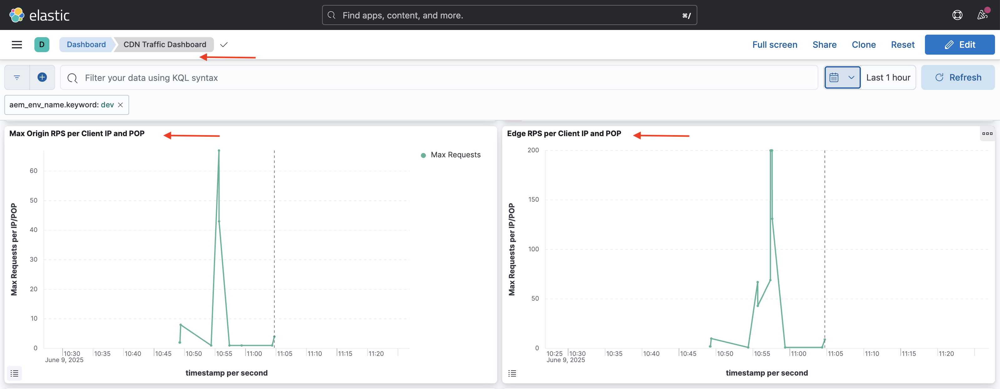

# AEM-websites beveiligen met de standaardregels voor verkeersfilters

Leer hoe te om de websites van AEM tegen Ontkenning van de Dienst (Dos), Verspreid Ontkenning van de Dienst (DDoS) te beschermen, en bot misbruik gebruikend _Adobe-geadviseerde_ **standaardregels van de verkeersfilter** in AEM as a Cloud Service.

## Leerdoelstellingen

- Bekijk de door Adobe aanbevolen standaardregels voor verkeersfilters.
- Bepaal, stel, test, en analyseer de resultaten van de regels op.
- Begrijp wanneer en hoe te om de regels te verfijnen die op verkeerspatronen worden gebaseerd.
- Leer hoe u het AEM Actions Center kunt gebruiken om waarschuwingen te bekijken die door de regels worden gegenereerd.

### Overzicht van implementatie

De implementatiestappen omvatten:

- De standaardregels voor verkeersfilters toevoegen aan het AEM WKND-projectbestand `/config/cdn.yaml` .
- De wijzigingen doorvoeren en doorvoeren in de Cloud Manager Git-opslagplaats.
- Het opstellen van de veranderingen in het milieu van AEM gebruikend de Cloud Manager config pijpleiding.
- Het testen van de regels door de aanval van Dos te simuleren gebruikend [ Vegeta ](https://github.com/tsenart/vegeta)
- De resultaten analyseren met de CDN-logboeken van AEMCS en het dashboard van de ELK.

## Vereisten

Alvorens te werk te gaan, zorg u de vereiste grondwerk zoals die in [ wordt beschreven hoe te opstellingsverkeersfilter en WAF regels ](../setup.md) leerprogramma heeft voltooid. Ook, hebt u gekloond en opgesteld het [ Project van de Plaatsen van AEM WKND ](https://github.com/adobe/aem-guides-wknd) aan uw milieu van AEM.

## Belangrijkste acties van de regels

Alvorens wij in de details van de standaardregels van de verkeersfilter duiken, begrijpen wij de belangrijkste acties die deze regels uitvoeren. Het attribuut `action` in elke regel bepaalt hoe de verkeersfilter zou moeten antwoorden wanneer de voorwaarden worden voldaan aan. De acties omvatten:

- **Logboek**: De regels registreren de gebeurtenissen voor controle en analyse, die u toestaan om verkeerspatronen te herzien en drempels aan te passen zoals nodig. Deze wordt opgegeven door het attribuut `type: log` .

- **Alarm**: De regels brengen alarm teweeg wanneer de voorwaarden worden voldaan, die u helpen om potentiële kwesties te identificeren. Deze wordt opgegeven door het attribuut `alert: true` .

- **Blok**: De regels blokkeren het verkeer wanneer de voorwaarden worden voldaan, verhinderend toegang tot uw plaats van AEM. Deze wordt opgegeven door het attribuut `action: block` .

## Regels evalueren en definiëren

Adobe-geadviseerde standaard de filterregels van het verkeer dienen als grondlaag voor het identificeren van potentieel kwaadwillige verkeerspatronen door gebeurtenissen als op IP-Gebaseerde tariefgrenzen te registreren die worden overschreden, en verkeer van specifieke landen te blokkeren. Deze logboeken helpen teams drempels bevestigen en geïnformeerde besluiten voor uiteindelijk **nemen die aan blok-wijze** regels overgaan zonder wettig verkeer te verstoren.

Laten we de drie standaardregels voor verkeersfilters controleren die u aan het AEM WKND-projectbestand `/config/cdn.yaml` moet toevoegen:

- **verhindert Dos bij Edge**: Deze regel ontdekt potentiële Ontkenning van de aanvallen van de Dienst (Dos) bij de CDN rand door verzoeken per seconde (RPS) van cliënt IPs te controleren.
- **verhindert Dos bij de Oorsprong**: Deze regel ontdekt potentiële Ontkenning van de aanvallen van de Dienst (Dos) bij de oorsprong door verzoeken van cliëntIPs te controleren.
- **Blokkeren OFAC Landen**: Deze regel blokkeert toegang van specifieke landen die onder (Bureau van de Buitenlandse Controle van Assets) beperkingen OFAC vallen.

### &#x200B;1. DoS in de Edge voorkomen

Deze regel **verzendt een alarm** wanneer het een potentiële Ontkenning van de Dienst (Dos) aanval bij CDN ontdekt. De criteria voor het teweegbrengen van deze regel is wanneer een cliënt **500 verzoeken per seconde** (gemiddeld over 10 seconden) per CDN POP (Punt van Aanwezigheid) bij de rand overschrijdt.

Het telt **alle** verzoeken en groepeert hen door cliëntIP.

```yaml
kind: "CDN"
version: "1"
metadata:
  envTypes: ["dev", "stage", "prod"]
data:
  trafficFilters:
    rules:
    - name: prevent-dos-attacks-edge
      when:
        reqProperty: tier
        equals: 'publish'
      rateLimit:
        limit: 500
        window: 10
        penalty: 300
        count: all
        groupBy:
          - reqProperty: clientIp
      action:
        type: log
        alert: true
```

Het attribuut `action` specificeert dat de regel de gebeurtenissen zou moeten registreren en een alarm zou teweegbrengen wanneer aan de voorwaarden wordt voldaan. Aldus, helpt het u potentiële aanvallen van Dos controleren zonder wettig verkeer te blokkeren. Nochtans, is uw doel om uiteindelijk over te gaan deze regel aan blok-wijze zodra u de verkeerspatronen en de drempels hebt bevestigd aangepast.

### &#x200B;2. DoS bij oorsprong voorkomen

Deze regel **verzendt een alarm** wanneer het een potentiële Ontkenning van de Dienst (Dos) aanval bij de oorsprong ontdekt. De criteria voor het teweegbrengen van deze regel is wanneer een cliënt **100 verzoeken per seconde** (gemiddeld over 10 seconden) per cliëntIP bij de oorsprong overschrijdt.

Het telt **haalt** (cache-bypassing verzoeken) en groepeert hen door cliëntIP.

```yaml
...
    - name: prevent-dos-attacks-origin
      when:
        reqProperty: tier
        equals: 'publish'
      rateLimit:
        limit: 100
        window: 10
        penalty: 300
        count: fetches
        groupBy:
          - reqProperty: clientIp
      action:
        type: log
        alert: true
```

Het attribuut `action` specificeert dat de regel de gebeurtenissen zou moeten registreren en een alarm zou teweegbrengen wanneer aan de voorwaarden wordt voldaan. Aldus, helpt het u potentiële aanvallen van Dos controleren zonder wettig verkeer te blokkeren. Nochtans, is uw doel om uiteindelijk over te gaan deze regel aan blok-wijze zodra u de verkeerspatronen en de drempels hebt bevestigd aangepast.

### &#x200B;3. Blokkeringslanden

Deze regel blokkeert toegang van specifieke landen die onder [ OFAC ](https://ofac.treasury.gov/sanctions-programs-and-country-information) beperkingen vallen.
U kunt de lijst met landen naar wens bekijken en wijzigen.

```yaml
...
    - name: block-ofac-countries
      when:
        allOf:
          - { reqProperty: tier, in: ["author", "publish"] }
          - reqProperty: clientCountry
            in:
              - SY
              - BY
              - MM
              - KP
              - IQ
              - CD
              - SD
              - IR
              - LR
              - ZW
              - CU
              - CI
      action: block
```

Het attribuut `action` specificeert dat de regel toegang van de gespecificeerde landen zou moeten blokkeren. Zo voorkomt u dat gebieden die beveiligingsrisico&#39;s kunnen opleveren, toegang krijgen tot uw AEM-site.

Het volledige `cdn.yaml` -bestand met de bovenstaande regels ziet er als volgt uit:


## Regels implementeren

Voer de volgende stappen uit om de bovenstaande regels te implementeren:

- Leg de wijzigingen vast en duw deze naar de Cloud Manager Git-opslagplaats.

- Stel de veranderingen in het milieu van AEM op gebruikend de Cloud Manager config pijpleiding [ vroeger gecreeerd ](../setup.md#deploy-rules-using-adobe-cloud-manager).

  

## Testregels

Om de doeltreffendheid van de standaardregels van de verkeersfilter te verifiëren, bij zowel **CDN Edge** als de **Oorsprong**, hoog verzoekverkeer simuleren gebruikend [ Vegeta ](https://github.com/tsenart/vegeta), een veelzijdig HTTP lading testend hulpmiddel.

- Test DoS Rule op de Edge (limiet van 500 rps). Met de volgende opdracht worden gedurende 15 seconden 200 verzoeken per seconde gesimuleerd. Dit overschrijdt de Edge-drempel (500 rps).

  ```shell
  $echo "GET https://publish-p63947-e1249010.adobeaemcloud.com/us/en.html" | vegeta attack -rate=200 -duration=15s | vegeta report
  ```

  

  >[!IMPORTANT]
  >
  >  Merk *100%* Succes en _200_ de codes van de Status in het bovengenoemde rapport op. Aangezien de regels aan `log` en `alert` worden geplaatst, worden de verzoeken _niet geblokkeerd_ maar zij worden geregistreerd voor controle en analyse en alarmerende doeleinden.

- Test DoS Rule bij de Oorsprong (grens 100 rps). De volgende opdracht simuleert 110 aanvragen voor ophalen per seconde gedurende 1 seconde, die de drempel van de Oorsprong (100 rps) overschrijdt. Om cache-bypassing verzoeken te simuleren, wordt het `targets.txt` dossier gecreeerd met unieke vraagparameters om ervoor te zorgen dat elk verzoek als haalverzoek wordt behandeld.

  ```shell
  # Create targets.txt with unique query parameters
  $for i in {1..110}; do
    echo "GET https://publish-p63947-e1249010.adobeaemcloud.com/us/en.html?ts=$(date +%s)$i"
  done > targets.txt
  
  # Use the targets.txt file to simulate fetch requests
  $vegeta attack -rate=110 -duration=1s -targets=targets.txt | vegeta report
  ```

  

  >[!IMPORTANT]
  >
  >  Merk *100%* Succes en _200_ de codes van de Status in het bovengenoemde rapport op. Aangezien de regels aan `log` en `alert` worden geplaatst, worden de verzoeken _niet geblokkeerd_ maar zij worden geregistreerd voor controle en analyse en alarmerende doeleinden.

- Voor de eenvoud wordt de OFAC-regel hier niet getest.

## Waarschuwingen bekijken

Het alarm wordt geproduceerd wanneer de regels van de verkeersfilter worden teweeggebracht. U kunt deze alarm in het [ Centrum van Acties van AEM ](https://experience.adobe.com/aem/actions-center) herzien.


## Resultaten analyseren

Om de resultaten van de regels van de verkeersfilter te analyseren, kunt u de logboeken van AEMCS CDN en het dashboard van de ELK gebruiken. Volg de instructies van [ CDN registreert opname ](../setup.md#ingest-cdn-logs) opstellingssectie om de CDN- logboeken in de stapel van de ELK in te nemen.

In de volgende schermafbeelding ziet u de CDN-logbestanden van de AEM Dev-omgeving die in de ELK-stapel zijn opgenomen.


Binnen de ELK toepassing, zou het **Dashboard van het Verkeer CDN** de piek bij **Edge** en **Oorsprong** tijdens de gesimuleerde aanvallen van Dos moeten tonen.

De twee panelen, _Edge RPS per Cliënt IP en POP_ en _Oorsprong RPS per Cliënt IP en POP_, tonen de verzoeken per seconde (RPS) bij de rand en de oorsprong respectievelijk, die door cliëntIP en Punt van Aanwezigheid (POP) worden gegroepeerd.



U kunt andere panelen in het Dashboard van het Verkeer CDN ook gebruiken om de verkeerspatronen, zoals _Bovenste Cliënt IPs_, _Hoogste Landen_, en _Hoogste Agenten van de Gebruiker_ te analyseren. Deze panelen helpen u potentiële bedreigingen identificeren en uw regels van de verkeersfilter dienovereenkomstig aanpassen.

### Splunk-integratie

De klanten die [ Logboek van de Splunk hebben toegelaten ](https://experienceleague.adobe.com/en/docs/experience-manager-cloud-service/content/implementing/developing/logging#splunk-logs) kunnen nieuwe dashboards tot stand brengen om de verkeerspatronen te analyseren.

Om dashboards in Splunk tot stand te brengen, volg [ Splunk dashboards voor de Analyse van het Logboek AEMCS CDN ](https://github.com/adobe/AEMCS-CDN-Log-Analysis-Tooling/blob/main/Splunk/README.md#splunk-dashboards-for-aemcs-cdn-log-analysis) stappen.

De volgende het schermschot toont een voorbeeld van een dashboard van het Splunk dat de maximumoorsprong en randverzoeken per IP toont, die u kunnen helpen potentiële aanvallen van Dos identificeren.


## Wanneer en hoe te om regels te verfijnen

U wilt voorkomen dat legitiem verkeer wordt geblokkeerd, maar toch uw AEM-site wordt beschermd tegen mogelijke bedreigingen. De standaardregels van de verkeersfilter worden ontworpen om (en uiteindelijk blokkeren wanneer de wijze wordt geschakeld) bedreigingen te alarmeren en te registreren zonder legitiem verkeer te blokkeren.

Als u de regels wilt verfijnen, gaat u als volgt te werk:

- **het verkeerspatronen van de Monitor**: Gebruik de CDN- logboeken en het dashboard van ELK om verkeerspatronen te controleren en om het even welke anomalieën of pieken in verkeer te identificeren.
- **pas drempels** aan: Gebaseerd op de verkeerspatronen, pas de drempels (verhoging of daling de tariefgrenzen) in de regels aan om uw specifieke vereisten beter aan te passen. Bijvoorbeeld, als u opmerkt dat het wettige verkeer de alarm teweegbracht, kunt u de tariefgrenzen verhogen of de groeperingen aanpassen.
In de volgende tabel vindt u een overzicht van de wijze waarop u de drempelwaarden kunt kiezen:

  | Variatie | Waarde |
  | :--------- | :------- |
  | Oorsprong | Neem de hoogste waarde van de Max Verzoeken van de Oorsprong per IP/POP onder **normale** verkeersvoorwaarden (namelijk niet het tarief op het tijdstip van een DDoS) en verhoog het met een veelvoud |
  | Edge | Neem de hoogste waarde van de Max Verzoeken van Edge per IP/POP onder **normale** verkeersvoorwaarden (namelijk niet het tarief op het tijdstip van een DDoS) en verhoog het met een veelvoud |

  Zie ook de [ Kiezen drempelwaarden ](../../blocking-dos-attack-using-traffic-filter-rules.md#choosing-threshold-values) sectie voor meer details.

- **Beweging aan het blokkeren van regels**: Zodra u de verkeerspatronen en de drempels hebt bevestigd, zou u de regels aan blok-wijze moeten overgaan.

## Samenvatting

In deze zelfstudie hebt u geleerd hoe u AEM-websites kunt beschermen tegen Denial of Service (DoS), Distributed Denial of Service (DDoS) en hoe u beide kunt misbruiken met de door Adobe aanbevolen standaardregels voor verkeersfilters in AEM as a Cloud Service.

## Aanbevolen WAF-regels

Leer hoe u Adobe aanbeveelt WAF-regels toe te passen om uw AEM-websites te beschermen tegen geavanceerde bedreigingen die geavanceerde technieken gebruiken om traditionele beveiligingsmaatregelen te omzeilen.

<!-- CARDS
{target = _self}

* ./using-waf-rules.md
  {title = Protecting AEM websites using WAF traffic filter rules}
  {description = Learn how to protect AEM websites from sophisticated threats including DoS, DDoS, and bot abuse using Adobe-recommended Web Application Firewall (WAF) traffic filter rules in AEM as a Cloud Service.}
  {image = ../assets/use-cases/using-waf-rules.png}
  {cta = Activate WAF}
-->
<!-- START CARDS HTML - DO NOT MODIFY BY HAND -->
<div class="columns">
    <div class="column is-half-tablet is-half-desktop is-one-third-widescreen" aria-label="Protecting AEM websites using WAF traffic filter rules">
        <div class="card" style="height: 100%; display: flex; flex-direction: column; height: 100%;">
            <div class="card-image">
                <figure class="image x-is-16by9">
                    <a href="./using-waf-rules.md" title="AEM-websites beveiligen met WAF-regels voor verkeersfilters" target="_self" rel="referrer">
                        
                    </a>
                </figure>
            </div>
            <div class="card-content is-padded-small" style="display: flex; flex-direction: column; flex-grow: 1; justify-content: space-between;">
                <div class="top-card-content">
                    <p class="headline is-size-6 has-text-weight-bold">
                        <a href="./using-waf-rules.md" target="_self" rel="referrer" title="AEM-websites beveiligen met WAF-regels voor verkeersfilters"> Beschermend de websites van AEM gebruikend de regels van de het verkeersfilter van WAF </a>
                    </p>
                    <p class="is-size-6">Leer hoe u AEM-websites kunt beschermen tegen geavanceerde bedreigingen, zoals DoS, DDoS en beide misbruiken met WAF (Adobe-Recommended Web Application Firewall), verkeersfilterregels in AEM as a Cloud Service.</p>
                </div>
                <a href="./using-waf-rules.md" target="_self" rel="referrer" class="spectrum-Button spectrum-Button--outline spectrum-Button--primary spectrum-Button--sizeM" style="align-self: flex-start; margin-top: 1rem;">
                    <span class="spectrum-Button-label has-no-wrap has-text-weight-bold"> activeer WAF </span>
                </a>
            </div>
        </div>
    </div>
</div>
<!-- END CARDS HTML - DO NOT MODIFY BY HAND -->


## Gebruik zaken - voorbij standaardregels

Voor meer geavanceerde scenario&#39;s, kunt u de volgende gebruiksgevallen onderzoeken die aantonen hoe te om de regels van de filter van het douaneverkeer uit te voeren die op specifieke bedrijfsvereisten worden gebaseerd:

<!-- CARDS
{target = _self}

* ../how-to/request-logging.md

* ../how-to/request-blocking.md

* ../how-to/request-transformation.md
-->
<!-- START CARDS HTML - DO NOT MODIFY BY HAND -->
<div class="columns">
    <div class="column is-half-tablet is-half-desktop is-one-third-widescreen" aria-label="Monitoring sensitive requests">
        <div class="card" style="height: 100%; display: flex; flex-direction: column; height: 100%;">
            <div class="card-image">
                <figure class="image x-is-16by9">
                    <a href="../how-to/request-logging.md" title="Bewaking van gevoelige verzoeken" target="_self" rel="referrer">
                        
                    </a>
                </figure>
            </div>
            <div class="card-content is-padded-small" style="display: flex; flex-direction: column; flex-grow: 1; justify-content: space-between;">
                <div class="top-card-content">
                    <p class="headline is-size-6 has-text-weight-bold">
                        <a href="../how-to/request-logging.md" target="_self" rel="referrer" title="Bewaking van gevoelige verzoeken"> Bewaking gevoelige verzoeken </a>
                    </p>
                    <p class="is-size-6">Leer hoe te om gevoelige verzoeken te controleren door hen te registreren gebruikend de regels van de verkeersfilter in AEM as a Cloud Service.</p>
                </div>
                <a href="../how-to/request-logging.md" target="_self" rel="referrer" class="spectrum-Button spectrum-Button--outline spectrum-Button--primary spectrum-Button--sizeM" style="align-self: flex-start; margin-top: 1rem;">
                    <span class="spectrum-Button-label has-no-wrap has-text-weight-bold"> Leer meer </span>
                </a>
            </div>
        </div>
    </div>
    <div class="column is-half-tablet is-half-desktop is-one-third-widescreen" aria-label="Restricting access">
        <div class="card" style="height: 100%; display: flex; flex-direction: column; height: 100%;">
            <div class="card-image">
                <figure class="image x-is-16by9">
                    <a href="../how-to/request-blocking.md" title="Toegang beperken" target="_self" rel="referrer">
                        
                    </a>
                </figure>
            </div>
            <div class="card-content is-padded-small" style="display: flex; flex-direction: column; flex-grow: 1; justify-content: space-between;">
                <div class="top-card-content">
                    <p class="headline is-size-6 has-text-weight-bold">
                        <a href="../how-to/request-blocking.md" target="_self" rel="referrer" title="Toegang beperken"> Beperkend toegang </a>
                    </p>
                    <p class="is-size-6">Leer hoe te om toegang te beperken door specifieke verzoeken te blokkeren gebruikend de regels van de verkeersfilter in AEM as a Cloud Service.</p>
                </div>
                <a href="../how-to/request-blocking.md" target="_self" rel="referrer" class="spectrum-Button spectrum-Button--outline spectrum-Button--primary spectrum-Button--sizeM" style="align-self: flex-start; margin-top: 1rem;">
                    <span class="spectrum-Button-label has-no-wrap has-text-weight-bold"> Leer meer </span>
                </a>
            </div>
        </div>
    </div>
    <div class="column is-half-tablet is-half-desktop is-one-third-widescreen" aria-label="Normalizing requests">
        <div class="card" style="height: 100%; display: flex; flex-direction: column; height: 100%;">
            <div class="card-image">
                <figure class="image x-is-16by9">
                    <a href="../how-to/request-transformation.md" title="Verzoeken normaliseren" target="_self" rel="referrer">
                        
                    </a>
                </figure>
            </div>
            <div class="card-content is-padded-small" style="display: flex; flex-direction: column; flex-grow: 1; justify-content: space-between;">
                <div class="top-card-content">
                    <p class="headline is-size-6 has-text-weight-bold">
                        <a href="../how-to/request-transformation.md" target="_self" rel="referrer" title="Verzoeken normaliseren"> het Normaliseren verzoeken </a>
                    </p>
                    <p class="is-size-6">Leer hoe te om verzoeken te normaliseren door hen te transformeren gebruikend de regels van de verkeersfilter in AEM as a Cloud Service.</p>
                </div>
                <a href="../how-to/request-transformation.md" target="_self" rel="referrer" class="spectrum-Button spectrum-Button--outline spectrum-Button--primary spectrum-Button--sizeM" style="align-self: flex-start; margin-top: 1rem;">
                    <span class="spectrum-Button-label has-no-wrap has-text-weight-bold"> Leer meer </span>
                </a>
            </div>
        </div>
    </div>
</div>
<!-- END CARDS HTML - DO NOT MODIFY BY HAND -->


## Aanvullende bronnen

- [ Aanbevolen starterregels ](https://experienceleague.adobe.com/en/docs/experience-manager-cloud-service/content/security/traffic-filter-rules-including-waf#recommended-starter-rules)


