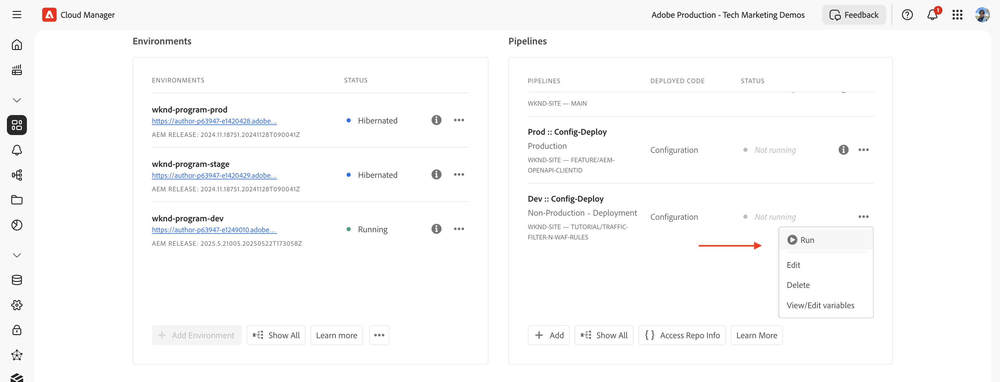

# AEM-websites beschermen met WAF-regels

Leer hoe te om de websites van AEM tegen verfijnde bedreigingen met inbegrip van DoS, DDoS, en bot misbruik te beschermen gebruikend _Adobe-geadviseerde_ **de regels van de Firewall van de Toepassing van het Web (WAF)** in AEM as a Cloud Service.

De gesofisticeerde aanvallen worden gekenmerkt door hoge vraagtarieven, complexe patronen, en het gebruik van geavanceerde technieken om traditionele veiligheidsmaatregelen te mijden.

>[!IMPORTANT]
>
> De regels van de het verkeersfilter van WAF vereisen een extra **bescherming WAF-DDoS** of **Verbeterde vergunning van de Veiligheid**. De standaardregels van de verkeersfilter zijn beschikbaar aan de klanten van Plaatsen en van Forms door gebrek.


>[!VIDEO](https://video.tv.adobe.com/v/3469397/?quality=12&learn=on)

## Leerdoelstellingen

- Bekijk de door Adobe aanbevolen WAF-regels.
- Bepaal, stel, test, en analyseer de resultaten van de regels op.
- Begrijp wanneer en hoe te om de regels te verfijnen die op de resultaten worden gebaseerd.
- Leer hoe u het AEM Actions Center kunt gebruiken om waarschuwingen te bekijken die door de regels worden gegenereerd.

### Overzicht van implementatie

De implementatiestappen omvatten:

- De WAF-regels toevoegen aan het AEM WKND-projectbestand `/config/cdn.yaml` .
- De wijzigingen doorvoeren en doorvoeren in de Cloud Manager Git-opslagplaats.
- Het opstellen van de veranderingen in het milieu van AEM gebruikend de Cloud Manager config pijpleiding.
- Het testen van de regels door een aanval te simuleren DDoS gebruikend [ Nikto ](https://github.com/sullo/nikto/wiki).
- De resultaten analyseren met de CDN-logboeken van AEMCS en het dashboard van de ELK.

## Vereisten

Alvorens te werk te gaan, zorg ervoor u de vereiste opstelling zoals die in [ wordt beschreven hoe te opstellings de filter van het verkeer en de regels van WAF ](../setup.md) leerprogramma hebt voltooid. Ook, hebt u gekloond en opgesteld het [ Project van de Plaatsen van AEM WKND ](https://github.com/adobe/aem-guides-wknd) aan uw milieu van AEM.

## Regels evalueren en definiëren

Adobe-Aanbevolen regels van de Firewall van de Toepassing van het Web (WAF) zijn essentieel om de websites van AEM tegen verfijnde bedreigingen, met inbegrip van Dos, DDoS, en bot misbruik te beschermen. De verfijnde aanvallen worden vaak gekenmerkt door hoge verzoektarieven, complexe patronen, en het gebruik van geavanceerde technieken (op protocol-gebaseerde of op lading-gebaseerde aanvallen) om traditionele veiligheidsmaatregelen te mijden.

Laten we drie aanbevolen WAF-regels doornemen die moeten worden toegevoegd aan het `cdn.yaml` -bestand in het AEM WKND-project:

### &#x200B;1. De aanvallen van het blok van bekende kwaadwillige IPs

Deze regel **blokkeert** verzoeken die zowel verdacht *kijken als* uit IP adressen voortkomen die als kwaadwillig worden gemarkeerd. Omdat aan beide criteria is voldaan, kunnen we erop vertrouwen dat het risico van valse positieven (het blokkeren van legitiem verkeer) zeer laag is. De bekende slechte IPs wordt geïdentificeerd gebaseerd op de feeds van de bedreigingsintelligentie en andere bronnen.

De markering `ATTACK-FROM-BAD-IP` WAF wordt gebruikt om deze aanvragen te identificeren. Het voegt verscheidene van de vlaggen van WAF [ samen die hier ](https://experienceleague.adobe.com/nl/docs/experience-manager-cloud-service/content/security/traffic-filter-rules-including-waf#waf-flags-list) worden vermeld.

```yaml
kind: "CDN"
version: "1"
metadata:
  envTypes: ["dev", "stage", "prod"]
data:
  trafficFilters:
    rules:
    - name: attacks-from-bad-ips-globally
      when:
        reqProperty: tier
        in: ["author", "publish"]
      action:
        type: block
        wafFlags:
          - ATTACK-FROM-BAD-IP
```

### &#x200B;2. De aanvallen van het logboek (en recenter blok) van om het even welk IP globaal

Deze regel **registreert** verzoeken die als potentiële aanvallen worden geïdentificeerd, zelfs als de IP adressen niet in bedreigingsinlichtingenvoer worden gevonden.

De markering `ATTACK` WAF wordt gebruikt om deze aanvragen te identificeren. Vergelijkbaar met de `ATTACK-FROM-BAD-IP` ,   Hiermee worden verschillende WAF-vlaggen samengevoegd.

Deze verzoeken zijn waarschijnlijk kwaadwillig, maar aangezien de IP adressen niet in bedreigingsinlichtingenvoer worden geïdentificeerd, kan het verstandig zijn om op `log` wijze eerder dan blokwijze te beginnen. Analyseer de logboeken voor valse positieven, en eens bevestigd, **zorg ervoor om de regel aan `block` wijze** te schakelen.

```yaml
...
    - name: attacks-from-any-ips-globally
      when:
        reqProperty: tier
        in: ["author", "publish"]
      action:
        type: log
        alert: true
        wafFlags:
          - ATTACK
```

U kunt er ook voor kiezen om de `block` -modus direct te gebruiken als uw zakelijke vereisten zo zijn dat u geen kans wilt maken om kwaadaardig verkeer toe te staan.

Deze geadviseerde regels van WAF verstrekken een extra laag van veiligheid tegen bekende en nieuwe bedreigingen.


## Migreren naar de meest recente door Adobe aanbevolen WAF-regels

Voordat de vlaggen `ATTACK-FROM-BAD-IP` en `ATTACK` WAF werden geïntroduceerd (in juli 2025), waren de aanbevolen WAF-regels als volgt. Ze bevatten een lijst met specifieke WAF-vlaggen om aanvragen te blokkeren die aan bepaalde criteria voldoen, zoals `SANS` , `TORNODE` , `NOUA` , enz.

```yaml
...
data:
  trafficFilters:
    rules:
    ...
    # Enable WAF protections (only works if WAF is enabled for your environment)
      - name: block-waf-flags
        when:
          reqProperty: tier
          matches: "author|publish"
        action:
          type: block
          wafFlags:
            - SANS
            - TORNODE
            - NOUA
            - SCANNER
            - USERAGENT
            - PRIVATEFILE
            - ABNORMALPATH
            - TRAVERSAL
            - NULLBYTE
            - BACKDOOR
            - LOG4J-JNDI
            - SQLI
            - XSS
            - CODEINJECTION
            - CMDEXE
            - NO-CONTENT-TYPE
            - UTF8
...
```

De bovenstaande regel is nog geldig, maar het wordt geadviseerd om aan de nieuwe regels te migreren die `ATTACK-FROM-BAD-IP` gebruiken en `ATTACK` de vlaggen van WAF _op voorwaarde dat u niet reeds `wafFlags` hebt aangepast om uw bedrijfsvereisten_ aan te passen.

U kunt naar de nieuwe regels migreren om consistent te zijn met de beste praktijken door deze stappen te volgen:

- Bekijk de bestaande WAF-regels in uw `cdn.yaml` -bestand, die er ongeveer hetzelfde uitzien als in het bovenstaande voorbeeld. Controleer of de `wafFlags` die specifiek is voor uw bedrijfsvereisten, niet is aangepast.

- Vervang uw bestaande WAF-regels door de nieuwe WAF-regels die door Adobe worden aanbevolen en die gebruikmaken van de markeringen `ATTACK-FROM-BAD-IP` en `ATTACK` . Zorg ervoor dat alle regels in blokmodus staan.

Als u de `wafFlags` eerder had aangepast, migreert u mogelijk nog steeds naar deze nieuwe regels, maar doe dit zorgvuldig om ervoor te zorgen dat eventuele aanpassingen naar de herziene regels worden overgebracht.

De migratie zou u moeten helpen uw regels van WAF vereenvoudigen terwijl nog het verstrekken van robuuste bescherming tegen gesofisticeerde bedreigingen. De nieuwe regels zijn ontworpen om effectiever en eenvoudiger te beheren.


## Regels implementeren

Voer de volgende stappen uit om de bovenstaande regels te implementeren:

- Leg de wijzigingen vast en duw deze naar de Cloud Manager Git-opslagplaats.

- Stel de veranderingen in het milieu van AEM op gebruikend de Cloud Manager config pijpleiding [ vroeger gecreeerd ](../setup.md#deploy-rules-using-adobe-cloud-manager).

  

## Testregels

Om de doeltreffendheid van de regels van WAF te verifiëren, simuleer een aanval gebruikend [ Nikto ](https://github.com/sullo/nikto), een scanner van de Webserver die kwetsbaarheid en misconfiguraties ontdekt. De volgende opdracht activeert SQL-injectieaanvallen op de AEM WKND-website, die wordt beveiligd door de WAF-regels.

```shell
$./nikto.pl -useragent "AttackSimulationAgent (Demo/1.0)" -D V -Tuning 9 -ssl -h https://publish-pXXXX-eYYYY.adobeaemcloud.com/us/en.html
```


Om over aanvalsimulatie te leren, herzie [ Nikto - Scannen ](https://github.com/sullo/nikto/wiki/Scan-Tuning) documentatie, die u vertelt hoe te om het type van testaanvallen te specificeren om te omvatten of uit te sluiten.

## Waarschuwingen bekijken

Het alarm wordt geproduceerd wanneer de regels van de verkeersfilter worden teweeggebracht. U kunt deze alarm in het [ Centrum van Acties van AEM ](https://experience.adobe.com/aem/actions-center) herzien.


## Resultaten analyseren

Om de resultaten van de regels van de verkeersfilter te analyseren, kunt u de logboeken van AEMCS CDN en het dashboard van de ELK gebruiken. Volg de instructies van [ CDN registreert opname ](../setup.md#ingest-cdn-logs) opstellingssectie om de CDN- logboeken in de stapel van de ELK in te nemen.

In de volgende schermafbeelding ziet u de CDN-logbestanden van de AEM Dev-omgeving die in de ELK-stapel zijn opgenomen.


Binnen de ELK toepassing zou het **dashboard van WAF** moeten tonen
Gemarkeerde verzoeken en overeenkomstige waarden in cliëntIP (cli_ip), gastheer, url, actie (waf_action), en regel-naam (waf_match) kolommen.


Ook, tonen de **distributie van de Vlaggen van WAF** en **Hoogste aanvallen** panelen extra details.


### Splunk-integratie

De klanten die [ Logboek van de Splunk hebben toegelaten ](https://experienceleague.adobe.com/nl/docs/experience-manager-cloud-service/content/implementing/developing/logging#splunk-logs) kunnen nieuwe dashboards tot stand brengen om de verkeerspatronen te analyseren.

Om dashboards in Splunk tot stand te brengen, volg [ Splunk dashboards voor de Analyse van het Logboek AEMCS CDN ](https://github.com/adobe/AEMCS-CDN-Log-Analysis-Tooling/blob/main/Splunk/README.md#splunk-dashboards-for-aemcs-cdn-log-analysis) stappen.

## Wanneer en hoe te om regels te verfijnen

U wilt voorkomen dat legitiem verkeer wordt geblokkeerd en tegelijkertijd uw AEM-websites beschermen tegen geavanceerde bedreigingen. De aanbevolen WAF-regels zijn ontworpen als uitgangspunt voor uw beveiligingsstrategie.

Als u de regels wilt verfijnen, gaat u als volgt te werk:

- **het verkeerspatronen van de Monitor**: Gebruik de CDN- logboeken en het dashboard van ELK om verkeerspatronen te controleren en om het even welke anomalieën of pieken in verkeer te identificeren. Besteed aandacht aan de _de vlagdistributie van WAF_ en _Hoogste aanvallen_ panelen in het dashboard van de ELK om de soorten aanvallen te begrijpen die worden ontdekt.
- **Adjust wafFlags**: Als `ATTACK` vlaggen te vaak worden teweeggebracht of
Als u de aanvalsvector wilt verfijnen, kunt u aangepaste regels maken met specifieke WAF-vlaggen. Zie een volledige lijst van [ de vlaggen van WAF ](https://experienceleague.adobe.com/nl/docs/experience-manager-cloud-service/content/security/traffic-filter-rules-including-waf#waf-flags-list) in de documentatie. Probeer eerst nieuwe aangepaste regels in de modus `log` .
- **Beweging aan het blokkeren van regels**: Zodra u de verkeerspatronen en de vlaggen van WAF hebt bevestigd, kunt u overwegen zich aan het blokkeren van regels te bewegen.

## Samenvatting

In deze zelfstudie hebt u geleerd hoe u AEM-websites kunt beschermen tegen geavanceerde bedreigingen, zoals DoS, DDoS en beide misbruiken met WAF-regels (Adobe-recommended Web Application Firewall).

## Gebruik zaken - voorbij standaardregels

Voor meer geavanceerde scenario&#39;s, kunt u de volgende gebruiksgevallen onderzoeken die aantonen hoe te om de regels van de filter van het douaneverkeer uit te voeren die op specifieke bedrijfsvereisten worden gebaseerd:

<!-- CARDS
{target = _self}

* ../how-to/request-logging.md

* ../how-to/request-blocking.md

* ../how-to/request-transformation.md
-->
<!-- START CARDS HTML - DO NOT MODIFY BY HAND -->
<div class="columns">
    <div class="column is-half-tablet is-half-desktop is-one-third-widescreen" aria-label="Monitoring sensitive requests">
        <div class="card" style="height: 100%; display: flex; flex-direction: column; height: 100%;">
            <div class="card-image">
                <figure class="image x-is-16by9">
                    <a href="../how-to/request-logging.md" title="Bewaking van gevoelige verzoeken" target="_self" rel="referrer">
                        
                    </a>
                </figure>
            </div>
            <div class="card-content is-padded-small" style="display: flex; flex-direction: column; flex-grow: 1; justify-content: space-between;">
                <div class="top-card-content">
                    <p class="headline is-size-6 has-text-weight-bold">
                        <a href="../how-to/request-logging.md" target="_self" rel="referrer" title="Bewaking van gevoelige verzoeken"> Bewaking gevoelige verzoeken </a>
                    </p>
                    <p class="is-size-6">Leer hoe te om gevoelige verzoeken te controleren door hen te registreren gebruikend de regels van de verkeersfilter in AEM as a Cloud Service.</p>
                </div>
                <a href="../how-to/request-logging.md" target="_self" rel="referrer" class="spectrum-Button spectrum-Button--outline spectrum-Button--primary spectrum-Button--sizeM" style="align-self: flex-start; margin-top: 1rem;">
                    <span class="spectrum-Button-label has-no-wrap has-text-weight-bold"> Leer meer </span>
                </a>
            </div>
        </div>
    </div>
    <div class="column is-half-tablet is-half-desktop is-one-third-widescreen" aria-label="Restricting access">
        <div class="card" style="height: 100%; display: flex; flex-direction: column; height: 100%;">
            <div class="card-image">
                <figure class="image x-is-16by9">
                    <a href="../how-to/request-blocking.md" title="Toegang beperken" target="_self" rel="referrer">
                        
                    </a>
                </figure>
            </div>
            <div class="card-content is-padded-small" style="display: flex; flex-direction: column; flex-grow: 1; justify-content: space-between;">
                <div class="top-card-content">
                    <p class="headline is-size-6 has-text-weight-bold">
                        <a href="../how-to/request-blocking.md" target="_self" rel="referrer" title="Toegang beperken"> Beperkend toegang </a>
                    </p>
                    <p class="is-size-6">Leer hoe te om toegang te beperken door specifieke verzoeken te blokkeren gebruikend de regels van de verkeersfilter in AEM as a Cloud Service.</p>
                </div>
                <a href="../how-to/request-blocking.md" target="_self" rel="referrer" class="spectrum-Button spectrum-Button--outline spectrum-Button--primary spectrum-Button--sizeM" style="align-self: flex-start; margin-top: 1rem;">
                    <span class="spectrum-Button-label has-no-wrap has-text-weight-bold"> Leer meer </span>
                </a>
            </div>
        </div>
    </div>
    <div class="column is-half-tablet is-half-desktop is-one-third-widescreen" aria-label="Normalizing requests">
        <div class="card" style="height: 100%; display: flex; flex-direction: column; height: 100%;">
            <div class="card-image">
                <figure class="image x-is-16by9">
                    <a href="../how-to/request-transformation.md" title="Verzoeken normaliseren" target="_self" rel="referrer">
                        
                    </a>
                </figure>
            </div>
            <div class="card-content is-padded-small" style="display: flex; flex-direction: column; flex-grow: 1; justify-content: space-between;">
                <div class="top-card-content">
                    <p class="headline is-size-6 has-text-weight-bold">
                        <a href="../how-to/request-transformation.md" target="_self" rel="referrer" title="Verzoeken normaliseren"> het Normaliseren verzoeken </a>
                    </p>
                    <p class="is-size-6">Leer hoe te om verzoeken te normaliseren door hen te transformeren gebruikend de regels van de verkeersfilter in AEM as a Cloud Service.</p>
                </div>
                <a href="../how-to/request-transformation.md" target="_self" rel="referrer" class="spectrum-Button spectrum-Button--outline spectrum-Button--primary spectrum-Button--sizeM" style="align-self: flex-start; margin-top: 1rem;">
                    <span class="spectrum-Button-label has-no-wrap has-text-weight-bold"> Leer meer </span>
                </a>
            </div>
        </div>
    </div>
</div>
<!-- END CARDS HTML - DO NOT MODIFY BY HAND -->

## Aanvullende bronnen

- [ Aanbevolen starterregels ](https://experienceleague.adobe.com/nl/docs/experience-manager-cloud-service/content/security/traffic-filter-rules-including-waf#recommended-nonwaf-starter-rules)
- [ WAF vlaggen lijst ](https://experienceleague.adobe.com/nl/docs/experience-manager-cloud-service/content/security/traffic-filter-rules-including-waf#waf-flags-list)
