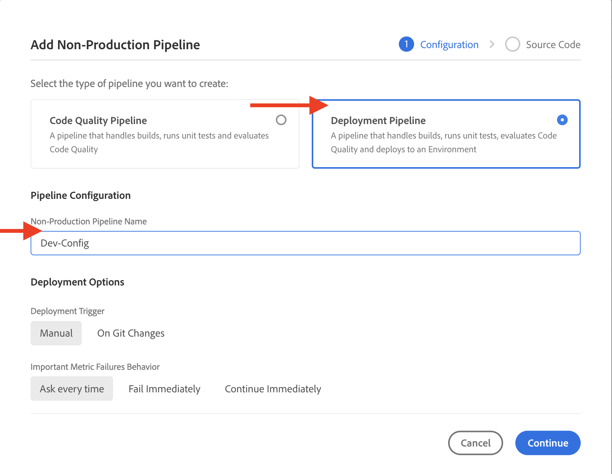

# Hoe te de regels van de Filter van het opstellingenverkeer met inbegrip van de regels van WAF

Meer informatie **instellen** de regels van de verkeersfilter, met inbegrip van de regels van WAF. Lees over het maken, implementeren, testen en analyseren van resultaten.

>[!VIDEO](https://video.tv.adobe.com/v/3425407?quality=12&learn=on)

## Instellen

Het installatieproces omvat het volgende:

- _regels maken_ met een geschikte AEM projectstructuur en configuratiebestand.
- _regels implementeren_ via de configuratiepijplijn van Adobe Cloud Manager.
- _testregels_ het gebruiken van diverse hulpmiddelen om verkeer te produceren.
- _de resultaten analyseren_ met AEMCS CDN-logboeken en dashboardwerkset.

### Regels maken in uw AEM project

Ga als volgt te werk om regels te maken:

1. Maak op het hoofdniveau van uw AEM project een map `config`.

1. Binnen de `config` een nieuw bestand met de naam `cdn.yaml`.

1. Voeg de volgende metagegevens toe aan de `cdn.yaml` bestand:

```yaml
kind: CDN
version: '1'
metadata:
  envTypes:
    - dev
    - stage
    - prod
data:
  trafficFilters:
    rules:
```

Zie een voorbeeld van de `cdn.yaml` bestand in het WKND-siteproject van de AEM:

{width="800" zoomable="yes"}

### Regels implementeren via Cloud Manager {#deploy-rules-through-cloud-manager}

Voer de volgende stappen uit om regels te implementeren:

1. Aanmelden bij Cloud Manager [my.cloudmanager.adobe.com](https://my.cloudmanager.adobe.com/) en selecteert u de gewenste organisatie en het juiste programma.

1. Ga naar de _Pijpleidingen_ kaart van _Programmaoverzicht_ pagina en klik op de knop **+Toevoegen** en selecteert u het gewenste type pijplijn.

   

   In het bovenstaande voorbeeld voor demo-doeleinden _Niet-productiepijpleiding toevoegen_ is geselecteerd omdat een ontwikkelomgeving wordt gebruikt.

1. In de _Niet-productiepijpleiding toevoegen_ kiest en voert u de volgende gegevens in:

   1. Configuratiestap:

      - **Type**: Distributiepijplijn
      - **Naam pijpleiding**: Dev-Config

      

   2. Stap broncode:

      - **Code voor implementatie**: doelgerichte implementatie
      - **Inclusief**: Config
      - **Implementatieomgeving**: Naam van uw omgeving, bijvoorbeeld wknd-program-dev.
      - **Bewaarplaats**: De Git-opslagplaats van waar de pijpleiding de code moet ophalen, bijvoorbeeld `wknd-site`
      - **Git Branch**: De naam van de Git-opslagvertakking.
      - **Codelocatie**: `/config`, overeenkomend met de configuratiemap op hoofdniveau die in de vorige stap is gemaakt.

      

### Regels testen door verkeer te genereren

Om regels te testen, zijn er verschillende hulpmiddelen van derden beschikbaar en uw organisatie kan een aangewezen hulpmiddel hebben. Gebruik de volgende gereedschappen voor demo-doeleinden:

- [Krol](https://curl.se/) voor basistests zoals het aanroepen van een URL en het controleren van de antwoordcode.

- [Vegeta](https://github.com/tsenart/vegeta) voor het uitvoeren van een Denial of Service (DOS). Volg de installatie-instructies van de [Vegeta GitHub](https://github.com/tsenart/vegeta#install).

- [Nikto](https://github.com/sullo/nikto/wiki) om potentiële problemen en veiligheidskwetsbaarheid zoals XSS, SQL injectie, en meer te vinden. Volg de installatie-instructies van de [Nikto GitHub](https://github.com/sullo/nikto).

- Controleer of de gereedschappen zijn geïnstalleerd en beschikbaar zijn in uw terminal door de onderstaande opdrachten uit te voeren:

  ```shell
  # Curl version check
  $ curl --version
  
  # Vegeta version check
  $ vegeta -version
  
  # Nikto version check
  $ cd <PATH-OF-CLONED-REPO>/program
  ./nikto.pl -Version
  ```

### Resultaten analyseren met de dashboardgereedschappen

Nadat u de regels hebt gemaakt, geïmplementeerd en getest, kunt u de resultaten analyseren met **Elasticsearch, Logstash en Kibana (ELK)** dashboardgereedschap. Het kan de logboeken van AEMCS CDN ontleden, die u toestaan om de resultaten in de vorm van diverse grafieken en grafieken te visualiseren.

Gereedschap Dashboard kan rechtstreeks worden gekloond vanuit het dialoogvenster [AEMCS-CDN-Log-Analysis-ELK-Tool GitHub-opslagplaats](https://github.com/adobe/AEMCS-CDN-Log-Analysis-ELK-Tool) en voert u de stappen uit om de **Verkeersfilterregels (inclusief WAF)** dashboard.

- Nadat u het voorbeelddashboard hebt geladen, ziet de gereedschapspagina Elastic er als volgt uit:

  

>[!NOTE]
>
>    Aangezien er nog geen AEMCS CDN-logbestanden worden opgenomen, is het dashboard leeg.


## Volgende stap

Leer hoe te om de regels van de verkeersfilter met inbegrip van de regels van WAF in te verklaren [Voorbeelden en resultaatanalyse](./examples-and-analysis.md) hoofdstuk, gebruikend het Project van de Plaatsen van AEM WKND.
