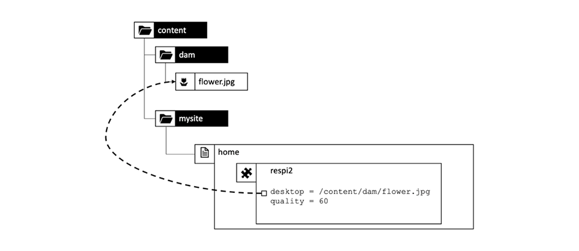

# Hoofdstuk 1 - Concepten, patronen en antipatronen van Dispatcher

## Overzicht

In dit hoofdstuk wordt een korte inleiding gegeven over de geschiedenis en de mechanica van de Dispatcher en wordt besproken hoe dit van invloed is op hoe een AEM ontwikkelaar zijn componenten zou ontwerpen.

## Waarom ontwikkelaars zich moeten bekommeren om infrastructuur

De Dispatcher is een essentieel onderdeel van de meeste, zo niet alle AEM installaties. U kunt vele online artikelen vinden die bespreken hoe te om de Dispatcher evenals uiteinden en trucs te vormen.

Deze stukken en stukken informatie beginnen echter altijd op een zeer technisch niveau - veronderstellend u reeds weet wat u wilt doen en zo slechts details verstrekken over hoe te om te bereiken wat u wilt. We hebben nooit conceptuele documenten gevonden waarin de _wat is en waarom is_ wanneer het aankomt wat u met de verzender kunt en niet kunt doen.

### Antipatroon: Dispatcher als een nagedachte

Dit gebrek aan basisinformatie leidt tot een aantal anti-patronen die we in een aantal AEM projecten hebben gezien:

1. Aangezien de Dispatcher in de server van het Web Apache wordt geïnstalleerd, is het de baan van de &quot;Unix gods&quot;in het project om het te vormen. Een &#39;mortale java-ontwikkelaar&#39; hoeft zich daar niet mee bezig te houden.

2. De Java-ontwikkelaar moet ervoor zorgen dat deze code werkt... de verzender zorgt er later magisch voor dat het snel gaat. De verzender is altijd een nagedachte. Dit werkt echter niet. Een ontwikkelaar moet zijn code met de verzender in mening ontwerpen. Hij moet zijn basisconcepten kennen om dat te doen.

### &quot;Eerst laat het werken - dan maak het snel&quot; Is niet altijd juist

Wellicht hebt u het programmeringsadvies gehoord _&quot;Maak het eerst aan het werk - maak het dan snel.&quot;_. Het is niet helemaal fout. Zonder de juiste context wordt het echter vaak verkeerd geïnterpreteerd en niet correct toegepast.

Het advies moet voorkomen dat de ontwikkelaar voortijdig code optimaliseert, die misschien nooit wordt uitgevoerd - of zo zelden wordt uitgevoerd, dat een optimalisatie niet voldoende effect zou hebben om de inspanning in de optimalisering te rechtvaardigen. Bovendien zou optimalisatie kunnen leiden tot complexere code en zo insecten kunnen introduceren. Dus als je ontwikkelaar bent, besteed je niet teveel tijd aan microoptimalisering van elke regel code. Zorg gewoon dat u de juiste gegevensstructuren, algoritmen en bibliotheken hebt gekozen en wacht tot de hotspot-analyse van een analyseprogramma de algemene prestaties verhoogt door een grondiger optimalisatie te kiezen.

### Architectuurbeslissingen en artefacten

Het advies &quot;Eerst laat het werken - dan snel maken&quot; is echter volkomen verkeerd als het gaat om &quot;architecturale&quot; beslissingen. Wat zijn architectonische beslissingen? Eenvoudig gezegd, het zijn de beslissingen die duur, moeilijk en/of onmogelijk achteraf te veranderen zijn. Houd er rekening mee dat &quot;duur&quot; soms hetzelfde is als &quot;onmogelijk&quot;.  Als uw project bijvoorbeeld niet over voldoende middelen beschikt, kunnen dure wijzigingen niet worden doorgevoerd. Infrastructuurveranderingen zijn de allereerste soort veranderingen in die categorie die de meeste mensen in gedachten hebben. Maar er is ook een ander soort &#39;architectonische&#39; artefacten die erg vervelend kunnen worden om te veranderen:

1. Stukken code in het midden van een toepassing, waarop vele andere stukken vertrouwen. Als u deze opties wijzigt, moeten alle afhankelijkheden tegelijk worden gewijzigd en opnieuw worden getest.

2. Artefacten, die in één of ander asynchroon, timing-afhankelijk scenario betrokken zijn waar de input - en zo het gedrag van het systeem zeer willekeurig kan variëren. Wijzigingen kunnen onvoorspelbare effecten hebben en kunnen moeilijk te testen zijn.

3. Softwarepatronen die steeds opnieuw worden gebruikt en gebruikt in alle onderdelen en onderdelen van het systeem. Als het softwarepatroon suboptimaal blijkt te zijn, moeten alle artefacten die het patroon gebruiken opnieuw worden gecodeerd.

Herinner je? Bovenop deze pagina hebben we gezegd dat de verzender een essentieel onderdeel is van een AEM toepassing. De toegang tot een webtoepassing is zeer willekeurig - gebruikers komen en gaan op onvoorspelbare tijden. Uiteindelijk wordt (of moet) alle inhoud in de Dispatcher in het cachegeheugen opgeslagen. Dus als je goed oplette, had je je kunnen realiseren dat caching gezien kon worden als een &#39;architectonisch&#39; artefact en dus begrepen moest worden door alle leden van het team, ontwikkelaars en beheerders.

We zeggen niet dat een ontwikkelaar de Dispatcher moet configureren. Zij moeten de concepten - vooral de grenzen - kennen om ervoor te zorgen dat hun code ook door de Dispatcher kan worden gebruikt.

De verzender verbetert de snelheid van de code niet magisch. Een ontwikkelaar moet zijn componenten met Dispatcher in mening creëren. Daarom moet hij weten hoe het werkt.

## Caching voor verzending - Basisbeginselen

### Wordt verzonden als Http in cache - taakverdeling

Wat is de Dispatcher en waarom heet deze &#39;Dispatcher&#39; in de eerste plaats?

De Dispatcher is

* Eerst en vooral een cache

* Een reverse-proxy

* Een module voor de Apache httpd-webserver, die AEM verwante functies toevoegt aan de veelzijdigheid van de Apache en soepel samenwerkt met alle andere Apache-modules (zoals SSL of zelfs SSI zoals we die later zullen zien)

In de vroege dagen van het Web, zou u een paar honderd bezoekers aan een plaats verwachten. Een opstelling van één Dispatcher, &quot;verzonden&quot;of evenwichtig het laden van verzoeken aan een aantal AEM publiceer servers en die gewoonlijk genoeg - zo, de naam &quot;Dispatcher&quot;was. Deze instelling wordt momenteel echter niet vaak meer gebruikt.

In dit artikel worden verschillende manieren weergegeven voor het instellen van Dispatcher- en Publish-systemen. Laten we beginnen met de basisbeginselen van http caching.


*Basisfunctionaliteit van een Dispatcher Cache*

<br> 

De basisbeginselen van de verzender worden hier uitgelegd. De verzender is een eenvoudige reverse-proxy die in cache kan worden geplaatst en waarmee HTTP-aanvragen kunnen worden ontvangen en gemaakt. Een normale verzoek-/responscyclus gaat als volgt:

1. Een gebruiker vraagt een pagina aan
2. De Dispatcher controleert of er al een gerenderde versie van die pagina is. Laten we aannemen dat dit het allereerste verzoek voor deze pagina is en dat de verzender geen lokale kopie in de cache kan vinden.
3. De verzender vraagt de pagina van het Publish systeem
4. Op het publicatiesysteem wordt de pagina weergegeven door een JSP- of een HTML-sjabloon
5. De pagina wordt geretourneerd aan de Dispatcher
6. De verzender plaatst de pagina in de cache
7. De Dispatcher retourneert de pagina naar de browser
8. Als dezelfde pagina een tweede keer wordt opgevraagd, kan deze rechtstreeks worden aangeboden vanuit de Dispatcher-cache zonder dat de pagina opnieuw moet worden gerenderd op de Publish-instantie. Hiermee bespaart u wachttijd voor de gebruiker en CPU-cycli op de instantie Publiceren.

In de laatste sectie hadden we het over &quot;pagina&#39;s&quot;. Maar hetzelfde schema geldt ook voor andere bronnen, zoals afbeeldingen, CSS-bestanden, PDF-downloads enzovoort.

#### Hoe gegevens in cache worden geplaatst

De module Dispatcher gebruikt de faciliteiten die de hostserver voor Apache biedt. Bronnen zoals HTML-pagina&#39;s, downloads en afbeeldingen worden als eenvoudige bestanden opgeslagen in het Apache-bestandssysteem. Zo eenvoudig is het.

De bestandsnaam wordt afgeleid door de URL van de gevraagde bron. Als u een bestand aanvraagt `/foo/bar.html` het wordt bijvoorbeeld opgeslagen onder /`var/cache/docroot/foo/bar.html`.

Als alle bestanden in het cachegeheugen worden opgeslagen en dus statisch in de Dispatcher worden opgeslagen, kunt u in principe de plug-in van het publicatiesysteem gebruiken en de Dispatcher als een eenvoudige webserver fungeren. Maar dit is slechts een illustratie van het principe. Het echte leven is ingewikkelder. U kunt niet alles in het cachegeheugen plaatsen en de cache is nooit volledig &quot;vol&quot;, omdat het aantal bronnen oneindig kan zijn vanwege de dynamische aard van het renderingsproces. Het model van een statisch bestandssysteem helpt een globaal beeld te genereren van de mogelijkheden van de verzender. En het helpt om de beperkingen van de verzender te verklaren.

#### De AEM URL-structuur en bestandssysteemtoewijzing

Als u de Dispatcher gedetailleerder wilt begrijpen, gaat u naar de structuur van een eenvoudige voorbeeld-URL.  Kijk naar het onderstaande voorbeeld.

`http://domain.com/path/to/resource/pagename.selectors.html/path/suffix.ext?parameter=value&amp;otherparameter=value#fragment`

* `http` geeft het protocol aan

* `domain.com` is de domeinnaam

* `path/to/resource` is het pad waaronder de bron wordt opgeslagen in CRX en vervolgens in het bestandssysteem van de Apache-server.

Van hieruit verschillen de dingen een beetje tussen het AEM en het Apache-bestandssysteem.

In AEM

* `pagename` is het resourcelabel

* `selectors` staat voor een aantal selecteurs die in Sling worden gebruikt om te bepalen hoe de middel wordt teruggegeven. Een URL kan een willekeurig aantal kiezers hebben. Ze worden gescheiden door een punt. Een sectie met kiezers kan bijvoorbeeld &#39;frans.mobile.fancy&#39; zijn. Kiezers mogen alleen letters, cijfers en streepjes bevatten.

* `html` als laatste van de &quot;kiezers&quot; wordt een extensie genoemd. Bij AEM/Verdelen bepaalt het ook gedeeltelijk het renderscript.

* `path/suffix.ext` is een pad-achtige uitdrukking die een achtervoegsel aan URL kan zijn.  Het kan in AEM manuscripten worden gebruikt om verder te controleren hoe een middel wordt teruggegeven. Later hebben we een volledige sectie over dit onderdeel. Vooralsnog zou het moeten volstaan om te weten u het als extra parameter kunt gebruiken. Achtervoegsels moeten een extensie hebben.

* `?parameter=value&otherparameter=value` Dit is het querygedeelte van de URL. Deze wordt gebruikt om willekeurige parameters door te geven aan AEM. URL&#39;s met parameters kunnen niet in de cache worden geplaatst en parameters moeten daarom worden beperkt tot gevallen waarin ze absoluut noodzakelijk zijn.

* `#fragment`, wordt het fragmentgedeelte van een URL niet doorgegeven aan AEM het alleen in de browser wordt gebruikt; in JavaScript-frameworks wordt het fragmentgedeelte niet doorgegeven als ‘parameters routeren’ of om naar een bepaald deel van de pagina te gaan.

In Apache (*verwijzing naar het onderstaande diagram*),

* `pagename.selectors.html` wordt gebruikt als de bestandsnaam in het bestandssysteem van de cache.

Als de URL een achtervoegsel heeft `path/suffix.ext` dan

* `pagename.selectors.html` wordt gemaakt als een map

* `path` een map in de `pagename.selectors.html` map

* `suffix.ext` is een bestand in het dialoogvenster `path` map. Opmerking: als het achtervoegsel geen extensie heeft, wordt het bestand niet in de cache opgeslagen.


*Bestandssysteemindeling na ophalen van URL&#39;s van de Dispatcher*

<br> 

#### Basisbeperkingen

De toewijzing tussen een URL, de bron en de bestandsnaam is vrij eenvoudig.

Het is echter mogelijk dat u enkele overvullingen hebt opgemerkt.

1. URL&#39;s kunnen erg lang worden. Het padgedeelte van een object toevoegen `/docroot` op het lokale bestandssysteem gemakkelijk de limieten van sommige filesystemen te overschrijden. Het runnen van de Dispatcher in NTFS op Vensters kan een uitdaging zijn. U bent echter veilig met Linux.

2. URL&#39;s kunnen speciale tekens en umlauts bevatten. Dit is meestal geen probleem voor de verzender. Houd er echter rekening mee dat de URL op veel plaatsen in de toepassing wordt geïnterpreteerd. Vaak hebben we vreemd gedrag van een toepassing gezien - alleen om te weten te komen dat één stukje zelden gebruikte (aangepaste) code niet grondig is getest op speciale tekens. Indien mogelijk moet u deze vermijden. En als je dat niet kunt, plan dan voor grondig testen.

3. In CRX hebben bronnen subbronnen. Een pagina bevat bijvoorbeeld een aantal subpagina&#39;s. Dit kan niet worden gevonden in een bestandssysteem omdat bestandssystemen bestanden of mappen hebben.

#### URL&#39;s zonder extensie worden niet in de cache geplaatst

URL&#39;s moeten altijd een extensie hebben. Hoewel u URL&#39;s zonder extensies kunt bedienen in AEM. Deze URL&#39;s worden niet in de cache opgeslagen in de Dispatcher.

**Voorbeelden**

`http://domain.com/home.html` is **kakelvormig**

`http://domain.com/home` is **niet in cache geplaatst**

Dezelfde regel geldt wanneer de URL een achtervoegsel bevat. Het achtervoegsel moet een uitbreiding hebben om cacheable te zijn.

**Voorbeelden**

`http://domain.com/home.html/path/suffix.html` is **kakelvormig**

`http://domain.com/home.html/path/suffix` is **niet in cache geplaatst**

Je zou je kunnen afvragen: wat gebeurt er als het resource-part geen extensie heeft, maar het achtervoegsel wel. In dit geval heeft de URL helemaal geen achtervoegsel. Kijk naar het volgende voorbeeld:

**Voorbeeld**

`http://domain.com/home/path/suffix.ext`

De `/home/path/suffix` is het pad naar de bron... dus de URL bevat geen achtervoegsel.

**Conclusie**

Voeg altijd extensies toe aan zowel het pad als het achtervoegsel. SEO-bewuste mensen beweren soms dat dit je in zoekresultaten rangschikt. Maar een pagina zonder cache zou supertraag zijn en nog verder naar beneden gaan.

#### Conflicterende achtervoegsel-URL&#39;s

U hebt twee geldige URL&#39;s

`http://domain.com/home.html`

en

`http://domain.com/home.html/suffix.html`

Ze zijn absoluut geldig in AEM. U zou geen probleem zien op uw lokale ontwikkelcomputer (zonder een Dispatcher). Waarschijnlijk zult u ook geen probleem tegenkomen in UAT- of ladingstests. Het probleem waarmee we te maken hebben is zo subtiel dat het de meeste tests overslaat.  Het zal u hard raken wanneer u op piektijd bent en u bent beperkt in tijd om het te richten, waarschijnlijk heeft geen servertoegang, noch middelen om het te bevestigen. We zijn er geweest...

Dus... wat is het probleem?

`home.html` in een bestandssysteem kan dit een bestand of een map zijn. Niet beide op hetzelfde moment als in AEM.

Als u `home.html` eerst wordt het gemaakt als een bestand.

Volgende verzoeken aan `home.html/suffix.html` retourneert geldige resultaten, maar als bestand `home.html` &quot;blokkeert&quot; de positie in het bestandssysteem,  `home.html` kan niet een tweede keer als een map worden gemaakt en dus `home.html/suffix.html` is niet in cache geplaatst.


*Bestandsblokkeerpositie in het bestandssysteem om te voorkomen dat subbronnen in cache worden geplaatst*

<br> 

Als u dit andersom doet, vraagt u eerst `home.html/suffix.html` dan `suffix.html` is in cache geplaatst onder een map `/home.html` eerst. Deze map wordt echter verwijderd en vervangen door een bestand `home.html` wanneer u later `home.html` als bron.


*Een padstructuur verwijderen wanneer een bovenliggend element als bron wordt opgehaald*

<br> 

Het resultaat van wat in cache wordt geplaatst, is volledig willekeurig en afhankelijk van de volgorde van de binnenkomende aanvragen. Wat het nog lastiger maakt, is het feit dat je meestal meer dan één verzender hebt. En de prestaties, cache hit-rate en het gedrag kunnen per Dispatcher verschillen. Als u wilt weten waarom uw website niet reageert, moet u zeker weten dat u de juiste Dispatcher bekijkt met de ongelukkige cachevolgorde. Als je kijkt naar de Dispatcher die - gelukkig - een gunstiger aanvraagpatroon had, zal je verloren gaan bij het zoeken naar het probleem.

#### Conflicterende URL&#39;s voorkomen

U kunt &quot;conflicterende URLs&quot;vermijden, waar een omslagnaam en filename &quot;concurreren&quot;voor de zelfde weg in het dossiersysteem, wanneer u een verschillende uitbreiding voor het middel gebruikt wanneer u een achtervoegsel hebt.

**Voorbeeld**

* `http://domain.com/home.html`

* `http://domain.com/home.dir/suffix.html`

Beide zijn perfect kacheable,


Als u een achtervoegsel opvraagt of het achtervoegsel niet helemaal gebruikt, kiest u een toegewezen extensie &quot;dir&quot; voor een resource. Er zijn zeldzame gevallen waarin ze nuttig zijn. En het is gemakkelijk om deze gevallen correct uit te voeren.  Zoals we in het volgende hoofdstuk zullen zien wanneer we het hebben over cachevalidatie en flushing.

#### Niet-cachegeerbare verzoeken

Bekijk een korte samenvatting van het laatste hoofdstuk plus nog enkele uitzonderingen. De afzender kan een URL in het voorgeheugen onderbrengen als het als cacheable wordt gevormd en als het een GET verzoek is. Het kan niet in de cache worden geplaatst op grond van een van de volgende uitzonderingen.

**Cacheable-verzoeken**

* Het verzoek wordt gevormd om in de configuratie van de Ontvanger in de cache te zijn
* Aanvraag is een aanvraag voor een gewone GET

**Niet-cachebare verzoeken of reacties**

* Verzoek dat caching door configuratie (Weg, Patroon, Type MIME) wordt ontkend
* Reacties die een header &quot;Dispatcher: no-cache&quot; retourneren
* Reactie die een &quot;Cache-Control: no-cache|private&quot; header retourneert
* Response that returns a &quot;Pragma: no-cache&quot; header
* Verzoek met vraagparameters
* URL zonder extensie
* URL met achtervoegsel dat geen extensie heeft
* Reactie die een andere statuscode dan 200 terugkeert
* Aanvraag POST

## De cache ongeldig maken en leegmaken

### Overzicht

In het laatste hoofdstuk wordt een groot aantal uitzonderingen vermeld, wanneer een aanvraag niet in de cache kan worden opgeslagen door de Dispatcher. Maar er zijn nog meer dingen die in overweging moeten worden genomen: alleen omdat de verzender _kan_ een verzoek in cache plaatsen, betekent dit niet noodzakelijkerwijs dat het _moet_.

Het punt is: In cache plaatsen is meestal eenvoudig. Dispatcher moet enkel het resultaat van een reactie opslaan en het terugkeren de volgende tijd wanneer zeer het zelfde verzoek binnenkomt. Toch? Verkeerd!

Het moeilijke deel is _ongeldigheid_ of _flush_ van de cache. Dispatcher moet erachter komen wanneer een resource is gewijzigd - en moet opnieuw worden gerenderd.

Dit lijkt op het eerste gezicht een triviale taak... maar dat is het niet. Lees verder en u zult wat lastige verschillen tussen enige en eenvoudige middelen en pagina&#39;s ontdekken die zich op een hoogst gemanipuleerde structuur van veelvoudige middelen baseren.

### Eenvoudige bronnen en blozen

We hebben ons AEM zo ingesteld dat er dynamisch een miniatuuruitvoering wordt gemaakt voor elke afbeelding wanneer deze wordt aangevraagd met een speciale &#39;duim&#39;-kiezer:

`/content/dam/path/to/image.thumb.png`

En - natuurlijk - wij verstrekken een URL om het originele beeld van een selecteurloze URL te dienen:

`/content/dam/path/to/image.png`

Als we beide, de miniatuur en de originele afbeelding downloaden, komen we terecht op een soort

```
/var/cache/dispatcher/docroot/content/dam/path/to/image.thumb.png

/var/cache/dispatcher/docroot/content/dam/path/to/image.png
```

in ons bestandssysteem van de Dispatcher.

De gebruiker uploadt en activeert nu een nieuwe versie van dat bestand. Uiteindelijk wordt een verzoek tot nietigverklaring van AEM naar de verzender verzonden,

```
GET /invalidate
invalidate-path:  /content/dam/path/to/image

<no body>
```

Ongeldigmaking is zo eenvoudig: een eenvoudig verzoek van de GET naar een speciale URL voor het verwijderen van gegevens via de Dispatcher. Een HTTP-hoofdtekst is niet vereist. De &#39;payload&#39; is alleen de header &#39;invalidate-path&#39;. Merk ook op, dat invalidate-path in de kopbal de middel is die AEM weet - en niet het dossier of de dossiers de Dispatcher in het voorgeheugen heeft opgeslagen. AEM weet alleen over middelen. Extensies, kiezers en achtervoegsels worden tijdens runtime gebruikt wanneer een resource wordt aangevraagd. AEM voert geen boekhouding over welke selecteurs op een middel zijn gebruikt, zodat is de middelweg allen het weet zeker wanneer het activeren van een middel.

Dat is in ons geval voldoende. Als een middel is veranderd, kunnen wij veilig veronderstellen, dat alle vertoningen van dat middel ook zijn veranderd. Als de afbeelding in ons voorbeeld is gewijzigd, wordt ook een nieuwe miniatuur weergegeven.

De Dispatcher kan de bron veilig verwijderen met alle uitvoeringen die in het cachegeheugen zijn opgeslagen. Het zal iets doen als:

`$ rm /content/dam/path/to/image.*`

verwijderen `image.png` en `image.thumb.png` en alle andere vertoningen die overeenkomen met dat patroon.

Supereenvoudig... zolang u maar één bron gebruikt om op een verzoek te reageren.

### Verwijzingen en verborgen inhoud

#### Probleem met verborgen inhoud

In tegenstelling tot afbeeldingen of andere binaire bestanden die naar AEM worden geüpload, zijn HTML-pagina&#39;s geen afzonderlijke dieren. Ze leven in koppels en zijn in hoge mate met elkaar verbonden door hyperlinks en verwijzingen. De eenvoudige link is onschadelijk, maar het wordt lastig als we het hebben over verwijzingen naar inhoud. De alomtegenwoordige bovenste navigatie(s) op pagina&#39;s zijn verwijzingen naar inhoud.

#### Inhoudsverwijzingen en waarom dit een probleem is

Laten we naar een eenvoudig voorbeeld kijken. Een reisbureau heeft een webpagina waarop een reis naar Canada wordt gepromoot. Deze aanbieding wordt in de teassectie op twee andere pagina&#39;s weergegeven, op de pagina &quot;Home&quot; en op de pagina &quot;Winter Specials&quot;.

Aangezien op beide pagina&#39;s hetzelfde gummetje wordt weergegeven, is het onnodig de auteur te vragen het gummetje meerdere keren te maken voor elke pagina waarop het moet worden weergegeven. In plaats daarvan behoudt de doelpagina &quot;Canada&quot; een sectie in de pagina-eigenschappen om de informatie voor het taser weer te geven - of beter om een URL te bieden die het teaser helemaal rendert:

`<sling:include resource="/content/home/destinations/canada" addSelectors="teaser" />`

of

`<sling:include resource="/content/home/destinations/canada/jcr:content/teaser" />`


Alleen op AEM werkt dat als charm, maar als u een Dispatcher gebruikt op de instantie Publish, gebeurt er iets vreemds.

Stel je voor dat u uw website hebt gepubliceerd. De titel op je pagina in Canada is &quot;Canada&quot;. Wanneer een bezoeker uw homepage opvraagt - die een teasverwijzing naar die pagina heeft - geeft de component op de pagina &quot;Canada&quot; iets als

```
<div class="teaser">
  <h3>Canada</h3>
  
</div>
```

*in* de homepage. De startpagina wordt door de Dispatcher opgeslagen als een statisch HTML-bestand, inclusief het taser en de kop in het bestand.

Nu heeft de markator geleerd dat de teaskoppen actioneerbaar moeten zijn. Hij besluit dus de titel te wijzigen van &quot;Canada&quot; in &quot;Visit Canada&quot; en de afbeelding bij te werken.

Hij publiceert de bewerkte pagina &quot;Canada&quot; en reviseert de eerder gepubliceerde homepage om zijn wijzigingen te zien. Maar - daar is niets veranderd. Het geeft nog steeds de oude taser weer. Hij dubbelcheckt de &quot;Winter Special&quot;. Deze pagina is nog nooit eerder aangevraagd en wordt dus niet statisch in de Dispatcher opgeslagen. Deze pagina wordt dus nieuw weergegeven door Publiceren en deze pagina bevat nu de nieuwe taser &quot;Visit Canada&quot;.


*Dispatcher die opgenomen inhoud van de stijl opslaat op de homepage*

<br> 

Wat is er gebeurd? Dispatcher slaat een statische versie van een pagina op die alle inhoud en opmaak bevat die uit andere bronnen is getekend tijdens het renderen.

De Dispatcher, die slechts een webserver op basis van bestandssysteem is, is snel maar ook relatief eenvoudig. Als een inbegrepen middel verandert realiseert het niet dat. De inhoud die aanwezig was toen de pagina voor opnemen werd weergegeven, blijft vastgeklonken.

De pagina &quot;Winter speciaal&quot; is nog niet weergegeven, dus er is geen statische versie op de Dispatcher en wordt dus weergegeven met het nieuwe taser omdat deze op verzoek nieuw wordt weergegeven.

U zou kunnen denken, dat de Dispatcher spoor van elk middel zou houden het terwijl het teruggeven en het spoelen van alle pagina&#39;s die dit middel hebben gebruikt, wanneer dat middel verandert. Maar de Dispatcher geeft de pagina&#39;s niet weer. De rendering wordt uitgevoerd door het publicatiesysteem. De Dispatcher weet niet welke bronnen in een gerenderd .html-bestand worden gebruikt.

Nog steeds niet overtuigd? Misschien denkt u *&quot; er moet een manier zijn om een of andere vorm van afhankelijkheidscontrole te implementeren &quot;*. Dat is er, of beter gezegd, *was*. Communiqué 3 de overgrootvader van AEM had een afhankelijkheidsleider geïmplementeerd in de _sessie_ die is gebruikt om een pagina weer te geven.

Tijdens een verzoek, werd elke middel dat via deze zitting werd verworven bijgehouden als gebiedsdeel van URL die momenteel werd teruggegeven.

Maar het bleek dat het bijhouden van de afhankelijkheden erg duur was. Mensen ontdekten al snel dat de website sneller is als ze de functie voor het bijhouden van afhankelijkheden volledig uitschakelen en afhankelijk zijn van het opnieuw weergeven van alle HTML-pagina&#39;s nadat één HTML-pagina is gewijzigd. Bovendien was die regeling ook niet perfect - er waren een aantal valkuilen en uitzonderingen onderweg. In sommige gevallen, gebruikte u niet de verzoeken standaardzitting om een middel te krijgen, maar een admin zitting om wat helper-middelen te krijgen om een verzoek terug te geven. Die gebiedsdelen werden gewoonlijk niet gevolgd en leidden tot hoofdpijnen en telefoongesprekken aan het ops-team die vragen om het geheime voorgeheugen manueel te spoelen. U had geluk als ze daarvoor een standaardprocedure hadden. Er waren meer gotchas onderweg, maar... laten we ophouden te herinneren. Dit leidt tot 2005. Uiteindelijk werd deze functie standaard gedeactiveerd in Communiqué 4 en werd het niet weer opgenomen in de opvolger CQ5, die toen AEM werd.

### Automatische validatie

#### Wanneer volledig blozen goedkoper is dan afhankelijkheid-tracking

Sinds CQ5 vertrouwen we er volledig op dat de hele site min of meer ongeldig wordt gemaakt als slechts een van de pagina&#39;s verandert. Deze functie wordt &#39;Automatische validatie&#39; genoemd.

Maar nogmaals, hoe kan het zijn, dat het weggooien en opnieuw renderen van honderden pagina&#39;s goedkoper is dan het uitvoeren van een goede afhankelijkheidstracering en gedeeltelijke herrendering?

Er zijn twee belangrijke redenen:

1. Op een gemiddelde website wordt vaak slechts een kleine subset van de pagina&#39;s opgevraagd. Zelfs als u alle gerenderde inhoud weggooit, wordt er slechts een paar dozijn inhoud direct daarna aangevraagd. De weergave van de lange staart van pagina&#39;s kan worden verdeeld over een tijdsverloop, wanneer deze daadwerkelijk worden aangevraagd. In feite is de belasting bij het weergeven van pagina&#39;s dus niet zo hoog als u zou verwachten. Natuurlijk zijn er altijd uitzonderingen... wij zullen sommige trucs bespreken hoe te om gelijkelijk verdeelde lading op grotere websites met lege geheime voorgeheugens van de Verzender te behandelen, later.

2. Alle pagina&#39;s zijn toch verbonden door de hoofdnavigatie. Dus bijna alle pagina&#39;s zijn uiteindelijk van elkaar afhankelijk. Dit betekent dat zelfs de slimste afhankelijkheidscontrole zal ontdekken wat wij reeds weten: Als één van de pagina&#39;s verandert, moet u alle anderen ongeldig maken.

Geloof je niet? Laat ons het laatste punt illustreren.

Wij gebruiken het zelfde argument zoals in het laatste voorbeeld met tellers die naar de inhoud van een verre pagina van verwijzingen voorzien. Alleen nu gebruiken we een extremer voorbeeld: een automatisch gerenderde Main-Navigation. Net als bij het gummetje wordt de navigatitel als inhoudsverwijzing van de gekoppelde of externe pagina getekend. De titels van de externe navigatie worden niet opgeslagen in de momenteel weergegeven pagina. Vergeet niet dat de navigatie op elke pagina van uw website wordt weergegeven. De titel van één pagina wordt dus steeds opnieuw gebruikt op alle pagina&#39;s met een hoofdnavigatie. En als u een navigatitel wilt veranderen, wilt u dat slechts eenmaal doen op de verre pagina - niet op elke pagina die naar de pagina verwijst.

In ons voorbeeld worden alle pagina&#39;s in de navigatie samengebracht met de navTitle van de doelpagina om een naam in de navigatie te renderen. De navigatitel voor &quot;IJsland&quot; wordt getekend op de pagina &quot;IJsland&quot; en weergegeven op elke pagina met een hoofdnavigatie.


*De belangrijkste navigatie onvermijdelijk mengt inhoud van alle pagina&#39;s samen door hun &quot;NavTitles&quot; te trekken*

<br> 

Als u de NavTitle op de IJslandse pagina wijzigt van &quot;IJsland&quot; in &quot;Mooi IJsland&quot;, verandert die titel direct in het hoofdmenu van alle andere pagina&#39;s. De pagina&#39;s die vóór die wijziging zijn gerenderd en in cache zijn geplaatst, worden dus allemaal verouderd en moeten ongeldig worden gemaakt.

#### Hoe automatisch ongeldig wordt gemaakt: Het .stat-bestand

Als u een grote site hebt met duizenden pagina&#39;s, duurt het behoorlijk lang om alle pagina&#39;s te doorlopen en fysiek te verwijderen. Tijdens die periode kan de Dispatcher onbedoeld verouderde inhoud bedienen. Erger nog, zouden er sommige conflicten kunnen voorkomen terwijl de toegang tot van de geheim voorgeheugendossiers, misschien wordt een pagina gevraagd terwijl het enkel wordt geschrapt of een pagina opnieuw wordt geschrapt toe te schrijven aan een tweede ongeldigverklaring die na een directe verdere activering gebeurde. Bedenk wat een rommeltje dat zou zijn. Gelukkig gebeurt dit niet. De Dispatcher gebruikt een slimme truc om dat te vermijden: in plaats van honderden of duizenden bestanden te verwijderen, plaatst deze een eenvoudig, leeg bestand in de hoofdmap van uw bestandssysteem wanneer een bestand wordt gepubliceerd en alle afhankelijke bestanden daarom als ongeldig worden beschouwd. Dit bestand wordt het &quot;statfile&quot; genoemd. Het bestand statfile is een leeg bestand. Wat belangrijk is aan het bestand is de aanmaakdatum, alleen.

Alle bestanden in de dispatcher die een aanmaakdatum hebben die ouder is dan het bestand met de status, zijn gerenderd vóór de laatste activering (en ongeldigmaking) en worden daarom als &#39;ongeldig&#39; beschouwd. Ze zijn fysiek aanwezig in het bestandssysteem, maar de Dispatcher negeert ze. Ze zijn &#39;stale&#39;. Wanneer een verzoek wordt gedaan aan een stapelmiddel, vraagt de Dispatcher het AEM systeem om pagina opnieuw terug te geven. Die nieuw weergegeven pagina wordt vervolgens opgeslagen in het bestandssysteem - nu met een nieuwe aanmaakdatum en het is weer vers.


*De aanmaakdatum van het .stat-bestand definieert welke inhoud &#39;stale&#39; en &#39;verse&#39; inhoud is*

<br> 

U kunt zich afvragen waarom het &quot;.stat&quot; wordt genoemd? En misschien &quot;.invalidate&quot;? U kunt zich voorstellen dat het bestand in uw bestandssysteem de Dispatcher helpt te bepalen welke bronnen mogelijk zijn *statisch* worden aangeboden, net als bij een statische webserver. Deze bestanden hoeven niet langer dynamisch te worden gerenderd.

De ware aard van de naam is echter minder metaforisch. Het wordt afgeleid van de Unix systeemvraag `stat()`, die de wijzigingstijd van een bestand (onder andere eigenschappen) retourneert.

#### Eenvoudige en automatische validatie mixen

Maar wacht... eerder zeiden we dat afzonderlijke bronnen fysiek verwijderd zijn. Nu zeggen we dat een recentere status ze in de ogen van de Dispatcher zo goed als ongeldig zou maken. Waarom dan eerst de fysieke verwijdering?

Het antwoord is eenvoudig. Meestal gebruikt u beide strategieën parallel, maar voor verschillende soorten bronnen. Binaire elementen, zoals afbeeldingen, zijn op zichzelf staande elementen. Ze zijn niet verbonden met andere bronnen in die zin dat ze hun informatie nodig hebben om te worden weergegeven.

HTML pagina&#39;s daarentegen zijn sterk onderling afhankelijk. Dus zou je automatische ongeldigmaking toepassen op die. Dit is de standaardinstelling in de Dispatcher. Alle bestanden die tot een ongeldig gemaakte bron behoren, worden fysiek verwijderd. Bovendien worden bestanden die eindigen met &quot;.html&quot; automatisch ongeldig gemaakt.

De Dispatcher beslist over de bestandsextensie, of het systeem voor automatische validatie wordt toegepast of niet.

De bestandseinden voor automatische validatie kunnen worden geconfigureerd. In theorie kunt u alle extensies opnemen voor automatische validatie. Maar houd er rekening mee dat dit een zeer hoge prijs heeft. Je ziet geen onbedoelde schaalbronnen, maar de leveringsprestaties nemen sterk af als gevolg van overvalidatie.

Stel dat u bijvoorbeeld een schema implementeert waarbij PNG&#39;s en JPG dynamisch worden gerenderd en hiervoor afhankelijk zijn van andere bronnen. U wilt afbeeldingen met hoge resolutie opnieuw schalen naar een kleinere resolutie die compatibel is met het web. Als u dat wel hebt, wordt ook de compressiesnelheid gewijzigd. De resolutie en de compressiesnelheid in dit voorbeeld zijn geen vaste constanten maar configureerbare parameters in de component die de afbeelding gebruikt. Als deze parameter wordt gewijzigd, moet u de afbeeldingen ongeldig maken.

Geen probleem - we hebben net geleerd dat we afbeeldingen kunnen toevoegen aan automatische validatie en altijd vers gerenderde afbeeldingen kunnen hebben als er iets verandert.

#### De baby weggooien met het badwater

Dat klopt - en dat is een enorm probleem. Lees de laatste alinea opnieuw. &quot;...vers gerenderde afbeeldingen als er iets verandert.&quot;. Zoals u weet, wordt een goede website voortdurend gewijzigd. Er wordt hier nieuwe inhoud toegevoegd, een typefout gecorrigeerd en een gummetje ergens anders getweend. Dat betekent dat al uw afbeeldingen voortdurend ongeldig worden gemaakt en opnieuw moeten worden gerenderd. Onderschat dat niet. Het dynamisch renderen en overdragen van afbeeldingsgegevens werkt in milliseconden op uw lokale ontwikkelcomputer. Uw productieomgeving moet dat honderd keer vaker doen - per seconde.

En laten we hier duidelijk zijn, je JPG&#39;s moeten opnieuw worden weergegeven, wanneer een HTML-pagina verandert en andersom. Er is slechts één &#39;emmertje&#39; van bestanden die automatisch ongeldig worden gemaakt. Het wordt als geheel gespoeld. Zonder enige manier om in verdere gedetailleerde structuren te breken.

Er is een goede reden waarom de automatische ongeldigverklaring standaard op &quot;.html&quot; wordt gehouden. Het doel is dat emmertje zo klein mogelijk te houden. Gooi het kind niet met het badwater weg door alles ongeldig te maken - alleen maar om op de veilige kant te staan.

De zelfstandige middelen zouden op de weg van die middel moeten worden gediend. Dat helpt om veel validatie uit te voeren. Houd het eenvoudig, maak geen toewijzingsschema&#39;s zoals &quot;middel /a/b/c&quot;wordt gediend van &quot;/x/y/z&quot;. Laat uw componenten werken met de standaardinstellingen voor automatische validatie van Dispatcher. Probeer niet om een slecht ontworpen component met overbevestiging in de Dispatcher te herstellen.

##### Uitzonderingen op automatische validatie: ResourceOnly-validatie

Het verzoek tot ongeldigmaking voor de Dispatcher wordt gewoonlijk in brand gestoken van het publicatiesysteem of de publicatiesystemen door een replicatieagent.

Als u zich super zeker over uw gebiedsdelen voelt, kunt u proberen om uw eigen het ongeldig maken replicatieagent te bouwen.

Het zou een beetje verder gaan dan deze handleiding om op details in te gaan, maar we willen je tenminste een paar tips geven.

1. Weet echt wat je doet. Het is erg moeilijk om de validatie juist te krijgen. Dat is één van de redenen waarom de automatische ongeldigverklaring zo rigoureus is; om het leveren van verouderde inhoud te vermijden.

2. Als uw agent een HTTP-header verzendt `CQ-Action-Scope: ResourceOnly`, hetgeen betekent dat dit enkele verzoek tot ongeldigmaking niet leidt tot automatische ongeldigmaking. Deze ( [https://github.com/cqsupport/webinar-dispatchercache/tree/master/src/refetching-flush-agent/refetch-bundle](https://github.com/cqsupport/webinar-dispatchercache/tree/master/src/refetching-flush-agent/refetch-bundle)) kan een stuk code een goed uitgangspunt voor uw eigen replicatieagent zijn.

3. `ResourceOnly`voorkomt u alleen automatische validatie. Om de noodzakelijke gebiedsdeel in feite te doen die en ongeldig maakt, moet u de ongeldigingsverzoeken teweegbrengen zelf. U kunt de Dispatcher-verpakkingsregels ([https://adobe-consulting-services.github.io/acs-aem-commons/features/dispatcher-flush-rules/index.html](https://adobe-consulting-services.github.io/acs-aem-commons/features/dispatcher-flush-rules/index.html)) voor inspiratie over hoe dat kan gebeuren.

Wij adviseren niet dat u een gebiedsdeeloplossend regeling bouwt. Er is gewoon te veel moeite en weinig winst - en zoals al eerder is gezegd, is er te veel dat u het mis zult hebben.

In plaats daarvan moet u nagaan welke bronnen niet afhankelijk zijn van andere bronnen en ongeldig kunnen worden gemaakt zonder automatische validatie. U hoeft echter geen aangepaste Replication Agent te gebruiken. Creëer enkel een douaneregel in uw Dispatcher config die deze middelen van auto ongeldigverklaring uitsluiten.

We hebben gezegd dat de belangrijkste navigatie of traasers een bron van afhankelijkheden zijn. Goed - als u de navigatie en leerkrachten asynchroon laadt of hen met een manuscript SSI in Apache omvat, zult u niet die afhankelijkheid hebben te volgen. Later in dit document zullen we verder werken aan het asynchroon laden van componenten wanneer we het hebben over ‘Sling Dynamic Includes’.

Hetzelfde geldt voor pop-upvensters of inhoud die in een lichtbak is geladen. Deze stukken hebben ook zelden navigaties (ook wel &quot;afhankelijkheden&quot; genoemd) en kunnen als één bron ongeldig worden gemaakt.

## Componenten samenstellen met de Dispatcher in gedachten

### De Dispatcher Mechanics toepassen in een Real-World-voorbeeld

In het laatste hoofdstuk legden we uit hoe de fundamentele mechanica van de Verzender, hoe het in het algemeen werkt en wat de beperkingen zijn.

We willen deze mechanica nu toepassen op een type onderdelen dat u waarschijnlijk zult vinden in de vereisten van uw project. We kiezen de component bewust om problemen te demonstreren die u vroeg of laat zult tegenkomen. Vrees niet - niet alle componenten hebben de hoeveelheid overweging nodig die we zullen presenteren. Maar als je ziet dat het nodig is om zo&#39;n component op te bouwen, dan weet je wel wat de gevolgen zijn en hoe ze moeten worden aangepakt.

### Het patroon van de component Spooling (anti)

#### De component Responsieve afbeelding

Laten we een gemeenschappelijk patroon (of antipatroon) van een component met onderling verbonden binaire elementen illustreren. We maken een component &quot;respi&quot; voor &quot;responsieve-image&quot;. Deze component moet de weergegeven afbeelding kunnen aanpassen aan het apparaat waarop deze wordt weergegeven. Op desktops en tablets toont het de volledige resolutie van het beeld, op telefoons met een kleinere versie met een smalle uitsnijding - of misschien zelfs een heel ander motief (dit wordt &quot;kunstrichting&quot;genoemd in de ontvankelijke wereld).

De middelen worden alleen geüpload naar de DAM-AEM _gerefereerd_ in de component responsieve afbeelding.

De respi-component zorgt voor zowel het renderen van de markering als het leveren van de binaire afbeeldingsgegevens.

De manier waarop we het hier implementeren is een gemeenschappelijk patroon dat we hebben gezien in veel projecten en zelfs een van de AEM kerncomponenten is gebaseerd op dat patroon. Daarom is het zeer waarschijnlijk dat u als ontwikkelaar dat patroon zou kunnen aanpassen. Het heeft zijn zoete vlekken in termen van inkapseling, maar het vereist veel inspanning om het te krijgen Dispatcher-ready. Wij zullen verscheidene opties bespreken hoe te om het probleem later te verlichten.

We noemen het patroon dat hier wordt gebruikt het &quot;Spooler Pattern&quot;, omdat het probleem teruggaat naar de vroege dagen van Communiqué 3, waar een methode &#39;spool&#39; was die op een resource zou kunnen worden aangeroepen om het binaire raw-data te streamen naar de respons.

De oorspronkelijke term &#39;spooling&#39; verwijst eigenlijk naar gedeelde langzame offline randapparaten, zoals printers, zodat deze hier niet correct worden toegepast. Maar we vinden de term hoe dan ook leuk omdat hij zelden in de online wereld te onderscheiden is. Elk patroon moet toch een herkenbare naam hebben, toch? Het is aan jou om te beslissen of dit een patroon of een anti-patroon is.

#### Implementatie

Hieronder wordt beschreven hoe onze component responsieve beelden wordt geïmplementeerd:

De component heeft twee delen; het eerste deel geeft de HTML van de afbeelding weer, het tweede deel &quot;spoolt&quot; de binaire gegevens van de afbeelding waarnaar wordt verwezen. Omdat dit een moderne website is met een responsief ontwerp, maken we geen eenvoudige `` -tag, maar een set afbeeldingen in `<picture/>` -tag. Voor elk apparaat uploaden we twee verschillende afbeeldingen naar de DAM en verwijzen we ernaar vanuit onze imagecomponent.

De component heeft drie renderingscripts (geïmplementeerd in JSP, HTML of als servlet) die elk worden geadresseerd met een toegewezen kiezer:

1. `/respi.jsp` - zonder kiezer om de markering HTML te renderen
2. `/respi.img.java` om de bureaubladversie te renderen
3. `/respi.img.mobile.java` om de mobiele versie te renderen.


De component wordt geplaatst in parsys van de homepage. De resulterende structuur in de CRX wordt hieronder weergegeven.


*Bronstructuur van het responsieve beeld in de CRX*

<br> 

De componentenprijsverhoging wordt teruggegeven als dit,

```plain
  #GET /content/home.html

  <html>

  …

  <div class="responsive-image>

  <picture>
    <source src="/content/home/jcr:content/par/respi.img.mobile.jpg" …/>
    <source src="/content/home/jcr:content/par/respi.img.jpg …/>

    …

  </picture>
  </div>
  …
```

en... we zijn klaar met onze mooie ingekapselde component.

#### Responsieve afbeeldingscomponent in actie

Nu vraagt een gebruiker om de pagina - en de middelen via de Dispatcher. Dit resulteert in bestanden in het Dispatcher-bestandssysteem, zoals hieronder wordt weergegeven,


*In cache geplaatste structuur van de ingekapselde responsieve afbeeldingscomponent*

<br> 

Overweeg een gebruiker een nieuwe versie van de twee bloemafbeeldingen te uploaden en in te schakelen naar de DAM. AEM verzendt het verzoek voor nietigverklaring voor

`/content/dam/flower.jpg`

en

`/content/dam/flower-mobile.jpg`

naar de verzender. Deze verzoeken zijn echter tevergeefs. De inhoud is in de cache geplaatst als bestanden onder de substructuur van de component. Deze bestanden zijn nu verouderd, maar worden nog steeds op verzoek afgehandeld.


*Niet-overeenkomende structuur leidt tot schaalinhoud*

<br> 

Er is nog een voorbehoud bij deze aanpak. U kunt dezelfde flower.jpg op meerdere pagina&#39;s gebruiken. Vervolgens wordt hetzelfde element onder meerdere URL&#39;s of bestanden in de cache geplaatst,

```
/content/home/products/jcr:content/par/respi.img.jpg

/content/home/offers/jcr:content/par/respi.img.jpg

/content/home/specials/jcr:content/par/respi.img.jpg

…
```

Telkens wanneer een nieuwe pagina wordt opgevraagd die niet in de cache is opgeslagen, worden de elementen opgehaald van AEM bij verschillende URL&#39;s. Geen verzender caching en geen browser caching kunnen de levering versnellen.

#### Waar het spoolerpatroon schittert

Er is één natuurlijke uitzondering, waar dit patroon zelfs in zijn eenvoudige vorm nuttig is: als het binaire getal in de component zelf - en niet in DAM wordt opgeslagen. Dit is echter alleen handig voor afbeeldingen die eenmaal op de website worden gebruikt en als u geen elementen opslaat in de DAM, hebt u een moeilijke tijd om uw middelen te beheren. Stel je voor dat je gebruikslicentie voor een bepaald middel is uitgeput. Hoe kunt u erachter komen op welke componenten u het middel hebt gebruikt?

Zie je? De &quot;M&quot; in DAM staat voor &quot;Management&quot; - zoals in Digital Asset Management. Je wilt die functie niet weggeven.

#### Conclusie

Vanuit het perspectief van AEM ontwikkelaar zag het patroon er superelegant uit. Maar als de Dispatcher in de vergelijking wordt meegenomen, zou je het eens kunnen zijn, dat de naïeve aanpak misschien niet voldoende is.

We laten het aan u over om te beslissen of dit nu een patroon of een antipatroon is. En misschien hebt u al een paar goede ideeën in gedachten hoe te om de hierboven beschreven kwesties te verlichten? Goed. Dan zou u graag zien hoe andere projecten deze kwesties hebben opgelost.

### Veelvoorkomende problemen met de verzender oplossen

#### Overzicht

Laten we het hebben over hoe dat een beetje meer cache-vriendelijk had kunnen worden geïmplementeerd. Er zijn verschillende opties. Soms kunt u niet de beste oplossing kiezen. Misschien kom je in een al lopend project en je hebt een beperkt budget om het &quot;cacheprobleem&quot; alleen maar op te lossen en niet genoeg om een volwaardig refactoring te doen. Of u hebt te maken met een probleem dat complexer is dan de voorbeeldafbeeldingscomponent.

Wij zullen de beginselen en de voorbehouden in de volgende paragrafen uiteenzetten.

Nogmaals, dit is gebaseerd op echte ervaring. We hebben al die patronen in het wild gezien, dus het is geen academische oefening. Daarom tonen we u een aantal antipatronen, zodat u de kans hebt te leren van fouten die anderen al hebben gemaakt.

#### Cachemoordenaar

>[!WARNING]
>
>Dit is een antipatroon. Niet gebruiken. Altijd.

Heb u ooit vraagparameters zoals gezien `?ck=398547283745`? Ze worden &#39;cache-killer&#39; genoemd. Het idee is, dat als u om het even welke vraagparameter toevoegt het middel niet in het voorgeheugen onder wordt gebracht. Als u bovendien een willekeurig getal toevoegt als waarde van de parameter (zoals &quot;398547283745&quot;), wordt de URL uniek en zorgt u ervoor dat er geen andere cache is tussen het AEM en het scherm. Meestal zouden tussenliggende verdachten een &quot;Varnish&quot;geheime voorgeheugen voor de Verzender, een CDN of zelfs het browser geheime voorgeheugen zijn. Nogmaals: doe dat niet. U wilt dat uw bronnen zo veel en zo lang mogelijk in cache worden opgeslagen. De cache is je vriend. Geen vrienden doden.

#### Automatische validatie

>[!WARNING]
>
>Dit is een antipatroon. Vermijd het gebruik voor digitale elementen. Probeer de standaardconfiguratie van de Dispatcher te behouden. > wordt alleen automatische ongeldigverklaring voor .html-bestanden uitgevoerd.

Op korte termijn, kunt u &quot;.jpg&quot;en &quot;.png&quot;aan de auto-ongeldigingsconfiguratie in de Dispatcher toevoegen. Dit betekent dat wanneer een validatie optreedt, alle &quot;.jpg&quot;, &quot;.png&quot; en &quot;.html&quot; opnieuw moeten worden gerenderd.

Dit patroon is supereenvoudig geïmplementeerd als bedrijfseigenaren klagen dat hun wijzigingen niet snel genoeg op de livesite worden doorgevoerd. Maar dit kan je slechts enige tijd kopen om met een verfijndere oplossing te komen.

Zorg ervoor dat u de enorme gevolgen voor de prestaties begrijpt. Hierdoor wordt uw website aanzienlijk vertraagd en kan zelfs de stabiliteit worden aangetast - als uw site een website met veel bezoekers is met veel wijzigingen - zoals een nieuwsportaal.

#### URL-vingerafdrukken

Een URL-vingerafdruk ziet eruit als een cache-moordenaar. Maar dat is het niet. Het is geen willekeurig getal maar een waarde die de inhoud van de bron karakteriseert. Dit kan een hash zijn van de inhoud van de bron of - nog eenvoudiger - een tijdstempel wanneer de bron werd geüpload, bewerkt of bijgewerkt.

Een Unix-timestamp is goed genoeg voor een real-world implementatie. Voor betere leesbaarheid gebruiken we een leesbaarder formaat in deze zelfstudie: `2018 31.12 23:59 or fp-2018-31-12-23-59`.

De vingerafdruk mag niet worden gebruikt als een queryparameter, omdat URL&#39;s met queryparameters niet in de cache kunnen worden opgeslagen. U kunt een kiezer of het achtervoegsel voor de vingerafdruk gebruiken.

Laten we aannemen dat het bestand `/content/dam/flower.jpg` heeft een `jcr:lastModified` datum 31 december 2018, 23:59. De URL met de vingerafdruk is `/content/home/jcr:content/par/respi.fp-2018-31-12-23-59.jpg`.

Deze URL blijft stabiel, zolang de resource waarnaar wordt verwezen (`flower.jpg`) is niet gewijzigd. Het kan dus voor onbepaalde tijd in cache worden opgeslagen en het is geen cachemoordenaar.

Deze URL moet worden gemaakt en bediend door de responsieve afbeeldingscomponent. Het is geen out-of-the-box AEM functionaliteit.

Dat is het basisconcept. Er zijn echter een paar details die gemakkelijk over het hoofd kunnen worden gezien.

In ons voorbeeld werd de component gerenderd en in cache geplaatst bij 23:59. Nu is de afbeelding veranderd, laten we zeggen om 00:00.  De component _zou_ een nieuwe vingerafdruk-URL genereren in de opmaakcode.

Misschien denkt u het wel _moet_... maar dat gebeurt niet. Aangezien alleen het binaire getal van de afbeelding is gewijzigd en de pagina met de inhoud niet is gewijzigd, hoeft de markering HTML niet opnieuw te worden weergegeven. De Dispatcher bedient de pagina met de oude vingerafdruk, en dus de oude versie van de afbeelding.


*Afbeeldingscomponent recenter dan de afbeelding waarnaar wordt verwezen, geen nieuwe vingerafdruk gerenderd.*

<br> 

Als u nu de startpagina (of een andere pagina van die site) opnieuw hebt geactiveerd, wordt het statusbestand bijgewerkt. De Dispatcher beschouwt dan de stapel home.html en geeft deze opnieuw met een nieuwe vingerafdruk in de afbeeldingscomponent.

Maar we hebben de homepage niet geactiveerd, toch? En waarom zouden we een pagina activeren die we toch niet aanraken? Bovendien hebben we misschien niet genoeg rechten om pagina&#39;s te activeren, of de goedkeuringswerkstroom is zo lang en tijdrovend dat we dat gewoon niet op korte termijn kunnen doen. Wat moet je doen?

#### Het gereedschap Lazy Admin - Statusniveaus verlagen

>[!WARNING]
>
>Dit is een antipatroon. Gebruik het alleen op korte termijn om wat tijd te kopen en met een verfijndere oplossing te komen.

De lazy admin gewoonlijk &quot;_stelt automatische ongeldigmaking in op JPG en op statfile-niveau op nul - dat altijd helpt bij het in cache plaatsen van allerlei problemen_.&quot; U vindt dat advies in technische forums en het helpt bij uw validatieprobleem.

Tot nu toe hebben we het statfile-niveau niet besproken. Automatische validatie werkt in principe alleen voor bestanden in dezelfde substructuur. Het probleem is echter dat pagina&#39;s en elementen gewoonlijk niet in dezelfde substructuur leven. Pagina&#39;s bevinden zich ergens onder `/content/mysite` overwegende dat activa onder `/content/dam`.

Het &quot;statfile level&quot;bepaalt waar bij welke diepte de wortelknopen van sub-bomen zijn. In het bovenstaande voorbeeld is het niveau &quot;2&quot; (1=/content, 2=/mysite,dam)

Het idee van het &quot;verminderen&quot;het statfile niveau aan 0 eigenlijk is de gehele /content boom als één en enige subboom te bepalen om pagina&#39;s en activa in het zelfde auto ongeldigingsdomein te maken leven. Dus zouden we alleen op grote boomstructuur op niveau hebben (in de docroot &quot;/&quot;). Maar het doen dit automatisch-maakt alle plaatsen op de server onbruikbaar wanneer iets wordt gepubliceerd - zelfs op volledig verwante plaatsen. Vertrouw op ons: Dit is een slecht idee op de lange termijn, omdat u de totale aanraaksnelheid van de cache sterk zult verlagen. U kunt alleen maar hopen dat uw AEM voldoende vuurkracht hebben om zonder cache uit te voeren.

U zult de volledige voordelen van diepere staatsdossierniveaus een beetje later begrijpen.

#### Een aangepaste validatieagent implementeren

Hoe dan ook - we moeten de Dispatcher op de een of andere manier vertellen, om de HTML-pagina&#39;s ongeldig te maken als &quot;.jpg&quot; of &quot;.png&quot; is gewijzigd, zodat het bestand opnieuw kan worden weergegeven met een nieuwe URL.

Wat wij in projecten hebben gezien is - bijvoorbeeld - speciale replicatieagenten op het publicatiesysteem die verzoeken om ongeldigverklaring van een plaats verzenden wanneer een beeld van die plaats wordt gepubliceerd.

Hier is het nuttig als u het pad van de site kunt afleiden van het pad van het element door de naamgevingsconventie te gebruiken.

Over het algemeen is het een goed idee om de sites en de middelenpaden als volgt op elkaar af te stemmen:

**Voorbeeld**

```
/content/dam/site-a
/content/dam/site-b

/content/site-a
/content/site-b
```

Op deze manier kan uw aangepaste Dispatcher Flushing-agent eenvoudig een aanvraag verzenden en annuleren naar /content/site-a wanneer er een wijziging wordt aangetroffen op `/content/dam/site-a`.

Het maakt niet uit welk pad u de Dispatcher invalideert, zolang deze zich op dezelfde site bevindt, in dezelfde substructuur. U hoeft zelfs geen echt bronnenpad te gebruiken. Het kan ook &quot;virtueel&quot;zijn:

```
GET /dispatcher-invalidate
Invalidate-path /content/mysite/dummy
```


1. Er wordt een listener op het publicatiesysteem geactiveerd wanneer een bestand in de DAM verandert

2. De listener verzendt een verzoek tot validatie naar de Dispatcher. Door auto-ongeldigmaking maakt het niet uit welk pad wij in auto-ongeldigverklaring verzenden, tenzij het onder de homepage van de plaats - of preciezer op het niveau van het plaatsenstatuut is.

3. Het statusbestand wordt bijgewerkt.

4. De volgende keer dat de startpagina wordt opgevraagd, wordt deze opnieuw weergegeven. De nieuwe vingerafdruk/-datum wordt als extra kiezer overgenomen van de eigenschap lastModified van de afbeelding

5. Hierdoor wordt impliciet een verwijzing naar een nieuwe afbeelding gemaakt

6. Als de afbeelding daadwerkelijk wordt aangevraagd, wordt een nieuwe uitvoering gemaakt en opgeslagen in de Dispatcher


#### Noodzaak van opschonen

Phew. Voltooid. Hurray!

Nou... nog niet helemaal.

Het pad,

`/content/mysite/home/jcr:content/par/respi.img.fp-2018-31-12-23-59.jpg`

heeft geen betrekking op een van de ongeldig gemaakte middelen. Herinner je? We hebben alleen een &#39;dummy&#39;-resource ongeldig gemaakt en zijn afhankelijk van automatische validatie om &#39;home&#39; als ongeldig te beschouwen. De afbeelding zelf is mogelijk nooit _fysiek_ geschrapt. De cache zal dus groeien en groeien en groeien. Wanneer afbeeldingen worden gewijzigd en geactiveerd, krijgen ze nieuwe bestandsnamen in het bestandssysteem van de Dispatcher.

Er zijn drie problemen waarbij u de bestanden in de cache niet fysiek verwijdert en voor onbepaalde tijd bewaart:

1. U verspilt opslagcapaciteit - heel duidelijk. Toegestane opslag is de afgelopen jaren goedkoper en goedkoper geworden. Maar beeldresoluties en bestandsgrootten zijn de afgelopen jaren ook toegenomen - met de komst van netvliesvertoningen die op zoek zijn naar kristalscherpe beelden.

2. Hoewel harde schijven goedkoper zijn geworden, is &quot;opslag&quot; mogelijk niet goedkoper geworden. We hebben een trend gezien dat uw datacenterprovider geen (goedkope) opslag voor bare metalen harde schijven heeft, maar virtuele opslag op een NAS verhuurt. Dit soort opslag is een beetje betrouwbaarder en scalable maar ook een beetje duurder. Misschien wilt u het niet verspillen door verouderde huisvuil op te slaan. Dit heeft niet alleen betrekking op de primaire opslag - denk ook aan back-ups. Als u een uit-van-de-doos reserveoplossing hebt kunt u niet de cache-folders kunnen uitsluiten. Uiteindelijk maakt u ook een back-up van afvalgegevens.

3. Nog erger: u hebt gebruikslicenties voor bepaalde afbeeldingen mogelijk slechts voor een beperkte periode gekocht - zolang u deze nodig hebt. Nu, als u het beeld nog opslaat nadat een vergunning is verlopen, zou dat als een auteursrechtschending kunnen worden gezien. Mogelijk gebruikt u de afbeelding niet meer op uw webpagina&#39;s, maar Google vindt ze wel.

Dus ten slotte, kom je met wat huiswerk om alle bestanden ouder te reinigen dan... laten we zeggen een week om dit soort zwerfafval onder controle te houden.

#### Bezig met verwijderen van vingerafdrukken van URL voor Denial of Service-aanvallen

Maar wacht, er is nog een fout in deze oplossing:

We misbruiken een kiezer als parameter: fp-2018-31-12-23-59 wordt dynamisch gegenereerd als een soort &#39;cache-killer&#39;. Maar misschien begint een verveeld kind (of een zoekmachine die wild is geworden) de pagina&#39;s aan te vragen:

```
/content/mysite/home/jcr:content/par/img.fp-0000-00-00-00-00.jpg
/content/mysite/home/jcr:content/par/img.fp-0000-00-00-00-01.jpg
/content/mysite/home/jcr:content/par/img.fp-0000-00-00-00-02.jpg

…
```

Bij elke aanvraag wordt de Dispatcher overgeslagen, waardoor het laden van een instantie Publish plaatsvindt. En, erger nog, maak een bestand volgens de Dispatcher.

Dus... in plaats van alleen de vingerafdruk te gebruiken als een eenvoudige cache-killer, zou je de jcr:lastModified date of image moeten controleren en een 404 moeten retourneren als dit niet de verwachte datum is. Dat vergt wat tijd en de cycli van cpu op het Publish systeem... wat u in de eerste plaats wilde verhinderen.

#### Voorkomen van URL-vingerafdrukken in versies met hoge frequentie

U kunt het schema voor vingerafdrukken niet alleen gebruiken voor elementen die afkomstig zijn van de DAM, maar ook voor JS- en CSS-bestanden en verwante bronnen.

[Versioned Clientlibs](https://adobe-consulting-services.github.io/acs-aem-commons/features/versioned-clientlibs/index.html) is een module die deze benadering gebruikt.

Maar hier zou je een ander voorwendsel kunnen tegenkomen met URL-vingerafdrukken: het bindt de URL aan de inhoud. U kunt de inhoud niet wijzigen zonder ook de URL te wijzigen (de wijzigingsdatum wordt ook bijgewerkt). Daar zijn de vingerafdrukken in de eerste plaats voor bedoeld. Maar denk eraan dat u een nieuwe versie ontwikkelt, met nieuwe CSS- en JS-bestanden en dus nieuwe URL&#39;s met nieuwe vingerafdrukken. Alle HTML-pagina&#39;s bevatten nog steeds verwijzingen naar de oude vingerafgedrukte URL&#39;s. Om de nieuwe versie consistent te laten werken, moet u dus alle HTML pagina&#39;s tegelijk ongeldig maken om een nieuwe rendering met verwijzingen naar de nieuwe vingerafgedrukte bestanden te forceren. Als u meerdere sites hebt die op dezelfde bibliotheken vertrouwen, kan dat een aanzienlijke hoeveelheid renderen zijn - en hier kunt u de `statfiles`. Wees daarom voorbereid om de pieken van de belasting op uw publicatiesystemen na een rollout te zien. U zou een blauw-groene plaatsing met geheim voorgeheugenopwarming kunnen overwegen of misschien een op TTL-Gebaseerde geheime voorgeheugen voor uw Verzender.. de mogelijkheden zijn eindeloos.

#### Een korte onderbreking

Wow - Dat zijn nogal wat details die in overweging moeten worden genomen, toch? Het weigert gemakkelijk te begrijpen, te testen en te debuggen. En allemaal voor een schijnbaar elegante oplossing. Het is weliswaar elegant, maar alleen vanuit een AEM perspectief. Samen met de Dispatcher wordt het vervelend.

En toch - het lost één basisvoorbehoud niet op, als een beeld veelvoudige tijden op verschillende pagina&#39;s wordt gebruikt, worden zij in het voorgeheugen onder die pagina&#39;s geplaatst. Er is niet veel synergie in de cache.

Doorgaans is het afdrukken van URL-vingerafdrukken een goed hulpmiddel in de toolkit, maar u moet deze met de nodige zorg toepassen, omdat het nieuwe problemen kan veroorzaken en slechts een paar bestaande problemen kan oplossen.

Dat was een lang hoofdstuk. Maar we hebben dit patroon zo vaak gezien, dat we het nodig vonden om je het hele beeld te geven met alle voor- en nadelen. De vingerafdruk URL lost een paar van het inherente probleem in het Patroon Spooler op, maar de inspanning om uit te voeren is vrij hoog en u moet ook andere - gemakkelijkere - oplossingen overwegen. Ons advies is altijd te controleren of u uw URL&#39;s kunt baseren op de beschikbare bronnenpaden en geen tussenliggende component hebt. In het volgende hoofdstuk zullen we hierop ingaan.

##### Resolutie van runtimeafhankelijkheid

De resolutie over runtimeafhankelijkheid is een concept dat we in één project hebben overwogen. Maar door het te denken werd het vrij ingewikkeld en we besloten het niet uit te voeren.

Dit is het basisidee:

De Dispatcher weet niet hoe afhankelijk middelen zijn. Het is gewoon een hoop losse bestanden met weinig semantiek.

AEM weet ook weinig over afhankelijkheden. Het ontbreekt aan juiste semantiek of een &quot;gebiedsdeelvolgster&quot;.

AEM is op de hoogte van enkele verwijzingen. Deze kennis wordt gebruikt om u te waarschuwen wanneer u een pagina of element waarnaar wordt verwezen probeert te verwijderen of te verplaatsen. Dit gebeurt door de interne zoekopdracht te starten wanneer u een element verwijdert. Inhoudsverwijzingen hebben een bepaalde vorm. Het zijn padexpressies die beginnen met &quot;/content&quot;. Ze kunnen dus gemakkelijk geïndexeerd worden in volledige tekst, waar nodig.

In ons geval, zouden wij een aangepaste replicatieagent op het Publish systeem nodig hebben, die een onderzoek naar een specifiek weg teweegbrengt wanneer dat weg is veranderd.

Laten we zeggen

`/content/dam/flower.jpg`

Is gewijzigd bij Publiceren. De agent zou een zoekopdracht naar &quot;/content/dam/flower.jpg&quot; uitvoeren en alle pagina&#39;s vinden die naar die afbeeldingen verwijzen.

Vervolgens kan de Dispatcher een aantal verzoeken tot ongeldigmaking indienen. Eén voor elke pagina die het element bevat.

In theorie zou dat moeten werken. Maar alleen voor afhankelijkheden op het eerste niveau. U wilt dat schema niet toepassen voor afhankelijkheden op meerdere niveaus, bijvoorbeeld wanneer u de afbeelding gebruikt op een ervaringsfragment dat op een pagina wordt gebruikt. Eigenlijk zijn we van mening dat deze aanpak te ingewikkeld is - en er kunnen ook uitvoeringsproblemen zijn. Over het algemeen is het beste advies om geen dure computertaken uit te voeren in gebeurtenishandlers. Vooral zoeken kan erg duur worden.

##### Conclusie

We hopen dat we het Spooler Pattern grondig genoeg hebben besproken om u te helpen beslissen wanneer u het gebruikt en niet in uw implementatie gebruiken.

## Problemen met verzending voorkomen

### Op bronnen gebaseerde URL&#39;s

Een veel elegantere manier om het afhankelijkheidsprobleem op te lossen is om helemaal geen afhankelijkheden te hebben. Vermijd kunstmatige afhankelijkheden die optreden wanneer één bron wordt gebruikt om gewoon een andere te proxy, zoals in het laatste voorbeeld. Probeer bronnen zo vaak mogelijk als &#39;afzonderlijke&#39; entiteiten te zien.

Ons voorbeeld is gemakkelijk op te lossen:


*De afbeelding wordt samengevoegd met een servlet die aan de afbeelding is gebonden, niet met de component.*

<br> 

We gebruiken de oorspronkelijke middelenpaden van de elementen om de gegevens te renderen. Als we de oorspronkelijke afbeelding zo moeten renderen, kunnen we gewoon AEM standaardrenderer voor elementen gebruiken.

Als wij wat speciale verwerking voor een specifieke component moeten doen, zouden wij een specifieke servlet op die weg en selecteur registreren om de transformatie namens de component te doen. We hebben dat hier voorbeeldig gedaan met &quot;.respi&quot;. kiezer. Het is verstandig om de namen van kiezers die worden gebruikt in de algemene URL-ruimte (zoals `/content/dam`) en een goede naamgevingsconventie hebben om naamgevingsconflicten te voorkomen.

Trouwens, we zien geen problemen met codeconcentratie. De servlet kan worden gedefinieerd in hetzelfde Java-pakket als het slingmodel voor componenten.

We kunnen zelfs extra kiezers gebruiken in de wereldwijde ruimte, zoals:

`/content/dam/flower.respi.thumbnail.jpg`

Eenvoudig, toch? Waarom komen mensen dan met gecompliceerde patronen zoals de Spooler?

Wel, konden wij het probleem oplossen vermijdend de interne inhoud-verwijzing omdat de buitencomponent weinig waarde of informatie aan de teruggave van de binnenmiddel toevoegde, dat het gemakkelijk in reeks statische selecteurs kon worden gecodeerd die de vertegenwoordiging van een solitaire middel controleren.

Maar er zijn één klasse gevallen die u niet gemakkelijk met een op bron-gebaseerde URL kunt oplossen. Wij roepen dit type van geval, &quot;Parameter Injecting Components&quot;, en bespreken hen in het volgende hoofdstuk.

### Parameter Injecting Components

#### Overzicht

De Spooler in het laatste hoofdstuk was slechts een dunne omslag rond een bron. Het veroorzaakte meer problemen dan hulp bij het oplossen van het probleem.

We kunnen die verpakking eenvoudig vervangen door een eenvoudige kiezer te gebruiken en een servlet toe te voegen om dergelijke verzoeken in te dienen.

Maar wat als de component &quot;respi&quot; meer is dan alleen een proxy. Wat gebeurt er als de component daadwerkelijk bijdraagt aan de rendering van de component?

Laten we een kleine uitbreiding introduceren van onze &quot;respi&quot;-component, dat is een beetje een spelwisselaar. Opnieuw zullen we eerst enkele naïeve oplossingen introduceren om de nieuwe uitdagingen aan te pakken en te laten zien waar ze tekortschieten.

#### De component Respi2

De component respi2 is een component die een responsieve afbeelding weergeeft, net als de component respi. Maar het heeft een kleine toevoeging,



*CRX-structuur: component respi2 die een kwaliteitseigenschap aan de levering toevoegt*

<br> 

De afbeeldingen zijn jpegs en jpegs kunnen worden gecomprimeerd. Wanneer u een JPEG-afbeelding comprimeert, exporteert u kwaliteit voor de bestandsgrootte. Compressie wordt gedefinieerd als een numerieke parameter &quot;quality&quot;, die loopt van &quot;1&quot; tot &quot;100&quot;. &quot;1&quot; betekent &quot;kleine maar slechte kwaliteit&quot;, &quot;100&quot; staat voor &quot;uitstekende kwaliteit maar grote bestanden&quot;. Wat is dan de perfecte waarde?

Zoals in alle IT-zaken, is het antwoord: &quot;Het is afhankelijk.&quot;

Hier hangt het af van het motief. Motivering met scherpe randen, zoals bijvoorbeeld geschreven tekst, foto&#39;s van gebouwen, illustraties, schetsen of foto&#39;s van productvakken (met scherpe contouren en tekst die erop zijn geschreven), valt gewoonlijk in die categorie. Verplaatsen met zachtere kleur- en contrastovergangen zoals landschappen of portretten kunnen een beetje meer worden gecomprimeerd zonder zichtbaar kwaliteitsverlies. Natuurfoto&#39;s vallen meestal onder die categorie.

Afhankelijk van waar de afbeelding wordt gebruikt, kunt u ook een andere parameter gebruiken. Een kleine miniatuur in een gummetje kan een betere compressie ondergaan dan dezelfde afbeelding die in een schermbrede hoofdbanner wordt gebruikt. Dat betekent dat de parameter quality niet in de afbeelding past, maar in de afbeelding en context. En naar de smaak van de auteur.

Kortom, er is geen perfecte instelling voor alle afbeeldingen. Er is geen standaard-alles. Het is het beste als de auteur beslist. Hij zal de parameter &quot;quality&quot;als bezit in de component aanpassen tot hij met de kwaliteit tevreden is en zal niet verder gaan om bandbreedte niet te offeren.

We hebben nu een binair bestand in de DAM en een component die een eigenschap quality biedt. Hoe moet de URL eruit zien? Welke component is verantwoordelijk voor het spoolen?

#### Naïeve aanpak 1: Eigenschappen doorgeven als zoekparameters

>[!WARNING]
>
>Dit is een antipatroon. Niet gebruiken.

In het laatste hoofdstuk zag de afbeeldings-URL die door de component werd gerenderd er als volgt uit:

`/content/dam/flower.respi.jpg`

Het enige dat ontbreekt, is de waarde voor de kwaliteit. De component weet welke eigenschap door de auteur is ingevoerd.. Het kan gemakkelijk worden doorgegeven aan de server voor het renderen van afbeeldingen als een queryparameter wanneer de markering wordt gerenderd, zoals `flower.respi2.jpg?quality=60`:

```plain
  <div class="respi2">
  <picture>
    <source src="/content/dam/flower.respi2.jpg?quality=60" …/>
    …
  </picture>
  </div>
  …
```

Dit is een slecht idee. Herinner je? Verzoeken met queryparameters kunnen niet in cache worden geplaatst.

#### Naïeve aanpak 2: geef aanvullende informatie door als kiezer

>[!WARNING]
>
>Dit kan een antipatroon worden. Gebruik het zorgvuldig.


*Componenteigenschappen doorgeven als kiezers*

<br> 

Dit is een kleine wijziging van de laatste URL. Slechts dit keer gebruiken wij een selecteur om het bezit tot servlet over te gaan, zodat het resultaat cacheable is:

`/content/dam/flower.respi.q-60.jpg`

Dit is veel beter, maar onthoud die vervelende scriptkind uit het laatste hoofdstuk die op dergelijke patronen kijkt? Hij zou zien hoe ver hij kan komen met het herhalen van waarden:

```plain
  /content/dam/flower.respi.q-60.jpg
  /content/dam/flower.respi.q-61.jpg
  /content/dam/flower.respi.q-62.jpg
  /content/dam/flower.respi.q-63.jpg
  …
```

Hierdoor wordt de cache opnieuw overgeslagen en wordt het laden op het publicatiesysteem gestart. Het zou dus een slecht idee kunnen zijn. U kunt dit verminderen door slechts een kleine ondergroep van parameters te filtreren. U wilt alleen toestaan `q-20, q-40, q-60, q-80, q-100`.

#### Filteren van ongeldige verzoeken bij gebruik van kiezers

Het verkleinen van het aantal kiezers was een goed begin. Als vuistregel moet u het aantal geldige parameters altijd tot een absoluut minimum beperken. Als u dat slim doet kunt u zelfs hefboomwerking een Firewall van de Toepassing van het Web buiten AEM gebruiken een statische reeks filters zonder diepe kennis van het onderliggende AEM systeem om uw systemen te beschermen:

```
Allow: /content/dam/(-\_/a-z0-9)+/(-\_a-z0-9)+
       \.respi\.q-(20|40|60|80|100)\.jpg
```

Als u geen Firewall van de Toepassing van het Web hebt moet u in Dispatcher of in AEM zelf filtreren. Als u dit in AEM doet, zorg er dan voor dat

1. Het filter wordt superefficiënt geïmplementeerd, zonder de CRX te veel te openen en geheugen en tijd te verspillen.

2. Het filter reageert op een foutbericht &quot;404 - Niet gevonden&quot;

Laten we nogmaals het laatste punt benadrukken. De HTTP-conversatie zou er als volgt uitzien:

```plain
  GET /content/dam/flower.respi.q-41.jpg

  Response: 404 – Not found
  << empty response body >>
```

We hebben ook implementaties gezien, die ongeldige parameters filterden maar een geldige fallback rendering retourneerden wanneer een ongeldige parameter wordt gebruikt. Laten we aannemen dat we alleen parameters van 20 tot 100 toestaan. De tussenliggende waarden worden toegewezen aan de geldige waarden. Dus,

`q-41, q-42, q-43, …`

zou altijd op dezelfde afbeelding reageren als q-40 zou hebben:

```plain
  GET /content/dam/flower.respi.q-41.jpg

  Response: 200 – OK
  << flower.jpg with quality = 40 >>
```

Die aanpak helpt helemaal niet. Deze verzoeken zijn eigenlijk geldige verzoeken.  Ze verbruiken verwerkingskracht en nemen ruimte in de cachemap op de Dispatcher.

Beter is om een `301 – Moved permanently`:

```plain
  GET /content/dam/flower.respi.q-41.jpg

  Response: 301 – Moved permanently
  Location: /content/dam/flower.respi.q-40.jpg
```

Hier AEM de browser. &quot;Ik heb `q-41`. Maar ze - je kunt me vragen `q-40` &quot;.

Dat voegt een extra verzoek-antwoord lijn aan het gesprek toe, dat een beetje overheadkosten is, maar het is goedkoper dan het doen van de volledige verwerking op `q-41`. En u kunt het bestand gebruiken dat al in de cache is opgeslagen `q-40`. Je moet echter begrijpen dat 302 reacties niet in de cache zijn geplaatst, we hebben het over logica die in de AEM wordt uitgevoerd. Steeds opnieuw. Dus je kunt het beter slank en snel maken.

Persoonlijk vinden wij de 404 het meest geschikt. Het maakt het overduidelijk wat er gebeurt. En helpt u bij het analyseren van logbestanden fouten op uw website te detecteren. De 301s kan worden gebruikt, waarbij 404 altijd geanalyseerd en geëlimineerd moeten worden.

## Beveiliging - Excursie

### Filterverzoeken

#### Waar moet ik het beste filteren?

Aan het eind van het laatste hoofdstuk hebben we gewezen op de noodzaak om het inkomende verkeer voor bekende kiezers te filteren. Dan blijft de vraag: waar moet ik eigenlijk verzoeken filteren?

Nou, dat hangt ervan af. Hoe eerder hoe beter.

#### Firewalls voor webtoepassingen

Als u een toestel van de Firewall van de Toepassing van het Web of &quot;WAF&quot;hebt dat voor de Veiligheid van het Web wordt ontworpen, zou u absoluut hefboomwerking deze mogelijkheden moeten. Maar u zou kunnen ontdekken, dat WAF door mensen met slechts beperkte kennis van uw inhoudstoepassing wordt in werking gesteld en zij of filter geldige verzoeken of laat teveel schadelijke verzoeken overgaan. Misschien zult u weten dat de mensen die WAF in werking stellen aan een verschillende afdeling met verschillende verschuivingen en releaseschema&#39;s worden toegewezen, zou de communicatie niet zo strak kunnen zijn zoals met uw directe teamgenoten en u krijgt niet altijd de veranderingen in tijd, wat betekent dat uiteindelijk uw ontwikkeling en inhoudssnelheid lijden.

Je zou kunnen eindigen met een paar algemene regels of zelfs een lijst van gewezen personen, die volgens je gevoel van darmen zou kunnen worden aangescherpt.

#### Filteren op verzending en publicatie

In de volgende stap worden URL-filterregels toegevoegd in de Apache-kern en/of in de Dispatcher.

Hier hebt u alleen toegang tot URL&#39;s. U bent beperkt tot op patronen gebaseerde filters. Als u opstelling een meer op inhoud-gebaseerd filtreren (als het toestaan van dossiers slechts met correcte tijd-stempel) moet of u wat van het filtreren wilt dat op uw Auteur wordt gecontroleerd - zult u omhoog schrijvend iets zoals een douaneserlet filter.

#### Controle en foutopsporing

In de praktijk zult u op elk niveau wat veiligheid hebben. Maar zorg dat u middelen hebt om te weten te komen op welk niveau een verzoek wordt uitgefilterd. Zorg ervoor u directe toegang tot het Publish systeem, tot de Verzender en tot de logboekdossiers op WAF hebt om te weten te komen welke filter in de ketting verzoeken blokkeert.

### Kiezers en proliferatie van kiezers

De benadering die &quot;selecteur-parameters&quot;in het laatste hoofdstuk gebruikt is snel en gemakkelijk en kan de ontwikkelingstijd van nieuwe componenten versnellen, maar het heeft grenzen.

Het instellen van een eigenschap &quot;quality&quot; is slechts een eenvoudig voorbeeld. Maar laten we zeggen, de servlet verwacht ook dat parameters voor &quot;breedte&quot; veelzijdiger zijn.

U kunt het aantal geldige URL&#39;s verminderen door het aantal mogelijke selectiewaarden te verminderen. U kunt hetzelfde doen met de breedte:

kwaliteit = q-20, q-40, q-60, q-80, q-100

width = w-100, w-200, w-400, w-800, w-1000, w-1200

Maar alle combinaties zijn nu geldige URL&#39;s:

```
/content/dam/flower.respi.q-40.w-200.jpg
/content/dam/flower.respi.q-60.w-400.jpg
…
```

Nu hebben we al 5x6=30 geldige URL&#39;s voor één bron. Elke extra eigenschap vergroot de complexiteit. Er kunnen eigenschappen zijn die niet tot een redelijke hoeveelheid waarden kunnen worden gereduceerd.

Dus ook deze aanpak heeft grenzen.

#### Onbedoeld een API blootstellen

Wat gebeurt hier? Als we goed kijken, zien we dat we geleidelijk overgaan van een statisch weergegeven naar een zeer dynamische website. En we surfen per ongeluk op een API voor het renderen van afbeeldingen naar de browser van de klant die eigenlijk alleen bestemd was voor gebruik door auteurs.

De auteur die de pagina bewerkt, moet de kwaliteit en de grootte van een afbeelding instellen. Het hebben van de zelfde die mogelijkheden door servlet als eigenschap of als vector voor een Ontkenning van de aanval van de Dienst worden blootgesteld. Wat het eigenlijk is, hangt af van de context. Hoe bedrijfskritiek is de website? Hoeveel lading is op de servers? Hoeveel ruimte is er nog over? Hoeveel geld hebt u voor de uitvoering? Je moet deze factoren in evenwicht brengen. U moet op de hoogte zijn van de voor- en nadelen.

## Het Spooler-patroon - Gereviseerd en gerehabiliteerd

### Hoe Spooler het toegankelijk maken van de API voorkomt

We hebben het Spooler-patroon in het laatste hoofdstuk in diskrediet gebracht. Het is tijd om het te rehabiliteren.


Het patroon Spooler voorkomt de kwestie met het blootstellen van API die wij in het laatste hoofdstuk bespraken. De eigenschappen worden opgeslagen en ingekapseld in de component. Alles wat we nodig hebben om deze eigenschappen te openen, is het pad naar de component. We hoeven de URL niet als een medium te gebruiken om de parameters tussen opmaak en binaire rendering over te brengen:

1. De client rendert de HTML-opmaak wanneer de component wordt aangevraagd binnen de primaire aanvraaglus

2. Het pad van de component fungeert als achterverwijzing van de markering naar de component

3. Browser gebruikt deze backreference om het binaire getal te verzoeken

4. Aangezien het verzoek de component raakt, hebben wij alle eigenschappen in onze hand resize, comprimeren en spool de binaire gegevens

5. De afbeelding wordt via de component naar de clientbrowser verzonden

Het Spooler Pattern is toch niet zo slecht, daarom is het zo populair. Als het alleen waar niet zo omslachtig is als het gaat om invalidatie in de cache...

### De omgekeerde spooler - het beste van beide werelden?

Dat brengt ons bij de vraag. Waarom kunnen we niet gewoon het beste van beide werelden krijgen? De goede inkapseling van het Patroon Spooler en de aardige in het voorgeheugen onderbrengende eigenschappen van een Bron Gebaseerde URL?

We moeten toegeven dat we dat niet hebben gezien in een echt live project. Maar laten we hier toch een klein gedachte-experiment durven te doen - als uitgangspunt voor uw eigen oplossing.

We noemen dit patroon het _Omgekeerde spooler_.. Inverted Spooler moet op de beeldmiddel worden gebaseerd, om alle aardige eigenschappen van de geheim voorgeheugenongeldigheid te hebben.

Maar het mag geen parameters blootstellen. Alle eigenschappen moeten in de component worden ingekapseld. Maar wij kunnen de componentenweg - als ondoorzichtige verwijzing naar de eigenschappen blootstellen.

Dit leidt tot een URL in het formulier:

`/content/dam/flower.respi3.content-mysite-home-jcrcontent-par-respi.jpg`

`/content/dam/flower` is het pad naar de bron van de afbeelding

`.respi3` is een kiezer die de juiste servlet selecteert om de afbeelding te leveren

`.content-mysite-home-jcrcontent-par-respi` is een extra kiezer. Het codeert het pad naar de component die de eigenschap opslaat die nodig is voor de afbeeldingstransformatie. Kiezers hebben slechts een kleiner aantal tekens dan paden. Het coderingsschema is hier slechts voorbeeldig. Het vervangt &quot;/&quot; door &quot;-&quot;. Er wordt geen rekening mee gehouden dat het pad zelf ook &quot;-&quot; kan bevatten. Een verfijnder coderingsschema zou in een echt voorbeeld worden geadviseerd. Base64 zou ok moeten zijn. Maar het maakt foutopsporing een beetje moeilijker.

`.jpg` is het achtervoegsel voor bestanden

### Conclusie

Wow... de discussie over de spooler werd langer en ingewikkelder dan verwacht. We zijn je een excuus schuldig. Maar we vonden het nodig om je een groot aantal aspecten te presenteren - goede en slechte - zodat je enige intuïtie kunt ontwikkelen over wat goed werkt in Dispatcher-land en wat niet.

## StatusFile en StatusFile

### De basisbeginselen

#### Inleiding

We hebben het al kort gehad over _statfile_ voor. Het heeft betrekking op automatische ongeldigmaking:

Alle cachebestanden in het bestandssysteem van de Dispatcher die zijn geconfigureerd om automatisch ongeldig te worden gemaakt, worden als ongeldig beschouwd als de datum die voor het laatst is gewijzigd, ouder is dan de `statfile's` datum van laatste wijziging.

>[!NOTE]
>
>De datum die als laatste is gewijzigd, is de datum waarop het bestand in de cache is opgeslagen in de browser van de client en uiteindelijk in het bestandssysteem is gemaakt. Het is niet `jcr:lastModified` datum van de bron.

De datum van de laatste wijziging van de status (`.stat`) is de datum waarop het validatieverzoek van AEM is ontvangen op de Dispatcher.

Als u meer dan één Dispatcher hebt, kan dit tot vreemde effecten leiden. Uw browser kan een recentere versie een Verzender hebben (als u meer dan één Verzender hebt). Of een Dispatcher zou kunnen denken dat de versie van browser die door andere Dispatcher werd uitgegeven verouderd is en onnodig een nieuw exemplaar verzendt. Deze effecten hebben geen significante invloed op de prestaties of de functionele vereisten. En ze zullen uitstappen in de tijd, wanneer de browser de meest recente versie heeft. Het kan echter enigszins verwarrend zijn wanneer u het gedrag van het in cache plaatsen van de browser optimaliseert en er fouten in opspoort. Wees daarom gewaarschuwd.

#### Validatiedomeinen instellen met /statfileslevel

Toen wij auto-ongeldigverklaring en de verklaring introduceerden wij zeiden, dat *alles* bestanden worden als ongeldig beschouwd wanneer er wijzigingen worden aangebracht en alle bestanden toch van elkaar afhankelijk zijn.

Dat is niet helemaal accuraat. Gewoonlijk zijn alle bestanden die een gemeenschappelijke hoofdnavigatie-hoofdmap delen onderling afhankelijk. Maar één AEM kan een aantal websites hosten - *onafhankelijk* websites. Geen gemeenschappelijke navigatie delen - in feite niets delen.

Zou het geen afval zijn om Site B ongeldig te maken omdat er een wijziging is in Site A? Ja, dat is het. Zo hoeft het niet te zijn.

De Dispatcher biedt een eenvoudig middel om de sites van elkaar te scheiden: `statfiles-level`.

Het is een getal dat aangeeft vanaf welk niveau in het bestandssysteem twee substructuren als &#39;onafhankelijk&#39; worden beschouwd.

Laten we eens kijken naar het standaardgeval waarin het statfilesniveau 0 is.


`/statfileslevel "0":` De `.stat` wordt gemaakt in de hoofdmap van het document. Het validatiedomein omvat de gehele installatie, inclusief alle sites.

Welk bestand ongeldig wordt gemaakt, `.stat` bestand helemaal boven aan de verzendersdocroot wordt altijd bijgewerkt. Dus wanneer u ongeldig maakt `/content/site-b/home`, ook alle bestanden in `/content/site-a` ook ongeldig zijn, omdat ze nu ouder zijn dan de `.stat` in de hoofdmap. Duidelijk niet wat u nodig hebt, wanneer u ongeldig maakt `site-b`.

In dit voorbeeld stelt u liever de `statfileslevel` tot `1`.

Nu als u publiceert en dus ongeldig maakt `/content/site-b/home` of een andere hieronder vermelde bron `/content/site-b`de `.stat` bestand is gemaakt op `/content/site-b/`.

Inhoud onder `/content/site-a/` heeft geen invloed op Deze inhoud wordt vergeleken met een `.stat` bestand bij `/content/site-a/`. Er zijn twee verschillende validatiedomeinen gemaakt.


*Met het statusniveau &quot;1&quot; worden verschillende validatiedomeinen gemaakt*

<br> 

De grote installaties zijn gewoonlijk een beetje complexer en dieper gestructureerd. Een gemeenschappelijke regeling is het structureren van sites per merk, land en taal. In dat geval kunt u het niveau van de statussen nog hoger instellen. _1_ zou leiden tot ongeldig wordingsdomeinen per merk; _2_ per land en _3_ per taal.

### Noodzaak van een homogene sitestructuur

Het statusniveau wordt op gelijke wijze toegepast op alle plaatsen in uw opstelling. Daarom moeten alle sites dezelfde structuur hebben en op hetzelfde niveau beginnen.

Stel dat uw portfolio bepaalde merken bevat die alleen op een paar kleine markten worden verkocht, terwijl andere wereldwijd worden verkocht. De kleine markten hebben toevallig slechts één lokale taal, terwijl er op de wereldmarkt landen zijn waar meer dan één taal wordt gesproken:

```plain
  /content/tiny-local-brand/finland/home
  /content/tiny-local-brand/finland/products
  /content/tiny-local-brand/finland/about
                              ^
                          /statfileslevel "2"
  …

  /content/tiny-local-brand/norway
  …

  /content/shiny-global-brand/canada/en
  /content/shiny-global-brand/canada/fr
  /content/shiny-global-brand/switzerland/fr
  /content/shiny-global-brand/switzerland/de
  /content/shiny-global-brand/switzerland/it
                                          ^
                                /statfileslevel "3"
  ..
```

De eerste zou een `statfileslevel` van _2_, terwijl laatstgenoemde _3_.

Geen ideale situatie. Als u de _3_ Dan werkt automatische ongeldigmaking niet binnen de kleinere locaties tussen de subvertakkingen `/home`, `/products` en `/about`.

Instellen op _2_ betekent dat op de grotere sites die u declareert `/canada/en` en `/canada/fr` afhankelijk, wat ze misschien niet zijn. Elke ongeldigmaking in `/en` zou ook ongeldig maken `/fr`. Dit leidt tot een iets lagere aanraaksnelheid voor cache, maar is nog steeds beter dan het leveren van inhoud in een verouderde cache.

De beste oplossing is natuurlijk om de wortels van alle sites even diep te maken:

```
/content/tiny-local-brand/finland/fi/home
/content/tiny-local-brand/finland/fi/products
/content/tiny-local-brand/finland/fi/about
…
/content/tiny-local-brand/norway/no/home
                                 ^
                        /statfileslevel "3"
```

### Koppeling tussen sites

Wat is nu het juiste niveau? Dat hangt van het aantal gebiedsdelen af u tussen de plaatsen hebt. Opnamen die u oplost voor het weergeven van een pagina worden beschouwd als &#39;harde afhankelijkheden&#39;. Dat hebben we laten zien _inclusie_ bij de invoering van de _Teaser_ component aan het begin van deze handleiding.

_Hyperlinks_ zijn een zachtere vorm van afhankelijkheid. Het is zeer waarschijnlijk dat u hyperlinks binnen één website... en het is niet onwaarschijnlijk dat u koppelingen tussen uw websites hebt. Met eenvoudige hyperlinks worden meestal geen afhankelijkheden tussen websites gemaakt. Denk aan een externe koppeling die u van uw site naar facebook instelt... Je hoeft je pagina niet te renderen als er iets verandert op facebook en andersom.

Een afhankelijkheid treedt op wanneer u inhoud leest uit de gekoppelde bron (bijvoorbeeld de navigatitel). Dergelijke afhankelijkheden kunnen worden vermeden als u alleen vertrouwt op lokaal ingevoerde navigatitels en deze niet tekent vanaf de doelpagina (zoals bij externe koppelingen).

#### Onverwachte afhankelijkheid

Er kan echter een deel van uw installatie zijn, waar sites - zogenaamd onafhankelijk - samenkomen. Laten we eens kijken naar een echt scenario dat we in een van onze projecten hebben meegemaakt.

De klant had een site-structuur zoals die in het laatste hoofdstuk werd geschetst:

```
/content/brand/country/language
```

Bijvoorbeeld:

```
/content/shiny-brand/switzerland/fr
/content/shiny-brand/switzerland/de

/content/shiny-brand/france/fr

/content/shiny-brand/germany/de
```

Elk land had zijn eigen domein,

```
www.shiny-brand.ch

www.shiny-brand.fr

www.shiny-brand.de
```

Er waren geen navigeerbare verbindingen tussen de taalplaatsen en geen duidelijke opneming, zodat plaatsen wij het statfilesniveau aan 3.

Alle sites hadden eigenlijk dezelfde inhoud. Het enige grote verschil was de taal.

Zoekprogramma&#39;s zoals Google beschouwen dezelfde inhoud als op verschillende URL&#39;s als &#39;misleidend&#39;. Een gebruiker kan proberen hoger gerangschikt of vaker vermeld te worden door landbouwbedrijven te creëren die identieke inhoud dienen. Zoekprogramma&#39;s herkennen deze pogingen en plaatsen pagina&#39;s lager die gewoon inhoud recyclen.

U kunt voorkomen dat u op een lager niveau wordt geplaatst door transparant te maken, dat u eigenlijk meer dan één pagina met dezelfde inhoud hebt en dat u niet probeert het systeem te &#39;gamen&#39; (zie [&quot;Google informeren over gelokaliseerde versies van je pagina&quot;](https://support.google.com/webmasters/answer/189077?hl=en)) door instellen `<link rel="alternate">` -codes naar elke gerelateerde pagina in de koptekstsectie van elke pagina:

```
# URL: www.shiny-brand.fr/fr/home/produits.html

<head>

  <link rel="alternate" 
        hreflang="fr-ch" 
        href="http://www.shiny-brand.ch/fr/home/produits.html">
  <link rel="alternate" 
        hreflang="de-ch" 
        href="http://www.shiny-brand.ch/de/home/produkte.html">
  <link rel="alternate" 
        hreflang="de-de" 
        href="http://www.shiny-brand.de/de/home/produkte.html">

</head>

----

# URL www.shiny-brand.de/de/home/produkte.html

<head>

  <link rel="alternate" 
        hreflang="fr-fr" 
        href="http://www.shiny-brand.fr/fr/home/produits.html">
  <link rel="alternate" 
        hreflang="fr-ch" 
        href="http://www.shiny-brand.ch/fr/home/produits.html">
  <link rel="alternate" 
        hreflang="de-ch"
         href="http://www.shiny-brand.ch/de/home/produits.html">

</head>
```


*Alles interlinking*

<br> 

Sommige SEO-experts betogen zelfs dat dit reputatie of &quot;link-sap&quot; van een hooggeplaatste website in één taal zou kunnen overbrengen naar dezelfde website in een andere taal.

Met dit schema zijn niet alleen een aantal koppelingen tot stand gekomen, maar ook enkele problemen. Het aantal koppelingen waarvoor _p_ in _n_ talen zijn _p x (n<sup>2</sup>-n)_: Elke pagina is aan elkaar gekoppeld (_n x n_) behalve aan zichzelf (_-n_). Dit schema wordt toegepast op elke pagina. Als we een kleine site hebben in 4 talen met 20 pagina&#39;s, komt dit neer op _240_ koppelingen.

Eerst wilt u niet dat een editor deze koppelingen handmatig moet onderhouden. Deze koppelingen moeten automatisch door het systeem worden gegenereerd.

Ten tweede moeten ze accuraat zijn. Wanneer het systeem een nieuw &quot;familielid&quot;ontdekt, wilt u het van alle andere pagina&#39;s met de zelfde inhoud (maar in verschillende taal) verbinden.

In ons project kwamen regelmatig nieuwe relatieve pagina&#39;s naar boven. Maar ze kwamen niet tot stand als &#39;alternatieve&#39; links. Wanneer bijvoorbeeld `de-de/produkte` Deze pagina is gepubliceerd op de Duitse website en was niet meteen zichtbaar op de andere sites.

De reden was dat de sites in onze opzet onafhankelijk moesten zijn. Een wijziging op de Duitse website heeft dus geen aanleiding gegeven tot een ongeldigverklaring op de Franse website.

U kent al één oplossing om dat probleem op te lossen. Verlaag gewoon het statusniveau naar 2 om het validatiedomein uit te breiden. Dit verlaagt natuurlijk ook de slagverhouding van de cache, vooral wanneer er publicaties worden gepubliceerd, en maakt dus vaker ongeldig.

In ons geval was het nog ingewikkelder:

Hoewel we dezelfde inhoud hadden, waren de eigenlijke niet-merknamen in elk land verschillend.

`shiny-brand` is gebeld `marque-brillant` in Frankrijk en `blitzmarke` in Duitsland:

```
/content/marque-brillant/france/fr
/content/shiny-brand/switzerland/fr
/content/shiny-brand/switzerland/de
/content/blitzmarke/germany/de
…
```

Dat had de `statfiles` niveau tot en met 1 - wat zou hebben geleid tot een te groot validatiedomein.

Herstructurering van de locatie zou dat hebben opgelost. Alle merken samenvoegen tot één gemeenschappelijke basis. Maar we hadden toen niet de capaciteit gehad, en - dat zou ons slechts niveau 2 hebben gegeven.

We hebben besloten om vast te houden aan niveau 3 en de prijs te betalen voor het niet altijd hebben van actuele &quot;alternatieve&quot; links. Om het probleem te verhelpen, hadden we een &#39;aperte&#39; tijdelijke werkkring op de Dispatcher die bestanden die ouder waren dan 1 week, hoe dan ook zou opschonen. Uiteindelijk werden alle pagina&#39;s dus toch op een bepaald moment opnieuw weergegeven. Maar dat is een compromis dat in elk project afzonderlijk moet worden vastgesteld.

## Conclusie

We hebben enkele basisprincipes besproken over de manier waarop de Dispatcher in het algemeen werkt en we hebben u enkele voorbeelden gegeven waarbij u wellicht een beetje meer implementatieinspanningen moet doen om het goed te doen en waar u compromissen wilt maken.

We zijn niet ingegaan op de manier waarop dat in de Dispatcher is geconfigureerd. Wij wilden u eerst de basisconcepten en de problemen begrijpen, zonder u aan de console te vroeg te verliezen. En - het daadwerkelijke configuratiewerk is goed gedocumenteerd - als u de basisconcepten begrijpt, zou u moeten weten waarvoor de diverse schakelaars worden gebruikt.

## Tips en trucs voor verzending

We zullen het eerste deel van dit boek afsluiten met een willekeurige verzameling tips en trucs die nuttig kunnen zijn in een bepaalde situatie. Zoals we al eerder hebben gedaan, presenteren we de oplossing niet, maar het idee, zodat u de kans krijgt om het idee en concept te begrijpen en een link te leggen naar artikelen waarin de feitelijke configuratie nader wordt beschreven.

### Tijdstip voor validatie corrigeren

Als u een AEM Auteur installeert en publiceert uit de doos, is de topologie een beetje oneven. De auteur verzendt de inhoud naar de publicatiesystemen en het verzoek tot ongeldigmaking tegelijkertijd naar de Dispatchers. Aangezien zowel, de Publish systemen als de Dispatcher, van de Auteur door rijen worden losgekoppeld kan de timing een beetje ongelukkig zijn. De Dispatcher kan het verzoek tot ongeldigmaking ontvangen van de auteur voordat de inhoud wordt bijgewerkt op het publicatiesysteem.

Als een klant ondertussen om die inhoud verzoekt, zal de Dispatcher om verouderde inhoud verzoeken en opslaan.

Er wordt een betrouwbaardere installatie verzonden voor het verzoek tot ongeldigmaking van de publicatiesystemen _na_ zij hebben de inhoud ontvangen. Het artikel &quot;[Dispatcher Cache van een publicatie-instantie ongeldig maken](https://helpx.adobe.com/experience-manager/dispatcher/using/page-invalidate.html#InvalidatingDispatcherCachefromaPublishingInstance)&quot; beschrijft de details.

**Verwijzingen**

[helpx.adobe.com - Dispatcher Cache van een publicatie-instantie ongeldig maken](https://helpx.adobe.com/experience-manager/dispatcher/using/page-invalidate.html#InvalidatingDispatcherCachefromaPublishingInstance)

### HTTP-koptekst en -koptekstcache

In de oude dagen heeft de Dispatcher gewoon onbewerkte bestanden in het bestandssysteem opgeslagen. Als u HTTP-headers nodig had om aan de klant te worden geleverd, hebt u dit gedaan door Apache te configureren op basis van de kleine informatie die u van het bestand of de locatie had. Dat was vooral vervelend toen u een Webtoepassing in AEM uitvoerde die sterk op de kopballen van HTTP baseerde. Alles werkte prima in de AEM-enige instantie, maar niet toen u een Dispatcher gebruikte.

Meestal bent u begonnen met het opnieuw toepassen van de ontbrekende headers op de bronnen op de Apache-server met `mod_headers` door informatie te gebruiken zou u door de middelenweg en het achtervoegsel kunnen voortkomen. Maar dat was niet altijd voldoende.

Vooral vervelend was dat zelfs met de Dispatcher de eerste _niet in cache geplaatst_ De reactie op de browser kwam van het Publish systeem met een volledige waaier van kopballen, terwijl de verdere reacties door de Dispatcher met een beperkte reeks kopballen werden geproduceerd.

Vanaf Dispatcher 4.1.11 kan de Dispatcher kopteksten opslaan die zijn gegenereerd door de Publish-systemen.

Zo voorkomt u dat headerlogica in Dispatcher wordt gedupliceerd en ontlast u de volledige expressieve kracht van HTTP en AEM.

**Verwijzingen**

* [helpx.adobe.com - Kopteksten van reacties in cache plaatsen](https://helpx.adobe.com/experience-manager/kb/dispatcher-cache-response-headers.html)

### Uitzonderingen in cache afzonderlijk

Het is mogelijk dat u alle pagina&#39;s en afbeeldingen in het algemeen in cache wilt plaatsen, maar onder bepaalde omstandigheden moet u een uitzondering maken. U wilt bijvoorbeeld PNG-afbeeldingen in cache plaatsen, maar geen PNG-afbeeldingen met een captcha (die bij elke aanvraag moet worden gewijzigd). De verzender herkent een captcha misschien niet als een captcha.. maar AEM zeker. Het kan de Dispatcher vragen om die ene aanvraag niet in de cache op te slaan door een koptekst met schreef te verzenden samen met het antwoord:

```plain
  response.setHeader("Dispatcher", "no-cache");

  response.setHeader("Cache-Control: no-cache");

  response.setHeader("Cache-Control: private");

  response.setHeader("Pragma: no-cache");
```

Cache-Control en Pragma zijn officiële HTTP-headers, die worden doorgegeven aan en geïnterpreteerd door lagen in de cache, zoals een CDN. De `Dispatcher` header is slechts een tip voor de Dispatcher om geen cache te maken. Deze kan worden gebruikt om ervoor te zorgen dat de Dispatcher de cache niet in cache plaatst, terwijl de lagen in de cache dit wel toestaan. Eigenlijk is het moeilijk om een geval te vinden waar dat nuttig kan zijn. Maar we zijn er zeker van dat er wat zijn, ergens.

**Verwijzingen**

* [Dispatcher - Geen cache](https://helpx.adobe.com/experience-manager/kb/DispatcherNoCache.html)

### Browsercaching

De snelste http-respons is de reactie die door de browser zelf wordt gegeven. Waar het verzoek en de reactie niet over een netwerk aan een webserver onder hoge lading moeten reizen.

U kunt de browser helpen bepalen wanneer de server om een nieuwe versie van het dossier moet vragen door een vervaldatum op een middel te plaatsen.

Meestal doe je dat statisch met Apache&#39;s `mod_expires` of door Cache-Controle op te slaan en Kopbal vervalt die uit AEM komen als u een meer individuele controle nodig hebt.

Een document in de browser dat in de cache is opgeslagen, kan drie up-to-date niveaus hebben.

1. _Gegarandeerd vers_ - De browser kan het cachedocument gebruiken.

2. _Potentieel vervormd_ - De browser moet de server eerst vragen of het document in de cache nog steeds up-to-date is,

3. _Stale_ - De browser moet de server om een nieuwe versie vragen.

De eerste wordt gegarandeerd door de vervaldatum die door de server wordt geplaatst. Als een bron niet is verlopen, hoeft u de server niet opnieuw te vragen.

Als het document de vervaldatum bereikt heeft, kan het nog vers zijn. De vervaldatum wordt ingesteld wanneer het document wordt afgeleverd. Maar vaak weet u niet van tevoren wanneer er nieuwe inhoud beschikbaar is - dus dit is slechts een conservatieve schatting.

Als u wilt bepalen of het document in de browsercache nog steeds hetzelfde is als het document dat bij een nieuwe aanvraag wordt geleverd, kan de browser de opdracht `Last-Modified` datum van het document. De browser vraagt de server:

&quot;_Ik heb een versie van 10 juni... heb ik een update nodig?_&quot; En de server kan reageren met

&quot;_304 - Uw versie is nog steeds bijgewerkt_&quot; zonder de bron opnieuw te verzenden, of de server kan antwoorden met

&quot;_200 - hier is een recentere versie_&quot; in de HTTP-header en de actuele recentere inhoud in de HTTP-hoofdtekst.

Om dat tweede deel te laten werken, zorgt u ervoor dat de `Last-Modified` datum aan browser zodat heeft het een verwijzingspunt om updates te vragen.

We hebben eerder uitgelegd dat toen de `Last-Modified` De datum wordt geproduceerd door de Dispatcher, kan het tussen verschillende verzoeken variëren omdat het caching dossier - en het is datum - wordt geproduceerd wanneer het dossier door browser wordt gevraagd. Een alternatief zou zijn &quot;e-tags&quot; te gebruiken - dit zijn getallen die de werkelijke inhoud identificeren (bijvoorbeeld door een hash-code te genereren) in plaats van een datum.

&quot;[Ondersteuning voor tags](https://adobe-consulting-services.github.io/acs-aem-commons/features/etag/index.html)&quot; van de _ACS-commandopakket_ gebruikt deze aanpak. Dit komt echter met een prijs: Aangezien de E-markering als kopbal moet worden verzonden, maar de berekening van de knoeiboelcode vereist volledig lezend de reactie, moet de reactie volledig in het belangrijkste geheugen worden gebufferd alvorens het kan worden geleverd. Dit kan een negatieve invloed hebben op de latentie wanneer uw website waarschijnlijk over resources beschikt die niet in de cache zijn opgeslagen en u natuurlijk het geheugen dat uw AEM gebruikt in de gaten moet houden.

Als u URL-vingerafdrukken gebruikt, kunt u zeer lange vervaldatums instellen. U kunt vingerafdrukbronnen altijd in de cache plaatsen in de browser. Een nieuwe versie wordt gemarkeerd met een nieuwe URL en oudere versies hoeven nooit te worden bijgewerkt.

We gebruikten URL-vingerafdrukken toen we het spoolerpatroon introduceerden. Statische bestanden die afkomstig zijn van de `/etc/design` (CSS, JS) worden zelden gewijzigd, waardoor ze ook goede kandidaten zijn om te gebruiken als vingerafdrukken.

Voor gewone bestanden maken we doorgaans een vast schema, zoals elke 30 minuten opnieuw HTML controleren, afbeeldingen elke 4 uur enzovoort.

Het in cache plaatsen van browsers is bijzonder handig op het Auteur-systeem. U wilt zoveel cache plaatsen als u in de browser kunt om de bewerkervaring te verbeteren. Helaas, de duurste middelen, de HTML- pagina&#39;s kunnen niet in het voorgeheugen worden opgeslagen... zij worden verondersteld om regelmatig op de auteur te veranderen.

De granietbibliotheken, die AEM UI vormen, kunnen voor behoorlijk een hoeveelheid tijd in het voorgeheugen ondergebracht worden. U kunt uw sites ook in de cache plaatsen van statische bestanden (lettertypen, CSS en JavaScript) in de browser. Even afbeeldingen in `/content/dam` U kunt doorgaans ongeveer 15 minuten in cache plaatsen, omdat deze niet zo vaak worden gewijzigd als tekst die u op de pagina&#39;s kopieert. Afbeeldingen worden niet interactief bewerkt in AEM. Ze worden eerst bewerkt en goedgekeurd voordat ze naar AEM worden geüpload. U kunt dus aannemen dat deze niet zo vaak als tekst veranderen.

In cache plaatsen van UI-bestanden, bestanden en afbeeldingen in uw sitemenu kan het opnieuw laden van pagina&#39;s aanzienlijk versnellen wanneer u in de bewerkingsmodus werkt.


**Verwijzingen**

*[developer.mozilla.org - Caching](https://developer.mozilla.org/en-US/docs/Web/HTTP/Caching)

* [apache.org - Mod verloopt](https://httpd.apache.org/docs/current/mod/mod_expires.html)

* [ACS-komma&#39;s - Etagondersteuning](https://adobe-consulting-services.github.io/acs-aem-commons/features/etag/index.html)

### URL&#39;s afkappen

Uw bronnen worden opgeslagen onder

`/content/brand/country/language/…`

Maar dit is natuurlijk niet de URL die u aan de klant wilt laten zien. Voor esthetica, leesbaarheid en SEO redenen zou u het deel kunnen willen beknotten dat reeds in de domeinnaam wordt vertegenwoordigd.

Als u een domein hebt

`www.shiny-brand.fi`

het is meestal niet nodig om het merk en het land in de weg te leggen . In plaats van:

`www.shiny-brand.fi/content/shiny-brand/finland/fi/home.html`

u zou willen hebben,

`www.shiny-brand.fi/home.html`

U moet die afbeelding implementeren op AEM, omdat AEM moet weten hoe koppelingen moeten worden gerenderd volgens de ingekorte indeling.

Vertrouw echter niet alleen op AEM. Als u dat doet, hebt u paden zoals `/home.html` in de hoofdmap van uw cache. Is dat het &quot;huis&quot; voor de Fins, Duitsers of de Canadese website? En als er een bestand is `/home.html` in de Dispatcher, hoe weet de Dispatcher dat dit ongeldig moet worden gemaakt wanneer een verzoek tot nietigverklaring `/content/brand/fi/fi/home` komt binnen.

We hebben een project gezien dat voor elk domein aparte documenten had. Het was een nachtmerrie om fouten op te sporen en te onderhouden - en we hebben het eigenlijk nooit perfect gezien.

We kunnen de problemen oplossen door de cache te herstructureren. We hadden één docroot voor alle domeinen, en aanvragen voor validatie konden 1:1 worden afgehandeld omdat alle bestanden op de server begonnen waren met `/content`.

Het afbreekpunt was ook heel eenvoudig.  AEM gegenereerde afgebroken koppelingen vanwege een configuratie volgens regels in `/etc/map`.

Nu wanneer een verzoek `/home.html` De Dispatcher raakt, het eerste ding dat gebeurt is het toepassen van een herschrijfregel die intern het pad uitbreidt.

Die regel was opstelling statisch in elke gastheerconfiguratie. Eenvoudig gezegd, de regels leken er zo uit,

```plain
  # vhost www.shiny-brand.fi

  RewriteRule "^(.\*\.html)" "/content/shiny-brand/finland/fi/$1"
```

In het bestandssysteem hebben we nu duidelijk `/content`Op -gebaseerde wegen, die op Auteur en Publish ook worden gevonden - die het zuiveren veel hielpen. Om nog maar te zwijgen van de correcte ongeldigverklaring - dat was geen probleem meer.

Dat deden we alleen voor &#39;zichtbare&#39; URL&#39;s, URL&#39;s die worden weergegeven in de URL-sleuf van de browser. URL&#39;s voor afbeeldingen waren bijvoorbeeld nog steeds zuivere URL&#39;s met de naam &quot;/content&quot;. We zijn van mening dat het verfraaien van de &#39;hoofd&#39;-URL voldoende is voor optimalisatie van zoekprogramma&#39;s.

Het hebben van één gemeenschappelijke docroot had ook een andere aardige eigenschap. Wanneer er iets fout ging in de Dispatcher, konden we de hele cache opschonen door uit te voeren,

`rm -rf /cache/dispatcher/*`

(iets wat u niet wilt doen bij hoge laadpieken).

**Verwijzingen**

* [apache.org - Mod Rewrite](https://httpd.apache.org/docs/2.4/mod/mod_rewrite.html)

* [helpx.adobe.com - Brontoewijzing](https://helpx.adobe.com/experience-manager/6-4/sites/deploying/using/resource-mapping.html)

### Foutafhandeling

In AEM klassen leert u hoe u een fouthandler kunt programmeren in Sling. Dit is niet zo anders dan het schrijven van een gewone sjabloon. Je schrijft gewoon een sjabloon in JSP of HTML, toch?

Ja, maar dat is alleen het AEM. Onthoud: de Dispatcher slaat geen cache op `404 – not found` of `500 – internal server error` reacties.

Als u deze pagina&#39;s dynamisch rendert bij elke (mislukte) aanvraag, hebt u een onnodige hoge belasting op de publicatiesystemen.

Wat wij nuttig vonden is om de volledige foutenpagina niet terug te geven wanneer een fout voorkomt maar slechts een super vereenvoudigde en kleine - zelfs statische versie van die pagina, zonder enige versieringen of logica.

Dit is natuurlijk niet wat de klant zag. In de Dispatcher hebben we ons geregistreerd `ErrorDocuments` zoals:

```
ErrorDocument 404 "/content/shiny-brand/fi/fi/edocs/error-404.html"
ErrorDocument 500 "/content/shiny-brand/fi/fi/edocs/error-500.html"
```

Het AEM systeem kon de Dispatcher laten weten dat er iets mis was, en de Dispatcher kon een glanzende en mooie versie van het foutdocument leveren.

Hier moeten twee dingen worden vermeld.

Ten eerste: `error-404.html` is altijd dezelfde pagina. Er is dus geen individueel bericht zoals &quot;Je zoekopdracht naar &quot;_producten_&quot; geen resultaat heeft opgeleverd&quot;. Daar zouden we gemakkelijk mee kunnen leven.

Ten tweede... wel, als we een interne serverfout zien - of nog erger als we een onderbreking van het AEM tegenkomen, is er geen manier om AEM te vragen een foutenpagina terug te geven, toch? Het noodzakelijke volgende verzoek zoals bepaald in `ErrorDocument` richtlijn zou ook mislukken . We hebben dit probleem opgelost door een tussentaak uit te voeren die de foutpagina&#39;s periodiek van de gedefinieerde locaties zou ophalen via `wget` en sla deze op in statische bestandslocaties die in het dialoogvenster `ErrorDocuments` richtlijn.

**Verwijzingen**

* [apache.org - Aangepaste foutdocumenten](https://httpd.apache.org/docs/2.4/custom-error.html)

### Beveiligde inhoud in cache plaatsen

De Dispatcher controleert geen toestemmingen wanneer het een middel door gebrek levert. Het wordt als dit op doel uitgevoerd - om uw openbare website te versnellen. Als u bepaalde bronnen wilt beschermen met een aanmelding, hebt u in principe drie opties:

1. Protect de bron voordat de aanvraag de cache raakt, dat wil zeggen door een SSO-gateway (Single Sign On) vóór de Dispatcher, of als een module op de Apache-server

2. Sluit gevoelige middelen van in het voorgeheugen ondergebracht worden uit en zo hen altijd levend van het Publish systeem.

3. Toestemmingsgevoelige caching in de Dispatcher gebruiken

En natuurlijk kun je je eigen mix van alle drie benaderingen toepassen.

**Optie 1**. Een &quot;SSO&quot;Gateway zou door uw organisatie hoe dan ook kunnen worden afgedwongen. Als uw toegangsregeling zeer grof korrelig is, kunt u geen informatie van AEM nodig hebben om te beslissen of om toegang tot een middel te verlenen of te ontkennen.

>[!NOTE]
>
>Voor dit patroon is een _Gateway_ dat _onderscheppingen_ elke aanvraag en voert de feitelijke _autorisatie_ - het verlenen of weigeren van verzoeken aan de verzender. Als uw SSO-systeem een _authenticator_, dat slechts de identiteit van een gebruiker vestigt u Optie 3 moet uitvoeren. Als u termen als &quot;SAML&quot;of &quot;OAauth&quot;in het handboek van uw SSO systeem leest - dat is een sterke indicator die u Optie 3 moet uitvoeren.


**Optie 2**. &quot;Niet in cache plaatsen&quot; is over het algemeen een slecht idee. Als u zo gaat, zorg ervoor de hoeveelheid verkeer en het aantal gevoelige middelen die worden uitgesloten klein zijn. Of zorg ervoor dat er een cache in het geheugen is geïnstalleerd in het publicatiesysteem, dat de publicatiesystemen de resulterende belasting kunnen verwerken - meer in die in deel III van deze reeks.

**Optie 3**. &#39;Machtigingsgevoelige caching&#39; is een interessante aanpak. De Dispatcher plaatst een bron in de cache - maar voordat deze wordt geleverd, wordt het systeem van de AEM gevraagd of dit mogelijk is. Dit leidt tot een extra verzoek van Dispatcher aan Publish - maar het bespreekt gewoonlijk het Publish systeem van het opnieuw teruggeven van een pagina als het reeds in het voorgeheugen ondergebracht is. Deze aanpak vereist echter enige aangepaste implementatie. Meer informatie vindt u hier in het artikel [Machtigingsgevoelige caching](https://helpx.adobe.com/experience-manager/dispatcher/using/permissions-cache.html).

**Verwijzingen**

* [helpx.adobe.com - Machtigingsgevoelige caching](https://helpx.adobe.com/experience-manager/dispatcher/using/permissions-cache.html)

### De respijtperiode instellen

Als u regelmatig kort na elkaar ongeldig maakt - bijvoorbeeld door een boomactivering of uit eenvoudige noodzaak om uw inhoud up-to-date te houden, kan het gebeuren dat u de cache voortdurend leegmaakt en dat uw bezoekers bijna altijd een lege cache raken.

In het onderstaande diagram ziet u een mogelijke timing bij het openen van één pagina.  Het probleem wordt natuurlijk alleen maar groter als het aantal verschillende gevraagde pagina&#39;s groter wordt.


*Frequente activeringen die voor het grootste deel van de tijd tot een ongeldige cache leiden*

<br> 

Om het probleem van deze &quot;geheime voorgeheugenongeldigingsonweer&quot;te verlichten zoals het soms wordt geroepen, kunt u minder rigoureus over zijn `statfile` interpretatie.

U kunt instellen dat de Dispatcher een `grace period` voor automatische ongeldigmaking. Dit zou intern wat extra tijd toevoegen aan `statfiles` wijzigingsdatum.

Laten we zeggen, jouw `statfile` heeft een wijzigingstijd van vandaag 12:00 en uw `gracePeriod` wordt ingesteld op 2 minuten. Vervolgens worden alle automatisch ongeldig gemaakte bestanden beschouwd als geldig om 12:01 en 12:02. Ze worden na 12:02 opnieuw weergegeven.

In de referentieconfiguratie wordt een `gracePeriod` van twee minuten om een goede reden. Je zou kunnen denken: &quot;Twee minuten? Dat is bijna niets. Ik kan gemakkelijk 10 minuten wachten tot de inhoud verschijnt...&quot;.  Dus je zou geneigd kunnen zijn om een langere periode in te stellen - laten we zeggen 10 minuten, ervan uitgaande dat je inhoud tenminste na deze 10 minuten verschijnt.

>[!WARNING]
>
>Dit is niet hoe `gracePeriod` werkt. De respijtperiode is _niet_ de tijd waarna een document waarschijnlijk ongeldig wordt gemaakt, maar er vindt geen ongeldigverklaring plaats binnen een bepaalde termijn. Elke volgende ongeldigmaking die binnen dit kader valt _verlenging_ het tijdsbestek - dit kan oneindig lang zijn .

Laten we illustreren hoe `gracePeriod` werkt eigenlijk met een voorbeeld:

Stel dat u een mediasite gebruikt en dat uw bewerkingspersoneel om de vijf minuten regelmatig inhoud bijwerkt. U kunt instellen dat voor de respijtperiode 5 minuten nodig is.

Om 12.00 uur beginnen we met een kort voorbeeld.

12:00 - Statfile is ingesteld op 12:00. Alle bestanden in de cache worden als geldig beschouwd tot 12:05.

12:01 - De validatie vindt plaats. Hierdoor wordt de grijsttijd verlengd tot 12:06

12:05 - Een andere redacteur publiceert zijn artikel - het verlengen van de respijttijd met een andere respijtperiode tot 12:10.

En zo verder... de inhoud wordt nooit ongeldig gemaakt. Elke ongeldigmaking *binnen* de respijtperiode verlengt de respijtperiode daadwerkelijk. De `gracePeriod` is ontworpen om de invalidatie-storm te weerstaan... maar je moet uiteindelijk de regen in gaan... dus, houd de `gracePeriod` aanzienlijk korter om te voorkomen dat ze zich voor altijd in de schuilplaats schuilhouden.

#### Een deterministische respijtperiode

We willen graag een ander idee introduceren hoe je een invalidatiestorm kunt doorstaan. Het is slechts een idee. We hebben het niet in productie geprobeerd, maar we vonden het concept interessant genoeg om het idee met jullie te delen.

De `gracePeriod` kan onvoorspelbaar lang worden, als uw regelmatig replicatieinterval korter is dan uw `gracePeriod`.

Het alternatieve idee is als volgt: Alleen ongeldig maken met vaste tijdsintervallen. De tussenliggende tijd betekent altijd dat u de inhoud van een schaal moet bedienen. De ongeldigverklaring zal uiteindelijk gebeuren, maar een aantal invalidaties wordt verzameld aan één &quot;bulkvalidering&quot;, zodat de Dispatcher ondertussen de kans heeft om inhoud in de cache te bedienen en het Publish systeem wat lucht te geven om in te ademen.

De implementatie zou er als volgt uitzien:

U gebruikt een &#39;Aangepast validatiescript&#39; (zie verwijzing) dat wordt uitgevoerd nadat de validatie is uitgevoerd. Met dit script wordt het `statfile's` laatste wijzigingsdatum en afronden tot aan de volgende intervalstop. De shell-opdracht Unix `touch --time`, laten we u een tijd opgeven.

Als u bijvoorbeeld de respijtperiode instelt op 30 seconden, wordt de datum van de laatste wijziging van het bestand afgerond naar de volgende 30 seconden. De verzoeken van de ongeldigverklaring die binnen tussen enkel plaatsen de zelfde volgende volledige 30 sec gebeuren.


*Als u de validatie uitstelt tot de volgende volledige 30 seconden, wordt de hit-rate verhoogd.*

<br> 

De cache-treffers die tussen het validatieverzoek en de volgende ronde sleuf van 30 seconden plaatsvinden, worden dan als &#39;traag&#39; beschouwd. Er was een update bij Publiceren, maar de Dispatcher bedient nog steeds oude inhoud.

Deze aanpak zou kunnen helpen bij het definiëren van langere aflossingsvrije perioden zonder dat men bang hoeft te zijn dat latere verzoeken de periode onbepaald verlengen. Zoals we al eerder hebben gezegd, is het slechts een idee en we hadden geen kans om het te testen.

**Verwijzingen**

[helpx.adobe.com - Dispatcher Configuration](https://helpx.adobe.com/experience-manager/dispatcher/using/dispatcher-configuration.html)

### Automatisch opnieuw ophalen

Uw site heeft een bijzonder toegangspatroon. U hebt een hoge lading van inkomend verkeer en het grootste deel van het verkeer is geconcentreerd op een klein deel van uw pagina&#39;s. De homepage, uw campagne landende pagina&#39;s en uw meest kenmerkende productdetailpagina&#39;s ontvangen 90% van het verkeer. Of als u een nieuwe site gebruikt, hebben de recentere artikelen hogere verkeersaantallen dan oudere artikelen.

Deze pagina&#39;s worden zeer waarschijnlijk in het cachegeheugen opgeslagen in de Dispatcher omdat ze zo vaak worden opgevraagd.

Er wordt een verzoek tot willekeurige ongeldigmaking naar de Dispatcher verzonden, waardoor alle pagina&#39;s, inclusief uw populairste pagina, ongeldig worden gemaakt.

Aangezien deze pagina&#39;s zo populair zijn, zijn er nieuwe binnenkomende aanvragen van verschillende browsers. Laten we de homepage als voorbeeld nemen.

Aangezien nu het geheime voorgeheugen ongeldig is, door:sturen alle verzoeken aan de homepage die tezelfdertijd binnenkomen aan het Publish systeem dat een hoge lading produceert.


*Parallelle verzoeken aan zelfde middel op leeg geheime voorgeheugen: De verzoeken worden doorgestuurd aan Publish*

Met automatisch opnieuw ophalen kunt u dat tot op zekere hoogte beperken. De meeste ongeldig gemaakte pagina&#39;s worden na automatische ongeldigmaking fysiek opgeslagen op de Dispatcher. Ze zijn alleen _beschouwd_ steen. _Automatisch opnieuw plaatsen_ betekent dat u deze verouderde pagina&#39;s nog een paar seconden kunt bedienen tijdens het starten _één_ verzoek aan het publicatiesysteem om de inhoud van de schaal opnieuw op te halen:


*Ophaalbare inhoud leveren terwijl opnieuw wordt opgehaald op de achtergrond*

<br> 

Als u het opnieuw ophalen wilt inschakelen, moet u de Dispatcher vertellen welke bronnen na een automatische ongeldigverklaring opnieuw moeten worden opgehaald. Houd er rekening mee dat elke pagina die u activeert, automatisch alle andere pagina&#39;s valideert, inclusief de populaire pagina&#39;s.

Herhalen betekent eigenlijk de Dispatcher in elk (!) vertellen verzoek tot ongeldigverklaring dat u de populairste opnieuw wilt ophalen - en dat zijn de populairste.

Dit wordt bereikt door een lijst met bron-URL&#39;s (werkelijke URL&#39;s, niet alleen paden) te plaatsen in de hoofdtekst van de verzoeken tot ongeldigmaking:

```
POST /dispatcher/invalidate.cache HTTP/1.1

CQ-Action: Activate
CQ-Handle: /content/my-brand/home/path/to/some/resource
Content-Type: Text/Plain
Content-Length: 207

/content/my-brand/home.html
/content/my-brand/campaigns/landing-page-1.html
/content/my-brand/campaigns/landing-page-2.html
/content/my-brand/products/product-1.html
/content/my-brand/products/product-2.html
```

Wanneer de Dispatcher een dergelijk verzoek ziet, zal het auto-ongeldigverklaring zoals gebruikelijk teweegbrengen, en het zal onmiddellijk verzoeken op rij maken om nieuwe inhoud van het Publish systeem terug te halen.

Aangezien wij nu een verzoeklichaam gebruiken, moeten wij ook inhoud-type en inhoud-lengte volgens de norm van HTTP plaatsen.

De verzender markeert ook intern volgens URLs zodat het weet dat het deze middelen direct kan leveren alhoewel zij door auto-ongeldigverklaring ongeldig worden geacht.

Alle vermelde URL&#39;s worden één voor één aangevraagd. U hoeft zich dus geen zorgen te maken over het maken van een te hoge belasting op de publicatiesystemen. Maar u zou ook niet teveel URLs in die lijst willen zetten. Uiteindelijk, moet de rij uiteindelijk in een begrensde tijd worden verwerkt om geen waliteit voor te lange inhoud te dienen. Neem gewoon de 10 meest geopende pagina&#39;s op.

Als u in de cachemap van uw Dispatcher kijkt, ziet u tijdelijke bestanden gemarkeerd met tijdstempels. Dit zijn de bestanden die momenteel op de achtergrond worden geladen.

**Verwijzingen**

[helpx.adobe.com - In cache geplaatste pagina&#39;s ongeldig maken van AEM](https://helpx.adobe.com/experience-manager/dispatcher/using/page-invalidate.html)

### Het publicatiesysteem beveiligen

Dispatcher geeft een beetje extra veiligheid door het Publish systeem tegen verzoeken te beschermen die slechts voor onderhoudsdoeleinden bestemd zijn. U wilt u bijvoorbeeld niet blootstellen `/crx/de` of `/system/console` URL&#39;s naar het publiek.

Het heeft geen nadelige gevolgen als een firewall van de Webtoepassing (WAF) in uw systeem wordt geïnstalleerd. Maar dat voegt een aanzienlijk deel toe aan uw begroting en niet alle projecten bevinden zich in een situatie waarin ze zich kunnen veroorloven en - laten we het niet vergeten - een WAF kunnen exploiteren en onderhouden.

Wat wij vaak zien, is een reeks van Apache herschrijft regels in Dispatcher config die toegang van de kwetsbaardere middelen verhinderen.

Maar u zou ook een verschillende benadering kunnen overwegen:

Volgens de configuratie van de Verzender, is de module van de Verzender gebonden aan een bepaalde folder:

```
<Directory />
  SetHandler dispatcher-handler
  …
</Directory>
```

Maar waarom bindt de manager aan het volledige docroot, wanneer u later moet omlaag filtreren?

U kunt de binding van de handler in de eerste plaats beperken. `SetHandler` bindt alleen een handler aan een map, dan kunt u de handler aan een URL of aan een URL-patroon binden:

```
<LocationMatch "^(/content|/etc/design|/dispatcher/invalidate.cache)/.\*">
  SetHandler dispatcher-handler
</LocationMatch>

<LocationMatch "^/dispatcher/invalidate.cache">
  SetHandler dispatcher-handler
</LocationMatch>

…
```

Als u dit doet, vergeet niet altijd om de verzender-manager aan de ongeldigverklaring URL van de Verzender te binden - anders zult u geen verzoeken van AEM aan de Verzender kunnen verzenden.

Een ander alternatief voor het gebruik van de Dispatcher als filter is het instellen van filterrichtlijnen in het dialoogvenster `dispatcher.any`

```
/filter {
  /0001  { /glob "\*" /type "deny" }
  /0002  { /type "allow"  /url "/content\*"  }
```

Wij geven geen toestemming voor het gebruik van de ene richtlijn ten opzichte van de andere, maar wij bevelen een passende combinatie van alle richtlijnen aan.

Maar we stellen voor dat u overweegt de URL-ruimte zo vroeg mogelijk in de keten te verkleinen, zo veel als u nodig hebt, en dat zo eenvoudig mogelijk doet. Houd er echter rekening mee dat deze technieken geen vervanging vormen voor een WAF op zeer gevoelige websites. Sommige mensen noemen deze technieken &#39;Arme&#39;s firewall&#39; - om een reden.

**Verwijzingen**

[apache.org- sethandler, richtlijn](https://httpd.apache.org/docs/2.4/mod/core.html#sethandler)

[helpx.adobe.com - Toegang tot inhoudsfilter configureren](https://helpx.adobe.com/experience-manager/dispatcher/using/dispatcher-configuration.html#ConfiguringAccesstoContentfilter)

### Filteren met reguliere expressies en algemene weergaven

In de vroege dagen kon u alleen &#39;globs&#39; gebruiken, eenvoudige plaatsaanduidingen om filters in de configuratie Dispatcher te definiëren.

Gelukkig is dat veranderd in de latere versies van de Dispatcher. Nu kunt u ook reguliere POSIX-expressies gebruiken en hebt u toegang tot verschillende onderdelen van een aanvraag om een filter te definiëren. Voor iemand die net begonnen is met de Dispatcher die als vanzelfsprekend beschouwd zou kunnen worden. Maar als je gewend bent aan alleen globs, dan is het een verrassing en gemakkelijk te vergeten. Naast de syntaxis van globs en regexes is enkel te gelijkaardig. Laten we twee versies vergelijken die hetzelfde doen:

```
# Version A

/filter {
  /0001  { /glob "\*" /type "deny" }
  /0002  { /type "allow"  /url "/content\*"  }

# Version B

/filter {
  /0001  { /glob "\*" /type "deny" }
  /0002  { /type "allow"  /url '/content.\*'  }
```

Zie je het verschil?

Versie B gebruikt enkele aanhalingstekens `'` om een _reguliere-expressiepatroon_. &quot;Willekeurig teken&quot; wordt uitgedrukt door `.*`.

_Globale patronen_, in tegenstelling tot dubbele aanhalingstekens `"` en u kunt alleen eenvoudige plaatsaanduidingen gebruiken, zoals `*`.

Als u dat verschil kent, is het triviaal - maar als niet, kunt u de citaten gemakkelijk mengen en een zonnige namiddag doorbrengen zuiverend uw configuratie. Nu wordt u gewaarschuwd.

&quot;Ik herken `'/url'` in de configuratie ... Maar wat is dat? `'/glob'` in het filter dat u wellicht vraagt?

Die richtlijn vertegenwoordigt de volledige verzoekkoord, met inbegrip van de methode en de weg. Het kan goed zijn

`"GET /content/foo/bar.html HTTP/1.1"`

dit is de tekenreeks waarmee je patroon wordt vergeleken. Beginners vergeten meestal het eerste deel, de `method` (GET, POST, ...). Dus een patroon

`/0002  { /glob "/content/\*" /type "allow" }`

Zou altijd mislukken omdat &quot;/content&quot; niet overeenkomt met &quot;GET..&quot; van het verzoek.

Dus als je Globals wilt gebruiken,

`/0002  { /glob "GET /content/\*" /type "allow" }`

zou juist zijn.

Voor aanvankelijk ontkent regel, als

`/0001  { /glob "\*" /type "deny" }`

dat is prima . Maar voor de daaropvolgende toestemming is het beter en duidelijker expressiever en veel veiliger om de afzonderlijke delen van een verzoek te gebruiken:

```
/method
/url
/path
/selector
/extension
/suffix
```

Zo:

```
/005  {

  /type "allow"
  /method "GET"
  /extension '(css|gif|ico|js|png|swf|jpe?g)' }
```

Opmerking: u kunt regex- en glob-expressies op een regel combineren.

Een laatste woord over de regelnummers zoals `/005` vóór elke definitie

Ze hebben helemaal geen zin! U kunt willekeurige noemers voor regels kiezen. Het gebruik van getallen vereist niet veel moeite om na te denken over een schema, maar houd er rekening mee dat de volgorde van belang is.

Als je honderden regels hebt, zoals:

```
/001
/002
/003
…
/100
…
```

en u wilt één tussen /001 en /002 opnemen wat met de verdere aantallen gebeurt? Verhoog je cijfers? Voegt u tussen getallen in?

```
/001
/001a
/002
/003
…
/100
…
```

Of wat gebeurt als u aan reorder /003 en /001 gaat veranderen gaat u de namen en hun identiteiten of bent u

```
/003
/002
/001
…
/100
…
```

Nummering lijkt op de eerste plaats een eenvoudige keuze die op de lange termijn zijn grenzen bereikt. Laten we eerlijk zijn, getallen als id&#39;s kiezen is toch een slechte programmeerstijl.

We willen een andere aanpak voorstellen: u zult waarschijnlijk geen betekenisvolle id&#39;s voor elke filterregel krijgen. Maar ze dienen waarschijnlijk een groter doel, zodat ze op een of andere manier kunnen worden gegroepeerd op basis van dat doel. Bijvoorbeeld &#39;basisopstelling&#39;, &#39;toepassingsspecifieke uitzonderingen&#39;, &#39;globale uitzonderingen&#39; en &#39;veiligheid&#39;.

U kunt de regels vervolgens een naam geven en groeperen en de lezer van de configuratie (uw beste collega) een of andere richting geven in het bestand:

```plain
  # basic setup:

  /filter {

    # basic setup

    /basic_01  { /glob "\*"             /type "deny"  }
    /basic_02  { /glob "/content/\*"    /type "allow" }
    /basic_03  { /glob "/etc/design/\*" /type "allow" }

    /basic_04  { /extension '(json|xml)'  /type "deny"  }
    …


    # login

    /login_01 { /glob "/api/myapp/login/\*" /type "allow" }
    /login_02 { … }

    # global exceptions

    /global_01 { /method "POST" /url '.\*contact-form.html' }
```


U zult waarschijnlijk een nieuwe regel toevoegen aan een van de groepen - of misschien zelfs een nieuwe groep maken. In dat geval is het aantal items dat moet worden hernoemd/hernummerd, beperkt tot die groep.

>[!WARNING]
>
>Geavanceerde instellingen splitsen filterregels in een aantal bestanden, die worden opgenomen in het hoofdbestand `dispatcher.any` configuratiebestand. Een nieuw bestand introduceert echter geen nieuwe naamruimte. Dus als je een regel &quot;001&quot; hebt in het ene bestand en &quot;001&quot; in het andere, krijg je een fout. Nog meer reden om semantisch sterke namen te bedenken.

**Verwijzingen**

[helpx.adobe.com - Patronen ontwerpen voor globale eigenschappen](https://helpx.adobe.com/experience-manager/dispatcher/using/dispatcher-configuration.html#DesigningPatternsforglobProperties)

### Protocol Specificatie

De laatste tip is geen echte tip, maar we vonden het toch de moeite waard om dit met u te delen.

AEM en de Dispatcher werken meestal buiten de doos. Zo zult u geen uitvoerige het protocolspecificatie van de Verzender over het ongeldigingsprotocol vinden om uw eigen toepassing bovenop te bouwen. De informatie is openbaar, maar een beetje verspreid over een aantal middelen.

We proberen de kloof hier enigszins te dichten. Zo ziet een aanvraag voor validatie er uit:

```
POST /dispatcher/invalidate.cache HTTP/1.1
CQ-Action: <action>
CQ-Handle: <path-pattern>
[CQ-Action-Scope]
[Content-Type: Text/Plain]
[Content-Length: <bytes in request body>]

<newline>

<refetch-url-1>
<refetch-url-2>

…

<refetch-url-n>
```

`POST /dispatcher/invalidate.cache HTTP/1.1` - De eerste lijn is URL van het de controleeindpunt van de Verzender en u zult waarschijnlijk niet het veranderen.

`CQ-Action: <action>` - Wat moet er gebeuren? `<action>` is ofwel:

* `Activate:` verwijderen `/path-pattern.*`
* `Deactive:` delete `/path-pattern.*`
EN verwijderen `/path-pattern/*`
* `Delete:`   delete `/path-pattern.*`
EN verwijderen `/path-pattern/*`
* `Test:`   Retourneer &quot;ok&quot; maar doe niets

`CQ-Handle: <path-pattern>` - Het pad naar de inhoudsbron dat ongeldig moet worden gemaakt. Opmerking: `<path-pattern>` is in feite een &quot;pad&quot; en geen &quot;patroon&quot;.

`CQ-Action-Scope: ResourceOnly` - Optioneel: als deze koptekst is ingesteld, wordt `.stat` wordt niet aangeraakt.

```
[Content-Type: Text/Plain]
[Content-Length: <bytes in request body>]
```

Stel deze koppen in als u een lijst met automatisch vernieuwde URL&#39;s definieert. `<bytes in request body>` is het aantal tekens in de hoofdtekst van HTTP

`<newline>` - Als u een aanvraagtekst hebt, moet deze met een lege rij van de koptekst worden gescheiden.

```
<refetch-url-1>
<refetch-url-2>
…
<refetch-url-n>
```

Geef een lijst weer van de URL&#39;s die u na de validatie direct opnieuw wilt ophalen.

## Aanvullende bronnen

Een goed overzicht en een introductie van het in cache plaatsen van Dispatcher: [https://helpx.adobe.com/experience-manager/dispatcher/using/dispatcher.html](https://helpx.adobe.com/experience-manager/dispatcher/using/dispatcher.html)

Documentatie van de verzender met alle richtlijnen die worden uitgelegd: [https://helpx.adobe.com/experience-manager/dispatcher/using/dispatcher-configuration.html](https://helpx.adobe.com/experience-manager/dispatcher/using/dispatcher-configuration.html)

Enkele veelgestelde vragen: [https://helpx.adobe.com/experience-manager/using/dispatcher-faq.html](https://helpx.adobe.com/experience-manager/using/dispatcher-faq.html)

Opname van een webinar over Dispatcher-optimalisatie - sterk aanbevolen: [https://my.adobeconnect.com/p7th2gf8k43?proto=true](https://my.adobeconnect.com/p7th2gf8k43?proto=true)

Presentatie &quot;De ondergewaardeerde kracht van de invalidatie van inhoud&quot;, conferentie &quot;adjustTo()&quot; in Potsdam 2018 [https://adapt.to/2018/en/schedule/the-underappreciated-power-of-content-invalidation.html](https://adapt.to/2018/en/schedule/the-underappreciated-power-of-content-invalidation.html)

In cache geplaatste pagina&#39;s ongeldig maken van AEM: [https://helpx.adobe.com/experience-manager/dispatcher/using/page-invalidate.html](https://helpx.adobe.com/experience-manager/dispatcher/using/page-invalidate.html)

## Volgende stap

* [2 - Infrastructuurpatroon](chapter-2.md)
