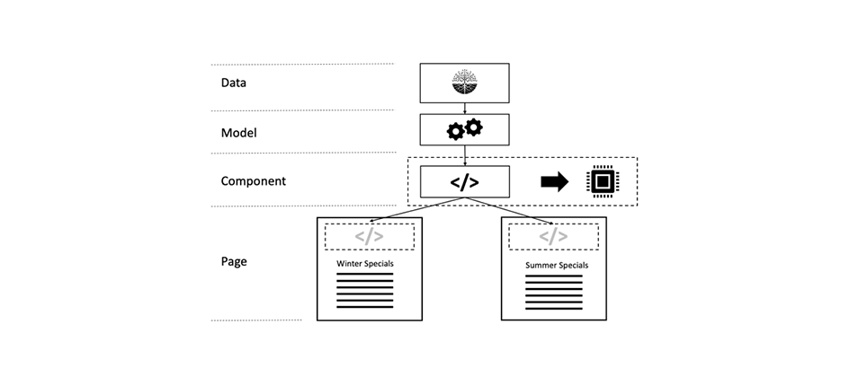

# Hoofdstuk 3 - Geavanceerde onderwerpen in cache

*&quot;Er zijn slechts twee harde dingen in de Wetenschap van de Computer: geheim voorgeheugenongeldigverklaring en het noemen van dingen.&quot;*

— PHIL KARLTON

## Overzicht

Dit is deel 3 van een driedelige serie voor caching in AEM. Waar de eerste twee delen zich richtten op het in cache plaatsen van onbewerkte http in de Dispatcher en welke beperkingen er zijn. In dit deel worden enkele ideeën besproken over hoe deze beperkingen kunnen worden overwonnen.

## Caching in het algemeen

[ Hoofdstuk 1 ](chapter-1.md) en [ Hoofdstuk 2 ](chapter-2.md) van deze reeks concentreerde zich hoofdzakelijk op Dispatcher. We hebben de grondbeginselen, de beperkingen en waar u bepaalde compromissen moet maken uitgelegd.

De complexiteit en complexiteit van caching zijn geen unieke problemen voor de Dispatcher. In cache plaatsen is in het algemeen moeilijk.

De Dispatcher als enige tool in de gereedschapset hebben zou eigenlijk een echte beperking zijn.

In dit hoofdstuk willen wij onze visie op het in cache plaatsen uitbreiden en ideeën ontwikkelen over de manier waarop u een aantal tekortkomingen van de Dispatcher kunt verhelpen. Er is geen zilverbolletje - u zult afwisselingen in uw project moeten maken. Onthoud, dat met caching en ongeldigmaking altijd ingewikkeldheid komt, en met ingewikkeldheid komt er de mogelijkheid van fouten.

U moet op deze gebieden compromissen sluiten,

* Prestaties en latentie
* Resourceverbruik / CPU-belasting / schijfgebruik
* Nauwkeurigheid/valuta/stabiliteit/beveiliging
* Eenvoud/complexiteit/kosten/onderhoudbaarheid/foutgevoeligheid

Deze dimensies zijn met elkaar verbonden in een vrij complex systeem. Er is geen simpel als dat. Een eenvoudiger systeem kan het sneller of langzamer maken. Het kan uw ontwikkelingskosten verlagen, maar de kosten op de helpdesk verhogen, bijvoorbeeld als klanten verouderde inhoud zien of klagen over een trage website. Al deze factoren moeten in overweging worden genomen en tegen elkaar worden afgewogen. Maar nu zou je al een goed idee moeten hebben, dat er geen zilveren bolletje of één &quot;beste praktijk&quot; is - slechts een heleboel slechte praktijken en een paar goede.

## Chained Caching

### Overzicht

#### Gegevensstroom

Het leveren van een pagina van een server aan browser van een cliënt kruist een veelheid van systemen en subsystemen. Als je goed kijkt, is er een aantal hopgegevens nodig die van de bron naar de afvoer moeten gaan, die elk een potentiële kandidaat voor caching zijn.


*stroom van Gegevens van een typische toepassing CMS*

<br> 

Laten we onze reis beginnen met een stuk gegevens die op een vaste schijf staan en die in een browser moeten worden weergegeven.

#### Hardware en besturingssysteem

Ten eerste heeft de harde schijf zelf een ingebouwde cache in de hardware. Ten tweede, het werkende systeem dat de harde schijf installeert, gebruikt vrij geheugen aan geheim voorgeheugen vaak betreden blokken om toegang te versnellen.

#### Content-repository

Het volgende niveau is de CRX of Oak, de documentdatabase die door AEM wordt gebruikt. CRX en Oak verdelen de gegevens in segmenten die in het geheugen kunnen worden opgeslagen om langzamere toegang tot de vaste schijf te voorkomen.

#### Gegevens van derden

De meeste grotere installaties van het Web hebben ook gegevens van derden; gegevens die uit een systeem van de productinformatie, een systeem van het het relatiebeheer van de klant, een erfenisgegevensbestand of een andere willekeurige Webdienst komen. Deze gegevens hoeven niet uit de bron te worden gehaald wanneer dat nodig is - zeker niet wanneer het niet te vaak verandert. Het kan dus in de cache worden geplaatst als het niet wordt gesynchroniseerd in de CRX-database.

#### Bedrijfslaag - app / model

Gewoonlijk wordt de onbewerkte inhoud die afkomstig is van CRX, niet door uw sjabloonscripts weergegeven via de JCR-API. Waarschijnlijk hebt u een bedrijfslaag tussen die gegevens samenvoegen, berekent en/of transformeert in een bedrijfsdomeinobject. Raad eens wat - als deze bewerkingen duur zijn, moet u overwegen ze in cache te plaatsen.

#### Markeringsfragmenten

Het model is nu de basis voor het renderen van de markering voor een component. Waarom zou u het gerenderde model niet ook in de cache plaatsen?

#### Dispatcher, CDN en andere proxy&#39;s

Hiermee gaat u de weergegeven HTML-pagina naar de Dispatcher. We hebben het er al over gehad dat het hoofddoel van de Dispatcher is om HTML-pagina&#39;s en andere webbronnen in cache te plaatsen (ondanks de naam). Voordat de bronnen de browser bereiken, kan het een reverse-proxy (die een cache kan plaatsen en een CDN) doorgeven die ook wordt gebruikt voor het in cache plaatsen. De klant kan in een bureau zitten, dat Webtoegang slechts via een volmacht verleent - en die volmacht zou kunnen besluiten om verkeer in het voorgeheugen onder te brengen eveneens te bewaren.

#### Browsercache

Last but not least: de browser slaat ook in cache op. Dit is een eenvoudig vergeten middel. Maar het is de dichtstbijzijnde en snelste cache die u in de cacheketen hebt. Helaas - het wordt niet tussen gebruikers gedeeld - maar nog steeds tussen verschillende verzoeken van één gebruiker.

### Waar en waarom

Dat is een lange keten van potentiële caches. We hebben allemaal problemen gehad waar we achterhaalde inhoud hebben gezien. Maar rekening houdend met het aantal fasen is het een wonder dat het meestal werkt.

Maar waar in die keten heeft het zin om überhaupt in cache te plaatsen? Aan het begin? Aan het eind? Overal? Het hangt van... en het hangt van een enorm aantal factoren af. Zelfs twee bronnen op dezelfde website zouden een ander antwoord op die vraag willen.

Om u een globaal idee te geven van welke factoren u in overweging zou kunnen nemen,

**Tijd om** te leven - als de voorwerpen een korte inherente levende tijd hebben (verkeersgegevens zouden een kortere levende dan weergegevens kunnen hebben) zou het niet het caching waard kunnen zijn.

**Kosten van de Productie -** hoe duur (in termen van cycli van cpu en I/O) de herproductie en levering van een voorwerp is. Als het goedkoop in cache plaatsen is, is het misschien niet nodig.

**Grootte** - de Grote voorwerpen vereisen meer middelen om in het voorgeheugen onder te brengen. Dat zou een beperkende factor kunnen zijn en moet worden afgewogen tegen het voordeel.

**frequentie van de Toegang** - als de voorwerpen zelden worden betreden, zou caching niet efficiënt kunnen zijn. Ze zouden gewoon verouderd of ongeldig worden gemaakt voordat ze de tweede keer van cache worden benaderd. Dergelijke punten zouden slechts geheugenmiddelen blokkeren.

**Gedeelde toegang** - Gegevens die door meer dan één entiteit worden gebruikt zouden verder omhoog de ketting moeten worden in het voorgeheugen ondergebracht. In feite is de keten van caching geen keten, maar een boom. Eén stukje gegevens in de gegevensopslagruimte kan door meerdere modellen worden gebruikt. Deze modellen kunnen op hun beurt worden gebruikt door meer dan één renderscript om HTML-fragmenten te genereren. Deze fragmenten worden opgenomen in meerdere pagina&#39;s die naar meerdere gebruikers worden gedistribueerd met hun persoonlijke caches in de browser. &quot;delen&quot; betekent dus niet dat alleen mensen, maar ook software met elkaar moeten delen. Als u een potentieel &quot;gedeeld&quot;geheime voorgeheugen wilt vinden, enkel spoor de boom aan de wortel en vinden een gemeenschappelijke voorouder - dat is waar u zou moeten in het voorgeheugen onderbrengen.

**Georuimtelijke distributie** - als uw gebruikers over de wereld worden verdeeld, zou het gebruiken van een verdeeld netwerk van geheime voorgeheugens kunnen helpen latentie verminderen.

**de bandbreedte en de latentie van het Netwerk** - sprekend van latentie, die uw klanten zijn en welk soort netwerk zij gebruiken? Misschien zijn uw klanten mobiele klanten in een onderontwikkeld land die 3G verbinding van oudere generatie smartphones gebruiken? U kunt kleinere objecten maken en deze in cache plaatsen in de browsercache.

Deze lijst is verreweg niet volledig, maar we denken dat u het idee nu krijgt.

### Basisregels voor in cache plaatsen

Opnieuw - caching is moeilijk. Laten we een aantal basisregels delen, die we hebben overgenomen uit eerdere projecten die u kunnen helpen problemen in uw project te voorkomen.

#### Vermijd dubbele caching

Elk van de lagen die in het laatste hoofdstuk zijn geïntroduceerd, biedt een bepaalde waarde in de cacheketen. Of door computercycli te besparen of door gegevens dichter bij de consument te brengen. Het is niet verkeerd om gegevens in meerdere fasen van de keten in de cache op te slaan, maar u moet altijd nadenken over de voordelen en kosten van de volgende fase. Het in cache plaatsen van een volledige pagina in het Publish-systeem levert meestal geen enkel voordeel op, zoals in de Dispatcher al gebeurt.

#### Bezig met mixen van validatiestrategieën

Er zijn drie basisstrategieën voor validatie:

* **TTL, Tijd om te leven:** een voorwerp verloopt na een vaste hoeveelheid tijd (b.v., &quot;2 uren van nu&quot;)
* **Vervaldatum:** het voorwerp verloopt op bepaalde tijd in de toekomst (b.v., &quot;5:00 PM op 10 Juni, 2019&quot;)
* **Gebaseerde Gebeurtenis:** het voorwerp wordt ongeldig gemaakt uitdrukkelijk door een gebeurtenis die in het platform (bijvoorbeeld, wanneer een pagina wordt veranderd en geactiveerd) gebeurde

Nu kunt u verschillende strategieën gebruiken op verschillende cachelagen, maar er zijn een paar &quot;toxische&quot; lagen.

#### Op gebeurtenis gebaseerde validatie


*Zuivere op gebeurtenis gebaseerde ongeldigverklaring: Valideer van het binnengeheime voorgeheugen aan de buitenlaag*

<br> 

Pure, op gebeurtenissen gebaseerde ongeldigmaking is de eenvoudigste om te begrijpen, eenvoudigste om theoretisch correct en nauwkeurigst te worden.

Eenvoudig gesteld, worden de geheime voorgeheugens één voor één ongeldig gemaakt nadat het voorwerp is veranderd.

U hoeft slechts één regel in gedachten te houden:

Valideer altijd van binnenuit aan het buitengeheim voorgeheugen. Als u eerst een buitencache ongeldig hebt gemaakt, wordt de inhoud van een binnencache mogelijk opnieuw in het cachegeheugen opgeslagen. Maak geen veronderstellingen op welk moment een cache opnieuw vers is - zorg ervoor. Het beste, door de ongeldigverklaring van het buitengeheime voorgeheugen _na_ te teweegbrengen ongeldig makend binnen.

Dat is de theorie. Maar in de praktijk is er een aantal gotchas. De gebeurtenissen moeten - potentieel over een netwerk worden verdeeld. In de praktijk maakt dit het moeilijkste invalidatieschema om uit te voeren.

#### Automatisch - retoucheren

Met op gebeurtenis-gebaseerde ongeldigverklaring, zou u een rampenplan moeten hebben. Wat gebeurt er als een validatiegebeurtenis wordt overgeslagen? Een eenvoudige strategie zou kunnen zijn om na een bepaalde hoeveelheid tijd ongeldig te maken of te zuiveren. Dus - je hebt die gebeurtenis misschien gemist en nu ook stale inhoud bedienen. Maar uw objecten hebben ook slechts een impliciete TTL van enkele uren (dagen). Uiteindelijk retourneert het systeem zichzelf.

#### Zuiver op TTL gebaseerde ongeldigverklaring


*Unsynchronized TTL gebaseerde ongeldigverklaring*

<br> 

Dat is ook een heel gangbare regeling. U stapelt meerdere lagen caches, die elk gedurende een bepaalde tijd een object mogen bedienen.

Het is gemakkelijk uit te voeren. Helaas is het moeilijk om de effectieve levensduur van een stuk gegevens te voorspellen.


*Outer geheime voorgeheugen verlengend de levenspanwijdte van een binnenvoorwerp*

<br> 

Bekijk de bovenstaande illustratie. Elke caching laag introduceert TTL van 2 min. Nu - de totale TTL moet ook 2 minuten, toch? Niet helemaal. Als de buitenlaag het object ophaalt vlak voordat het wordt verouderd, verlengt de buitenste laag de effectieve live tijd van het object. De effectieve live tijd kan in dat geval tussen 2 en 4 minuten liggen. Overweeg u met uw bedrijfsafdeling overeenkwam, op één dag is aanvaardbaar - en u hebt vier lagen geheime voorgeheugens. De daadwerkelijke TTL op elke laag moet niet langer zijn dan zes uur... die het geheime voorgeheugen missen-tarief verhogen...

We zeggen niet dat het een slecht plan is. Je zou gewoon zijn grenzen moeten kennen. Het is een mooie en gemakkelijke strategie om mee te beginnen. Alleen als het verkeer van uw site toeneemt, kunt u een nauwkeurigere strategie overwegen.

*het Synchroniseren tijd van de Invalidatie door een specifieke datum* te plaatsen

#### Op vervaldatum gebaseerde ongeldigmaking

U krijgt een voorspelbaarder efficiënte levensduur, als u een specifieke datum op het binnenvoorwerp plaatst en dat aan de buitengeheime voorgeheugens verspreidt.


*synchroniserend vervaldata*

<br> 

Nochtans, kunnen niet alle geheime voorgeheugens de data verspreiden. Het kan vervelend worden, wanneer de buitenste cache twee binnenste objecten samenvoegt met verschillende vervaldatums.

#### Op gebeurtenissen gebaseerde en op TTL gebaseerde validatie mixen


*Mengend op gebeurtenis-gebaseerde en op TTL-Gebaseerde strategieën*

<br> 

Een algemeen schema in de AEM wereld is ook om gebeurtenis gebaseerde ongeldigverklaring bij de binnengeheime voorgeheugens (b.v., in-geheugengeheime voorgeheugens waar de gebeurtenissen in dichtbij real time kunnen worden verwerkt) en op TTL-Gebaseerde geheime voorgeheugens op de buitenkant te gebruiken - waar u misschien geen toegang tot expliciete ongeldigverklaring hebt.

In de AEM wereld zou u een in-geheugengeheime voorgeheugen voor bedrijfsvoorwerpen en de fragmenten van de HTML in de systemen van Publish hebben, die ongeldig wordt gemaakt, wanneer de onderliggende middelen veranderen en u deze veranderingsgebeurtenis aan de dispatcher verspreidt die ook op gebeurtenis-gebaseerd werkt. Voor dat zou u bijvoorbeeld op TTL-Gebaseerde CDN hebben.

Als u een laag van (korte) op TTL gebaseerde caching voor een Dispatcher hebt, kan een piek die gewoonlijk na een auto-ongeldigverklaring zou voorkomen, effectief worden verzacht.

#### Het mengen van TTL - en op gebeurtenis-Gebaseerde Bevestiging


*Toxisch: Het mengen van TTL - en op gebeurtenis-gebaseerde Invalidatie*

<br> 

Deze combinatie is toxisch. Plaats nooit cache op basis van gebeurtenissen en gebeurtenis na een TTL- of op Vervaldatum gebaseerde cache. Herinner dat spill-overeffect dat we hadden in de &quot;puur-TTL&quot;strategie? Hier kan hetzelfde effect worden waargenomen. Alleen dat de gebeurtenis voor ongeldigmaking van de buitenste cache al heeft plaatsgevonden, kan mogelijk niet meer plaatsvinden. Dit kan de levensduur van het object in de cache tot oneindig uitbreiden.


*op TTL-Gebaseerde en op gebeurtenis-gebaseerde gecombineerde: Spill-over aan oneindigheid*

<br> 

## Gedeeltelijke caching en In-Memory Caching

U kunt het werkgebied van het renderingsproces in het cachegeheugen opnemen. Van het krijgen van verre voorwerpen van de gegevensoverdracht of het creëren van lokale bedrijfsvoorwerpen aan caching van de teruggegeven prijsverhoging van één enkele component. We zullen concrete implementaties overlaten aan een latere zelfstudie. Maar misschien ben je van plan om zelf al een paar van deze caching lagen te implementeren. Dus het minste wat we hier kunnen doen is de basisprincipes introduceren - en gotchas.

### Woorden van waarschuwing

#### Toegangsbeheer respecteren

De hier beschreven technieken zijn vrij krachtig en a _moet-hebben_ in toolbox van elke AEM ontwikkelaar. Maar ga niet te enthousiast, gebruik ze verstandig. Door een voorwerp in een geheim voorgeheugen op te slaan en het te delen aan andere gebruikers in follow-upverzoeken betekent eigenlijk het ontwijken van toegangsbeheer. Dit is doorgaans geen probleem op openbare websites, maar wel wanneer een gebruiker zich moet aanmelden voordat toegang kan worden verkregen.

U kunt de HTML-opmaakcodes van het hoofdmenu van een site ook opslaan in een cache in het geheugen om deze op verschillende pagina&#39;s te kunnen delen. In feite is dat een perfect voorbeeld voor het opslaan van gedeeltelijk gerenderde HTML als het creëren van een navigatie gewoonlijk duur aangezien het het oversteken van veel pagina&#39;s vereist.

U deelt niet dezelfde menustructuur tussen alle pagina&#39;s, maar ook met alle gebruikers, waardoor deze nog efficiënter wordt. Maar wacht ... maar misschien zijn er sommige punten in het menu die voor een bepaalde groep gebruikers slechts gereserveerd zijn. In dat geval kan caching een beetje complexer worden.

#### Alleen aangepaste bedrijfsobjecten in cache opslaan

Als er al een advies is - dat is het belangrijkste advies, kunnen we je het volgende geven:

>[!WARNING]
>
>Alleen cacheobjecten die van u zijn, die onveranderlijk zijn, die u zelf hebt gemaakt, die ondiep zijn en geen uitgaande referentie hebben.

Wat betekent dat?

1. Je weet niet wat de bedoelde levenscyclus van objecten van anderen is. Overweeg een verwijzing naar een aanvraagobject en besluit om het in de cache te plaatsen. De aanvraag is nu afgelopen en de servletcontainer wil dat object voor de volgende binnenkomende aanvraag recyclen. In dat geval wijzigt iemand anders de inhoud waarover u dacht dat u exclusieve controle had. Dat moet je niet ontkennen. We hebben iets dergelijks gezien in een project. De klant zag gegevens van andere klanten in plaats van die van de klant.

2. Zolang er naar een object wordt verwezen door een reeks andere referenties, kan het niet uit de heap worden verwijderd. Als u een zogenaamd klein voorwerp in uw geheime voorgeheugen behoudt dat verwijzingen, laten wij zeggen een vertegenwoordiging van 4 MB van een beeld u een goede kans hebt om problemen met het lekken van geheugen te krijgen. De auto&#39;s worden verondersteld gebaseerd te zijn op zwakke verwijzingen. Maar - zwakke verwijzingen werken niet zoals u zou kunnen verwachten. Dat is de absolute beste manier om een geheugenlek te veroorzaken en in een uit-van-geheugen-fout te eindigen. En - je weet niet wat de grootte is van de bewaard gebleven herinnering van de buitenlandse objecten, toch?

3. Met name bij Sling kunt u (bijna) elk object aan elkaar aanpassen. Overweeg een middel in het geheime voorgeheugen. Het volgende verzoek (met verschillende toegangsrechten), haalt die middel en past het in een resourceResolver of een zitting aan om tot andere middelen toegang te hebben die hij geen toegang zou hebben tot.

4. Zelfs als u een dunne &quot;omslag&quot;rond een middel van AEM creeert, moet u niet dat in het voorgeheugen onderbrengen - zelfs als het uw eigen en onveranderlijk is. Het omloopobject zou een referentie zijn (die we eerder hebben verboden) en als we er scherp uitzien, ontstaan er in feite dezelfde problemen als in het laatste item.

5. Als u in cache wilt plaatsen, maakt u uw eigen objecten door primitieve gegevens te kopiëren naar uw eigen onderliggende objecten. U wilt mogelijk een koppeling maken tussen uw eigen objecten via verwijzingen, bijvoorbeeld als u een boomstructuur met objecten in cache wilt plaatsen. Dat is prima - maar alleen cacheobjecten die u net in dezelfde aanvraag hebt gemaakt - en geen objecten die ergens anders zijn aangevraagd (zelfs als het &#39;naam-spatie&#39; van het &#39;jouw&#39; object is). _het Kopiëren voorwerpen_ is de sleutel. En zorg ervoor dat u de volledige structuur van gekoppelde objecten tegelijk leegmaakt en binnenkomende en uitgaande verwijzingen naar uw structuur voorkomt.

6. Ja, en houd uw objecten onveranderlijk. Alleen persoonlijke eigenschappen en geen setters.

Dat zijn veel regels, maar het is de moeite waard om ze te volgen. Zelfs als je ervaren bent, superslim bent en alles onder controle hebt. De jonge collega in uw project is net afgestudeerd aan de universiteit. Hij kent niet al deze valkuilen. Als er geen valkuilen zijn, is er niets te vermijden. Houd het eenvoudig en begrijpelijk.

### Gereedschappen en bibliotheken

Deze reeks gaat over het begrijpen van concepten en het machtigen van u om een architectuur te bouwen die het beste uw gebruiksgeval past.

Wij bevorderen geen enkel instrument in het bijzonder. Maar geef je aanwijzingen hoe je ze moet beoordelen. AEM heeft bijvoorbeeld een eenvoudige ingebouwde cache met een vaste TTL sinds versie 6.0. Zal je het gebruiken? Waarschijnlijk niet bij publiceren waar een op een gebeurtenis gebaseerd geheim voorgeheugen in de ketting (wenk: Dispatcher) volgt. Maar het zou een fatsoenlijke keuze kunnen zijn voor een auteur. Er is ook een geheime voorgeheugen van HTTP door Adobe ACS-bevelen die het overwegen waard zouden kunnen zijn.

Of u bouwt uw die, op een matuur caching kader zoals [ Ehcache ](https://www.ehcache.org) wordt gebaseerd. Dit kan worden gebruikt om voorwerpen van Java en teruggegeven prijsverhoging (`String` voorwerpen) in het voorgeheugen onder te brengen.

In sommige eenvoudige gevallen kunt u het ook gebruiken van gelijktijdige hash maps - u zult hier snel grenzen zien - of in het hulpmiddel of in uw vaardigheden. Gelijktijdige uitvoering is net zo moeilijk te beheersen als naamgeving en caching.

#### Verwijzingen

* [ ACS Commons http Cachegeheugen ](https://adobe-consulting-services.github.io/acs-aem-commons/features/http-cache/index.html)
* [ Ehcache caching kader ](https://www.ehcache.org)

### Basisbegrippen

We zullen hier niet te diep in de theorie in het cachegeheugen gaan zitten, maar we voelen ons verplicht om een paar zoemwoorden te geven, zodat je een goede sprong start hebt.

#### Cache Evicting

We hadden het over ongeldigverklaring en leegmaken. _de uitzetting van het Geheime voorgeheugen_ is verwant met deze termijnen: Na een ingang wordt het weggelaten, is het niet meer beschikbaar. Maar de uitzetting gebeurt niet wanneer een ingang verouderd is, maar wanneer het geheime voorgeheugen volledig is. Nieuwere of &quot;belangrijkere&quot; items drukken oudere of minder belangrijke items uit de cache. Welke vermeldingen u zult moeten opofferen is een geval-tot-geval beslissing. Misschien wilt u de oudste uitzetten of degenen die zeer zelden of langdurig zijn gebruikt.

#### Preemptive Caching

Preemptive Caching betekent het opnieuw creëren van de ingang met nieuwe inhoud op het ogenblik het ongeldig wordt gemaakt of als verouderd wordt beschouwd. Natuurlijk - u zou dat slechts met een paar middelen doen, die u zeker vaak en onmiddellijk worden betreden. Anders verspilt u bronnen bij het maken van cache-items die nooit worden aangevraagd. Door op voorhand cachegegevens te maken, kunt u de latentie van het eerste verzoek tot een resource na de ongeldigmaking van het cachegeheugen verkleinen.

#### Cache Warming

De opwarming van de cache houdt nauw verband met preventieve caching. Alhoewel je die term niet zou gebruiken voor een levend systeem. En het is minder tijd beperkt dan het eerste. U kunt niet onmiddellijk na ongeldigverklaring opnieuw in het voorgeheugen onderbrengen, maar u vult geleidelijk het geheime voorgeheugen wanneer de tijd toestaat.

Neem bijvoorbeeld een Publish/Dispatcher-gedeelte van het taakverdelingsmechanisme om het bij te werken. Voordat u de pagina opnieuw gaat integreren, horizontaal schuift u automatisch door de pagina&#39;s die het vaakst worden geopend, zodat deze weer in de cache worden geplaatst. Als de cache &quot;warm&quot; is, wordt het been weer geïntegreerd in het taakverdelingsmechanisme.

Of misschien herintegreer je het been in één keer, maar je gooit het verkeer naar dat been zodat het de kans heeft om het in de cache op te warmen door regelmatig gebruik.

Of misschien wilt u sommige minder vaak betreden pagina&#39;s in het voorgeheugen onderbrengen in tijden waar uw systeem nutteloos is om latentie te verminderen wanneer zij eigenlijk door echte verzoeken worden betreden.

#### Identiteit van cacheobject, Payload, afhankelijkheid van validatie en TTL

In het algemeen heeft een object in de cache of een &quot;item&quot; vijf belangrijke eigenschappen.

#### Sleutel

Dit is de identiteit is de eigenschap waarmee u het object identificeert. Of om zijn lading terug te winnen of het van het geheime voorgeheugen te ontruimen. De verzender gebruikt bijvoorbeeld de URL van een pagina als sleutel. De verzender gebruikt de paden naar de pagina&#39;s niet. Dit volstaat niet om verschillende renderingen apart te noemen. Andere cache kan verschillende toetsen gebruiken. We zullen later enkele voorbeelden zien.

#### Waarde/Payload

Dat is de schatkist van het object, de gegevens die je wilt ophalen. In het geval van de verzender is het de bestandsinhoud. Maar het kan ook een Java-objectstructuur zijn.

#### TTL

We hebben de GVTO al behandeld. Het tijdstip waarna een vermelding als &#39;stale&#39; wordt beschouwd en niet langer mag worden afgeleverd.

#### Afhankelijkheid

Dit heeft betrekking op op op gebeurtenissen gebaseerde validatie. Welke oorspronkelijke gegevens hangt dat object af? In deel I hebben we al gezegd dat een waarheidsgetrouwe en accurate afhankelijkheidscontrole te complex is. Maar met onze kennis van het systeem kunt u de afhankelijkheden benaderen met een eenvoudiger model. We maken genoeg objecten ongeldig om verouderde inhoud te zuiveren... en misschien onbedoeld meer dan nodig is. Maar toch proberen we onder &quot;alles leegmaken&quot; te blijven.

Welke objecten afhankelijk zijn van wat anderen in elke toepassing echt zijn. We zullen u enkele voorbeelden geven van hoe u later een afhankelijkheidsstrategie kunt implementeren.

### HTML-fragmentcaching



*hergebruikt een teruggegeven fragment op verschillende pagina&#39;s*

<br> 

HTML Fragmentcaching is een krachtig gereedschap. Het idee is om de HTML prijsverhoging in het voorgeheugen onder te brengen die door een component in een in-geheugen-geheime voorgeheugen werd geproduceerd. U vraagt zich misschien af waarom ik dat moet doen. Ik caching toch de prijsverhoging van de hele pagina in de verzender - met inbegrip van de prijsverhoging van die component. Wij zijn het daarmee eens. Dat doe je, maar één keer per pagina. U deelt die markering niet tussen de pagina&#39;s.

Stel dat u een navigatie vóór elke pagina rendert. De markering ziet er op elke pagina hetzelfde uit. Maar u geeft het telkens weer voor elke pagina, dat is niet in de Dispatcher. Vergeet niet dat na automatische ongeldigmaking alle pagina&#39;s opnieuw moeten worden weergegeven. Dus eigenlijk heb je dezelfde code met dezelfde resultaten honderden keren.

Vanuit onze ervaring is het renderen van een geneste topnavigatie een zeer dure taak. Doorgaans doorloopt u een groot deel van de documentstructuur om de navigatie-items te genereren. Zelfs als u alleen de navigatitel en de URL nodig hebt, moeten de pagina&#39;s in het geheugen worden geladen. En hier zijn ze kostbare middelen aan het kappen. Steeds opnieuw.

Maar de component wordt tussen vele pagina&#39;s gedeeld. En het delen van iets is een aanwijzing die een cache gebruikt. Dus - wat u wilt doen is controleren of de navigatiecomponent al is gerenderd en in cache is geplaatst en in plaats van opnieuw te renderen, geeft u alleen de cachewaarde uit.

Er zijn twee wonderlijke leugens van dat plan die makkelijk gemist worden:

1. U plaatst een Java-tekenreeks in cache. Een tekenreeks heeft geen uitgaande verwijzingen en is onveranderlijk. Dus gezien de bovenstaande waarschuwingen is dit superveilig.

2. Ook ongeldigmaking is bijzonder eenvoudig. Wanneer uw website wordt gewijzigd, wilt u deze cachevermelding ongeldig maken. Herbouw is relatief goedkoop, aangezien het slechts eenmaal moet worden uitgevoerd en dan door alle honderden pagina&#39;s opnieuw wordt gebruikt.

Dit is een groot voordeel voor uw Publish-servers.

### Implementatie van fragmentcages

#### Aangepaste tags

In de oude dagen, waar u JSP als malplaatjemotor gebruikte was het vrij gebruikelijk om een douaneJSP markering te gebruiken die rond de componenten teruggeeft code loopt.

```
<!-- Pseudo Code -->

<myapp:cache
  key=' ${info.homePagePath} + ${component.path}'
  cache='main-navigation'
  dependency='${info.homePagePath}'>

… original components code ..

</myapp:cache>
```

De douanetag dan vangt zijn lichaam en schrijft het in het geheime voorgeheugen of verhindert uitvoering van zijn lichaam en output de lading van het geheime voorgeheugen-ingang in plaats daarvan.

De &quot;sleutel&quot;is de componentenweg die het op de homepage zou hebben. We gebruiken het pad van de component op de huidige pagina niet, omdat dit één cacheitem per pagina zou maken. Dat zou in strijd zijn met onze intentie om die component te delen. Wij gebruiken ook niet alleen de componenten relatieve weg (`jcr:conten/mainnavigation`) aangezien dit ons zou verhinderen verschillende navigatiecomponenten in verschillende plaatsen te gebruiken.

&quot;Cache&quot; is een indicator waarin het item wordt opgeslagen. Gewoonlijk hebt u meer dan één cache waarin u items opslaat. Elk van hen gedraagt zich een beetje anders. Het is dus goed om te onderscheiden wat wordt opgeslagen - zelfs als het uiteindelijk alleen maar tekenreeksen zijn.

De &quot;Afhankelijkheid&quot;dit is waar de geheim voorgeheugeningang van afhankelijk is. Het &quot;main-navigation&quot;geheime voorgeheugen zou een regel kunnen hebben, dat als er om het even welke verandering onder de knoop &quot;gebiedsdeel&quot;is, de volgens ingang moet worden leeggemaakt. Zo - uw geheim voorgeheugenimplementatie zou zich als gebeurtenisluisteraar in de bewaarplaats moeten registreren om zich van veranderingen bewust te zijn en dan de geheim voorgeheugenspecifieke regels toe te passen om te weten te komen wat ongeldig moet worden verklaard.

Het bovenstaande was slechts een voorbeeld. U kunt er ook voor kiezen om een boomstructuur met caches te hebben. Wanneer het eerste niveau wordt gebruikt om sites (of huurders) te scheiden en het tweede niveau vertakt het vervolgens naar typen inhoud (bijvoorbeeld &#39;main-navigation&#39;) - dat u zou kunnen besparen bij het toevoegen van het pad naar homepages, zoals in het bovenstaande voorbeeld.

Overigens kunt u deze aanpak ook gebruiken met modernere HTL-componenten. Dan hebt u een JSP-wrapper rondom uw HTML-script.

#### Componentfilters

Maar in een zuivere HTML-benadering zou u liever de fragmentcache maken met een filter voor de afzonderlijke componenten. We hebben dit nog niet in het wild gezien, maar dat is de aanpak die we op dat punt zouden volgen.

#### Dynamisch afspelen opnemen

De fragmentcache wordt gebruikt als u een constante waarde (de navigatie) hebt in een veranderende omgeving (verschillende pagina&#39;s).

Maar u kunt ook het tegenovergestelde hebben, een relatief constante context (een pagina die zelden verandert) en sommige voortdurend veranderende fragmenten op die pagina (bijvoorbeeld, een levende ticker).

In dit geval, zou u [ Verschuivende Dynamische omvat ](https://sling.apache.org/documentation/bundles/dynamic-includes.html) een kans kunnen geven. In wezen is dit een componentfilter, dat om de dynamische component loopt en in plaats van de component te renderen in de pagina die een verwijzing maakt. Deze verwijzing kan een vraag Ajax zijn - zodat de component door browser wordt omvat en zo kan de omringende pagina statisch in het voorgeheugen worden opgenomen. Of - alternatief - het Verkopen Dynamisch omvat kan een richtlijn van SSI (de Server zijomvatten) produceren. Deze instructie wordt uitgevoerd op de Apache-server. U kunt zelfs ESI - de Kant van Edge gebruiken omvat richtlijnen als u Vers of een CDN hefboomwerking die manuscripten ESI steunt.


*Diagram van de Opeenvolging van een Verzoek gebruikend het Verschuiven Dynamisch omvat*

<br> 

In de SDI-documentatie staat dat u caching moet uitschakelen voor URL&#39;s die eindigen op &quot;*.nocache.html&quot;. Dit is logisch - aangezien u werkt met dynamische componenten.

U zou een andere optie kunnen zien hoe te om SDI te gebruiken: Als u _niet_ het verzendingsgeheime voorgeheugen voor omvat onbruikbaar maakt, handelt Dispatcher als fragment-geheim voorgeheugen gelijkend op dat wij in het laatste hoofdstuk beschreven: De pagina&#39;s en componentenfragmenten worden gelijkelijk en onafhankelijk in het voorgeheugen ondergebracht in de verzender en samen vastgemaakt door het manuscript SSI in de server van Apache wanneer de pagina wordt gevraagd. Zo kunt u gedeelde componenten zoals de hoofdnavigatie implementeren (op voorwaarde dat u altijd dezelfde component-URL gebruikt).

Dat moet in theorie werken. Maar...

We raden u aan dat niet te doen: u verliest dan de mogelijkheid om het cachegeheugen voor de echte dynamische componenten te omzeilen. SDI wordt globaal gevormd en de veranderingen u voor uw &quot;arm-mans-fragment-geheime voorgeheugen&quot;zou ook op de dynamische componenten van toepassing zijn.

We raden u aan de SDI-documentatie zorgvuldig te bestuderen. Er zijn nog een paar beperkingen, maar SDI is in sommige gevallen een waardevol instrument.

#### Verwijzingen

* [ docs.oracle.com - hoe te om de markeringen van douaneJSP ](https://docs.oracle.com/cd/E11035_01/wls100/taglib/quickstart.html) te schrijven
* [ Dominik Süß - Creërend en gebruikend componentenfilters ](https://www.slideshare.net/connectwebex/prsentation-dominik-suess)
* [ sling.apache.org - het Verkopen Dynamische omvat ](https://sling.apache.org/documentation/bundles/dynamic-includes.html)
* [ helpx.adobe.com - Vestiging het Verdelen van Dynamische Omvat in AEM ](https://helpx.adobe.com/experience-manager/kt/platform-repository/using/sling-dynamic-include-technical-video-setup.html)


#### Model in cache plaatsen


*Model gebaseerd caching: Één bedrijfsvoorwerp met twee verschillende teruggaven*

<br> 

Laten we de zaak opnieuw bekijken met de navigatie. We gingen ervan uit dat elke pagina dezelfde markering van de navigatie zou vereisen.

Maar misschien is dat niet het geval. U zou verschillende prijsverhoging voor het punt in de navigatie kunnen willen teruggeven die de _huidige pagina_ vertegenwoordigt.

```
Travel Destinations

<ul class="maninnav">
  <li class="currentPage">Travel Destinations
    <ul>
      <li>Finland
      <li>Canada
      <li>Norway
    </ul>
  <li>News
  <li>About us
<ul>
```

```
News

<ul class="maninnav">
  <li>Travel Destinations
  <li class="currentPage">News
    <ul>
      <li>Winter is coming>
      <li>Calm down in the wild
    </ul>
  <li>About us
<is
```

Dit zijn twee totaal verschillende renderingen. Toch nog, is het _bedrijfsvoorwerp_ - de volledige navigatieboom - het zelfde.  Het _bedrijfsvoorwerp_ zou hier een objecten grafiek zijn die de knopen in de boom vertegenwoordigen. Deze grafiek kan gemakkelijk in een in-geheugengeheime voorgeheugen worden opgeslagen. Deze grafiek mag echter geen objecten bevatten of verwijzen naar objecten die u niet zelf hebt gemaakt, vooral nu JCR-knooppunten.

#### In cache plaatsen in de browser

We hebben het belang van caching in de browser al aangestipt en er zijn veel goede zelfstudies beschikbaar. Uiteindelijk - voor de browser - is de Dispatcher slechts een webserver die het HTTP-protocol volgt.

Ondanks de theorie hebben we echter enige kennis vergaard die we nergens anders hebben gevonden en die we willen delen.

In wezen kan caching van browsers op twee verschillende manieren worden gebruikt,

1. De browser heeft een resource in de cache waarvan de exacte vervaldatum bekend is. In dat geval wordt de bron niet opnieuw aangevraagd.

2. De browser heeft een bron, maar het is niet zeker of deze nog geldig is. In dat geval vraagt het de webserver (in ons geval de Dispatcher). Geef me de bron als deze is gewijzigd sinds u deze voor het laatst hebt geleverd. Als dit niet is gewijzigd, antwoordt de server met &quot;304 - niet gewijzigd&quot; en werden alleen de metagegevens verzonden.

#### Foutopsporing

Als u uw Dispatcher-instellingen optimaliseert voor het in cache plaatsen van browsers, is het bijzonder handig om een proxyserver voor desktops te gebruiken tussen uw browser en de webserver. We verkiezen &#39;Charles Web Debugging Proxy&#39; van Karl von Randow.

Met Charles kunt u de aanvragen en reacties lezen, die van en naar de server worden verzonden. En - je kunt veel leren over het HTTP-protocol. Moderne browsers bieden ook enkele mogelijkheden voor foutopsporing, maar de functies van een desktopproxy hebben geen precedent. U kunt de overgedragen gegevens manipuleren, de overdracht vertragen, enkele aanvragen opnieuw afspelen en nog veel meer. En de gebruikersinterface is duidelijk gerangschikt en volledig.

De eenvoudigste test is om de website te gebruiken als een normale gebruiker - met de proxy ertussenin - en de proxy in te checken als het aantal statische aanvragen (naar /etc/...) in de loop van de tijd kleiner wordt - aangezien deze in de cache moeten staan en niet langer hoeven te worden aangevraagd.

Wij vonden, zou een volmacht een duidelijker overzicht kunnen geven, aangezien het caching verzoek niet in het logboek verschijnt terwijl sommige browser-ingebouwde debuggers nog deze verzoeken met &quot;0 ms&quot;of &quot;van schijf&quot;tonen. Dat is prima en accuraat, maar het kan je weergave wat bederven.

U kunt dan boor-neer en de kopballen van de overgebrachte dossiers controleren om, bijvoorbeeld, te zien of &quot;verloopt&quot;http de kopballen correct zijn. U kunt verzoeken met als gewijzigd-sinds kopballen herhalen die worden geplaatst om te zien of antwoordt de server correct met 304 of 200 reactiecode. U kunt de timing van asynchrone vraag waarnemen en u kunt uw veiligheidsveronderstellingen aan een bepaalde graad ook testen. Weet je nog dat je hebt gezegd dat je niet alle kiezers accepteert die niet expliciet worden verwacht? Hier kunt u met URL en de parameters spelen en zien of werkt uw toepassing goed.

Er is slechts één ding wij u vragen niet te doen, wanneer u uw geheime voorgeheugen zuivert:

Laad geen pagina&#39;s opnieuw in de browser!

Een &quot;browser herladen&quot;, a _eenvoudig-herladen_ evenals a _gedwongen-herladen_ (&quot;_verschuiving-herladen_&quot;) is niet het zelfde als een normaal paginaverzoek. Met een eenvoudige aanvraag voor opnieuw laden wordt een header ingesteld

```
Cache-Control: max-age=0
```

En een Shift-Opnieuw laden (terwijl u Shift ingedrukt houdt terwijl u op de knop Opnieuw laden klikt) stelt doorgaans een aanvraagkoptekst in

```
Cache-Control: no-cache
```

Beide kopballen hebben gelijkaardige maar lichtjes verschillende gevolgen - maar het belangrijkste, verschillen zij volledig van een normaal verzoek wanneer u een URL van de groef URL opent of door verbindingen op de plaats te gebruiken. Bij normaal bladeren worden de headers voor Cache-control niet ingesteld, maar waarschijnlijk een if-modified-since header.

Zo, als u het normale het doorbladeren gedrag wilt zuiveren, zou u precies dat moeten doen: _doorbladert normaal_. Het gebruiken van de herladingsknoop van uw browser is de beste manier om de fouten van de geheim voorgeheugenconfiguratie in uw configuratie niet te zien.

Gebruik je Charles Proxy om te zien waar we het over hebben. Ja - en terwijl u het open hebt - kunt u de verzoeken daar opnieuw afspelen. U hoeft de browser niet opnieuw te laden.

## Prestatietesten

Door een proxy te gebruiken, krijgt u een idee van de timing van uw pagina&#39;s. Natuurlijk is dat verreweg geen prestatietest.  Een prestatietest zou een aantal cliënten vereisen die uw pagina&#39;s parallel vragen.

Een algemene fout, die we al te vaak hebben gezien, is dat de prestatietest slechts een superklein aantal pagina&#39;s bevat en dat deze pagina&#39;s alleen worden geleverd via de Dispatcher-cache.

Als u uw toepassing naar het actieve systeem promoot, verschilt de belasting volledig van wat u hebt getest.

Op het actieve systeem is het toegangspatroon niet het kleine aantal gelijkmatig verdeelde pagina&#39;s dat u in tests hebt (homepage en weinig inhoudspagina&#39;s). Het aantal pagina&#39;s is veel groter en de aanvragen zijn zeer ongelijk verdeeld. En - natuurlijk - de levende pagina&#39;s kunnen niet 100% van geheim voorgeheugen worden gediend: Er zijn verzoeken van het systeem van Publish om ongeldigverklaring die een groot deel van uw kostbare middelen auto-ongeldig maken.

Ah ja - en wanneer u uw Dispatcher cache herbouwt, zult u erachter komen dat het Publish-systeem zich ook heel anders gedraagt, afhankelijk van het feit of u slechts een paar pagina&#39;s vraagt - of een groter aantal. Zelfs als alle pagina&#39;s even complex zijn - hun aantal speelt een rol. Herinner je wat we zeiden over ketting caching? Als u altijd om hetzelfde kleine aantal pagina&#39;s vraagt, is de kans groot dat de blokken met de onbewerkte gegevens zich in de cache van de harde schijf bevinden of dat de blokken door het besturingssysteem in de cache worden opgeslagen. Er is ook een goede kans dat de Repository het volgens segment in het hoofdgeheugen in de cache heeft geplaatst. Het renderen gaat dus veel sneller dan wanneer andere pagina&#39;s elkaar nu en dan uit verschillende cache hadden uitgezet.

Caching is moeilijk, en ook het testen van een systeem dat op caching baseert. Wat kan je doen om een nauwkeuriger real-life scenario te hebben?

Wij denken dat u meer dan één test zou moeten uitvoeren, en u zou meer dan één prestatiesindex als maat van de kwaliteit van uw oplossing moeten verstrekken.

Als u al een bestaande website hebt, meet dan het aantal verzoeken en de manier waarop deze worden verspreid. Probeer een test te modelleren die een gelijkaardige distributie van verzoeken gebruikt. Het toevoegen van enige willekeur kon geen pijn doen. U moet geen browser simuleren die statische middelen zoals JS en CSS zou laden - die niet echt van belang zijn. Ze worden uiteindelijk in de browser of in de Dispatcher in cache geplaatst en ze worden niet noemenswaardig geladen. Maar afbeeldingen waarnaar wordt verwezen, zijn belangrijk. Vind hun distributie in oude logboekdossiers evenals model een gelijkaardig verzoekpatroon.

Voer nu een test uit waarbij je Dispatcher helemaal niet in cache plaatst. Dat is uw slechtst denkbare scenario. Kom te weten bij welke piekbelasting uw systeem onder deze ergste omstandigheden instabiel wordt. Je kunt het ook erger maken door een paar Dispatcher/Publish benen uit te nemen, als je dat wilt.

Voer vervolgens dezelfde test uit met alle vereiste cache-instellingen naar &quot;on&quot;. Maak uw parallelle aanvragen langzaam op om het cachegeheugen op te warmen en zie hoeveel uw systeem onder deze optimale omstandigheden kan innemen.

Een gemiddeld casescenario zou zijn om de test met toegelaten Dispatcher maar ook met sommige invalidaties uit te voeren. U kunt dat simuleren door de statfiles met een cronjob aan te raken of door de verzoeken tot ongeldigmaking met onregelmatige intervallen naar de Dispatcher te verzenden. Vergeet niet om ook een aantal van de niet automatisch ongeldig gemaakte middelen nu en dan te zuiveren.

U kunt het laatste scenario variëren door de verzoeken tot ongeldigmaking te verhogen en de lading te verhogen.

Dat is iets complexer dan een lineaire belastingstest - maar geeft veel meer vertrouwen in uw oplossing.

Je kan je afschuw maken van de inspanning. Maar in ieder geval een test uitvoeren op het slechtst denkbare geval op het Publish-systeem met een groter aantal pagina&#39;s (gelijkelijk verdeeld) om de grenzen van het systeem te zien. Zorg ervoor dat u het aantal van de beste scenario&#39;s correct interpreteert en dat u uw systemen voldoende ruimte biedt.
