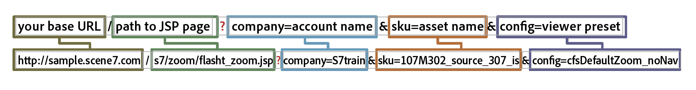

# Inleiding tot basissjablonen {#basic-templates}

In Dynamic Media Classic termen is een sjabloon een document dat dynamisch via de URL kan worden gewijzigd nadat de sjabloon is gepubliceerd. Dynamic Media Classic biedt Basic Templates, op afbeeldingen gebaseerde sjablonen die worden aangeroepen vanaf de Image Server en die bestaan uit afbeeldingen en gerenderde tekst.

Één van het krachtigste aspect van malplaatjes is dat zij directe integratiepunten hebben die u hen aan uw gegevensbestand laten binden. Zo kunt u niet alleen een beeld dienen en het resize, u uw gegevensbestand vragen om nieuwe of verkoop punten te vinden en die als bekleding op het beeld te maken verschijnen. U kunt om een beschrijving van het punt vragen en maken dat als etiket in een doopvont verschijnt u kiest en lay-out. De mogelijkheden zijn onbeperkt.

Basissjablonen kunnen op verschillende manieren worden geïmplementeerd, van eenvoudig tot complex. Bijvoorbeeld:

- Basishandel. Hiermee gebruikt u labels als &#39;gratis verzending&#39; als dat product gratis verzending heeft. Deze labels worden ingesteld door het productteam in Photoshop en het web gebruikt logica om te weten wanneer ze op de afbeelding worden toegepast.
- Geavanceerde merchandising. Elke sjabloon heeft meerdere variabelen en kan meerdere opties tegelijk weergeven. Gebruikt een gegevensbestand, inventaris en bedrijfsregels om te bepalen wanneer om een product als &quot;enkel binnen&quot;, op &quot;Opruiming,&quot;of &quot;Verkocht uit te tonen.&quot; Ook kan transparantie achter het product worden gebruikt om het op verschillende achtergronden, zoals in verschillende ruimten, te tonen. Dezelfde sjablonen en/of middelen kunnen op de pagina met productdetails worden hergebruikt om een grotere of zoombare versie van hetzelfde product op verschillende achtergronden weer te geven.

Het is belangrijk om te begrijpen dat Dynamic Media Classic slechts het visuele gedeelte van deze op malplaatjes-gebaseerde toepassingen verstrekt. De Klassieke bedrijven van Dynamic Media of hun integratiepartners moeten de bedrijfsregels, het gegevensbestand, en ontwikkelingsvaardigheden leveren om de toepassingen tot stand te brengen. Er is geen &quot;ingebouwde&quot;malplaatjetoepassing; ontwerpers stellen de sjabloon in in Dynamic Media Classic en ontwikkelaars gebruiken URL-aanroepen om de variabelen in de sjabloon te wijzigen.

Aan het einde van deze sectie van de zelfstudie leert u hoe u het volgende kunt doen:

- Upload een Photoshop PSD naar Dynamic Media Classic om deze als basis voor een sjabloon te gebruiken.
- Maak een eenvoudige merchandising Basic-sjabloon die bestaat uit afbeeldingslagen.
- Voeg tekstlagen toe en maak hen veranderlijk door het gebruik van parameters.
- Hiermee maakt u een sjabloon-URL en bewerkt u de afbeelding dynamisch via de webbrowser.

>[!NOTE]
>
>Alle URL&#39;s in dit hoofdstuk dienen slechts ter illustratie; het zijn geen live links .

## Overzicht van basissjablonen

De definitie van een basissjabloon (of alleen &quot;sjabloon,&quot; voor kort) is een URL-adresseerbare gelaagde afbeelding. Het eindresultaat is een afbeelding, maar deze kan worden gewijzigd door de URL. Deze kan bestaan uit foto&#39;s, tekst of afbeeldingen — elke combinatie van P-TIFF-elementen in Dynamic Media Classic.

Sjablonen lijken veel op Photoshop PSD-bestanden, omdat ze een vergelijkbare workflow en vergelijkbare mogelijkheden hebben.

- Beide bestaan uit lagen die lijken op bladen van gestapeld acetaat. U kunt gedeeltelijk transparante afbeeldingen samenstellen en door de transparante gebieden van een laag naar de onderliggende lagen kijken.
- De lagen kunnen worden verplaatst en geroteerd om de inhoud te verplaatsen en de dekkings- en overvloeimodi kunnen worden gewijzigd om de inhoud gedeeltelijk transparant te maken.
- U kunt op tekst gebaseerde lagen maken. De kwaliteit kan zeer hoog zijn omdat de server van het Beeld de zelfde tekstmotor zoals Photoshop en Illustrator gebruikt.
- U kunt eenvoudige laagstijlen op elke laag toepassen om speciale effecten te maken, zoals slagschaduwen of gloed.

In tegenstelling tot Photoshop PSD&#39;s kunnen lagen echter volledig dynamisch zijn en worden beheerd via een URL op de Image Server.

- U kunt variabelen aan alle malplaatjeeigenschappen toevoegen, die het gemakkelijk maken om zijn samenstelling te veranderen op de vlucht.
- Met variabelen die parameters worden genoemd, kunt u alleen het deel van de sjabloon dat u wilt wijzigen, zichtbaar maken.

U hoeft alleen een tijdelijke aanduiding toe te voegen voor elke laag die varieert in plaats van alle lagen in één bestand te plaatsen, zoals in Photoshop, en ze weer te geven en te verbergen (maar dat kunt u desgewenst ook doen).

Met behulp van een plaatsaanduiding kunt u de inhoud van een laag dynamisch omwisselen met een ander gepubliceerd element. De laag krijgt automatisch dezelfde eigenschappen (zoals grootte en rotatie) van de laag die is vervangen.

Omdat de BasisMalplaatjes typisch in Photoshop worden ontworpen maar via een URL worden opgesteld, vereist een malplaatjeproject een mengeling van zowel ontwerp als technische vaardigheden. Over het algemeen gaan we ervan uit dat de persoon die het creatieve sjabloonwerk doet, een Photoshop-ontwerper is en dat de persoon die de sjabloon implementeert een webontwikkelaar is. De creatieve en ontwikkelingsteams moeten nauw samenwerken om de sjabloon succesvol te laten zijn.

De projecten van het malplaatje kunnen vrij eenvoudig of uiterst complex afhankelijk van de bedrijfsregels en de behoeften van de toepassing zijn. De basis Malplaatjes worden geroepen van de Server van het Beeld, echter wegens de flexibiliteit van het Klassieke milieu van Dynamic Media, kunt u malplaatjes binnen andere malplaatjes zelfs nesten, toestaand u om vrij complexe beelden tot stand te brengen die door algemeen genoemde variabelen kunnen worden verbonden.

- Meer informatie over [Sjabloonbeginselen](https://experienceleague.adobe.com/docs/dynamic-media-classic/using/template-basics/quick-start-template-basics.html).
- Leer hoe u een [Standaardsjabloon](https://experienceleague.adobe.com/docs/dynamic-media-classic/using/template-basics/creating-template.html#creating_a_template) maakt.

## Een basissjabloon maken

Wanneer u werkt met een standaardsjabloon, volgt u gewoonlijk de workflowstappen in het onderstaande diagram. Stappen gemarkeerd met stippellijnen zijn optioneel als u dynamische tekstlagen gebruikt en worden in de onderstaande instructies aangegeven als &quot;Tekstworkflow&quot;. Als u geen tekst gebruikt, volgt u alleen het hoofdpad.

_De basisworkflow voor sjablonen._

1. Ontwerp en maak uw elementen. De meeste gebruikers doen dit in Adobe Photoshop. Elementen ontwerpen op het exacte formaat dat u nodig hebt — als het een afbeelding van 200 pixels voor een miniatuurpagina betreft, moet u deze ontwerpen op 200 pixels. Als u erop moet inzoomen, ontwerpt u het bestand met een grootte van ongeveer 2000 pixels. Gebruik Photoshop (en/of Illustrator die als bitmap is opgeslagen) om de elementen te maken en gebruik Dynamic Media Classic om de onderdelen samen te stellen, de lagen te beheren en variabelen toe te voegen.
2. Na het ontwerpen van grafische elementen uploadt u deze naar Dynamic Media Classic. In plaats van afzonderlijke elementen van de PSD te uploaden, raden we u aan om uw volledige gelaagde PSD-bestand te uploaden en Dynamic Media Classic een bestand per laag te laten maken met de optie **Lagen behouden** tijdens het uploaden (zie hieronder voor meer informatie.) _Tekstworkflow: Als u dynamische tekst maakt, moet u ook de lettertypen uploaden. Dynamische tekst is variabel en wordt bestuurd via de URL. Als de tekst statisch is of slechts een paar korte zinnen bevat die niet veranderen, bijvoorbeeld tags met de tekst &#39;Nieuw&#39; of &#39;Verkoop&#39; in plaats van &#39;X% uit&#39;, waarbij de X een variabel getal is, raden we aan de tekst vooraf te renderen in Photoshop en te uploaden als gerasterde lagen als afbeeldingen. Het wordt eenvoudiger en u kunt de tekst precies zo opmaken als u wilt._
3. Bouw het Malplaatje in de Klassiek van Dynamic Media gebruikend de redacteur van de Grondbeginselen van het Malplaatje van het menu van de Bouwstijl en voeg beeldlagen toe. Tekstworkflow: Maak tekstlagen in dezelfde editor. Deze stap is vereist wanneer u handmatig een sjabloon maakt in Dynamic Media Classic. Kies een canvasgrootte die overeenkomt met uw ontwerp, sleep en zet afbeeldingen neer op het canvas en stel laageigenschappen in (grootte, rotatie, dekking, enz.). U plaatst niet elke mogelijke laag op uw sjabloon, maar slechts één plaatsaanduiding per afbeeldingslaag. _Tekstworkflow: U maakt tekstlagen met het gereedschap Tekst, net als bij het maken van tekstlagen in Photoshop. U kunt een lettertype kiezen en het opmaken met dezelfde opties die beschikbaar zijn met het gereedschap Photoshop-tekst._ Een andere workflow is om een PSD te uploaden en Dynamic Media Classic een &quot;gratis&quot; sjabloon te laten genereren en zelfs tekstlagen opnieuw te maken. Dit zal later nader worden besproken.
4. Nadat de lagen zijn gemaakt, voegt u parameters (variabelen) toe aan elke eigenschap van een laag die u via de URL wilt besturen, inclusief de bron van de laag (de afbeelding zelf). _Tekstworkflow: U kunt ook parameters toevoegen aan tekstlagen, zowel om de inhoud van de tekst en de grootte en positie van de laag zelf te bepalen, als alle opmaakopties zoals lettertypekleur, tekengrootte, horizontale tekstspatiëring, enzovoort._
5. Maak een voorinstelling voor afbeeldingen die overeenkomt met de grootte van de sjabloon. We raden u aan dit te doen, zodat de sjabloon altijd wordt aangeroepen met een grootte van 1:1 en om verscherping toe te voegen aan alle grote afbeeldingslagen waarvan de grootte wordt aangepast aan de sjabloon. Als u een sjabloon maakt waarop moet worden ingezoomd, is deze stap overbodig.
6. Publiceer, kopieer de URL van de klassieke voorvertoning van Dynamic Media en test deze in een browser.

## Uw sjabloonmiddelen voorbereiden en uploaden naar Dynamic Media Classic

Voordat u de sjabloonelementen uploadt naar Dynamic Media Classic, moet u een aantal voorbereidende stappen uitvoeren.

### De PSD voorbereiden voor uploaden

Voordat u uw Photoshop-bestand uploadt naar Dynamic Media Classic, vereenvoudigt u de lagen in Photoshop, zodat u gemakkelijker kunt werken met de Image Server en deze zo compatibel mogelijk zijn. Het PSD-bestand bestaat vaak uit veel elementen die Dynamic Media Classic niet herkent en u krijgt wellicht ook veel kleine onderdelen die moeilijk te beheren zijn. Sla een back-up van de master PSD op voor het geval u het origineel later moet bewerken. U uploadt de vereenvoudigde kopie en niet de master.

1. Vereenvoudig de laagstructuur door gerelateerde lagen die moeten worden in- of uitgeschakeld samen te voegen/af te vlakken tot één laag. Het label &#39;NEW&#39; en de blauwe banner worden bijvoorbeeld samengevoegd tot één laag, zodat u deze kunt tonen of verbergen met één klik.
   
2. Sommige laagtypen en laageffecten worden niet ondersteund door Dynamic Media Classic of de Image Server en moeten voorafgaand aan het uploaden worden omgezet in pixels. Anders worden de effecten mogelijk genegeerd of worden de lagen verwijderd. Als u een laag rastert, wordt deze omgezet van bewerkbaar in niet-bewerkbaar. Als u laageffecten of tekstlagen wilt omzetten in pixels, maakt u een lege laag, selecteert u beide lagen en voegt u ze samen met **Lagen > Lagen samenvoegen** of CTRL + E/CMD + E.

   - Dynamic Media Classic kan lagen niet groeperen of koppelen. Alle lagen in een groep of gekoppelde set worden omgezet in afzonderlijke lagen die niet meer zijn gegroepeerd of gekoppeld.
   - Laagmaskers worden tijdens het uploaden omgezet in transparantie.
   - Aanpassingslagen worden niet ondersteund en worden genegeerd.
   - Opvullagen, zoals lagen met effen kleuren, worden gerasterd.
   - Lagen met slimme objecten en vectorlagen worden tijdens het uploaden omgezet in normale afbeeldingen en slimme filters worden toegepast en gerasterd.
   - Tekstlagen worden ook gerasterd, tenzij u de optie Tekst extraheren gebruikt. Zie hieronder voor meer informatie.
   - De meeste laageffecten worden genegeerd en slechts een paar overvloeimodi worden ondersteund. In geval van twijfel voegt u eenvoudige effecten toe in Dynamic Media Classic (zoals binnen- of slagschaduwen, binnen- of buitengloed) of gebruikt u een lege laag om het effect in Photoshop samen te voegen en om te zetten in pixels.

### Werken met lettertypen

Als u dynamische tekst wilt genereren, uploadt en publiceert u uw lettertypen. Het enige lettertype dat bij Dynamic Media Classic wordt geleverd, is Arial.

Het is de verantwoordelijkheid van elk bedrijf om een licentie te verkrijgen voor het gebruik van een lettertype op het web. Als een lettertype alleen op uw computer is geïnstalleerd, hebt u niet het recht om het lettertype commercieel te gebruiken op het web. Uw bedrijf kan juridische stappen ondernemen bij de uitgever van het lettertype als het lettertype zonder toestemming wordt gebruikt. Bovendien variëren de licentievoorwaarden. Wellicht hebt u aparte licenties voor bijvoorbeeld afdrukken en schermweergave nodig.

Dynamic Media Classic biedt ondersteuning voor standaard OpenType- (OTF), TrueType- (TTF) en Type 1 Postscript-lettertypen. Alleen Mac-lettertypen, bestanden met tekstverzamelingen, Windows-systeemlettertypen en eigen machinefettertypen (zoals lettertypen die worden gebruikt door graving- of borduurmachines) worden niet ondersteund. U moet ze converteren naar een van de standaardlettertypen of een vergelijkbaar lettertype vervangen voor gebruik in Dynamic Media Classic en op de Image Server.

Nadat de doopvonten aan de Klassiek van Dynamic Media, zoals om het even welk ander middel worden geupload, moeten zij ook aan de Server van het Beeld worden gepubliceerd. Een veel voorkomende sjabloonfout is het publiceren van lettertypen te vergeten. Dit leidt tot een afbeeldingsfout. Een ander lettertype wordt dan niet vervangen door de afbeeldingsserver. Als u bovendien de optie **Tekst uitpakken** wilt gebruiken bij het uploaden, moet u de lettertypebestanden uploaden voordat u de PSD-versie uploaden die deze lettertypen gebruikt. Met de functie **Tekst extraheren** wordt geprobeerd uw tekst opnieuw te maken als een bewerkbare tekstlaag en deze in een klassieke Dynamic Media-sjabloon te plaatsen. Dit wordt besproken in het volgende onderwerp, Opties PSD.

Houd er rekening mee dat lettertypen meerdere interne namen hebben die vaak afwijken van hun externe bestandsnaam. Alle verschillende namen worden weergegeven op de pagina Details voor dat element in Dynamic Media Classic. Hier volgen de namen van het lettertype Adobe Caslon Pro Semibold, dat op het tabblad Metagegevens in Dynamic Media Classic wordt weergegeven:

_Het tabblad Metagegevens op de pagina Details voor een lettertype in Dynamic Media Classic._

Dynamic Media Classic gebruikt de bestandsnaam van dit lettertype (ACaslonPro-Semibold) als de Asset-id, maar dat is niet de naam die in de sjabloon wordt gebruikt. De sjabloon gebruikt de RTF-naam (Rich Text Format), die onderaan wordt weergegeven. RTF is de inheemse &quot;taal&quot;van de de tekstmotor van de Server van het Beeld.

Als u lettertypen moet wijzigen via de URL, moet u de RTF-naam van het lettertype aanroepen (niet de ID van het element), anders krijgt u een fout. In dit geval is de juiste naam voor dit lettertype &quot;Adobe Caslon Pro&quot;. Hieronder bespreken we meer over lettertypen en RTF in het onderwerp-RTF en Tekstparameters.

De meest gebruikte indelingen voor lettertypebestanden op Windows- en Mac-systemen zijn OpenType en TrueType. OpenType heeft een uitbreiding .OTF, terwijl TrueType .TTF is. Beide indelingen werken even goed in Dynamic Media Classic.

### Opties selecteren bij het uploaden van uw PSD

U hoeft geen Photoshop-bestand (PSD) te uploaden om een sjabloon te maken; Een sjabloon kan worden samengesteld uit alle afbeeldingselementen in Dynamic Media Classic. Het uploaden van een PSD kan het ontwerpen echter eenvoudiger maken, omdat deze elementen doorgaans al in een gelaagde PSD staan. Bovendien genereert Dynamic Media Classic automatisch een sjabloon wanneer u een gelaagde PSD uploadt.

- **Lagen behouden.** Dit is de belangrijkste optie. Zo kan Dynamic Media Classic één afbeeldingselement per Photoshop-laag maken. Als deze optie is uitgeschakeld, worden alle andere opties uitgeschakeld en wordt de PSD tot één afbeelding samengevoegd.
- **** **CreateTemplate.** Met deze optie maakt u de verschillende gegenereerde lagen en maakt u automatisch een sjabloon door deze te combineren. Een nadeel van het gebruik van de automatisch gegenereerde sjabloon is dat in Dynamic Media Classic alle lagen in één bestand worden geplaatst, terwijl er slechts één plaatsaanduiding per laag nodig is. Het is gemakkelijk genoeg om de extra lagen te schrappen, maar als u vele lagen hebt, is het sneller om hen opnieuw te creëren. Zorg ervoor dat u de naam van de nieuwe sjabloon wijzigt. Als u dat niet doet, wordt het de volgende keer dat u dezelfde PSD opnieuw uploadt, overschreven.
- **Tekst extraheren.** Hiermee worden tekstlagen in het PSD-bestand opnieuw gemaakt als tekstlagen in de sjabloon met het lettertype dat u hebt geüpload. Deze stap is vereist als de tekst zich op een pad in Photoshop bevindt en u dat pad in de sjabloon wilt behouden. Voor deze functie moet u de optie **Sjabloon maken** gebruiken, aangezien de geëxtraheerde tekst alleen kan worden gemaakt met een sjabloon die tijdens het uploaden wordt gegenereerd.
- **Lagen uitbreiden naar achtergrondgrootte.** Met deze instelling wordt elke laag even groot als het algehele PSD-canvas. Dit is erg handig voor lagen die altijd op dezelfde positie blijven staan: anders moet u de afbeelding mogelijk verplaatsen wanneer u deze in dezelfde laag plaatst.
- **Laagnaam.** Dit vertelt Dynamic Media Classic hoe u elk element dat per laag wordt gegenereerd een naam geeft. Wij adviseren of **Photoshop** **en Laag** **Naam** of Photoshop en **Laag** **Aantal**. Bij beide opties wordt de PSD-naam gebruikt als het eerste deel van de naam en wordt aan het einde de naam of het nummer van de laag toegevoegd. Als u bijvoorbeeld een PSD met de naam &quot;shirt.psd&quot; hebt en lagen met de naam &quot;front&quot;, &quot;sleeves&quot; en &quot;collar&quot; hebt, als u uploadt met de optie **Photoshop en** Laag **Naam**, genereert Dynamic Media Classic de element-id&#39;s &quot;shirt_front&quot;, &quot;shirt_sleeves&quot; en &quot;shirt_collar .&quot; Als u een van deze opties gebruikt, weet u zeker dat de naam uniek is in Dynamic Media Classic.

## Een sjabloon maken met afbeeldingslagen

Hoewel Dynamic Media Classic automatisch een sjabloon kan maken op basis van een gelaagde PSD, moet u weten hoe u de sjabloon handmatig kunt maken. Zoals hierboven beschreven, zijn er bepaalde tijden wanneer u niet het malplaatje wilt gebruiken dat door Dynamic Media Classic wordt gecreeerd.

### De interface Sjabloonbasisbeginselen

Laten we eerst vertrouwd raken met de bewerkingsinterface.

In het linkermidden ziet u in uw werkgebied een voorbeeld van de uiteindelijke sjabloon. Rechts ziet u de deelvensters Lagen en Laageigenschappen. Op deze gebieden zult u het meeste werk doen.

_De pagina Grondbeginselen van sjablonen samenstellen._

- **Voorbeeld-/werkgebied.** Dit is het hoofdvenster. Hier kunt u lagen verplaatsen, vergroten, verkleinen en roteren met de muis. Laagcontouren worden weergegeven als onderbroken lijnen.
- **Lagen.** Dit is vergelijkbaar met het deelvenster Lagen van Photoshop. Als u lagen toevoegt aan de sjabloon, worden deze hier weergegeven. Lagen worden van boven naar beneden gestapeld. De bovenste laag in het deelvenster Lagen wordt boven de andere lagen eronder in de lijst weergegeven.
- **Laageigenschappen.** Hier kunt u alle eigenschappen van een laag aanpassen met numerieke besturingselementen. Selecteer eerst een laag en pas vervolgens de eigenschappen ervan aan.
- **** **CompositeURL.** Onder aan de interface bevindt zich het samengestelde URL-gebied. Dit zal niet in deze sectie van het leerprogramma worden besproken, nochtans hier zult u uw malplaatje die als reeks Beeld zien Server URL bepalingen wordt gedeconstrueerd. Dit gebied is editable — als u met de bevelen van de Server van het Beeld zeer vertrouwd bent kunt u het malplaatje hier manueel uitgeven. U kunt het echter ook breken. Net als Photoshop begint de laagnummering bij 0. Het canvas is laag 0 en de eerste laag die u zelf toevoegt, is laag 1. Overvloeimodi bepalen hoe pixels in een laag overvloeien in pixels eronder. Met overvloeimodi kunt u allerlei speciale effecten maken.

#### De Sjabloonbasiseditor gebruiken

Hier volgen de workflowstappen waarmee u uw Basic-sjabloon kunt starten:

1. Ga in Dynamic Media Classic naar **Build > Sjabloonbasisbeginselen**. U kunt niets hebben geselecteerd, of door een beeld te selecteren, dat de eerste laag van uw malplaatje zal worden.
2. Kies een Grootte en druk **OK**. Deze grootte moet overeenkomen met de grootte die u in Photoshop hebt ontworpen. De sjablooneditor wordt geladen.
3. Als u in stap 1 geen afbeelding hebt geselecteerd, zoekt u naar een afbeelding in het middelenpaneel links en sleept u deze naar het werkgebied.

   - De grootte van de afbeelding wordt automatisch aangepast aan de grootte van het canvas. Als u afbeeldingen met een hoge resolutie wilt omwisselen, brengt u doorgaans een van uw grote (2000 px) P-TIFF-afbeeldingen naar een andere afbeelding en gebruikt u deze als plaatsaanduiding.
   - Dit moet de onderste laag van de sjabloon zijn, maar u kunt de lagen later opnieuw ordenen.

4. Wijzig de grootte of de positie van de laag rechtstreeks in het werkgebied of door de instellingen in het deelvenster Laageigenschappen aan te passen.
5. Sleep indien nodig in extra afbeeldingslagen. Voeg desgewenst ook laageffecten toe. Zie het onderwerp _Toevoegend de Gevolgen van de Laag_, hieronder.
6. Klik **Opslaan**, kies een locatie en geef de sjabloon een naam. U kunt een voorvertoning weergeven, maar de sjabloon ziet er nu precies zo uit als een afgevlakte Photoshop-afbeelding. De sjabloon kan nog niet worden gewijzigd.

### Laageffecten toevoegen

De server van het Beeld steunt een paar programmatic laageffecten — speciale gevolgen die de verschijning van de inhoud van een laag veranderen. Ze werken op dezelfde manier als laageffecten in Photoshop. Ze zijn gekoppeld aan een laag, maar worden onafhankelijk van de laag beheerd. U kunt deze aanpassen of verwijderen zonder dat u de laag zelf permanent wijzigt.

- **Slagschaduw**. Hiermee past u een schaduw toe buiten de grenzen van de laag, gepositioneerd door een x- en y-pixelverschuiving.
- **Schaduw** binnen. Hiermee past u binnen de grenzen van de laag een schaduw toe, geplaatst door een x- en y-pixelverschuiving.
- **Gloed** buiten. Hiermee past u een gloedeffect gelijkmatig toe rond alle randen van de laag.
- **Gloed** binnen. Hiermee past u een gloedeffect gelijkmatig toe binnen alle randen van de laag.

_Een laag met en zonder slagschaduw_

Als u een effect wilt toevoegen, klikt u op **Effect toevoegen** en kiest u een effect in het menu. Net als normale lagen kunt u een effect selecteren in het deelvenster Lagen en de instellingen van het effect aanpassen in het deelvenster Laageigenschappen.

Schaduweffecten worden horizontaal of verticaal buiten de laag verschoven, terwijl de gloedeffecten in alle richtingen gelijkmatig worden toegepast. De binneneffecten worden toegepast op de dekkende gedeelten van de laag, terwijl de buiteneffecten alleen van toepassing zijn op de transparante gebieden.

Meer informatie over[Laageffecten toevoegen](https://experienceleague.adobe.com/docs/dynamic-media-classic/using/template-basics/creating-template.html#using-shadow-and-glow-effects-on-layers).

### Parameters toevoegen

Als u alleen lagen combineert en opslaat, is het nettoresultaat niet anders dan een afgevlakte Photoshop-afbeelding. Wat sjablonen speciaal maakt, is de mogelijkheid om parameters toe te voegen aan de eigenschappen van elke laag, zodat deze dynamisch kunnen worden gewijzigd via de URL.

In klassieke Dynamic Media-termen is een parameter een variabele die kan worden gekoppeld aan een sjablooneigenschap zodat deze via een URL kan worden gemanipuleerd. Wanneer u een parameter aan een laag toevoegt, stelt Dynamic Media Classic die eigenschap in URL bloot door de naam van uw parameter met een dollarteken ($) voor te maken - bijvoorbeeld, als u een parameter genoemd &quot;grootte&quot;creeert om de grootte van een laag te veranderen, zal Dynamic Media Classic uw parameter $size anders noemen.

Als u geen parameter voor een eigenschap toevoegt, blijft die eigenschap verborgen in de klassieke Dynamic Media-database en wordt deze niet weergegeven in de URL.

Zonder parameters zouden uw URL&#39;s doorgaans veel langer zijn, vooral als u ook dynamische tekst gebruikt. Tekst voegt vele tientallen extra karakters aan elke URL toe.

Tot slot wordt uw eerste set parameters de standaardwaarden van eigenschappen in de sjabloon. Als u uw malplaatje bouwt, parameters toevoegt, en dan URL zonder zijn parameters roept, zal de Server van het Beeld het beeld met alle gebreken tot stand brengen u in het malplaatje bewaarde. Parameters zijn alleen nodig als u een eigenschap wilt wijzigen. Als een eigenschap niet hoeft te worden gewijzigd, hoeft u geen parameter in te stellen.

#### Parameters maken

Dit is de workflow voor het maken van parameters:

1. Klik op de knop **Parameters** naast de naam van de laag waarvoor u parameters wilt maken. Het scherm Parameters wordt geopend. Elke eigenschap op de laag en de waarde ervan worden weergegeven.
1. Selecteer de optie **Op** naast de naam van elke eigenschap die u in een parameter wilt maken. Er wordt een standaardparameternaam weergegeven. U kunt alleen parameters toevoegen aan eigenschappen die zijn gewijzigd ten opzichte van de standaardstatus.

   - Bijvoorbeeld, als u een laag toevoegt en het bij zijn standaardvolmachtspositie van 0.0 houdt, zal de Klassiek van Dynamic Media geen **Positie** bezit blootstellen. Verplaats de laag ten minste één pixel om deze te corrigeren. Nu zal Dynamic Media Classic **Position** als bezit blootstellen u parameters kunt bepalen.
   - Als u een parameter wilt toevoegen aan de eigenschap show/hide (waarmee de laag wordt in- en uitgeschakeld), klikt u op het pictogram **Show** of **Hide Layer** om de laag uit te schakelen (u kunt de laag desgewenst achteraf weer inschakelen). Dynamic Media Classic stelt nu een eigenschap **Hide** beschikbaar die kan worden geparameterized.

1. Wijzig de naam van de standaardparameternamen in iets dat u gemakkelijker kunt herkennen in de URL. Als u bijvoorbeeld een parameter wilt toevoegen om de bannerlaag vóór een afbeelding te wijzigen, wijzigt u de standaardnaam van &quot;layer_2_src&quot; in &quot;banner&quot;.
1. Druk **Close** om het scherm van Parameters weg te gaan.
1. Herhaal dit proces voor andere lagen door op de knop **Parameters** te klikken en parameters toe te voegen en een andere naam te geven.
1. Sla uw wijzigingen op als u klaar bent.

>[!TIP]
>
>Wijzig de naam van de parameters in een betekenisvolle naam en ontwikkel een naamgevingsconventie om die namen te standaardiseren. Zorg ervoor dat zowel de ontwerp- als de ontwikkelingsteams vooraf overeenstemming hebben bereikt over de naamgevingsconventie.
>
>Kan geen parameter toevoegen omdat u het bezit niet ziet? Verander enkel het bezit van de laag van zijn gebrek (door zich te bewegen, resizing, te verbergen, enz.). Nu moet u die eigenschap zichtbaar maken.

Meer informatie over [Sjabloonparameters](https://experienceleague.adobe.com/docs/dynamic-media-classic/using/template-basics/creating-template-parameters.html).

## Een sjabloon maken met tekstlagen

Nu leert u hoe u een standaardsjabloon maakt die tekstlagen bevat.

### Dynamische tekst

U weet nu hoe u een standaardsjabloon kunt maken met behulp van afbeeldingslagen. Voor veel toepassingen is dit alles wat u nodig hebt. Zoals u tijdens de vorige oefening hebt gezien, kunnen lagen met eenvoudige tekst (zoals &quot;Schaal&quot; en &quot;Nieuw&quot;) worden gerasterd en als afbeeldingen worden behandeld omdat de tekst ervan niet hoeft te worden gewijzigd.

Maar wat als u nodig hebt:

- Voeg een label toe als &quot;25% uit&quot;, waarbij de waarde van 25% variabel is
- Voeg een tekstlabel met de naam van het product toe boven op de afbeelding
- Lagen lokaliseren in verschillende talen, afhankelijk van het land waarin uw sjabloon wordt weergegeven

In dat geval wilt u enkele dynamische tekstlagen met parameters toevoegen om de tekst en/of opmaak te bepalen.

Als u tekst wilt maken, moet u een aantal lettertypen uploaden. Anders wordt in Dynamic Media Classic Arial standaard ingesteld. De lettertypen moeten ook naar de afbeeldingsserver worden gepubliceerd, anders wordt er een fout gegenereerd wanneer wordt geprobeerd tekst met dat lettertype te renderen.

### RTF- en tekstparameters

Als u variabelen aan tekst wilt toevoegen met het gereedschap Sjabloonbasisbeginselen, moet u weten hoe tekst wordt gerenderd. De server van het Beeld produceert tekst gebruikend de Motor van de Tekst van de Adobe, de zelfde motor die door Photoshop en Illustrator wordt gebruikt, en samenstelt het als laag in het definitieve beeld. Om met de motor te communiceren, gebruikt de Server van het Beeld Rich Text Format, of RTF.

RTF is een bestandsindelingspecificatie die door Microsoft is ontwikkeld voor het opgeven van de opmaak van documenten. Het is een standaardopmaaktaal die door de meeste tekstverwerkings- en e-mailsoftware wordt gebruikt. Als u in een URL &amp;text= \ b1 Hello schreef, zou de Server van het Beeld een beeld met het woord &quot;Hello&quot;in gewaagde tekst produceren, omdat \ b1 het bevel RTF voor het maken van de tekst gewaagd is.

Het goede nieuws is dat Dynamic Media Classic de RTF voor je genereert. Wanneer u tekst in een sjabloon typt en opmaak toevoegt, schrijft Dynamic Media Classic de RTF-code automatisch naar de sjabloon. De reden dat wij het vermelden is omdat u parameters direct aan RTF zelf zult toevoegen, zodat is het belangrijk dat u er een beetje vertrouwd mee bent.

#### Tekstlagen maken

U kunt tekstlagen in een sjabloon in Dynamic Media Classic op de volgende twee manieren maken:

1. Tekstgereedschap in Dynamic Media Classic. Deze methode wordt hieronder besproken. De redacteur van de Grondbeginselen van het Malplaatje heeft een hulpmiddel dat u een tekstvakje laat creëren, tekst ingaan en de tekst formatteren. Dynamic Media Classic genereert de RTF zo nodig en plaatst deze in een aparte laag.
2. Tekst uitnemen (bij uploaden). De andere methode is om de tekstlaag te maken in Photoshop en deze op te slaan in de PSD als een normale tekstlaag (in plaats van deze als een afbeeldingslaag te rasteren). Vervolgens uploadt u het bestand naar Dynamic Media Classic en gebruikt u de optie **Tekst extraheren**. Met RTF-opdrachten zet Dynamic Media Classic elke Photoshop-tekstlaag om in een afbeeldingsserver. Als u deze methode gebruikt, moet u eerst uw lettertypen uploaden naar Dynamic Media Classic. Als dit niet het geval is, vervangt Dynamic Media Classic tijdens het uploaden een standaardlettertype en is er geen eenvoudige manier om het juiste lettertype opnieuw te vervangen.

### De Teksteditor

U voert tekst in met de Teksteditor. De Teksteditor is een WYSIWYG-interface waarmee u tekst kunt invoeren en opmaken met behulp van opmaakbesturingselementen die lijken op die in Photoshop of Illustrator.

_Sjabloonbasis teksteditor._

U zult het grootste deel van uw werk op **Voorproef** lusje doen, dat u toestaat om tekst in te gaan en het te zien getoond aangezien het in het malplaatje zal kijken. Er is ook een **tabblad Bron**, dat zo nodig wordt gebruikt om de RTF handmatig te bewerken.

De algemene workflow bestaat uit het gebruik van het tabblad **Voorvertoning** om tekst te typen.

Vervolgens selecteert u de tekst en kiest u een bepaalde opmaak, zoals lettertypekleur, tekengrootte of uitvulling met de besturingselementen bovenaan. Nadat de tekst op de gewenste manier is vormgegeven, klikt u op **Toepassen** om deze bij te werken in de voorvertoning van het werkgebied. Vervolgens sluit u de Teksteditor om terug te keren naar het hoofdvenster Sjabloonbasisbeginselen.

#### De Teksteditor gebruiken

Hier volgen de workflowstappen voor het toevoegen van tekst binnen de bouwstijlpagina Sjabloonbasis:

1. Klik op de knop **Tekst** boven aan de pagina voor samenstellen.
2. Sleep een tekstvak waar u tekst wilt weergeven. Het venster Teksteditor wordt geopend in een modaal venster. Op de achtergrond wordt de sjabloon weergegeven, maar deze kan pas worden bewerkt nadat de tekst is bewerkt.
3. Typ de voorbeeldtekst die u wilt weergeven wanneer de sjabloon voor het eerst wordt geladen. Als u bijvoorbeeld een tekstvak maakt voor een gepersonaliseerde e-mailafbeelding, staat in de tekst mogelijk &quot;Hi Name&quot;. Nu is het tijd om op te slaan!&quot; Later zou u een tekstparameter toevoegen om Naam met een waarde te vervangen u op URL verzendt. Uw tekst zal niet in het malplaatje onder het venster verschijnen tot u **Apply** klikt.
4. Als u de tekst wilt opmaken, selecteert u de tekst door deze met de muis te slepen en kiest u een opmaakbesturingselement in de gebruikersinterface.

   - Er zijn veel opmaakopties. Enkele van de meest voorkomende zijn lettertypen (gezicht), tekengrootte en lettertypekleur, en uitvulling links/midden/rechts.
   - Vergeet niet eerst de tekst te selecteren. Anders kunt u geen opmaak toepassen.
   - Als u een ander lettertype wilt kiezen, selecteert u de tekst en opent u het menu Lettertype. In de editor wordt een lijst weergegeven met alle lettertypen die naar Dynamic Media Classic zijn geüpload. Als een lettertype ook op uw computer is geïnstalleerd, wordt het in zwart weergegeven. Als het niet op uw computer wordt geïnstalleerd, zal het in rood tonen. Nochtans, zal het nog in het voorproefvenster teruggeven wanneer u **Apply** klikt. U hoeft alleen lettertypen te uploaden naar Dynamic Media Classic om ze beschikbaar te maken voor iedereen die Dynamic Media Classic gebruikt. Nadat u de afbeelding hebt gepubliceerd, gebruikt de Image Server deze lettertypen om de tekst te genereren. Uw gebruikers hoeven geen lettertypen te installeren om de tekst te zien die u maakt, omdat deze deel uitmaakt van een afbeelding.
   - In tegenstelling tot Photoshop en Illustrator, kan de server van het Beeld uw tekst verticaal in het tekstvakje richten. De standaardinstelling is uitlijning boven. Als u dit wilt wijzigen, selecteert u de tekst en kiest u **Midden** of **Onder** in het menu **Verticale uitlijning**.
   - Als u de tekst te groot maakt voor het vak (of als het tekstvak te klein is), wordt de tekst geheel of gedeeltelijk bijgesneden en verdwijnt de tekst. Verklein de tekengrootte of maak het vak groter.

5. Klik **Toepassen** om te zien dat uw wijzigingen van kracht worden in het venster van het werkgebied. U moet **Apply** klikken, anders zult u uw uitgeeft verliezen.
6. Als u klaar bent, klikt u op **Close**. Als u wilt terugkeren naar de bewerkingsmodus, dubbelklikt u op de tekstlaag om de Teksteditor opnieuw te openen.

In de teksteditor ziet u precies hoe groot het lettertype is als het lettertype lokaal op uw systeem is geïnstalleerd.

### Informatie over het toevoegen van parameters aan tekstlagen

We volgen nu een vergelijkbaar proces voor het toevoegen van tekstparameters als voor laagparameters. De lagen van de tekst kunnen laagparameters voor grootte, positie, etc. ook nemen; ze kunnen echter extra parameters nemen waarmee u een willekeurig aspect van de RTF kunt beheren.

In tegenstelling tot laagparameters selecteert u alleen de waarde die u wilt wijzigen en voegt u er een parameter aan toe in plaats van een parameter aan de gehele eigenschap toe te voegen.

Voorbeeld-RTF:

Wanneer het onderzoeken van RTF, moet u uitzoeken waar elke het plaatsen is dat u wilt veranderen. In de RTF hierboven, zou wat van het kunnen zinvol zijn en u kunt zien waar het formatteren uit komt.

Je kunt de uitdrukking Chocolate Mint Sandal zien — dat is de tekst zelf.

- Er is een verwijzing naar de font Poor Richard. Hier worden lettertypen geselecteerd.
- U ziet een RGB-waarde: \red56\green53\blue4 — dit is de tekstkleur.
- Hoewel de tekengrootte 20 is, ziet u het getal 20 niet. U ziet echter wel een opdracht \fs40 — om een of andere oneven reden meet RTF lettertypen als halve punten. \fs40 is dus de tekengrootte!

U hebt genoeg informatie om uw parameters tot stand te brengen, nochtans is er een volledige verwijzing van alle RTF bevelen in de documentatie van de Serving van het Beeld. Bezoek de [Documentatie voor afbeeldingsserver](https://experienceleague.adobe.com/docs/dynamic-media-developer-resources/image-serving-api/image-serving-api/http-protocol-reference/text-formatting/c-text-formatting.html#concept-0d3136db7f6f49668274541cd4b6364c).

#### Parameters toevoegen aan tekstlagen

Hier volgen de stappen voor het toevoegen van parameters aan tekstlagen.

1. Klik op de knop **Parameters** (een &quot;P&quot;) naast de naam van de tekstlaag waarvoor u parameters wilt maken. Het scherm Parameters wordt geopend. Het **Gemeenschappelijke** lusje maakt een lijst van elk bezit op de laag en zijn waarde. Hier kunt u standaardlaagparameters toevoegen.
1. Klik op de **tab Text**. Hier ziet u de RTF bovenaan. de parameters die u toevoegt, bevinden zich onder die parameters.
1. Als u een parameter wilt toevoegen, markeert u eerst de waarde die u wilt wijzigen en klikt u op de knop **Parameter toevoegen**. Zorg ervoor dat u alleen de waarden voor opdrachten selecteert en niet de volledige opdracht zelf. Als u bijvoorbeeld een parameter voor de lettertypenaam wilt instellen in het voorbeeld-RTF hierboven, markeer ik alleen &#39;Poor Richard&#39; en voeg er een parameter aan toe, maar niet ook &#39;\f0&#39;. Wanneer u **Parameter toevoegen** klikt, zal het in de lijst hieronder verschijnen, en de parameterwaarde zal in rood in RTF verschijnen terwijl het nog wordt geselecteerd. Als u een parameter moet verwijderen, klik checkbox naast **On** om die parameter uit te zetten, en het zal verdwijnen.
1. Klik om de naam van de parameter te wijzigen in een betekenisvollere naam.
1. Wanneer u klaar bent, wordt uw RTF groen gemarkeerd waar de parameters bestaan en worden de namen en waarden van de parameters hieronder vermeld.
1. Klik **Close** om het scherm van Parameters weg te gaan. Druk vervolgens op **Opslaan** om de sjabloon op te slaan. Als u klaar bent met bewerken, drukt u op **Close** om de pagina Sjabloongrondbeginselen te sluiten.
1. Klik **Voorvertoning** om uw sjabloon te testen in Dynamic Media Classic. Als u de tekstparameters wilt testen, typt u nieuwe tekst of waarden in het voorvertoningsvenster. Als u het lettertype wilt wijzigen, moet u de exacte RTF-naam van het lettertype invoeren.

>[!TIP]
>
>Als u parameters wilt toevoegen aan de tekstkleur, voegt u afzonderlijk parameters voor rood, groen en blauw toe. Als de RTF bijvoorbeeld `\red56\green53\blue46` is, voegt u afzonderlijke parameters rood, groen en blauw toe voor de waarden 56, 53 en 46. In URL, zou u de kleur veranderen door alle drie te roepen: `&$red=56&$green=53&$blue=46`.

Leer hoe u [Dynamische tekstparameters maken](https://experienceleague.adobe.com/docs/dynamic-media-classic/using/template-basics/creating-template-parameters.html#creating-dynamic-text-parameters).

## Sjabloon-URL&#39;s publiceren en maken

### Een voorinstelling voor afbeeldingen maken

Het maken van een voorinstelling voor uw sjabloon is geen vereiste stap. We raden het aan als aanbevolen werkwijze, zodat de sjabloon altijd wordt aangeroepen met een grootte van 1:1 en ook verscherping wordt toegevoegd aan grote afbeeldingslagen waarvan de grootte wordt aangepast aan de sjabloon. Als u een afbeelding aanroept zonder een voorinstelling, kan de afbeeldingsserver de standaardgrootte van de afbeelding willekeurig wijzigen (ongeveer 400 pixels) en wordt de standaardverscherping niet toegepast.

Er is niets bijzonders aan een Voorinstelling voor afbeelding voor een sjabloon. Als u al een voorinstelling hebt voor een statische afbeelding van dezelfde grootte, kunt u deze gebruiken.

### Publicatie

U zult moeten in werking stellen publiceert om uw veranderingen te zien die levend aan de Server van het Beeld worden gebracht. Houd rekening met wat u moet publiceren: de verschillende lagen met afbeeldingselementen, de lettertypen voor dynamische tekst en de sjabloon zelf. Net als bij andere klassieke Dynamic Media-media-elementen met veel media, zoals Afbeeldingssets en Draaisets, is een standaardsjabloon een kunstmatige constructie. Het is een regelitem in de database dat verwijst naar de afbeeldingen en fonts met behulp van een reeks opdrachten in de afbeeldingsservice. Zo wanneer u het malplaatje publiceert, allen u doet bijwerkt gegevens over de Server van het Beeld.

Meer informatie over [Uw sjabloon publiceren](https://experienceleague.adobe.com/docs/dynamic-media-classic/using/template-basics/publishing-templates.html).

### Sjabloon-URL-constructie

Een basissjabloon heeft dezelfde essentiële URL-syntaxis als een normale afbeeldingsaanroep, zoals eerder uitgelegd. Een sjabloon bevat meestal meer wijzigingstoetsen, opdrachten die worden gescheiden door een en-teken (&amp;), zoals parameters met waarden. Het belangrijkste verschil is echter dat u de sjabloon aanroept als de hoofdafbeelding in plaats van een statische afbeelding aan te roepen.

In tegenstelling tot voorinstellingen voor afbeeldingen, die aan elke zijde van de naam van de voorinstelling een dollarteken ($) hebben, hebben parameters aan het begin een dollarteken. De plaatsing van die dollartekens is belangrijk.

**Correct:**

`$text=46-inch LCD HDTV`

**Incorrect:**

`$text$=46-inch LCD HDTV`

`$text=46-inch LCD HDTV$`

`text=46-inch LCD HDTV`

Zoals eerder vermeld, worden parameters gebruikt om het malplaatje te veranderen. Als u het malplaatje zonder parameters roept, zal het terugkeren naar zijn standaardmontages zoals ontworpen in het auteursgereedschap van de Grondbeginselen van het Malplaatje. Als een eigenschap niet hoeft te worden gewijzigd, hoeft u geen parameter in te stellen.

_imageExamples van een sjabloon zonder parameters (boven) in te stellen en met parameters (onder)._
