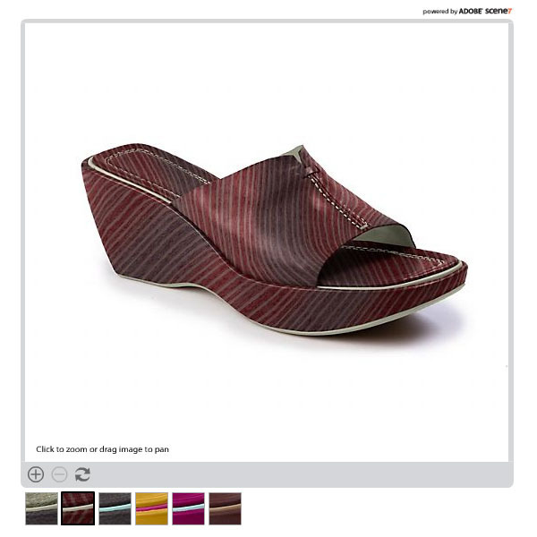
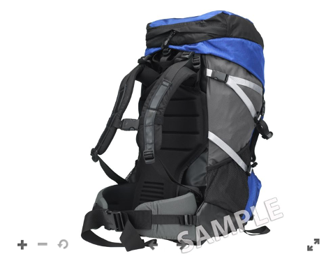

# Afbeeldings-, staal-, centrifuge- en gemengde-mediasets {#media-sets}

Dynamische Media Classic-verzamelingen die verder gaan dan enkele afbeeldingen en die u wilt gebruiken voor dynamisch vergroten of verkleinen, zorgen voor een rijkere online ervaring. In dit gedeelte van de zelfstudie wordt uitgelegd hoe u de volgende rijke mediasets kunt maken in Dynamic Media Classic:

- Afbeeldingsset
- Staalset
- Set draaien
- Gemengde mediaset

Er wordt ook uitgelegd hoe u Voorinstellingen batchset kunt gebruiken om het maken van sets te automatiseren via een upload.

## Alles wat u altijd over sets wilde weten

Naast het standaard dynamische aanpassen van grootte en zoomen zijn sets waarschijnlijk het meest gebruikte Dynamic Media Classic-subproduct. Sets zijn in wezen &quot;virtuele&quot; elementen die geen werkelijke afbeeldingen bevatten, maar bestaan uit een reeks relaties met andere afbeeldingen en/of video. De belangrijkste aantrekkingskracht van sets is dat het mini-toepassingen zijn die klaar zijn &quot;van de plank.&quot; Door dat betekenen wij dat elke vastgestelde kijker zijn eigen logica en interface bevat zodat u slechts moet doen is vraag aan hen op de plaats. Bovendien vereisen ze alleen dat u één id voor middelen per set bijhoudt, in plaats van dat u zelf alle elementen en relaties van de leden moet beheren.

Wanneer u een set maakt, wordt die set beheerd als een afzonderlijk element dat moet worden gemarkeerd voor publiceren en gepubliceerd voordat deze via een URL kan worden verzonden. Alle activa van zijn leden moeten ook worden gepubliceerd.

### Typen sets

Meer informatie over de vier typen sets die u kunt maken in Dynamic Media Classic: Afbeeldings-, staal-, centrifuge- en gemengde-mediasets.

## Afbeeldingsset

Dit is het meest voorkomende type set. Doorgaans gebruikt u deze voor alternatieve weergaven van hetzelfde item. Het bestaat uit meerdere afbeeldingen die u in de viewer laadt door op de bijbehorende miniatuur van die afbeelding te klikken.

_Voorbeeld van een afbeeldingsset_

De URL voor de bovenstaande afbeeldingsset kan er als volgt uitzien:

- Leer meer over de Reeksen van het Beeld met het Snelle Begin aan de Reeksen van het Beeld.
- Leer hoe u een afbeeldingsset [maakt](https://docs.adobe.com/content/help/en/dynamic-media-classic/using/image-sets/creating-image-set.html#creating-an-image-set).

### Staalset

Dit type set wordt doorgaans gebruikt om gekleurde weergaven van hetzelfde item weer te geven. Deze bestaat uit afbeeldingsparen en kleurenstalen.

Het belangrijkste verschil tussen een staal en een afbeeldingsset is dat stalensets een andere afbeelding gebruiken als een klikbaar staal, terwijl in Afbeeldingssets een miniatuurversie van de oorspronkelijke afbeelding wordt gebruikt waarop kan worden geklikt.

In stalensets worden afbeeldingen niet ingekleurd (een veel voorkomende misvatting). De afbeeldingen worden gewoon omgewisseld, net als in een Afbeeldingsset. De ministaalafbeeldingen hadden met Photoshop kunnen worden gemaakt, elke kleur had afzonderlijk kunnen worden gefotografeerd of het gereedschap Uitsnijden in Dynamic Media Classic had kunnen worden gebruikt om een staal te maken van een van de gekleurde afbeeldingen.

_Voorbeeld van een stalenset_

De URL voor de bovenstaande stalenset kan er als volgt uitzien:

- Meer informatie over staalsets vindt u in Staalsets [Snel starten naar stalensets](https://docs.adobe.com/content/help/en/dynamic-media-classic/using/swatch-sets/quick-start-swatch-sets.html).
- Leer hoe u een stalenset [maakt](https://docs.adobe.com/content/help/en/dynamic-media-classic/using/swatch-sets/creating-swatch-set.html#creating-a-swatch-set).

### Set draaien

Deze set wordt doorgaans gebruikt om een weergave van 360 graden van een item weer te geven. Net als Staalsets gebruiken centrifuges geen 3D-magie. Het echte werk is om veel foto&#39;s van een afbeelding van alle kanten te maken. Met de viewer kunt u eenvoudig schakelen tussen de afbeeldingen als een stop-motion-animatie.

Draaiingsets kunnen in één richting draaien langs één as of, indien ze afwisselend worden gemaakt als 2D-reeks, draaien op meerdere assen. Een auto kan bijvoorbeeld worden gedraaid terwijl alle wielen op de grond staan en vervolgens ook op de achterwielen worden &quot;gedraaid&quot;. Voor een correct ingestelde 2D-reeks voor draaien moet het aantal afbeeldingen per rij voor elke as gelijk zijn. Met andere woorden, als u op twee assen draait, hebt u twee keer zoveel afbeeldingen nodig als één hoek draaien.

_Voorbeeld van een centrifugeerset_

De URL voor de bovenstaande centrifugeset kan er als volgt uitzien:

- Meer informatie over centrifuges vindt u in het dialoogvenster [Snel aan de slag gaan met centrifuges](https://docs.adobe.com/content/help/en/dynamic-media-classic/using/spin-sets/quick-start-spin-sets.html).
- Leer hoe u een [centrifugeset](https://docs.adobe.com/content/help/en/dynamic-media-classic/using/spin-sets/creating-spin-set.html#creating-a-spin-set)maakt.

## Gemengde mediaset

Dit is een combinatieset. Hiermee kunt u alle vorige sets combineren en video toevoegen in één viewer. In dit werkschema, creeert u om het even welke componentenreeksen eerst, en verenigt hen dan samen in een Gemengde Reeks van Media.

_Voorbeeld van een gemengde mediaset_

De URL voor de bovenstaande gemengde mediaset kan er als volgt uitzien:

- Meer informatie over gemengde Mediasets met het [Snel starten naar gemengde mediasets](https://docs.adobe.com/content/help/en/dynamic-media-classic/using/mixed-media-sets/quick-start-mixed-media-sets.html).

- Leer hoe u een gemengde mediaset [maakt](https://docs.adobe.com/content/help/en/dynamic-media-classic/using/mixed-media-sets/creating-mixed-media-set.html#creating-a-mixed-media-set).

Als u een afbeelding wilt weergeven voor zoomen, een set of een video op uw website, roept u deze aan in een Dynamic Media Classic &#39;viewer&#39;. Dynamic Media Classic bevat viewers voor rich-media-elementen, zoals stalensets, centrifugesets, video en vele andere.

Meer informatie over [Viewers voor AEM Assets en Dynamic Media Classic](https://docs.adobe.com/content/help/en/dynamic-media-developer-resources/library/viewers-aem-assets-dmc/c-html5-s7-aem-asset-viewers.html).

## Voorinstellingen batchset

Tot nu toe hebben wij besproken hoe te om reeksen manueel te bouwen gebruikend de Dynamische Klassieke functie van Media bouwen. Het is echter mogelijk om het maken van afbeeldingssets en centrifuges te automatiseren met behulp van een voorinstelling voor batchset, zolang u een standaardnaamgevingsconventie hebt.

Elke voorinstelling is een unieke, op zichzelf staande verzameling instructies die definiëren hoe de set moet worden samengesteld met afbeeldingen die overeenkomen met de gedefinieerde naamgevingsconventies. In de voorinstelling definieert u eerst naamgevingsconventies voor de elementen die u in een set wilt groeperen. Vervolgens kunt u een voorinstelling Batch maken die naar deze afbeeldingen verwijst.

Hoewel het mogelijk is om de voorinstelling zelf te maken (deze vindt u onder **Setup > Application Setup > Batch Set Presets** ), kunt u het beste uw Consulting-team of Technical Support instellen. Dit is de reden waarom:

- Voorinstellingen voor batchsets kunnen complex zijn om in te stellen. Ze worden aangedreven door reguliere expressies en deze syntaxis kan onbekend of verwarrend zijn, tenzij u een ontwikkelaar bent.
- Als deze eenmaal zijn gemaakt, worden ze standaard ingeschakeld. Er is geen functie &#39;ongedaan maken&#39;. Als u duizenden afbeeldingen begint te uploaden en uw voorinstelling onjuist is geconfigureerd, kan het zijn dat u uiteindelijk honderden of duizenden sets met breuken hebt, die u handmatig moet zoeken en verwijderen.

Een eenvoudige naamgevingsconventie is eerder voorgesteld, zodat u deze eenvoudig kunt opnemen in een voorinstelling voor batchsets. Omdat de voorinstellingen echter zeer flexibel zijn, kunnen ze complexe naamgevingsstrategieën gebruiken. Kortom, de afbeeldingen die deel uitmaken van een set moeten aan elkaar worden gekoppeld met een algemene naam. Dit is vaak het SKU-nummer of de product-id. In Dynamic Media Classic geeft u een standaardnaamgevingsconventie voor alle afbeeldingen die voor een voorinstelling worden gebruikt, of u kunt meerdere voorinstellingen maken, elk met verschillende naamgevingsregels.

Voorinstellingen voor batchsets worden alleen tijdens het uploaden toegepast; ze kunnen niet worden uitgevoerd nadat de afbeeldingen zijn geüpload. Daarom is het belangrijk dat u de naamgevingsconventie indeelt en een voorinstelling maakt voordat u al uw afbeeldingen gaat laden.

Zodra vooraf instelt zijn gecreeerd, kan de Beheerder van het Bedrijf kiezen of zij actief of inactief zijn. Actief betekent dat deze onder **Taakopties** op de uploadpagina worden weergegeven, terwijl inactieve voorinstellingen verborgen blijven.

Leer hoe u een voorinstelling [voor een batchset](https://docs.adobe.com/content/help/en/dynamic-media-classic/using/setup/application-setup.html#creating-a-batch-set-preset)maakt.

### Batchvoorinstellingen gebruiken bij uploaden

Hieronder wordt beschreven hoe u voorinstellingen voor batchsets gebruikt bij het uploaden nadat deze zijn gemaakt:

1. Klik op **Uploaden** en kies **Van bureaublad** of **Via FTP**.
2. Klik op **Taakopties**.
3. Open de optie Voorinstellingen **** batchset en schakel de voorinstelling in of uit om deze te gebruiken tijdens het uploaden.
4. Nadat het uploaden is voltooid, kijkt u in uw map naar de voltooide sets.

Meer informatie over voorinstellingen voor [batchsets](https://docs.adobe.com/content/help/en/dynamic-media-classic/using/setup/application-setup.html#batch-set-presets).
