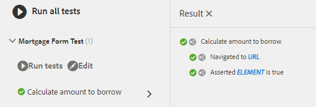

# Automatische tests gebruiken met AEM adaptieve Forms {#using-automated-tests-with-aem-adaptive-forms}

Automatisch testen van Adaptive Forms met Calvin SDK

Calvin SDK is een hulpprogramma-API waarmee Adaptive Forms-ontwikkelaars Adaptive Forms kunnen testen. Calvin SDK is gebaseerd op het [Hobbes.js-testframework](https://docs.adobe.com/docs/en/aem/6-3/develop/ref/test-api/index.html). Calvin SDK is beschikbaar bij AEM Forms 6.3 en hoger.

In deze zelfstudie maakt u het volgende:

* Testsuite
* Testsuite bevat een of meer testgevallen
* De Gevallen van de test zullen één of meerdere acties bevatten

## Aan de slag {#getting-started}

[Download en installeer de middelen met behulp van Package ](assets/testingadaptiveformsusingcalvinsdk1.zip)ManagerHet pakket bevat voorbeeldscripts en verschillende Adaptive Forms.Deze Adaptive Forms wordt gebouwd met AEM Forms 6.3-versie. Het wordt aanbevolen nieuwe formulieren te maken die specifiek zijn voor uw versie van AEM Forms als u deze test op AEM Forms 6.4 of hoger. De voorbeeldscripts tonen verschillende Calvin SDK API&#39;s die beschikbaar zijn om Adaptive Forms te testen. De algemene stappen voor het testen AEM Adaptive Forms zijn:

* Navigeer naar het formulier dat u wilt testen
* Waarde van veld instellen
* Het adaptieve formulier verzenden
* Controleren op foutberichten

De voorbeeldscripts in het pakket tonen alle bovenstaande handelingen aan.
Bekijk de code van `mortgageForm.js`

```javascript
var mortgageFormTS = new hobs.TestSuite("Mortgage Form Test", {
        path: '/etc/clientlibs/testingAFUsingCalvinSDK/mortgageForm.js',
        register: true
})
```

De bovenstaande code maakt een nieuwe testsuite.

* De naam van de TestSuite in dit geval is &#39; `Mortgage Form Test` &#39;.
* Opgegeven is het absolute pad in AEM naar het JS-bestand dat de testsuite bevat.
* De registerparameter wanneer ingesteld op &#39; `true`&#39;, maakt de testsuite beschikbaar in de testinterface.

```javascript
.addTestCase(new hobs.TestCase("Calculate amount to borrow")
        // navigate to the mortgage form  which is to be tested
        .navigateTo("/content/forms/af/cal/mortgageform.html?wcmmode=disabled")
  .asserts.isTrue(function () {
            return calvin.isFormLoaded()
        })
```

>[!NOTE]
>
>Als u deze functie test op AEM Forms 6.4 of hoger, maakt u een nieuw adaptief formulier en gebruikt u dit voor de test. Het gebruik van het adaptieve formulier dat bij het pakket wordt geleverd, wordt niet aanbevolen.

Testgevallen kunnen worden toegevoegd aan een testsuite die wordt uitgevoerd met een adaptief formulier.

* Als u een testcase wilt toevoegen aan een testsuite, gebruikt u de methode `addTestCase` van het object TestSuite.
* De methode `addTestCase` neemt een voorwerp TestCase als parameter.
* Om TestCase tot stand te brengen gebruik de `hobs.TestCase(..)` methode.
* Opmerking: De eerste parameter is de naam van het Geval van de Test dat in UI zal verschijnen.
* Nadat u een testcase hebt gemaakt, kunt u vervolgens handelingen toevoegen aan uw testcase.
* Handelingen zoals `navigateTo` en `asserts.isTrue` kunnen als handelingen aan het testcase worden toegevoegd.

## De geautomatiseerde tests {#running-the-automated-tests} uitvoeren

[](http://localhost:4502/libs/granite/testing/hobbes.html)OpenTestSuite uitvouwen en de tests uitvoeren. Als alles goed werkt, ziet u de volgende uitvoer.



## Probeer de testsuites {#try-out-the-sample-test-suites} uit

Als onderdeel van de monsterverpakking zijn er drie extra testreeksen. U kunt ze uitproberen door de desbetreffende bestanden op te nemen in het bestand js.txt van de clientbibliotheek, zoals hieronder wordt weergegeven:

```javascript
#base=.

scriptingTest.js
validationTest.js
prefillTest.js
mortgageForm.js
```
