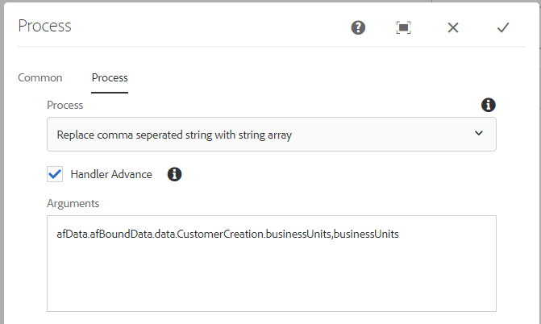

# Een door komma&#39;s gescheiden tekenreeks omzetten in een tekenreeksarray {#setting-value-of-json-data-element-in-aem-forms-workflow}

Wanneer uw formulier is gebaseerd op een formuliergegevensmodel met een array van tekenreeksen als invoerparameter, moet u de verzonden adaptieve formuliergegevens bewerken om een array van tekenreeksen in te voegen. Als voorbeeld wanneer u een selectievakje hebt gekoppeld aan een formuliergegevensmodelelement van het type tekenreeksarray, hebben de gegevens in het veld Selectievakje een door komma&#39;s gescheiden tekenreeksindeling. De voorbeeldcode hieronder laat zien hoe u de door komma&#39;s gescheiden tekenreeks kunt vervangen door een array met tekenreeksen.

## Een processtap maken

Een processtap wordt gebruikt in een AEM werkstroom wanneer wij onze werkschema een bepaalde logica willen uitvoeren. De processtap kan met een manuscript ECMA of een dienst worden geassocieerd OSGi. Onze stap van het douaneproces voert de dienst OSGi uit.

De ingediende gegevens hebben de volgende indeling. De waarde van het element businessUnits is een door komma&#39;s gescheiden tekenreeks, die moet worden omgezet in een array van tekenreeksen.


De inputgegevens voor het rest eindpunt verbonden aan het model van vormgegevens verwachten een serie van koorden zoals aangetoond in dit het schermschot. De douanecode in de processtap zet de voorgelegde gegevens in het correcte formaat om.


We geven het JSON-objectpad en de elementnaam door aan de processtap. De code in de processtap vervangt de door komma&#39;s gescheiden waarden van het element in een array met tekenreeksen.


>[!NOTE]
>
>Zorg ervoor dat het pad naar het gegevensbestand in de verzendopties van het adaptieve formulier is ingesteld op &quot;Data.xml&quot;. De reden hiervoor is dat de code in de processtap naar een bestand met de naam Data.xml zoekt in de payload-map.

## Code processtap

```java
import java.io.BufferedReader;
import java.io.ByteArrayInputStream;
import java.io.InputStream;
import java.io.InputStreamReader;

import javax.jcr.Binary;
import javax.jcr.Node;
import javax.jcr.Session;

import org.osgi.framework.Constants;
import org.osgi.service.component.annotations.Component;
import org.slf4j.Logger;
import org.slf4j.LoggerFactory;

import com.adobe.granite.workflow.WorkflowException;
import com.adobe.granite.workflow.WorkflowSession;
import com.adobe.granite.workflow.exec.WorkItem;
import com.adobe.granite.workflow.exec.WorkflowProcess;
import com.adobe.granite.workflow.metadata.MetaDataMap;
import com.google.gson.JsonArray;
import com.google.gson.JsonObject;
import com.google.gson.JsonParser;

@Component(property = {
    Constants.SERVICE_DESCRIPTION + "=Create String Array",
    Constants.SERVICE_VENDOR + "=Adobe Systems",
    "process.label" + "=Replace comma seperated string with string array"
})

public class CreateStringArray implements WorkflowProcess {
    private static final Logger log = LoggerFactory.getLogger(CreateStringArray.class);
    @Override
    public void execute(WorkItem workItem, WorkflowSession workflowSession, MetaDataMap arg2) throws WorkflowException {
        log.debug("The string I got was ..." + arg2.get("PROCESS_ARGS", "string").toString());
        String[] arguments = arg2.get("PROCESS_ARGS", "string").toString().split(",");
        String objectName = arguments[0];
        String propertyName = arguments[1];

        String objects[] = objectName.split("\\.");
        System.out.println("The params is " + propertyName);
        log.debug("The params string is " + objectName);
        String payloadPath = workItem.getWorkflowData().getPayload().toString();
        log.debug("The payload  in set Elmement Value in Json is  " + workItem.getWorkflowData().getPayload().toString());
        String dataFilePath = payloadPath + "/Data.xml/jcr:content";
        Session session = workflowSession.adaptTo(Session.class);
        Node submittedDataNode = null;
        try {
            submittedDataNode = session.getNode(dataFilePath);

            InputStream submittedDataStream = submittedDataNode.getProperty("jcr:data").getBinary().getStream();
            BufferedReader streamReader = new BufferedReader(new InputStreamReader(submittedDataStream, "UTF-8"));
            StringBuilder stringBuilder = new StringBuilder();

            String inputStr;
            while ((inputStr = streamReader.readLine()) != null)
                stringBuilder.append(inputStr);
            JsonParser jsonParser = new JsonParser();
            JsonObject jsonObject = jsonParser.parse(stringBuilder.toString()).getAsJsonObject();
            System.out.println("The json object that I got was " + jsonObject);
            JsonObject targetObject = null;

            for (int i = 0; i < objects.length - 1; i++) {
                System.out.println("The object name is " + objects[i]);
                if (i == 0) {
                    targetObject = jsonObject.get(objects[i]).getAsJsonObject();
                } else {
                    targetObject = targetObject.get(objects[i]).getAsJsonObject();

                }

            }

            System.out.println("The final object is " + targetObject.toString());
            String businessUnits = targetObject.get(propertyName).getAsString();
            System.out.println("The values of " + propertyName + " are " + businessUnits);

            JsonArray jsonArray = new JsonArray();

            String[] businessUnitsArray = businessUnits.split(",");
            for (String name: businessUnitsArray) {
                jsonArray.add(name);
            }

            targetObject.add(propertyName, jsonArray);
            System.out.println(" After updating the property " + targetObject.toString());
            InputStream is = new ByteArrayInputStream(jsonObject.toString().getBytes());
            System.out.println("The changed json data  is " + jsonObject.toString());
            Binary binary = session.getValueFactory().createBinary(is);
            submittedDataNode.setProperty("jcr:data", binary);
            session.save();

        } catch (Exception e) {
            System.out.println(e.getMessage());
        }

    }
}
```

De voorbeeldbundel kan [hier gedownload](assets/CreateStringArray.CreateStringArray.core-1.0-SNAPSHOT.jar)
