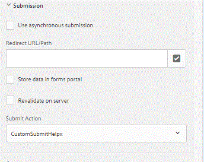

# Een aangepaste verzending schrijven in AEM Forms {#writing-a-custom-submit-in-aem-forms}

Snelle en eenvoudige manier om uw eigen aangepaste verzendactie te maken voor adaptief formulier

In dit artikel worden de stappen doorlopen die nodig zijn om een aangepaste verzendactie te maken voor de verwerking van Adaptive Forms-verzendingen.

* Aanmelden bij crx
* Maak een knooppunt van het type &quot;sling:folder&quot; onder apps. Laten we dit knooppunt CustomSubmitHelpx noemen.
* Sla het nieuwe knooppunt op.
* Voeg de volgende drie eigenschappen toe aan het nieuwe knooppunt

| Eigenschapnaam | Waarde van eigenschap |
|----------------    | ---------------------------------|
| guideComponentType | fd/af/components/guidesubmittype |
| guideDataModel | xfa,xsd,basic |
| jcr:beschrijving | CustomSubmitHelp |


* De wijzigingen opslaan
* Maak een nieuw bestand met de naam post.POST.jsp onder het knooppunt CustomSubmitHelpx. Wanneer een adaptief formulier wordt verzonden, wordt dit JSP aangeroepen. U kunt de JSP-code naar wens in dit bestand schrijven. De volgende code stuurt het verzoek door naar de servlet.

```java
<%
%><%@include file="/libs/foundation/global.jsp"%>
<%@taglib prefix="cq" uri="http://www.day.com/taglibs/cq/1.0"%>
<%@ page import="org.apache.sling.api.request.RequestParameter,com.day.cq.wcm.api.WCMMode,com.adobe.forms.common.submitutils.CustomParameterRequest,com.adobe.aemds.guide.submitutils.*" %>

<%@ page import="org.apache.sling.api.request.RequestParameter,com.day.cq.wcm.api.WCMMode" %>
<%@page session="false" %>
<%

   com.adobe.aemds.guide.utils.GuideSubmitUtils.setForwardPath(slingRequest,"/bin/storeafsubmission",null,null);

%>
```

* Maak het bestand addfields.jsp onder het knooppunt CustomSubmitHelpx. Met dit bestand hebt u toegang tot het ondertekende document.
* De volgende code toevoegen aan dit bestand

```java
    <%@include file="/libs/fd/af/components/guidesglobal.jsp"%>

    <%@page import="org.slf4j.LoggerFactory" %>

    <%@page import="org.slf4j.Logger" %>

    <input type="hidden" id="useSignedPdf" name="_useSignedPdf" value=""/>;
```

* Uw wijzigingen opslaan

Nu ziet u &quot;CustomSubmitHelpx&quot; in de verzendacties van uw Adaptief formulier, zoals in deze afbeelding wordt getoond.


