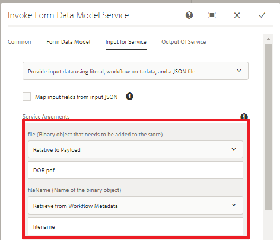

# Binaire gegevens verzenden met het formuliergegevensmodel{#using-form-data-model-to-post-binary-data}

Vanaf AEM Forms 6.4 kunnen we nu de service Formuliergegevensmodel aanroepen als een stap in AEM workflow. In dit artikel wordt een voorbeeld van een gebruiksgeval getoond voor het posten van een document met gebruik van de service Formuliergegevensmodel.

Het gebruiksgeval is als volgt:

1. Een gebruiker vult het adaptieve formulier en verzendt het.
1. Het adaptieve formulier is geconfigureerd om een document met records te genereren.
1. Bij het indienen van deze adaptieve formulieren wordt AEM workflow geactiveerd die de Invoke Form Data Model Service gebruikt om het Document of Record te POSTEN naar AEM DAM.

Tabblad Formuliergegevensmodel - Eigenschappen

Op het tabblad Service Input geven we het volgende in kaart

* file(The Binary Object that need to be stored) with DOR.pdf property relative to payload. Dat betekent dat wanneer het adaptieve formulier wordt verzonden, het gegenereerde Document Of Record wordt opgeslagen in een bestand met de naam DOR.pdf ten opzichte van de payload van de workflow.**Zorg ervoor dat dit bestand DOR.pdf hetzelfde is als het bestand dat u opgeeft bij het configureren van de eigenschap voor verzending van het adaptieve formulier.**

* fileName - Dit is de naam waarmee het binaire object in DAM wordt opgeslagen. Zo wilt u dit bezit dynamisch worden geproduceerd, zodat elke fileName uniek per voorlegging zou zijn. Daarom hebben we de processtap in de workflow gebruikt om de eigenschap metadata genaamd bestandsnaam te maken en de waarde ervan in te stellen op de combinatie van Lidnaam en Rekeningnummer van de persoon die het formulier indient. Als de naam van het lid van de persoon bijvoorbeeld John Jacobs is en zijn rekeningnummer 9846, zou de bestandsnaam John Jacobs_9846.pdf zijn

Service-invoer

>[!NOTE]
>
>Tips voor het oplossen van problemen - Als om een of andere reden DOR.pdf niet in DAM wordt gemaakt, herstelt u de instellingen voor gegevensbronverificatie door op [hier](http://localhost:4502/mnt/overlay/fd/fdm/gui/components/admin/fdmcloudservice/properties.html?item=%2Fconf%2Fglobal%2Fsettings%2Fcloudconfigs%2Ffdm%2Fpostdortodam). Dit zijn de instellingen voor AEM verificatie, die standaard admin/admin zijn.

Volg onderstaande stappen om deze mogelijkheid op uw server te testen:

1.[De gebruikersbundel DevelopingWithService implementeren](/help/forms/assets/common-osgi-bundles/DevelopingWithServiceUser.jar)

1. [De setvalue-bundel downloaden en implementeren](/help/forms/assets/common-osgi-bundles/SetValueApp.core-1.0-SNAPSHOT.jar).This custom OSGI bundle is used to create metadata property and set its value from the submitted form data.

1. [Elementen importeren](assets/postdortodam.zip) is gekoppeld aan dit artikel in AEM met gebruik van pakketbeheer. U krijgt het volgende

   1. Workflowmodel
   1. Adaptief formulier geconfigureerd voor verzending naar de AEM-workflow
   1. Gegevensbron geconfigureerd voor gebruik van het bestand PostToDam.JSON
   1. Formuliergegevensmodel dat gebruikmaakt van de gegevensbron

1. Wijs uw [browser om het adaptieve formulier te openen](http://localhost:4502/content/dam/formsanddocuments/helpx/timeoffrequestform/jcr:content?wcmmode=disabled)
1. Vul het formulier in en verzend het.
1. Controleer de toepassing Middelen als het Document of Record is gemaakt en opgeslagen.

[Swaggbestand](http://localhost:4502/conf/global/settings/cloudconfigs/fdm/postdortodam/jcr:content/swaggerFile) gebruikt bij het maken van de gegevensbron is beschikbaar voor uw referentie
