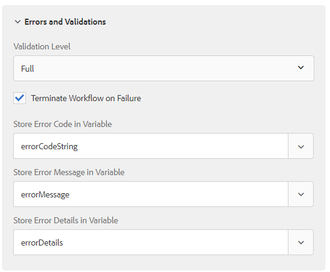

# Vastleggen van foutberichten in Stap van de service Formuliergegevensmodel aanroepen

Vanaf AEM Forms 6.5.1 kunnen nu foutberichten worden vastgelegd en validatieopties worden opgegeven. De aanroepservice Formuliergegevensmodel is uitgebreid met de volgende mogelijkheden.

* Optie voor validatie op drie niveaus (&quot;OFF&quot;, &quot;BASIC&quot; en &quot;FULL&quot;) voor het verwerken van uitzonderingen die worden aangetroffen bij het aanroepen van de service Formuliergegevensmodel. De drie opties wijzen achtereenvolgens op een striktere versie van het controleren van gegevensbestand-specifieke vereisten.
  

* Het aanvinken van een selectievakje voor het aanpassen van de uitvoering van Workflow. Daarom heeft de gebruiker nu de flexibiliteit om door te gaan met de Workflowuitvoering, zelfs als de stap Formuliergegevensmodel aanroepen uitzonderingen genereert.

* Belangrijke informatie opslaan over fouten die zich voordoen als gevolg van validatie-uitzonderingen. Drie variabelen van het type AutoComplete zijn opgenomen om relevante variabelen te selecteren om ErrorCode (Koord), ErrorMessage (Koord) en ErrorDetails (JSON) op te slaan. ErrorDetails zou echter aan ongeldige toename worden geplaatst de uitzondering is geen DermisValidationException.
  

Met deze wijzigingen zorgt de stap Service Formuliergegevensmodel aanroepen ervoor dat de invoerwaarden voldoen aan de gegevensbeperkingen die in het kwikbestand zijn opgegeven. Het volgende foutbericht wordt bijvoorbeeld gegenereerd wanneer de waarden voor accountId en balance niet voldoen aan de gegevensbeperkingen die in het wagerbestand zijn opgegeven.

```json
{
    "errorCode": "AEM-FDM-001-049"
    "errorMessage": "Input validations failed during operation execution"
    "violations": {
        "/accountId": ["numeric instance is greater than the required maximum (maximum: 20, found: 97)"],
        "/newAccount/balance": ["instance type (string) does not match any allowed primitive type (allowed: [\"integer\",\"number\"])"]
    }   
}
```
