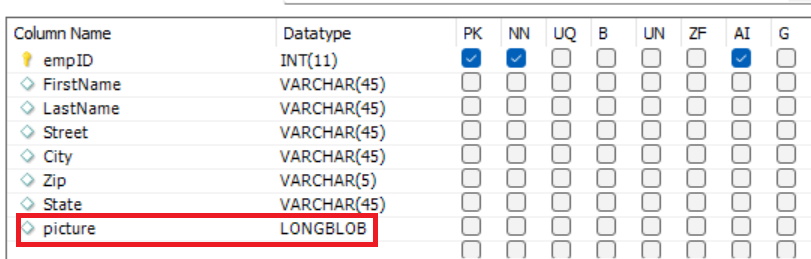

# Formulierbijlage invoegen in database

Dit artikel zal door het gebruiksgeval lopen om vormgehechtheid in MySQL gegevensbestand op te slaan.

Veelvoorkomende vragen van klanten zijn het opslaan van vastgelegde formuliergegevens en de formulierbijlage in een databasetabel.
Om dit te verwezenlijken het gebruikscase werd de volgende stappen gevolgd

## Databasetabel maken voor de formuliergegevens en de bijlage

Er is een tabel met de naam NewWire gemaakt voor de opslag van de formuliergegevens. Let op de kolomnaamafbeelding van het type **LONGBLOB** de formulierbijlage opslaan


## Formuliergegevensmodel maken

Er is een formuliergegevensmodel gemaakt voor communicatie met de MySQL-database. U moet het volgende maken:

* [JDBC-gegevensbron in AEM](./data-integration-technical-video-setup.md)
* [Formuliergegevensmodel gebaseerd op de JDBC-gegevensbron](./jdbc-data-model-technical-video-use.md)

## Workflow maken

Als u het Adaptief formulier configureert voor verzending naar een AEM, kunt u de formulierbijlagen opslaan in een workflowvariabele of de bijlagen opslaan in een opgegeven map onder de payload. Voor dit gebruik moeten we de bijlagen opslaan in een workflowvariabele van het type ArrayList of Document. Uit deze ArrayList moeten we het eerste item extraheren en een documentvariabele initialiseren. De workflowvariabelen worden **listOfDocuments** en **employeePhoto** zijn gemaakt.
Wanneer het adaptieve formulier wordt verzonden om de workflow te activeren, wordt met behulp van het ECMA-script een stap in de workflow de variabele employeePhoto geïnitialiseerd. Hier volgt de ECMA-scriptcode

```javascript
log.info("executing script now...");
var metaDataMap = graniteWorkItem.getWorkflow().getWorkflowData().getMetaDataMap();
var listOfAttachments = [];
// Make sure you have a workflow variable caled listOfDocuments defined
listOfAttachments = metaDataMap.get("listOfDocuments");
log.info("$$$  got listOfAttachments");
//Make sure you have a workflow variable caled employeePhoto defined
var employeePhoto = listOfAttachments[0];
metaDataMap.put("employeePhoto", employeePhoto);
log.info("Employee Photo updated");
```

De volgende stap in de workflow bestaat uit het invoegen van gegevens en de formulierbijlage in de tabel met de servicecomponent Formuliergegevensmodel aanroepen.

[De volledige workflow met het voorbeeldscript kan hier worden gedownload](assets/add-new-employee.zip).

>[!NOTE]
> U moet een nieuw op JDBC gebaseerd formuliergegevensmodel maken en dat formuliergegevensmodel gebruiken in de workflow

## Adaptief formulier maken

Maak een adaptief formulier op basis van het formuliergegevensmodel dat u in de vorige stap hebt gemaakt. Sleep de elementen van het formuliergegevensmodel naar het formulier. Configureer de formulierverzending om de workflow te activeren en geef de volgende eigenschappen op, zoals hieronder weergegeven in de schermafbeelding.

