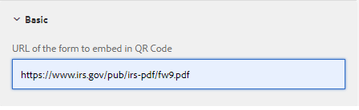

# Voorbeeld QR-codecomponent

Het insluiten van een QR-code in een adaptief formulier kan het voor gebruikers veel gemakkelijker en efficiënter maken om toegang te krijgen tot aanvullende informatie over het formulier.

De voorbeeldcomponent maakt gebruik van [QRCode.js](https://davidshimjs.github.io/qrcodejs/).

QRCode.js is een bibliotheek javascript voor het maken van QRCode, steunt het dwars-browser met HTML5 Canvas en lijstmarkering in DOM.

De component produceert de code QR die op de waarde wordt gebaseerd in het configuratiebezit van de component wordt gespecificeerd.


De volgende code is gebruikt in body.jsp van de qr-code-generator component.

De &quot;url&quot; is de URL die moet worden ingesloten in de Qr-code. Deze url wordt gespecificeerd in de configuratieeigenschappen van de QR codecomponent.

```java
<%@include file="/libs/foundation/global.jsp"%>
<body>
    <h2>Scan the QR Code for more information related to this form</h2>
    <div data-url="<%=properties.get("url")%>">
    </div>
    <div id="qrcode">
    </div>
</body>
```


De volgende code maakt gebruik van de methode makeCode van de bibliotheek QRCode.js in de cliëntbibliotheek van de qr-code-generator component.De geproduceerde QR code wordt toegevoegd aan div die door identiteitskaart wordt geïdentificeerd **&quot;qrcode&quot;**.

```javascript
$(document).ready(function()
  {
      var qrcode = new QRCode("qrcode");
      qrcode.makeCode(document.querySelector("[data-url]").getAttribute("data-url"));
      
 });
```

## De elementen op uw lokale server implementeren

* [Download en installeer de component QR-code met Package Manager.](assets/qrcode.zip)
* [Download en installeer het voorbeeldadaptieve formulier met Package Manager.](assets/form-with-qr-code.zip)
* [Een voorbeeld van het formulier bekijken](http://localhost:4502/content/dam/formsanddocuments/qrcode/w9form/jcr:content?wcmmode=disabled). De Help-sectie van het formulier heeft de QR-code.


