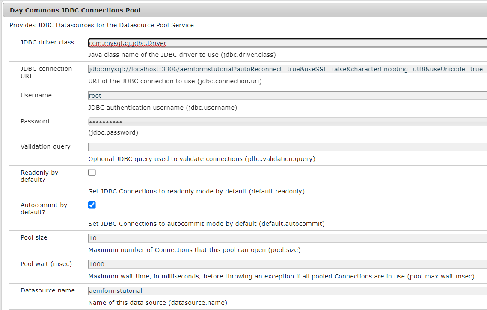

# Aangepaste formulierverzendingen opslaan in database

Er zijn verschillende manieren om de verzonden formuliergegevens op te slaan in de database van uw keuze. Een JDBC-gegevensbron kan worden gebruikt om de gegevens rechtstreeks in de database op te slaan. U kunt een aangepaste OSGI-bundel schrijven om de gegevens in de database op te slaan. Dit artikel gebruikt een aangepaste processtap in AEM workflow om de gegevens op te slaan.
Het gebruiksscenario is dat een AEM workflow wordt geactiveerd voor het verzenden van een adaptief formulier en dat de verzonden gegevens in de database worden opgeslagen in een stap in de workflow.


## JDBC-verbindingsgroep

* Ga naar [ConfigMgr](http://localhost:4502/system/console/configMgr)

   * Zoek naar &quot;Pool van de Verbinding JDBC&quot;. Maak een nieuwe dag gemeenschappelijke JDBC-verbindingspool. Geef de specifieke instellingen voor uw database op.

   * 

## Databasegegevens opgeven

* Zoeken naar &quot;**Databasedetails opgeven**&quot;
* Geef de specifieke eigenschappen voor uw database op.
   * DataSourceName:Naam van de gegevensbron u eerder vormde.
   * TableName - Naam van de lijst waarin u de Gegevens van AF wilt opslaan
   * Formuliernaam - Kolomnaam voor de naam van het formulier
   * Kolomnaam - Kolomnaam om de AF-gegevens te bevatten


## Code voor OSGi-configuratie

```java
package com.aemforms.dbsamples.core.insertFormData;

import org.osgi.service.metatype.annotations.AttributeDefinition;
import org.osgi.service.metatype.annotations.ObjectClassDefinition;

@ObjectClassDefinition(name = "Specify Database details", description = "Specify Database details")

public @interface InsertFormDataConfiguration {
  @AttributeDefinition(name = "DataSourceName", description = "Data Source Name configured")
  String dataSourceName() default "";
  @AttributeDefinition(name = "TableName", description = "Name of the table")
  String tableName() default "";
  @AttributeDefinition(name = "FormName", description = "Column Name for form name")
  String formName() default "";
  @AttributeDefinition(name = "columnName", description = "Column Name for form data")
  String columnName() default "";

}
```

## Configuratiewaarden lezen

```java
package com.aemforms.dbsamples.core.insertFormData;
import org.osgi.service.component.annotations.Activate;
import org.osgi.service.component.annotations.Component;
import org.osgi.service.metatype.annotations.Designate;

@Component(service={InsertFormDataConfigurationService.class})
@Designate(ocd=InsertFormDataConfiguration.class)

public class InsertFormDataConfigurationService {
    public String TABLE_NAME;
    public String DATA_SOURCE_NAME;
    public String COLUMN_NAME;
    public String FORM_NAME;
    @Activate      
      protected final void activate(InsertFormDataConfiguration insertFormDataConfiguration)
      {
        TABLE_NAME = insertFormDataConfiguration.tableName();
        DATA_SOURCE_NAME = insertFormDataConfiguration.dataSourceName();
        COLUMN_NAME = insertFormDataConfiguration.columnName();
        FORM_NAME = insertFormDataConfiguration.formName();
      }
    public String getTABLE_NAME()
    {
        return TABLE_NAME;
    }
    public String getDATA_SOURCE_NAME()
    {
        return DATA_SOURCE_NAME;
    }
    public String getCOLUMN_NAME()
    {
        return COLUMN_NAME;
    }
    public String getFORM_NAME()
    {
        return FORM_NAME;
    }
}
```

## Code voor de implementatie van de processtap

```java
package com.aemforms.dbsamples.core.insertFormData;
import java.io.InputStream;
import java.io.StringWriter;
import java.nio.charset.StandardCharsets;
import java.sql.Connection;
import java.sql.PreparedStatement;
import java.sql.SQLException;

import javax.jcr.Node;
import javax.jcr.Session;
import javax.sql.DataSource;

import org.apache.commons.io.IOUtils;
import org.osgi.framework.Constants;
import org.osgi.service.component.annotations.Component;
import org.osgi.service.component.annotations.Reference;
import org.slf4j.Logger;
import org.slf4j.LoggerFactory;

import com.adobe.granite.workflow.WorkflowException;
import com.adobe.granite.workflow.WorkflowSession;
import com.adobe.granite.workflow.exec.WorkItem;
import com.adobe.granite.workflow.exec.WorkflowProcess;
import com.adobe.granite.workflow.metadata.MetaDataMap;
import com.day.commons.datasource.poolservice.DataSourcePool;

@Component(property = {
  Constants.SERVICE_DESCRIPTION + "=Insert Form Data in Database",
  Constants.SERVICE_VENDOR + "=Adobe Systems",
  "process.label" + "=Insert Form Data in Database"
})

public class InsertAfData implements WorkflowProcess {
  @Reference
  InsertFormDataConfigurationService insertFormDataConfig;
  @Reference
  DataSourcePool dataSourcePool;
  private final Logger log = LoggerFactory.getLogger(getClass());
  @Override
  public void execute(WorkItem workItem, WorkflowSession session, MetaDataMap metaDataMap) throws WorkflowException {

    String proccesArgsVals = (String) metaDataMap.get("PROCESS_ARGS", (Object)
      "string");
    String[] values = proccesArgsVals.split(",");
    String AdaptiveFormName = values[0];
    String formDataFile = values[1];
    String payloadPath = workItem.getWorkflowData().getPayload().toString();
    Session jcrSession = (Session) session.adaptTo((Class) Session.class);
    String dataFilePath = payloadPath + "/" + formDataFile + "/jcr:content";
    log.debug("The data file path is " + dataFilePath);
    PreparedStatement ps = null;
    Connection con = null;
    DataSource dbSource = null;

    try {
      dbSource = (DataSource) dataSourcePool.getDataSource(insertFormDataConfig.getDATA_SOURCE_NAME());
      log.debug("Got db source");
      con = dbSource.getConnection();

      Node xmlDataNode = jcrSession.getNode(dataFilePath);
      InputStream xmlDataStream = xmlDataNode.getProperty("jcr:data").getBinary().getStream();
      StringWriter writer = new StringWriter();
      String encoding = StandardCharsets.UTF_8.name();
      IOUtils.copy(xmlDataStream, writer, encoding);
      String queryStmt = "insert into " + insertFormDataConfig.TABLE_NAME + "(" + insertFormDataConfig.COLUMN_NAME + "," + insertFormDataConfig.FORM_NAME + ") values(?,?)";
      log.debug("The query Stmt is " + queryStmt);
      ps = con.prepareStatement(queryStmt);
      ps.setString(1, writer.toString());
      ps.setString(2, AdaptiveFormName);
      ps.executeUpdate();

    } catch (Exception e) {
      log.debug("The error message is " + e.getMessage());
    } finally {
      if (ps != null) {
        try {
          ps.close();
        } catch (SQLException sqlException) {
          log.debug(sqlException.getMessage());
        }
      }
      if (con != null) {
        try {
          con.close();
        } catch (SQLException sqlException) {
          log.error("Unable to close connection to database", sqlException);
        }
      }
    }
  }

}
```

## De voorbeeldelementen implementeren

* Controleer of u de JDBC-verbindingspool hebt geconfigureerd
* Geef de databasedetails op met behulp van configMgr
* [Download het Zip-bestand en extraheer de inhoud ervan naar de vaste schijf](assets/article-assets.zip)

   * Het jar-bestand implementeren met [AEM webconsole](http://localhost:4502/system/console/bundles). Dit jar-bestand bevat de code waarmee de formuliergegevens in de database worden opgeslagen.

   * De twee ZIP-bestanden importeren in [AEM met pakketbeheer](http://localhost:4502/crx/packmgr/index.jsp). Hiermee krijgt u de [voorbeeldworkflow](http://localhost:4502/editor.html/conf/global/settings/workflow/models/storeformdata.html) en de [adaptief voorbeeldformulier](http://localhost:4502/editor.html/content/forms/af/addformdataindb.html) dat de workflow voor het verzenden van formulieren activeert. Let op de procesargumenten in de workflowstap. Deze argumenten verwijzen naar de naam van de indeling en de naam van het gegevensbestand dat de adaptieve formuliergegevens zal bevatten. Het gegevensbestand wordt opgeslagen onder de ladingmap in de crx-opslagplaats. Let op het volgende [adaptieve vorm](http://localhost:4502/editor.html/content/forms/af/addformdataindb.html) is geconfigureerd om de AEM workflow bij verzending en de configuratie van het gegevensbestand (data.xml) te activeren

   * Bekijk een voorbeeld van het formulier, vul het in en verzend het. Er moet een nieuwe rij in uw database worden gemaakt

