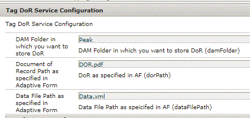

# AEM Forms DoR coderen en opslaan in DAM {#tagging-and-storing-aem-forms-dor-in-dam}

Dit artikel zal door het gebruik geval lopen van het opslaan en etiketteren van DoR die door AEM Forms in AEM DAM wordt geproduceerd. Het document wordt gelabeld op basis van de verzonden formuliergegevens.

Een veelvoorkomende vraag van klanten is om het Document of Record (DoR) dat door AEM Forms is gegenereerd, op te slaan en te labelen in AEM DAM. De codering van het document moet gebaseerd zijn op de door Adaptive Forms ingediende gegevens. Als de werkgelegenheidsstatus in de verzonden gegevens bijvoorbeeld &quot;In ruste&quot; is, willen we het document labelen met de tag &quot;In ruste&quot; en het document opslaan in DAM.

Het gebruiksgeval is als volgt:

* Een gebruiker vult het adaptieve formulier in. In het adaptieve formulier worden de huwelijkse staat (ex Single) en de arbeidsstatus (Ex Reensioen) van de gebruiker vastgelegd.
* Bij het verzenden van formulieren wordt een AEM workflow geactiveerd. Met deze workflow wordt het document gelabeld met de burgerlijke staat (Single) en de werkgelegenheidsstatus (In ruste) en wordt het document opgeslagen in DAM.
* Nadat het document is opgeslagen in DAM, kan de beheerder het document op basis van deze codes doorzoeken. Bijvoorbeeld, zou het onderzoek op Enige of In ruste de aangewezen Dor&#39;s halen.

Om aan dit gebruiksgeval te voldoen is een stap van het douaneproces geschreven. In deze stap halen wij de waarden van de aangewezen gegevenselementen uit de voorgelegde gegevens. Vervolgens wordt de labeltegel gemaakt met deze waarde. Als bijvoorbeeld de waarde van het element van de burgerlijke staat &#39;Single&#39; is, wordt de titel van de tag **Peak:EmploymentStatus/Single. **Met behulp van de API TagManager vinden we de tag en passen we de tag toe op de DoR.

In het volgende codefragment ziet u hoe u de tag kunt zoeken en de tag op het document kunt toepassen.

```java
Tag tagFound = tagManager.resolveByTitle(tagTitle+xmlElement.getTextContent());
//tagTitle is "Peak:EmploymentStatus/" and the xmlElement.getTextContent() will return the value Single. So the tag title becomes Peak:EmploymentStatus/Single. Once the tag is found we put the tag in array and apply the tags to the resource as shown below
tagArray[i] = tagFound;
tagManager.setTags(metadata, tagArray, true);
```

Volg onderstaande stappen om dit voorbeeld op uw systeem te laten werken:
* [De gebruikersbundel DevelopingWithService implementeren](/help/forms/assets/common-osgi-bundles/DevelopingWithServiceUser.jar)

* [Download en implementeer de setvalue-bundel](/help/forms/assets/common-osgi-bundles/SetValueApp.core-1.0-SNAPSHOT.jar). Dit is de aangepaste OSGI-bundel die de codes instelt van de verzonden formuliergegevens.

* [Het adaptieve voorbeeldformulier downloaden](assets/tag-and-store-in-dam-assets.zip)

* [Ga naar Forms en Documenten](http://localhost:4502/aem/forms.html/content/dam/formsanddocuments)

* Klik op Maken | Bestand uploaden en voorbeeldAdaptiveform.zip uploaden

* [Artikelelementen importeren met ](assets/tag-and-store-in-dam-assets.zip) behulp van AEM pakketbeheer
* Open het voorbeeldformulier [in de voorbeeldmodus](http://localhost:4502/content/dam/formsanddocuments/summit/peakform/jcr:content?wcmmode=disabled). Vul de sectie Personen in en verzend het formulier.
* [Navigeer naar de map Peak in DAM](http://localhost:4502/assets.html/content/dam/Peak). U zou DoR in de Piek omslag moeten zien. Controleer de eigenschappen van het document. Het moet op passende wijze worden gelabeld.
Gefeliciteerd! U hebt het voorbeeld op uw systeem geïnstalleerd

* We verkennen de [workflow](http://localhost:4502/editor.html/conf/global/settings/workflow/models/TagAndStoreDoRinDAM.html) die wordt geactiveerd bij het verzenden van formulieren.
* De eerste stap in de workflow maakt een unieke bestandsnaam door de naam van de aanvrager en het land van verblijf samen te voegen.
* De tweede stap van de workflow gaat over de taghiërarchie en de formulierveldelementen die moeten worden gecodeerd. De processtap extraheert de waarde uit de verzonden gegevens en bouwt de codetitel die het document moet labelen.
* Als u DoR in een verschillende omslag in DAM wilt opslaan, specificeert u de omslagplaats gebruikend de configuratieeigenschappen zoals die in het hieronder screenshot worden gespecificeerd.

De andere twee parameters zijn specifiek voor DoR en de Weg van het Dossier van Gegevens zoals die in de Adaptieve de indieningsopties van de Vorm worden gespecificeerd. Zorg ervoor dat de waarden die u hier opgeeft, overeenkomen met de waarden die u hebt opgegeven in de verzendopties voor Adaptief formulier.



