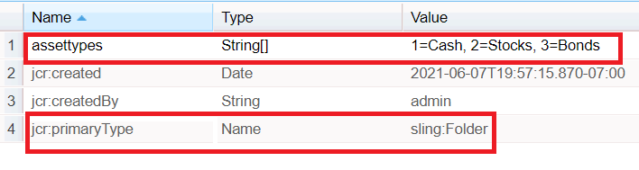

# Eigenschap voor objectladen in AEM Forms

Vorm en bevolk drop-down lijst gebruikend het bezit van de weg van de puntlading.
In het veld Pad laden item kan een auteur een URL opgeven waaruit de beschikbare opties in een vervolgkeuzelijst worden geladen.
Voer de onderstaande stappen uit om een dergelijk knooppunt in crx te maken:
* Aanmelden bij crx
* Maak een knooppunt met de naam assets (u kunt dit knooppunt naar wens een naam geven). Typ sling:map onder inhoud.
* Opslaan
* Klik op het nieuwe knooppunt met elementen en stel de eigenschappen ervan in zoals hieronder weergegeven
* U zult een bezit van typeKoord genoemd activa moeten tot stand brengen (u kunt het volgens uw vereiste noemen).Zorg ervoor het bezit een multivalue is. Geef de gewenste waarden op en sla deze op.
   

Als u deze waarden in de vervolgkeuzelijst wilt laden, geeft u het volgende pad op in de eigenschap Pad laden van item  **/content/assets/assettypes**

Het voorbeeldpakket kan [hier gedownload](assets/item-load-path-package.zip)
