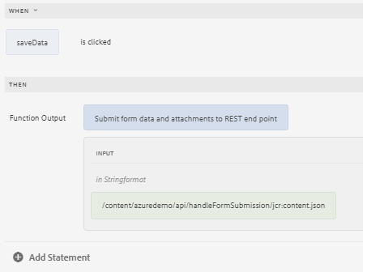

# GuideBridge-API gebruiken om formuliergegevens te POSTEN

Met &quot;Opslaan en hervatten&quot; voor een formulier kunnen gebruikers de invulling van het formulier opslaan en het later hervatten.
Om dit te verwezenlijken gebruiken wij het geval, moeten wij tot de vormgegevens toegang hebben en verzenden gebruikend GuideBridge API aan het REST eindpunt voor opslag en herwinning.

De formuliergegevens worden opgeslagen in de gebeurtenis click van een knop met de regeleditor


De volgende JavaScript-functie is geschreven om de gegevens naar het opgegeven eindpunt te verzenden

```javascript
/**
* Submits data and attachments 
* @name submitFormDataAndAttachments Submit form data and attachments to REST end point
* @param {string} endpoint in Stringformat
* @return {string} 
 */
 
 function submitFormDataAndAttachments(endpoint) {
    guideBridge.getFormDataObject({
        success: function(resultObj) {
            const afFormData = resultObj.data.data;
            const formData = new FormData();
            formData.append("dataXml", afFormData);
            resultObj.data.attachments.forEach(attachment => {
                console.log(attachment.name);
                formData.append(attachment.name, attachment.data);
            });
            fetch(endpoint, {
                method: 'POST',
                body: formData
            })
            .then(response => {
                if (response.ok) {
                    console.log("successfully saved");
                    const fld = guideBridge.resolveNode("$form.confirmation");
                    return "Form data was saved successfully";
                } else {
                    throw new Error('Failed to save form data');
                }
            })
            .catch(error => {
                console.error('Error:', error);
            });
        }
    });
}
```


## Code aan serverzijde

De volgende Java-code aan de serverzijde is geschreven om de formuliergegevens af te handelen. Hier volgt de Java-servlet die wordt uitgevoerd in AEM die wordt aangeroepen via de XHR-aanroep in het JavaScript hierboven.

```java
package com.azuredemo.core.servlets;
import com.adobe.aemfd.docmanager.Document;
import org.apache.sling.api.SlingHttpServletRequest;
import org.apache.sling.api.SlingHttpServletResponse;
import org.apache.sling.api.request.RequestParameter;
import org.apache.sling.api.servlets.SlingAllMethodsServlet;
import org.apache.sling.servlets.annotations.SlingServletResourceTypes;
import org.osgi.service.component.annotations.Component;
import org.slf4j.Logger;
import org.slf4j.LoggerFactory;
import javax.servlet.Servlet;
import javax.servlet.http.HttpServletResponse;
import java.io.File;
import java.io.IOException;
import java.io.Serializable;
import java.util.List;
@Component(
   service = {
      Servlet.class
   }
)
@SlingServletResourceTypes(
   resourceTypes = "azure/handleFormSubmission",
   methods = "POST",
   extensions = "json"
)
public class StoreFormSubmission extends SlingAllMethodsServlet implements Serializable {
   private static final long serialVersionUID = 1 L;
   private final transient Logger log = LoggerFactory.getLogger(this.getClass());
   protected void doPost(SlingHttpServletRequest request, SlingHttpServletResponse response) throws IOException {
      List < RequestParameter > listOfRequestParameters = request.getRequestParameterList();
      log.debug("The size of list is " + listOfRequestParameters.size());
      for (int i = 0; i < listOfRequestParameters.size(); i++) {
         RequestParameter requestParameter = listOfRequestParameters.get(i);
         log.debug("is this request parameter a form field?" + requestParameter.isFormField());
         if (!requestParameter.isFormField()) {
            Document attachmentDOC = new Document(requestParameter.getInputStream());
            attachmentDOC.copyToFile(new File(requestParameter.getName()));
         } else {
            log.debug("Not a form field " + requestParameter.getName());
            log.debug(requestParameter.getString());
         }
      }
      response.setStatus(HttpServletResponse.SC_OK);
   }
}
```
