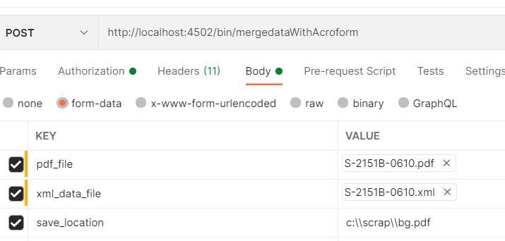

# Sling Servlet

Een server is een klasse die wordt gebruikt om de mogelijkheden van servers uit te breiden die toepassingen ontvangen die door middel van een verzoek-antwoord programmeringsmodel worden betreden. Voor dergelijke toepassingen, bepaalt de technologie van Servlet HTTP-specifieke servlet klassen.
Alle servlets moeten de interface uitvoeren Servlet, die levenscyclusmethodes bepaalt.


Een servlet in AEM kan als dienst worden geregistreerd OSGi: u kunt SlingSafeMethodsServlet voor read-only implementatie of SlingAllMethodsServlet uitbreiden om alle verrichtingen uit te voeren RESTful.

## Servlet-code

```java
package com.mysite.core.servlets;
import javax.servlet.Servlet;
import org.apache.sling.api.SlingHttpServletRequest;
import org.apache.sling.api.SlingHttpServletResponse;
import org.apache.sling.api.servlets.SlingAllMethodsServlet;
import org.osgi.service.component.annotations.Component;
import org.osgi.service.component.annotations.Reference;
import java.io.File;
import com.adobe.aemfd.docmanager.Document;
import com.adobe.fd.forms.api.FormsService;

@Component(service={Servlet.class}, property={"sling.servlet.methods=post", "sling.servlet.paths=/bin/mergedataWithAcroform"})
public class MyFirstAEMFormsServlet extends SlingAllMethodsServlet
{
    
    private static final long serialVersionUID = 1L;
    @Reference
    FormsService formsService;
     protected void doPost(SlingHttpServletRequest request, SlingHttpServletResponse response)
      { 
         String file_path = request.getParameter("save_location");
         
         java.io.InputStream pdf_document_is = null;
         java.io.InputStream xml_is = null;
         javax.servlet.http.Part pdf_document_part = null;
         javax.servlet.http.Part xml_data_part = null;
              try
              {
                 pdf_document_part = request.getPart("pdf_file");
                 xml_data_part = request.getPart("xml_data_file");
                 pdf_document_is = pdf_document_part.getInputStream();
                 xml_is = xml_data_part.getInputStream();
                 Document data_merged_document = formsService.importData(new Document(pdf_document_is), new Document(xml_is));
                 data_merged_document.copyToFile(new File(file_path));
                 
              }
              catch(Exception e)
              {
                  response.sendError(400,e.getMessage());
              }
      }
}
```

## Samenstellen en implementeren

Voer de volgende stappen uit om uw project te maken:

* Openen **opdrachtpromptvenster**
* Navigeren naar `c:\aemformsbundles\mysite\core`
* De opdracht uitvoeren `mvn clean install -PautoInstallBundle`
* Het bovenstaande bevel bouwt automatisch de bundel aan uw AEM instantie die op localhost loopt op en stelt op:4502

De bundel is ook beschikbaar op de volgende locatie `C:\AEMFormsBundles\mysite\core\target`. De bundel kan ook in AEM worden opgesteld gebruikend [Felix-webconsole.](http://localhost:4502/system/console/bundles)


## Servlet Resolver testen

Wijs uw browser aan [servlet resolver URL](http://localhost:4502/system/console/servletresolver?url=%2Fbin%2FmergedataWithAcroform&amp;method=POST). Dit vertelt u servlet die voor een bepaalde weg zoals gezien in het hieronder ontsproten scherm wordt aangehaald


## Serlet testen met Postman



## Volgende stappen

[Inclusief jar&#39;s van derden](./include-third-party-jars.md)

