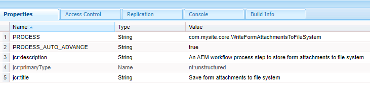

# Aangepaste workflowcomponent

Deze zelfstudie is bedoeld voor AEM Forms-klanten die een aangepaste workflowcomponent moeten maken. De workflowcomponent wordt geconfigureerd om de code uit te voeren die in de vorige stap is geschreven. De workflowcomponent kan procesargumenten voor de code opgeven. In dit artikel bekijken we de workflowcomponent die aan de code is gekoppeld.

[&#x200B; Download de component van het douanewerkschema &#x200B;](assets/saveFiles.zip)
Invoer de werkschemacomponent [&#x200B; gebruikend pakketmanager &#x200B;](http://localhost:4502/crx/packmgr/index.jsp)

De aangepaste workflowcomponent bevindt zich in /apps/AEMFormsDemoListings/workflowcomponent/SaveFiles

Selecteer de knoop SaveFiles en onderzoek zijn eigenschappen

**componentGroup** - de waarde van dit bezit bepaalt de categorie van de werkschemacomponent.

**jcr:Titel** - dit is de titel van de werkschemacomponent.

**sling:resourceSuperType** De waarde van dit bezit zal de overerving van deze component bepalen. In dit geval nemen wij van de procescomponent over

## cq:dialoogvenster

Dialogen worden gebruikt om auteur toe te staan om met de component in wisselwerking te staan. De cq:dialog bevindt zich onder het knooppunt SaveFiles

De knopen onder de puntenknoop vertegenwoordigen de lusjes van de component waardoor de auteurs met de component zullen communiceren. De algemene tabbladen en procestabbladen zijn verborgen. De tabbladen Algemeen en Argumenten zijn zichtbaar.

De procesargumenten voor het proces bevinden zich onder het procesknooppunt

De auteur specificeert de argumenten zoals aangetoond in het hieronder ontsproten scherm

De waarden worden opgeslagen als eigenschappen van het metagegevensknooppunt. Bijvoorbeeld de waarde **c:\formsattachments** zal in het bezit saveToLocation van de meta-gegevensknoop worden opgeslagen

## cq:editConfig

Cq:EditConfig is eenvoudig een knoop met het primaire type cq:EditConfig en de naam cq:editConfig onder de componentenwortel
Het bewerkingsgedrag van een component wordt geconfigureerd door een cq:editConfig-knooppunt van het type cq:EditConfig toe te voegen onder het componentknooppunt (van het type cq:Component)

cq:formParameters (knooppunttype nt:unStructured): definieert aanvullende parameters die aan het dialoogvenster worden toegevoegd.

De eigenschappen van het knooppunt cq:formParameters

De waarde van de eigenschap PROCESS geeft de Java-code aan die aan de workflowcomponent wordt gekoppeld.
