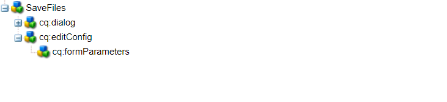

# Aangepaste workflowcomponent

Deze zelfstudie is bedoeld voor AEM Forms-klanten die een aangepaste workflowcomponent moeten maken. De workflowcomponent wordt geconfigureerd om de code uit te voeren die in de vorige stap is geschreven. De workflowcomponent kan procesargumenten voor de code opgeven. In dit artikel bekijken we de workflowcomponent die aan de code is gekoppeld.

[De aangepaste workflowcomponent downloaden](assets/saveFiles.zip)
De workflowcomponent importeren [gebruiken, pakketbeheer](http://localhost:4502/crx/packmgr/index.jsp)

De aangepaste workflowcomponent bevindt zich in /apps/AEMFormsDemoListings/workflowcomponent/SaveFiles

Selecteer de knoop SaveFiles en onderzoek zijn eigenschappen

**componentGroup** - De waarde van deze eigenschap bepaalt de categorie van de workflowcomponent.

**jcr:Titel** - Dit is de titel van de workflowcomponent.

**sling:resourceSuperType** De waarde van deze eigenschap bepaalt de overerving van deze component. In dit geval nemen wij van de procescomponent over

## cq:dialoogvenster

Dialogen worden gebruikt om auteur toe te staan om met de component in wisselwerking te staan. De cq:dialog bevindt zich onder het knooppunt SaveFiles

De knopen onder de puntenknoop vertegenwoordigen de lusjes van de component waardoor de auteurs met de component zullen communiceren. De algemene tabbladen en procestabbladen zijn verborgen. De tabbladen Algemeen en Argumenten zijn zichtbaar.

De procesargumenten voor het proces bevinden zich onder het procesknooppunt

De auteur specificeert de argumenten zoals aangetoond in het hieronder ontsproten scherm

De waarden worden opgeslagen als eigenschappen van het metagegevensknooppunt. De waarde **c:\formsattachments** wordt opgeslagen in de eigenschap saveToLocation van het metagegevensknooppunt

## cq:editConfig

De cq:EditConfig is eenvoudig een knoop met het primaire type cq:EditConfig en de naam cq:editConfig onder de componentenwortel het uitgeven gedrag van een component wordt gevormd door een knoop cq:editConfig van type cq:EditConfig onder de componentenknoop (van type cq:Component) toe te voegen

cq:formParameters (knooppunttype nt:unStructured): definieert aanvullende parameters die aan het dialoogvenster worden toegevoegd.

De eigenschappen van het knooppunt cq:formParameters

De waarde van de eigenschap PROCESS geeft de Java-code aan die aan de workflowcomponent wordt gekoppeld.
