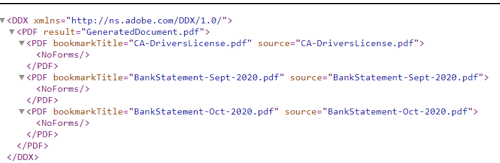

# Formulierbijlagen samenstellen

Dit artikel bevat elementen waarmee u aangepaste formulierbijlagen in een bepaalde volgorde kunt samenstellen. Deze voorbeeldcode werkt alleen als de formulierbijlagen de PDF-indeling hebben. Het volgende is het gebruiksgeval.
Door het invullen van een adaptief formulier worden een of meer PDF-documenten aan het formulier gekoppeld.
Bij het verzenden van een formulier stelt u in dat de formulierbijlagen één PDF moeten genereren. U kunt de volgorde opgeven waarin de bijlagen worden samengevoegd om de uiteindelijke PDF te genereren.

## Creeer component OSGi die WorkflowProcess interface uitvoert

Creeer een component OSGi die [com.adobe.granite.workflow.exec.WorkflowProcess interface](https://helpx.adobe.com/experience-manager/6-5/sites/developing/using/reference-materials/javadoc/com/adobe/granite/workflow/exec/WorkflowProcess.html) uitvoert. De code in deze component kan aan de component van de processtap in het AEM werkschema worden geassocieerd. De methode execute van de interface com.adobe.granite.workflow.exec.WorkflowProcess wordt geïmplementeerd in deze component.

Wanneer een adaptief formulier wordt verzonden om een AEM workflow te activeren, worden de verzonden gegevens opgeslagen in het opgegeven bestand onder de payload-map. Dit is bijvoorbeeld het ingediende gegevensbestand. We moeten de bijlagen samenstellen die in de tag idcard en bankstatements zijn gespecificeerd.
.

### De tagnamen ophalen

De volgorde van de bijlagen wordt opgegeven als argumenten voor processtappen in de workflow, zoals wordt weergegeven in de onderstaande schermafbeelding. Hier zijn we bezig met het samenstellen van de bijlagen die aan de werkkaart zijn toegevoegd, gevolgd door bankafschriften


Het volgende codefragment extraheert de gehechtheidsnamen uit de procesargumenten

```java
String  []attachmentNames  = arg2.get("PROCESS_ARGS","string").toString().split(",");
```

### DDX maken van de bijlagenamen

Vervolgens moeten we [Document Description XML (DDX)](https://helpx.adobe.com/pdf/aem-forms/6-2/ddxRef.pdf)-document maken dat door de Assembler-service wordt gebruikt om documenten samen te stellen. Het volgende is DDX die van de procesargumenten werd gecreeerd. Met het element NoForms kunt u op XFA gebaseerde documenten samenvoegen. De PDF-bronelementen bevinden zich in de juiste volgorde zoals is opgegeven in de procesargumenten.



### Kaart met documenten maken

Vervolgens maken we een kaart met documenten met de naam van de bijlage als sleutel en de bijlage als waarde. De de bouwerdienst van de vraag werd gebruikt om de gehechtheid onder de nuttige ladingspad te vragen en de kaart van documenten te bouwen. Deze kaart van document samen met DDX is nodig voor de assembleerdienst om definitieve pdf samen te stellen.

```java
public Map<String, Object> createMapOfDocuments(String payloadPath,WorkflowSession workflowSession )
{
  Map<String, String> queryMap = new HashMap<String, String>();
  Map<String,Object>mapOfDocuments = new HashMap<String,Object>();
  queryMap.put("type", "nt:file");
  queryMap.put("path",payloadPath);
  Query query = queryBuilder.createQuery(PredicateGroup.create(queryMap),workflowSession.adaptTo(Session.class));
  query.setStart(0);
  query.setHitsPerPage(30);
  SearchResult result = query.getResult();
  log.debug("Get result hits "+result.getHits().size());
  for (Hit hit : result.getHits()) {
    try {
          String path = hit.getPath();
          log.debug("The title "+hit.getTitle()+" path "+path);
          if(hit.getTitle().endsWith("pdf"))
           {
             com.adobe.aemfd.docmanager.Document attachmentDocument = new com.adobe.aemfd.docmanager.Document(path);
             mapOfDocuments.put(hit.getTitle(),attachmentDocument);
             log.debug("@@@@Added to map@@@@@ "+hit.getTitle());
           }
        }
    catch (Exception e)
       {
          log.debug(e.getMessage());
       }

}
return mapOfDocuments;
}
```

### Gebruik AssemblerService om de documenten samen te stellen

Nadat DDX en de documentkaart worden gecreeerd, is de volgende stap het gebruik AssemblerService om de documenten samen te stellen.
De volgende code assembleert en retourneert de geassembleerde pdf.

```java
private com.adobe.aemfd.docmanager.Document assembleDocuments(Map<String, Object> mapOfDocuments, com.adobe.aemfd.docmanager.Document ddxDocument)
{
    AssemblerOptionSpec aoSpec = new AssemblerOptionSpec();
    aoSpec.setFailOnError(true);
    AssemblerResult ar = null;
    try
    {
        ar = assemblerService.invoke(ddxDocument, mapOfDocuments, aoSpec);
        return (com.adobe.aemfd.docmanager.Document) ar.getDocuments().get("GeneratedDocument.pdf");
    }
    catch (OperationException e)
    {
        log.debug(e.getMessage());
    }
    return null;
    
}
```

### De geassembleerde PDF opslaan onder de payload-map

De laatste stap bestaat uit het opslaan van de geassembleerde PDF onder de payload-map. Dit pdf-bestand kan vervolgens worden geopend in de volgende stappen van de workflow voor verdere verwerking.
Het volgende codefragment is gebruikt om het bestand op te slaan in de map payload

```java
Session session = workflowSession.adaptTo(Session.class);
javax.jcr.Node payloadNode =  workflowSession.adaptTo(Session.class).getNode(workItem.getWorkflowData().getPayload().toString());
log.debug("The payload Path is "+payloadNode.getPath());
javax.jcr.Node assembledPDFNode = payloadNode.addNode("assembled-pdf.pdf", "nt:file"); 
javax.jcr.Node jcrContentNode =  assembledPDFNode.addNode("jcr:content", "nt:resource");
Binary binary =  session.getValueFactory().createBinary(assembledDocument.getInputStream());
jcrContentNode.setProperty("jcr:data", binary);
log.debug("Saved !!!!!!"); 
session.save();
```

Hier volgt de structuur van de payload-map nadat de formulierbijlagen zijn samengesteld en opgeslagen.


### Om deze functie te laten werken op uw AEM

* Download [Formulierbijlagen samenstellen Formulier](assets/assemble-form-attachments-af.zip) naar uw lokale systeem.
* Importeer het formulier van de pagina[Forms And Documents](http://localhost:4502/aem/forms.html/content/dam/formsanddocuments).
* Download [workflow](assets/assemble-form-attachments.zip) en importeer in AEM met pakketbeheer.
* Download de [aangepaste bundel](assets/assembletaskattachments.assembletaskattachments.core-1.0-SNAPSHOT.jar)
* De bundel implementeren en starten met de [webconsole](http://localhost:4502/system/console/bundles)
* Wijs uw browser aan [Formulier voor bijlagen samenstellen](http://localhost:4502/content/dam/formsanddocuments/assembleattachments/jcr:content?wcmmode=disabled)
* Voeg een bijlage in het ID-document en een paar pdf-documenten toe aan de sectie met bankafschriften
* Het formulier verzenden om de workflow te activeren
* Controleer de [payload-map van de workflow in de crx](http://localhost:4502/crx/de/index.jsp#/var/fd/dashboard/payload) voor de geassembleerde pdf

>[!NOTE]
> Als u registreerapparaat voor de douanebundel hebt toegelaten wordt DDX en het geassembleerde dossier geschreven aan de omslag van uw AEM installatie.

