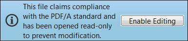

# PDF

Portable Document Format (PDF) is in feite een reeks bestandsindelingen en in dit artikel worden de bestandsindelingen beschreven die het meest relevant zijn voor formulierontwikkelaars. Veel van de technische details en standaarden van verschillende PDF-typen evolueren en veranderen. Sommige van deze formaten en specificaties zijn ISO-normen (International Organisation for Standardization) en sommige zijn specifieke intellectuele eigendom van Adobe.

In dit artikel wordt uitgelegd hoe u verschillende typen PDF&#39;s kunt maken. Het helpt u begrijpen hoe en waarom om elk te gebruiken. Al deze typen werken het beste in de Premier Client Tool voor het weergeven en werken met PDF&#39;s—Adobe Acrobat DC.

Hieronder ziet u een voorbeeld van een PDF/A-bestand in Acrobat DC.

De dossiers van de steekproef kunnen [&#x200B; van hier worden gedownload &#x200B;](assets/pdf-file-types.zip)

## XML Forms Architecture PDF (XFA PDF)

Adobe gebruikt de term XFA PDF-formulier om te verwijzen naar de interactieve en dynamische Forms die u met AEM Forms Designer maakt. De Forms en de bestanden die u met Designer maakt, zijn gebaseerd op de Adobe XML Forms Architecture (XFA). In veel opzichten is de XFA PDF-bestandsindeling dichter bij een HTML-bestand dan bij een traditioneel PDF-bestand. De volgende code toont bijvoorbeeld hoe een eenvoudig tekstobject eruitziet in een XFA PDF-bestand.

XFA Forms is gebaseerd op XML. Met deze goed gestructureerde en flexibele indeling kan een AEM Forms Server uw Designer-bestanden transformeren in verschillende indelingen, zoals traditionele PDF, PDF/A en HTML. U kunt de volledige XML-structuur van uw Forms in Designer zien door het tabblad XML Source van de Indelingseditor te selecteren. U kunt zowel statische als dynamische XFA Forms maken in AEM Forms Designer.

## Statische PDF

De statische lay-out XFA PDF forms verandert nooit bij runtime, maar zij kunnen voor de gebruiker interactief zijn. Hier volgen enkele voordelen van statische XFA PDF forms:

* De statische lay-out XFA PDF forms verandert nooit bij runtime, maar zij kunnen voor de gebruiker interactief zijn.
* Statische Forms biedt ondersteuning voor Acrobat-gereedschappen Opmerkingen en Markeringen.
* Met statische Forms kunt u Acrobat-opmerkingen importeren en exporteren.
* Statische Forms biedt ondersteuning voor subsets van lettertypen. Dit is een techniek die op een AEM Forms-server kan worden uitgevoerd.
* Statische Forms kan worden gerenderd met de ingebouwde PDF-viewer die bij moderne browsers wordt geleverd.

>[!NOTE]
>
> U kunt statische PDF&#39;s maken met AEM Forms Designer door de XDP op te slaan als Adobe Static PDF Form

### Dynamische Forms

Dynamische XFA PDF&#39;s kunnen hun indeling tijdens runtime wijzigen, zodat de functies voor opmerkingen en markeringen niet worden ondersteund. Dynamische XFA PDF&#39;s bieden echter wel de volgende voordelen:

* Dynamische formulieren ondersteunen clientscripts die de indeling en paginering van het formulier wijzigen. Zo wordt Purchase Order.xdp uitgevouwen en gepagineerd voor een eindeloze hoeveelheid gegevens als u deze opslaat als een dynamisch formulier
* Dynamische formulieren ondersteunen alle eigenschappen van het formulier tijdens runtime, terwijl statische formulieren alleen een subset ondersteunen

* [&#x200B; verwijs naar dit document om de verschillen tussen statische en dynamische pdf- vormen te begrijpen &#x200B;](https://experienceleague.adobe.com/docs/experience-manager-learn/forms/document-services/pdf-forms-and-documents.html?lang=nl-NL#:~:text=Dynamic%20forms%20support%20all%20the,forms%20support%20only%20a%20subset)

>[!NOTE]
>
> U kunt dynamische PDF&#39;s maken met AEM Forms Designer door de XDP op te slaan als dynamisch XML-formulier van Adobe

>[!NOTE]
>
> Dynamische formulieren kunnen niet worden gegenereerd met de ingebouwde PDF-viewers van moderne browsers.

### PDF-bestand (traditionele PDF)

Een gecertificeerd document biedt PDF-documenten en Forms-ontvangers extra garanties ten aanzien van authenticiteit en integriteit.

De populairste en meest gangbare PDF-indeling is het traditionele PDF-bestand. Er zijn veel manieren om een traditioneel PDF-bestand te maken, zoals het gebruik van Acrobat en veel hulpprogramma&#39;s van derden. Acrobat biedt de volgende manieren om traditionele PDF-bestanden te maken. Als u Acrobat niet hebt geïnstalleerd, ziet u deze opties mogelijk niet op uw computer.

* Door de afdrukstroom van een desktoptoepassing vast te leggen: kies de opdracht Afdrukken van een ontwerptoepassing en selecteer het Adobe PDF-printerpictogram. In plaats van een afgedrukte kopie van uw document hebt u een PDF-bestand van uw document gemaakt
* Met de Acrobat PDFMaker-plug-in in Microsoft Office-toepassingen: wanneer u Acrobat installeert, wordt een Adobe PDF-menu toegevoegd aan Microsoft Office-toepassingen en een pictogram aan het Office-lint. U kunt deze toegevoegde functies gebruiken om PDF-bestanden rechtstreeks in Microsoft Office te maken
* Door Acrobat Distiller te gebruiken om PostScript- en Encapsulated PostScript-bestanden (EPS) te converteren naar PDF&#39;s: Distiller wordt doorgaans gebruikt voor publicatie op papier en andere workflows die een conversie van de PostScript-indeling naar de PDF-indeling vereisen
* Onder de kap is een traditionele PDF heel anders dan een XFA PDF. Het heeft niet de zelfde structuur van XML, en aangezien het door de drukstroom van een dossier wordt gecreeerd te vangen, is een traditionele PDF een statisch en read-only dossier.

Een gecertificeerd document biedt ontvangers van PDF-documenten en formulieren extra garanties ten aanzien van authenticiteit en integriteit.

### Acrovormen

Acroforms zijn Adobe&#39;s oude interactieve formuliertechnologie; ze zijn terug te vinden in Acrobat versie 3. Adobe verstrekt de [&#x200B; Verwijzing van Forms API van Acrobat &#x200B;](assets/FormsAPIReference.pdf), gedateerd Mei 2003, om de technische details voor deze technologie te verstrekken. Acrovormen zijn een combinatie van de
de volgende items:

* Een traditionele PDF die de statische indeling en afbeeldingen van het formulier definieert.
* Interactieve formuliervelden die op de voorgrond zijn bevestigd met de formuliergereedschappen van het Adobe Acrobat-programma. Deze formuliergereedschappen vormen een kleine subset van wat beschikbaar is in AEM Forms Designer.

### PDF/A (PDF&#39;s voor archief)

PDF/A (PDF for Archives) bouwt voort op de voordelen van de documentopslag van traditionele PDF&#39;s met veel specifieke details die archivering op lange termijn verbeteren. De traditionele PDF-bestandsindeling biedt veel voordelen voor het opslaan van documenten op lange termijn. Het compacte karakter van PDF vergemakkelijkt gemakkelijke overdracht en bewaart ruimte, en zijn goed gestructureerde aard laat krachtige indexering en onderzoeksmogelijkheden toe. Traditionele PDF biedt uitgebreide ondersteuning voor metagegevens en PDF heeft al lang ondersteuning voor verschillende computeromgevingen.

Net als PDF is PDF/A een ISO-standaardspecificatie. Het werd ontwikkeld door een task force die AIIM (Association for Information and Image Management), NPES (National Printing Equipment Association) en de Administratieve Office van de Amerikaanse rechtbanken omvatte. Aangezien het doel van de PDF/A-specificatie is om een archiefindeling voor de lange termijn te bieden, worden veel PDF-functies weggelaten, zodat de bestanden op zichzelf kunnen staan. Hieronder volgen enkele belangrijke punten in de specificatie die de reproduceerbaarheid op lange termijn van het PDF/A-bestand verbeteren:

* Alle inhoud moet in het bestand staan en er kunnen geen afhankelijkheden zijn van externe bronnen, zoals hyperlinks, lettertypen of softwareprogramma&#39;s.
* Alle lettertypen moeten worden ingesloten en het moeten lettertypen zijn met een licentie voor onbeperkt gebruik voor elektronische documenten.
* JavaScript is niet toegestaan
* Transparantie is niet toegestaan
* Versleuteling is niet toegestaan
* Audio- en video-inhoud is niet toegestaan
* Kleurruimten moeten op een apparaatonafhankelijke manier worden gedefinieerd
* Alle metagegevens moeten aan bepaalde normen voldoen

### Een PDF/A-bestand weergeven

Twee bestanden in de voorbeeldbestanden zijn gemaakt van hetzelfde Microsoft Word-bestand. Het ene bestand is gemaakt als een traditionele PDF en het andere als een PDF/A-bestand. Open deze twee bestanden in Acrobat Professional:

* simpleWordFile.pdf
* simpleWordFilePDFA.pdf

Hoewel de documenten er hetzelfde uitzien, wordt het PDF/A-bestand geopend met een blauwe balk boven in het scherm, ten teken dat u dit document in de modus PDF/A weergeeft. Deze blauwe balk is een Acrobat-documentberichtenbalk die wordt weergegeven wanneer u bepaalde typen PDF-bestanden opent.

De documentberichtenbalk bevat instructies en mogelijk knoppen waarmee u een taak kunt uitvoeren. De PDF heeft een kleurcodering en u ziet de blauwe kleur wanneer u speciale typen PDF&#39;s (zoals dit PDF/A-bestand) en gecertificeerde en digitaal ondertekende PDF&#39;s opent. De balk verandert van paars voor PDF forms en geel als je deelneemt aan een PDF-revisie.

>[!NOTE]
>
> Als u op Bewerken inschakelen klikt, haalt u dit document uit de PDF/A-compatibiliteit.
