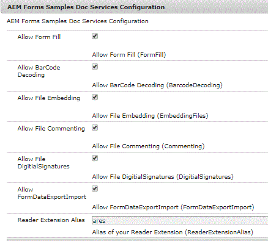

# XDP renderen in PDF met gebruiksrechten{#rendering-xdp-into-pdf-with-usage-rights}

Een veel voorkomend geval is het renderen van xdp in PDF en het toepassen van Reader Extensions op de gerenderde PDF.

Als een gebruiker bijvoorbeeld op XDP klikt in een formulierportal van AEM Forms, kunnen we XDP renderen als PDF en lezer de PDF uitbreiden.


Voor dit gebruiksgeval moeten we het volgende doen.

* Voeg het certificaat van de Uitbreidingen van de Reader aan &quot;fd-dienst&quot;gebruiker toe. De stappen om de credentie van de Uitbreidingen van de Reader toe te voegen zijn vermeld [ hier ](https://experienceleague.adobe.com/docs/experience-manager-65/forms/install-aem-forms/osgi-installation/install-configure-document-services.html?lang=en)


* U kunt ook naar de video verwijzen bij [ vormend de geloofsbrieven van de Uitbreidingen van de Reader ](https://experienceleague.adobe.com/docs/experience-manager-learn/forms/document-services/configuring-reader-extension-osgi.html)


* Creeer de douanedienst OSGi die teruggeeft en gebruiksrechten toepast. De code om dit te bereiken wordt hieronder vermeld

## XDP renderen en gebruiksrechten toepassen {#render-xdp-and-apply-usage-rights}

* Lijn 7: Gebruikend renderPDFForm van FormsService produceren wij PDF van XDP.

* Lijnen 8 tot en met 14: De toepasselijke gebruiksrechten worden vastgesteld. Deze gebruiksrechten worden opgehaald van de OSGi-configuratiemontages.

* Lijn 20: Gebruik resourceresolver verbonden aan de dienst van de de dienstgebruiker

* Regel 24: De methode secureDocument van DocumentAssuranceService wordt gebruikt om de gebruiksrechten toe te passen

```java
 public Document renderAndExtendXdp(String xdpPath) {
  // TODO Auto-generated method stub
  log.debug("In renderAndExtend xdp the alias is " + docConfig.ReaderExtensionAlias());
  PDFFormRenderOptions renderOptions = new PDFFormRenderOptions();
  renderOptions.setAcrobatVersion(AcrobatVersion.Acrobat_11);
  try {
   Document xdpRenderedAsPDF = formsService.renderPDFForm("crx://" + xdpPath, null, renderOptions);
   UsageRights usageRights = new UsageRights();
   usageRights.setEnabledBarcodeDecoding(docConfig.BarcodeDecoding());
   usageRights.setEnabledFormFillIn(docConfig.FormFill());
   usageRights.setEnabledComments(docConfig.Commenting());
   usageRights.setEnabledEmbeddedFiles(docConfig.EmbeddingFiles());
   usageRights.setEnabledDigitalSignatures(docConfig.DigitialSignatures());
   usageRights.setEnabledFormDataImportExport(docConfig.FormDataExportImport());
   ReaderExtensionsOptionSpec reOptionsSpec = new ReaderExtensionsOptionSpec(usageRights, "Sample ARES");
   UnlockOptions unlockOptions = null;
   ReaderExtensionOptions reOptions = ReaderExtensionOptions.getInstance();
   reOptions.setCredentialAlias(docConfig.ReaderExtensionAlias());
   log.debug("set the credential");
   reOptions.setResourceResolver(getResolver.getFormsServiceResolver());
   
   reOptions.setReOptions(reOptionsSpec);
   log.debug("set the resourceResolver and re spec");
   xdpRenderedAsPDF = docAssuranceService.secureDocument(xdpRenderedAsPDF, null, null, reOptions,
     unlockOptions);

   return xdpRenderedAsPDF;
  } catch (FormsServiceException e) {
   // TODO Auto-generated catch block
   e.printStackTrace();
  } catch (Exception e) {
   // TODO Auto-generated catch block
   e.printStackTrace();
  }
  return null;

 }
```

Het volgende schermschot toont u de configuratieeigenschappen blootgesteld. De meeste algemene gebruiksrechten worden via deze configuratie weergegeven.



De volgende code toont u de code die wordt gebruikt om de OSGi configuratiemontages te bouwen

```java
package com.aemformssamples.configuration;

import org.osgi.service.metatype.annotations.AttributeDefinition;
import org.osgi.service.metatype.annotations.AttributeType;
import org.osgi.service.metatype.annotations.ObjectClassDefinition;

@ObjectClassDefinition(name = "AEM Forms Samples Doc Services Configuration", description = "AEM Forms Samples Doc Services Configuration")
public @interface DocSvcConfiguration {
 @AttributeDefinition(name = "Allow Form Fill", description = "Allow Form Fill", type = AttributeType.BOOLEAN)
 boolean FormFill() default false;

 @AttributeDefinition(name = "Allow BarCode Decoding", description = "Allow BarCode Decoding", type = AttributeType.BOOLEAN)
 boolean BarcodeDecoding() default false;

 @AttributeDefinition(name = "Allow File Embedding", description = "Allow File Embedding", type = AttributeType.BOOLEAN)
 boolean EmbeddingFiles() default false;

 @AttributeDefinition(name = "Allow Commenting", description = "Allow Commenting", type = AttributeType.BOOLEAN)
 boolean Commenting() default false;

 @AttributeDefinition(name = "Allow DigitialSignatures", description = "Allow File DigitialSignatures", type = AttributeType.BOOLEAN)
 boolean DigitialSignatures() default false;

 @AttributeDefinition(name = "Allow FormDataExportImport", description = "Allow FormDataExportImport", type = AttributeType.BOOLEAN)
 boolean FormDataExportImport() default false;

 @AttributeDefinition(name = "Reader Extension Alias", description = "Alias of your Reader Extension")
 String ReaderExtensionAlias() default "";

}
```

## Servlet maken om de PDF te streamen {#create-servlet-to-stream-the-pdf}

De volgende stap bestaat uit het maken van een servlet met een methode GET om de lezer uitgebreide PDF naar de gebruiker terug te sturen. In dit geval wordt de gebruiker gevraagd de PDF op te slaan in zijn bestandssysteem. De reden hiervoor is dat de PDF wordt weergegeven als dynamische PDF en dat de PDF-viewers die bij de browsers worden geleverd, geen dynamische PDF&#39;s verwerken.

Hier volgt de code voor de servlet. We geven het pad van de XDP in de CRX-opslagplaats door aan deze servlet.

Vervolgens roept u de methode renderAndExtendXdp van com.aemformssamples.documentservices.core.DocumentServices aan.

De lezer extended PDF wordt vervolgens gestreamd naar de aanroepende toepassing

```java
package com.aemformssamples.documentservices.core.servlets;

import java.io.IOException;
import java.io.InputStream;
import java.io.OutputStream;

import javax.servlet.Servlet;

import org.apache.sling.api.SlingHttpServletRequest;
import org.apache.sling.api.SlingHttpServletResponse;
import org.apache.sling.api.servlets.SlingSafeMethodsServlet;
import org.osgi.service.component.annotations.Component;
import org.osgi.service.component.annotations.Reference;
import org.slf4j.Logger;
import org.slf4j.LoggerFactory;

import com.adobe.aemfd.docmanager.Document;
import com.adobe.fd.forms.api.FormsService;
import com.aemformssamples.documentservices.core.DocumentServices;

@Component(service = Servlet.class, property = {

  "sling.servlet.methods=get",

  "sling.servlet.paths=/bin/renderandextend"

})
public class RenderAndReaderExtend extends SlingSafeMethodsServlet {
 @Reference
 FormsService formsService;
 @Reference
 DocumentServices documentServices;
 private static final Logger log = LoggerFactory.getLogger(RenderAndReaderExtend.class);
 private static final long serialVersionUID = 1L;

 protected void doGet(SlingHttpServletRequest request, SlingHttpServletResponse response) {
  log.debug("The path of the XDP I got was " + request.getParameter("xdpPath"));
  Document renderedPDF = documentServices.renderAndExtendXdp(request.getParameter("xdpPath"));
  response.setContentType("application/pdf");
  response.addHeader("Content-Disposition", "attachment; filename=AemFormsRocks.pdf");
  try {
   response.setContentLength((int) renderedPDF.length());
   InputStream fileInputStream = null;
   fileInputStream = renderedPDF.getInputStream();
   OutputStream responseOutputStream = null;
   responseOutputStream = response.getOutputStream();
   int bytes;
   while ((bytes = fileInputStream.read()) != -1) {
    {
     responseOutputStream.write(bytes);
    }

   }
  } catch (IOException e2) {
   // TODO Auto-generated catch block
   e2.printStackTrace();
  }

 }

}
```

Voer de volgende stappen uit om dit op uw lokale server te testen
1. [Download en installeer de DevelopingWithServiceUser Bundle](/help/forms/assets/common-osgi-bundles/DevelopingWithServiceUser.jar)
1. [De AEMFormsDocumentServices-bundel downloaden en installeren](/help/forms/assets/common-osgi-bundles/AEMFormsDocumentServices.core-1.0-SNAPSHOT.jar)

1. [De aangepaste portalsjabloon html downloaden](assets/render-and-extend-template.zip)
1. [De aan dit artikel gerelateerde elementen downloaden en importeren in AEM met behulp van pakketbeheer](assets/renderandextendxdp.zip)
   * Dit pakket bevat voorbeeldportal en xdp-bestand
1. Certificaat van extensies voor Readers toevoegen aan gebruiker van het type fd-service
1. Punt uw browser aan [ portalwebpagina ](http://localhost:4502/content/AemForms/ReaderExtensionsXdp.html)
1. Klik op het pictogram pdf om de xdp te renderen als een PDF-bestand waarop gebruiksrechten zijn toegepast.
