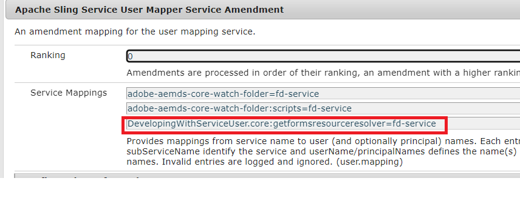

# PDF-document met fragmenten genereren met behulp van ECMA-script{#developing-with-output-and-forms-services-in-aem-forms}


In dit artikel gebruiken we de uitvoerservice om PDF-bestanden te genereren met xdp-fragmenten. De hoofd xdp en de fragmenten verblijven in de crx bewaarplaats. Het is belangrijk dat u de mapstructuur van het bestandssysteem in AEM nabootst. Bijvoorbeeld als u een fragment in fragmentomslag in uw xdp gebruikt moet u een omslag creëren genoemd **fragmenten** onder uw basisomslag in AEM. De basismap bevat uw basis-xdp-sjabloon. Bijvoorbeeld, als u de volgende structuur op uw dossiersysteem hebt
* c:\xdptemplates - Deze bevat uw basis-xdp-sjabloon
* c:\xdptemplates\fragments - Deze map bevat fragmenten en de hoofdsjabloon verwijst naar het fragment zoals hieronder wordt weergegeven
  .
* De omslag xdpdocuments zal uw basissjabloon en de fragmenten in **fragments** omslag bevatten

U kunt de vereiste structuur tot stand brengen gebruikend [ vormen en document ui ](http://localhost:4502/aem/forms.html/content/dam/formsanddocuments)

Hier volgt de mapstructuur voor de voorbeeld-xdp die 2 fragmenten gebruikt


* Uitvoerservice - Deze service wordt doorgaans gebruikt om XML-gegevens samen te voegen met de xdp-sjabloon of pdf om samengevoegde pdf te genereren. Voor meer details, gelieve te verwijzen naar [ javadoc ](https://helpx.adobe.com/experience-manager/6-5/forms/javadocs/index.html?com/adobe/fd/output/api/OutputService.html) voor de dienst van de Output. In dit voorbeeld gebruiken we fragmenten die zich in de crx-opslagplaats bevinden.


Het volgende ECMA-script is gebruikt om PDF te genereren. Bericht het gebruik van ResourceResolver en ResourceResolverHelper in de code. ResourceReolver is nodig aangezien deze code buiten om het even welke gebruikerscontext loopt.

```java
var inputMap = processorContext.getInputMap();
var itr = inputMap.entrySet().iterator();
var entry = inputMap.entrySet().iterator().next();
var xmlData = inputMap.get(entry.getKey());
log.info("Got XML Data File");

var resourceResolverHelper = sling.getService(Packages.com.adobe.granite.resourceresolverhelper.ResourceResolverHelper);
var aemDemoListings = sling.getService(Packages.com.mergeandfuse.getserviceuserresolver.GetResolver);
log.info("Got service resolver");
var resourceResolver = aemDemoListings.getFormsServiceResolver();
//The ResourceResolverHelper execute's the following code within the context of the resourceResolver 
resourceResolverHelper.callWith(resourceResolver, {call: function()
       {
             //var statement = new Packages.com.adobe.aemfd.docmanager.Document("/content/dam/formsanddocuments/xdpdocuments/main.xdp",resourceResolver);
               var outputService = sling.getService(Packages.com.adobe.fd.output.api.OutputService);
            var pdfOutputOptions = new Packages.com.adobe.fd.output.api.PDFOutputOptions();
            pdfOutputOptions.setContentRoot("crx:///content/dam/formsanddocuments/xdpdocuments");
            pdfOutputOptions.setAcrobatVersion(Packages.com.adobe.fd.output.api.AcrobatVersion.Acrobat_11);
            var dataMergedDocument = outputService.generatePDFOutput("main.xdp",xmlData,pdfOutputOptions);
               //var dataMergedDocument = outputService.generatePDFOutput(statement,xmlData,pdfOutputOptions);
            processorContext.setResult("mergeddocument.pdf",dataMergedDocument);
            log.info("Generated the pdf document with fragments");
      }

 });
```

**om het steekproefpakket op uw systeem** te testen
* [Implementeer de DevelopingWithServiceUSer-bundel](assets/DevelopingWithServiceUser.jar)
* Voeg de ingang **DevelopingWithServiceUser.core toe:getformsresourceresolver=fd-service** in het de dienstamendement van de gebruikershandkaart zoals aangetoond in hieronder het scherm
  
* [ Download en voer de steekproefXdp- dossiers en manuscripten ECMA ](assets/watched-folder-fragments-ecma.zip) in.
Hiermee wordt een gecontroleerde mapstructuur gemaakt in de map c:/fragmentsandoutputservice

* [ extraheert het dossier van steekproefgegevens ](assets/usingFragmentsSampleData.zip) en plaatst het in de installatiemap van uw gelete op omslag (c:\fragmentsandoutputdienst \ installeert)

* Controleer de resultatenmap van de configuratie van de gecontroleerde map op het gegenereerde PDF-bestand
