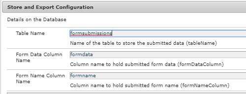

# Inleiding

Klanten willen de ingediende formuliergegevens doorgaans exporteren in CSV-indeling. In dit artikel worden de stappen gemarkeerd die nodig zijn om de formuliergegevens in CSV-indeling te exporteren. In dit artikel wordt ervan uitgegaan dat de formulierverzendingen worden opgeslagen in de RDBMS-tabel. In de volgende schermafbeelding wordt de minimale tabelstructuur beschreven die vereist is om de verzonden formulieren op te slaan.

>[!NOTE]
>
>Dit voorbeeld werkt alleen met Adaptief Forms dat niet is gebaseerd op het schema of het formuliergegevensmodel


StructureAs u kunt zien dat de naam van het schema een modelstudie is. In dit schema worden de tabelopmaak weergegeven met de volgende gedefinieerde kolommen

* formatiegegevens: Deze kolom bevat de verzonden formuliergegevens
* naam van de indeling: Deze kolom bevat de naam van het verzonden formulier
* id: Dit is de primaire sleutel en wordt ingesteld op automatisch verhogen

De lijstnaam en de twee-kolomnamen worden blootgesteld als OSGi configuratieeigenschappen zoals aangetoond in het hieronder scherm:

De code leest deze waarden en construeert de juiste SQL-query die moet worden uitgevoerd. De volgende query wordt bijvoorbeeld uitgevoerd op basis van de bovenstaande waarden
**Formuliergegevens SELECTEREN UIT AMMormstutorial.formsubmission waarbij formname=timeoffrequestform**
In de bovenstaande query wordt de naam van het formulier (timeoffrequestform) doorgegeven als aanvraagparameter aan de servlet.

## **OSGi-service maken**

De volgende dienst OSGI werd gecreeerd om de voorgelegde gegevens in CSV formaat uit te voeren.

* Regel 37: We benaderen Apache Sling Connection Pooled DataSource.

* Regel 89: Dit is het ingangspunt voor de service. De methode `getCSVFile(..)` neemt formName op als invoerparameter en haalt de verzonden gegevens met betrekking tot de opgegeven formuliernaam op.

>[!NOTE]
>
>De code veronderstelt u verbinding samengevoegde DataSource genoemd &quot;aemformstutorial&quot;in de Console van het Web van Felix hebt bepaald.De code veronderstelt ook dat u een schema in het gegevensbestand genoemd aemformstutorial hebt

```java
package com.aemforms.storeandexport.core;

import java.io.IOException;
import java.io.StringReader;
import java.sql.Connection;
import java.sql.PreparedStatement;
import java.sql.ResultSet;
import java.sql.SQLException;
import java.sql.Statement;
import java.util.ArrayList;
import java.util.List;

import javax.sql.DataSource;
import javax.xml.parsers.DocumentBuilder;
import javax.xml.parsers.DocumentBuilderFactory;
import javax.xml.parsers.ParserConfigurationException;
import javax.xml.xpath.XPath;
import javax.xml.xpath.XPathConstants;
import javax.xml.xpath.XPathExpressionException;
import javax.xml.xpath.XPathFactory;

import org.osgi.service.component.annotations.Component;
import org.osgi.service.component.annotations.Reference;
import org.slf4j.Logger;
import org.slf4j.LoggerFactory;
import org.w3c.dom.Document;
import org.w3c.dom.Node;
import org.w3c.dom.NodeList;
import org.xml.sax.InputSource;
import org.xml.sax.SAXException;

@Component(service = StoreAndExport.class)
public class StoreAndExportImpl implements StoreAndExport {

    private final Logger log = LoggerFactory.getLogger(getClass());
    @Reference
    StoreAndExportConfigurationService config;
    @Reference(target = "(&(objectclass=javax.sql.DataSource)(datasource.name=aemformstutorial))")
    private DataSource dataSource;

    private List<String> getRowValues(String row) {
        List<String> rowValues = new ArrayList<String>();
        //API to obtain DOM Document instance
        DocumentBuilderFactory factory = DocumentBuilderFactory.newInstance();
        DocumentBuilder builder = null;
        try {
            builder = factory.newDocumentBuilder();
            Document doc = builder.parse(new InputSource(new StringReader(row)));
            XPathFactory xpf = XPathFactory.newInstance();
            XPath xpath = xpf.newXPath();
            Node dataNode = (Node) xpath.evaluate("//afData/afUnboundData/data", doc, XPathConstants.NODE);
            NodeList dataElements = dataNode.getChildNodes();
            for (int i = 0; i < dataElements.getLength(); i++) {
                log.debug("The name of the node is" + dataElements.item(i).getNodeName() + " the node value is " + dataElements.item(i).getTextContent());
                rowValues.add(i, dataElements.item(i).getTextContent());
            }
            return rowValues;
        } catch (Exception e) {
            log.debug(e.getMessage());
        }
        return null;
    }

    private List<String> getHeaderValues(String row) {
        DocumentBuilderFactory factory = DocumentBuilderFactory.newInstance();
        List<String> rowValues = new ArrayList<String>();
        DocumentBuilder builder = null;
        try {
            //Create DocumentBuilder with default configuration
            builder = factory.newDocumentBuilder();
            Document doc = builder.parse(new InputSource(new StringReader(row)));
            XPathFactory xpf = XPathFactory.newInstance();
            XPath xpath = xpf.newXPath();
            Node dataNode = (Node) xpath.evaluate("//afData/afUnboundData/data", doc, XPathConstants.NODE);
            NodeList dataElements = dataNode.getChildNodes();
            for (int i = 0; i < dataElements.getLength(); i++) {
                rowValues.add(i, dataElements.item(i).getNodeName());
            }
            return rowValues;
        } catch (Exception e) {
            log.debug(e.getMessage());
        }
        return null;

    }

    @Override
    public StringBuilder getCSVFile(String formName) {
        log.debug("In get CSV File");
        String selectStatement = "SELECT " + config.getFORM_DATA_COLUMN() + " FROM aemformstutorial." + config.getTABLE_NAME() + " where " + config.getFORM_NAME_COLUMN() + "='" + formName + "'" + "";
        log.debug("The select statment is " + selectStatement);
        Connection con = getConnection();
        Statement st = null;
        ResultSet rs = null;
        CSVUtils csvUtils = new CSVUtils();
        try {
            st = con.createStatement();
            rs = st.executeQuery(selectStatement);
            log.debug("Got Result Set in getCSVFile");
            StringBuilder sb = new StringBuilder();
            while (rs.next()) {
                if (rs.isFirst()) {
                    sb = csvUtils.writeLine(getHeaderValues(rs.getString(1)), sb);
                }
                sb = csvUtils.writeLine(getRowValues(rs.getString(1)), sb);
                log.debug("$$$$The current strng buffer is " + sb.toString());
            }

            return sb;
        } catch (Exception e) {
            log.debug(e.getMessage());
        } finally {
            try {
                rs.close();
            } catch (Exception e) { /* ignored */ }
            try {
                st.close();
            } catch (Exception e) { /* ignored */ }
            try {
                con.close();
            } catch (Exception e) { /* ignored */ }
        }

        return null;

    }

    private Connection getConnection() {
        log.debug("Getting Connection ");
        Connection con = null;
        try {
            con = dataSource.getConnection();
            log.debug("got connection");
            return con;
        } catch (Exception e) {
            log.debug("not able to get connection ");
            log.debug(e.getMessage());
        }
        return null;
    }
    
    @Override
    public void inserFormData(String formData) {
        String formDataColumn = config.getFORM_DATA_COLUMN();
        String formNameColumn = config.getFORM_NAME_COLUMN();
        String tableName = config.getTABLE_NAME();
        String insertStatement = "Insert into aemformstutorial." + tableName + "(" + formDataColumn + "," + formNameColumn + ") VALUES(?,?)";
        log.debug("The insert statment is" + insertStatement);
        Connection con = getConnection();
        PreparedStatement pstmt = null;
        try {
            DocumentBuilderFactory factory = DocumentBuilderFactory.newInstance();
            DocumentBuilder builder = null;
            builder = factory.newDocumentBuilder();
            Document xmlDoc = builder.parse(new InputSource(new StringReader(formData)));
            XPath xPath = javax.xml.xpath.XPathFactory.newInstance().newXPath();
            org.w3c.dom.Node submittedFormNameNode = (org.w3c.dom.Node) xPath.compile("/afData/afSubmissionInfo/afPath").evaluate(xmlDoc, javax.xml.xpath.XPathConstants.NODE);
            String paths[] = submittedFormNameNode.getTextContent().split("/");
            String formName = paths[paths.length - 1];
            log.debug("The form name submiited is" + formName);
            pstmt = null;
            pstmt = con.prepareStatement(insertStatement);
            pstmt.setString(1, formData);
            pstmt.setString(2, formName);
            log.debug("Executing the insert statment  " + pstmt.execute());
            con.commit();
        } catch (SQLException e) {
            log.debug(e.getMessage());
        } catch (ParserConfigurationException e) {
            log.debug(e.getMessage());
        } catch (SAXException e) {
            log.debug(e.getMessage());
        } catch (IOException e) {
            log.debug(e.getMessage());
        } catch (XPathExpressionException e) {
            log.debug(e.getMessage());
        } finally {
            try {
                pstmt.close();
            } catch (Exception e) { /* ignored */ }
            try {
                con.close();
            } catch (Exception e) { /* ignored */ }
        }
    }
}
```

## Configuratieservice

Wij hebben de volgende drie eigenschappen als configuratieeigenschappen OSGI blootgesteld. De SQL-query wordt samengesteld door deze waarden tijdens runtime te lezen.

```java
package com.aemforms.storeandexport.core;

import org.osgi.service.metatype.annotations.AttributeDefinition;
import org.osgi.service.metatype.annotations.ObjectClassDefinition;

@ObjectClassDefinition(name="Store and Export Configuration", description = "Details on the Database ")
public @interface StoreAndExportConfiguration {
    @AttributeDefinition(name = "Table Name", description = "Name of the table to store the submitted data")
    String tableName() default "formsubmissions";

    @AttributeDefinition(name = "Form Data Column Name", description = "Column name to hold submitted form data")
    String formDataColumn() default "formdata";

    @AttributeDefinition(name = "Form Name Column Name", description = "Column name to hold submitted form name")
    String formNameColumn() default "formname";
}
```

## Servlet

Hier volgt de servletcode die de methode `getCSVFile(..)` van de service aanroept. De service retourneert een StringBuffer-object dat vervolgens wordt gestreamd naar de aanroepende toepassing

```java
package com.aemforms.storeandexport.core.servlets;

import java.io.IOException;
import javax.servlet.Servlet;
import javax.servlet.ServletOutputStream;

import org.apache.sling.api.SlingHttpServletRequest;
import org.apache.sling.api.SlingHttpServletResponse;
import org.apache.sling.api.servlets.SlingAllMethodsServlet;
import org.osgi.service.component.annotations.Component;
import org.osgi.service.component.annotations.Reference;
import com.aemforms.storeandexport.core.StoreAndExport;

@Component(
        service = {Servlet.class}, 
        property = {"sling.servlet.methods=get", "sling.servlet.paths=/bin/streamformdata"}
)
public class StreamCSVFile extends SlingAllMethodsServlet {
    private static final long serialVersionUID = -3703364266795135086L;

    @Reference
    StoreAndExport createCSVFile;

    protected void doGet(SlingHttpServletRequest request, SlingHttpServletResponse response) {
        StringBuilder stringToStream = createCSVFile.getCSVFile(request.getParameter("formName"));
        response.setHeader("Content-Type", "text/csv");
        response.setHeader("Content-Disposition", "attachment;filename=\"formdata.csv\"");
        try {
            final ServletOutputStream sout = response.getOutputStream();
            sout.print(stringToStream.toString());
        } catch (IOException e) {
            log.debug(e.getMessage());
        }
    }
}
```

### Distribueren op uw server

* Importeer het [SQL-bestand](assets/formsubmissions.sql) in MySQL-server met MySQL Workbench. Dit leidt tot schema genoemd **aemformstutorial** en lijst genoemd **formsubmission** met sommige steekproefgegevens.
* [OSGi-bundel](assets/store-export.jar) implementeren met de Felix-webconsole
* [TimeOffRequest-verzendingen](http://localhost:4502/bin/streamformdata?formName=timeoffrequestform) ophalen. Het CSV-bestand moet naar u worden gestreamd.
