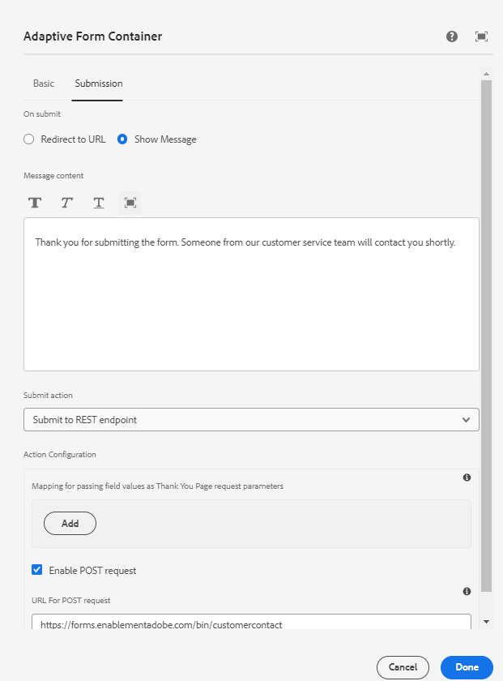

# Toon het gevormde dankwoodbericht

Een dankwoord bij het verzenden van een formulier is een doordachte manier om de gebruiker te bedanken en te bedanken voor het invullen en verzenden van een formulier. Zij vormt een bevestiging dat hun opmerkingen zijn ontvangen en beoordeeld. Het bedankbericht wordt geconfigureerd met het verzendtabblad van de hulplijncontainer van het adaptieve formulier



Het gevormde dankwoodbericht kan in de onSuccess gebeurtenismanager van de super component worden betreden AdaptiveForm.
De code voor het koppelen van de gebeurtenis onSuccess en de code voor de gebeurtenishandler onSuccess worden hieronder weergegeven

```javascript
<AdaptiveForm mappings={extendMappings} onSubmitSuccess={onSuccess} formJson={selectedForm}/>
```

```javascript
const onSuccess=(action) =>{
        let body = action.payload?.body;
        debugger;
        setThankYouMessage(body.thankYouMessage.replace(/<(.|\n)*?>/g, ''));
        console.log("Thank you message "+body.thankYouMessage.replace(/<(.|\n)*?>/g, ''));

      }
```

De volledige code van de component Contactfunctie wordt hieronder gegeven

```javascript
import Form from './components/Form';
import PlainText from './components/plainText';
import TextField from './components/TextField';
import Button from './components/Button';
import { useState,useEffect } from "react";
import { AdaptiveForm } from "@aemforms/af-react-renderer";
export default function Contact(){
  
    const [selectedForm, setForm] = useState("");
    const [thankYouMessage, setThankYouMessage] = useState("");
    const [formSubmitted, setFormSubmitted] = useState(false);
  
    const extendMappings = {
        'plain-text' : PlainText,
        'text-input' : TextField,
        'button' : Button,
        'form': Form
      };
     const onSuccess=(action) =>{
        let body = action.payload?.body;
        debugger;
        setFormSubmitted(true);
        setThankYouMessage(body.thankYouMessage.replace(/<(.|\n)*?>/g, ''));
        // Remove any html tags in the thank you message
        console.log("Thank you message "+body.thankYouMessage.replace(/<(.|\n)*?>/g, ''));

      }
      
      const getForm = async () => {
        
        const resp = await fetch('/adobe/forms/af/L2NvbnRlbnQvZm9ybXMvYWYvY29udGFjdHVz');
        // Get the form id manually using the listform api
        let formJSON = await resp.json();
        setForm(formJSON.afModelDefinition)
      }
      useEffect( ()=>{
        getForm()
        

    },[]);
    
    return(
        
        <div>
           {!formSubmitted ?
            (
                <div>
                    <h1>Get in touch with us!!!!</h1>
                    <AdaptiveForm mappings={extendMappings} onSubmitSuccess={onSuccess} formJson={selectedForm}/>
                </div>
            ) :
            (
                <div>
                    <div>{thankYouMessage}</div>
                </div>
            )}
        </div>
      
          
        
    )
}
```

De bovenstaande code gebruikt native HTML-componenten die zijn toegewezen aan de componenten die in het adaptieve formulier worden gebruikt. We wijzen bijvoorbeeld de adaptieve formuliercomponent voor tekstinvoer toe aan de component TextField. De inheemse componenten die in het artikel [&#x200B; worden gebruikt kunnen van hier worden gedownload &#x200B;](./assets/native-components.zip)
