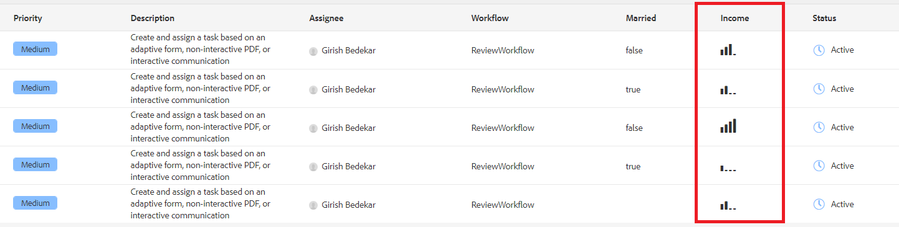

# Het gebruiken van sightmalplaatje om inbox gegevens te tonen

U kunt een hechte sjabloon gebruiken om de gegevens op te maken die in kolommen in het postvak moeten worden weergegeven. In dit voorbeeld worden koraal-ui-pictogrammen weergegeven afhankelijk van de waarde van de inkomenskolom. Het volgende screenshot toont het gebruik van pictogrammen in de inkomenskolom


[De ](assets/sightly-template.zip) sjabloon voor de weergave van aangepaste corale ui-pictogrammen is onderdeel van dit artikel.

## Correcte sjabloon

Na is het sibleke malplaatje. De code in het malplaatje toont pictogram afhankelijk van het inkomen. De pictogrammen zijn beschikbaar als deel van [koral ui pictogrambibliotheek](https://helpx.adobe.com/experience-manager/6-3/sites/developing/using/reference-materials/coral-ui/coralui3/Coral.Icon.html#availableIcons) die met AEM komt.

```java
<template data-sly-template.incomeTemplate="${@ item}>">
    <td is="coral-table-cell" class="payload-income-cell">
         <div data-sly-test="${(item.workflowMetadata && item.workflowMetadata.income)}" data-sly-set.income ="${item.workflowMetadata.income}">
                 <coral-icon icon="confidenceOne" size="M" data-sly-test="${income >=0 && income <10000}"></coral-icon>
                 <coral-icon icon="confidenceTwo" size="M" data-sly-test="${income >=10000 && income <100000}"></coral-icon>
                 <coral-icon icon="confidenceThree" size="M" data-sly-test="${income >=100000 && income <500000}"></coral-icon>
                 <coral-icon icon="confidenceFour" size="M" data-sly-test="${income >=500000}"></coral-icon>
          </div>
    </td>
</template>
```

## Serviceimplementatie

De volgende code is de de dienstimplementatie voor het tonen van de inkomenskolom.

Regel 12 associeert de kolom met het sibleke malplaatje

```java
import java.util.Map;
import org.osgi.service.component.annotations.Component;
import com.adobe.cq.inbox.ui.InboxItem;
import com.adobe.cq.inbox.ui.column.Column;
import com.adobe.cq.inbox.ui.column.provider.ColumnProvider;

@Component(service = ColumnProvider.class, immediate = true)
public class IncomeProvider implements ColumnProvider {
@Override
public Column getColumn() {

return new Column("income", "Income", String.class.getName(),"inbox/customization/column-templates.html", "incomeTemplate");
}

@Override
public Object getValue(InboxItem inboxItem) {
Object val = null;

Map workflowMetadata = inboxItem.getWorkflowMetadata();

if (workflowMetadata != null && workflowMetadata.containsKey("income"))
    val = workflowMetadata.get("income");

return val;
}
}
```

## Testen op uw server

>[!NOTE]
>
>In dit artikel wordt ervan uitgegaan dat u de [voorbeeldworkflow](assets/review-workflow.zip) en [voorbeeldformulier](assets/snap-form.zip) van [vorig artikel](https://docs.adobe.com/content/help/en/experience-manager-learn/forms/inbox-customization/add-married-column.md) in deze reeks hebt geïnstalleerd.

* [Aanmelden als beheerder bij crx](http://localhost:4502/crx/de/index.jsp)
* [sightsjabloon importeren](assets/sightly-template.zip)
* [Aanmelden bij AEM webconsole](http://localhost:4502/system/console/bundles)
* [Aanpassingsbundel inbox implementeren en starten](assets/income-column-customization.jar)
* [De inbox openen](http://localhost:4502/aem/inbox)
* Beheer beheren openen door te klikken op Lijstweergave naast de knop Maken
* Kolom Inkomen toevoegen aan Postvak In en uw wijzigingen opslaan
* [Geef een voorbeeld van het formulier weer](http://localhost:4502/content/dam/formsanddocuments/snapform/jcr:content?wcmmode=disabled)
* Selecteer de _huwelijksstatus_ en verzend het formulier
* [Inbox weergeven](http://localhost:4502/aem/inbox)

Als u het formulier verzendt, wordt de workflow geactiveerd en wordt een taak toegewezen aan de gebruiker van de &quot;beheerder&quot;. U moet het juiste pictogram zien onder de inkomenskolom
