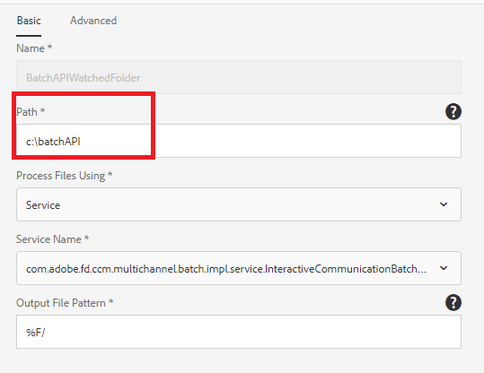

# Batch-API

U kunt de batch-API gebruiken om meerdere interactieve communicatie van een sjabloon te maken. De sjabloon is een interactieve communicatie zonder gegevens. De batch-API combineert gegevens met een sjabloon voor interactieve communicatie. De API is nuttig bij de massaproductie van interactieve communicatie. Bijvoorbeeld telefoonrekeningen, creditcardoverzichten voor meerdere klanten.

[Meer informatie over de API voor het genereren van batch](https://experienceleague.adobe.com/docs/experience-manager-65/forms/interactive-communications/generate-multiple-interactive-communication-using-batch-api.html)

Dit artikel bevat voorbeeldelementen voor het genereren van interactieve communicatiedocumenten met de Batch-API.

## Batchgeneratie met gecontroleerde map

* Het dialoogvenster Importeren [Interactieve communicatiesjabloon](assets/Beneficiaries-confirmation.zip) op uw AEM Forms-server.
* Het dialoogvenster Importeren [gecontroleerde mapconfiguratie](assets/batch-generation-api.zip). Hiermee wordt een map gemaakt met de naam `batchAPI` in uw C-station.

**Als u AEM Forms uitvoert op een ander besturingssysteem dan Windows, voert u de volgende drie stappen uit:**

1. [Gecontroleerde map openen](http://localhost:4502/libs/fd/core/WatchfolderUI/content/UI.html)
2. Selecteer BatchAPIWatchedFolder en klik uitgeven.
3. Wijzig het pad zodat dit overeenkomt met uw besturingssysteem.

* Inhoud van [zip-bestand](assets/jsonfile.zip). Het ZIP-bestand bevat een map met de naam `jsonfile` bevat `beneficiaries.json` bestand. Dit bestand bevat de gegevens die moeten worden gegenereerd in 3 documenten.

* Zet de `jsonfile` in de invoermap van uw controlemap.
* Als de map is opgepikt voor verwerking, controleert u de resultatenmap van de gecontroleerde map. Gegenereerde 3 PDF-bestanden bekijken

## Batchgeneratie met REST-verzoeken

U kunt de [Batch-API](https://helpx.adobe.com/experience-manager/6-5/forms/javadocs/index.html) via REST-verzoeken. U kunt REST-eindpunten voor andere toepassingen toegankelijk maken om de API aan te roepen om documenten te genereren.
De verstrekte steekproefactiva stellen REST eindpunt voor het produceren van Interactieve Communicatie documenten bloot. De servlet accepteert de volgende parameters:

* fileName - Locatie van het gegevensbestand op het dossiersysteem.
* templatePath - IC-sjabloonpad
* saveLocation - Locatie om de geproduceerde documenten op het dossiersysteem op te slaan
* channelType - Print,Web of beide
* recordId - JSON-pad naar element om de naam van een interactieve communicatie in te stellen

De volgende schermafbeelding toont de parameters en de bijbehorende waarden

## Stel steekproefactiva op uw server op

* Importeren [ICTemplate](assets/ICTemplate.zip) gebruiken [pakketbeheer](http://localhost:4502/crx/packmgr/index.jsp)
* Importeren [Aangepast verzenden, handler](assets/BatchAPICustomSubmit.zip) gebruiken [pakketbeheer](http://localhost:4502/crx/packmgr/index.jsp)
* Importeren [Adaptief formulier](assets/BatchGenerationAPIAF.zip) met de [Forms- en Document-interface](http://localhost:4502/aem/forms.html/content/dam/formsanddocuments)
* Implementeren en starten [Aangepaste OSGI-bundel](assets/batchgenerationapi.batchgenerationapi.core-1.0-SNAPSHOT.jar) gebruiken [Felix-webconsole](http://localhost:4502/system/console/bundles)
* [Batchgeneratie activeren door het formulier te verzenden](http://localhost:4502/content/dam/formsanddocuments/batchgenerationapi/jcr:content?wcmmode=disabled)
