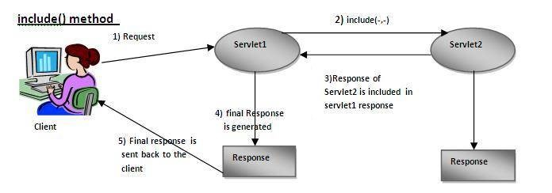

# E-maillevering van webkanaaldocument

Nadat u het interactieve document met webkanalen hebt gedefinieerd en getest, hebt u een leveringsmechanisme nodig om het webkanaaldocument aan de ontvanger te leveren.

In dit artikel bekijken we e-mail als een leveringsmechanisme voor webkanaaldocumenten. De ontvanger krijgt via e-mail een koppeling naar het webkanaaldocument. Wanneer de gebruiker op de koppeling klikt, wordt de gebruiker gevraagd om verificatie en wordt het webkanaaldocument gevuld met de gegevens die specifiek zijn voor de aangemelde gebruiker.

Laten we eens kijken naar het volgende codefragment. Deze code maakt deel uit van GET.jsp die wordt geactiveerd wanneer de gebruiker op de koppeling in de e-mail klikt om het document met het webkanaal weer te geven. We krijgen de aangemelde gebruiker met behulp van de GoogleBbit UserManager. Zodra wij de het programma geopende gebruiker krijgen, krijgen wij de waarde van het accountNumber bezit verbonden aan het profiel van de gebruiker.

Vervolgens koppelen we de waarde accountNumber aan een sleutel met de naam accountnummer op de kaart. De toets **accountnummer** wordt in het formuliergegevensmodaal gedefinieerd als een aanvraagkenmerk. De waarde van dit kenmerk wordt als een invoerparameter doorgegeven aan de leesservicemethode Formuliergegevensmodule.

Lijn 7: Wij verzenden het ontvangen verzoek naar een andere server, die op het middeltype wordt gebaseerd dat door Interactive Communication Document url wordt geïdentificeerd. De reactie die door deze tweede servlet wordt geretourneerd, is opgenomen in de eerste servlet-reactie.

```java
org.apache.jackrabbit.api.security.user.UserManager um = ((org.apache.jackrabbit.api.JackrabbitSession) session).getUserManager();
org.apache.jackrabbit.api.security.user.Authorizable loggedinUser = um.getAuthorizable(session.getUserID());
String accountNumber = loggedinUser.getProperty("profile/accountNumber")[0].getString();
map.put("accountnumber",accountNumber);
slingRequest.setAttribute("paramMap",map);
CustomParameterRequest wrapperRequest = new CustomParameterRequest(slingRequest,"GET");
wrapperRequest.getRequestDispatcher("/content/forms/af/401kstatement/irastatement/channels/web.html").include(wrapperRequest, response);
```



Visuele weergave van regel 7-code


Aanvraagkenmerk gedefinieerd voor leesservice van het modaal formulier voor gegevensverwerking

[Voorbeeld AEM pakket](assets/webchanneldelivery.zip).
