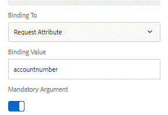

# Interactief communicatiedocument genereren voor afdrukkanaal met behulp van controlemap

Nadat u het afdrukkanaaldocument hebt ontworpen en getest, moet u het document meestal genereren door een REST-aanroep te maken of afdrukdocumenten te genereren aan de hand van het controlemap.

In dit artikel wordt uitgelegd hoe u documenten met afdrukkanalen kunt genereren aan de hand van het mechanisme voor gecontroleerde mappen.

Wanneer u een bestand neerzet in de controlemap, wordt een script uitgevoerd dat is gekoppeld aan een controlemap. Dit script wordt uitgelegd in het onderstaande artikel.

Het bestand dat naar de gecontroleerde map is neergezet, heeft de volgende structuur. De code genereert instructies voor alle accountnummers die in het XML-document worden vermeld.

&lt;accountnumbers>

&lt;accountnumber>509840&lt;/accountnumber>

&lt;accountnumber>948576&lt;/accountnumber>

&lt;accountnumber>398762&lt;/accountnumber>

&lt;accountnumber>291723&lt;/accountnumber>

&lt;/accountnumbers>

In de onderstaande code wordt het volgende gedaan:

Lijn 1 - Weg aan InteractiveCommunicationsDocument

Lijnen 15-20: Hiermee wordt de lijst met accountnummers uit het XML-document opgehaald en in de controlemap geplaatst

Lijnen 24-25: Haal de PrintChannelService en het Kanaal van de Druk verbonden aan het document op.

Regel 30: Geef het accountnummer als het sleutelelement door aan het formuliergegevensmodel.

Lijnen 32-36: Stel de gegevensopties in voor het document dat moet worden gegenereerd.

Regel 38: Render het document.

Regels 39-40 - Hiermee slaat u het gegenereerde document op in het bestandssysteem.

Het REST-eindpunt van het Form Data Model verwacht een id als invoerparameter. deze id wordt in kaart gebracht aan een Attribuut van het Verzoek genoemd accountnummer zoals aangetoond in het hieronder schroevingsschot.



```java
var interactiveCommunicationsDocument = "/content/forms/af/retirementstatementprint/channels/print/";
var saveLocation =  new Packages.java.io.File("c:\\scrap\\loadtesting");

if(!saveLocation.exists())
{
 saveLocation.mkdirs();
}

var inputMap = processorContext.getInputMap();
var entry = inputMap.entrySet().iterator().next();
var inputDocument = inputMap.get(entry.getKey());
var aemDemoListings = sling.getService(Packages.com.mergeandfuse.getserviceuserresolver.GetResolver);
var resourceResolver = aemDemoListings.getServiceResolver();
var resourceResolverHelper = sling.getService(Packages.com.adobe.granite.resourceresolverhelper.ResourceResolverHelper);
var dbFactory = Packages.javax.xml.parsers.DocumentBuilderFactory.newInstance();
var dBuilder = dbFactory.newDocumentBuilder();
var xmlDoc = dBuilder.parse(inputDocument.getInputStream());
var nList = xmlDoc.getElementsByTagName("accountnumber");
for(var i=0;i<nList.getLength();i++)
{
 var accountnumber = nList.item(i).getTextContent();
resourceResolverHelper.callWith(resourceResolver, {call: function()
       {
   var printChannelService = sling.getService(Packages.com.adobe.fd.ccm.channels.print.api.service.PrintChannelService);
   var printChannel = printChannelService.getPrintChannel(interactiveCommunicationsDocument);
   var options = new Packages.com.adobe.fd.ccm.channels.print.api.model.PrintChannelRenderOptions();
   options.setMergeDataOnServer(true);
   options.setRenderInteractive(false);
   var map = new Packages.java.util.HashMap();
   map.put("accountnumber",accountnumber);
    // Required Data Options
   var dataOptions = new Packages.com.adobe.forms.common.service.DataOptions(); 
   dataOptions.setServiceName(printChannel.getPrefillService()); 
   dataOptions.setExtras(map); 
   dataOptions.setContentType(Packages.com.adobe.forms.common.service.ContentType.JSON);
   dataOptions.setFormResource(resourceResolver.resolve(interactiveCommunicationsDocument));
            options.setDataOptions(dataOptions); 
    var printDocument = printChannel.render(options);
   var statement = new Packages.com.adobe.aemfd.docmanager.Document(printDocument.getInputStream());
            statement.copyToFile(new Packages.java.io.File(saveLocation+"\\"+accountnumber+".pdf"));

      }
   });
}
```


**Volg de onderstaande instructies om dit op uw lokale systeem te testen:**

* Setup Tomcat zoals beschreven in deze [artikel.](/help/forms/ic-print-channel-tutorial/set-up-tomcat.md) Tomcat heeft het oorlogsdossier dat de steekproefgegevens produceert.
* Service aka-systeemgebruiker instellen zoals beschreven in deze [artikel](/help/forms/adaptive-forms/service-user-tutorial-develop.md).
Zorg ervoor dat deze systeemgebruiker lees toestemmingen op de volgende knoop heeft. Aanmelden voor machtigingen [gebruikersbeheerder](https://localhost:4502/useradmin) en zoek naar &quot;gegevens&quot; van de systeemgebruiker en geef de leesmachtigingen voor het volgende knooppunt door op het tabblad Machtigingen te klikken
   * /content/dam/formsanddocuments
   * /content/dam/formsanddocuments-fdm
   * /content/forms/af
* Importeer de volgende pakketten in AEM met de pakketmanager. Dit pakket bevat het volgende:


* [Voorbeeld van interactief communicatiedocument](assets/retirementstatementprint.zip)
* [Script voor gecontroleerde mappen](assets/printchanneldocumentusingwatchedfolder.zip)
* [Configuratie gegevensbron](assets/datasource.zip)

* Open het bestand /etc/fd/watchfolder/scripts/PrintPDF.ecma. Zorg ervoor dat het pad naar het interactiveCommunicationsDocument in regel 1 naar het juiste document verwijst dat u wilt afdrukken

* De opslaglocatie wijzigen volgens uw voorkeur op regel 2

* Het bestand accountnumbers.xml maken met de volgende inhoud

```xml
<accountnumbers>
<accountnumber>1</accountnumber>
<accountnumber>100</accountnumber>
<accountnumber>101</accountnumber>
<accountnumber>1009</accountnumber>
<accountnumber>10009</accountnumber>
<accountnumber>11990</accountnumber>
</accountnumbers>
```


* Zet de accountnumbers.xml neer in de map C:\RenderPrintChannel\input folder.

* De gegenereerde PDF-bestanden worden naar saveLocation geschreven, zoals in het ecma-script is opgegeven.

>[!NOTE]
>
>Als u dit wilt gebruiken op een ander besturingssysteem dan Windows, navigeert u naar
>
>/etc/fd/watchfolder /config/PrintChannelDocument en verander de folderPath volgens uw voorkeur
