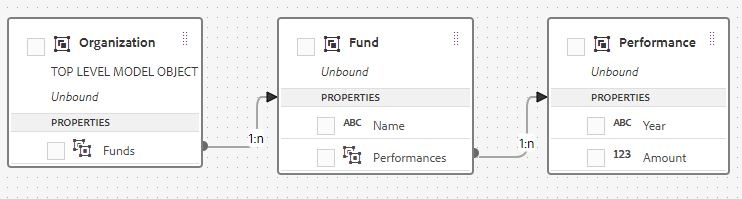

# Diagrammen uit meerdere reeksen

AEM Forms 6.5 introduceerde de capaciteit om veelvoudige reekskaarten tot stand te brengen en te vormen. De veelvoudige reekskaarten worden typisch gebruikt in verband met Lijn, Bar, het grafiektype van de Kolom. De volgende grafiek is een goed voorbeeld van multi reeksengrafiek. De grafiek toont de groei van USD 10.000 in 3 verschillende onderlinge fondsen over een bepaalde periode. Als u dergelijke grafieken in AEM Forms wilt maken en gebruiken, moet u het juiste formuliergegevensmodel maken.

Als u grafieken met meerdere reeksen wilt maken in AEM Forms, moet u een geschikt formuliergegevensmodel maken met de benodigde entiteiten en koppelingen tussen de entiteiten. In de volgende schermafbeelding worden de entiteiten en de koppelingen tussen de drie entiteiten gemarkeerd. Op het hoogste niveau hebben we een entiteit genaamd &quot;Organisatie&quot;, die een één-op-veel associatie heeft met een fondsentiteit. De fondsentiteit heeft op haar beurt een een-op-een-relatie met de prestatieentiteit.

## Formuliergegevensmodel maken voor grafieken uit meerdere reeksen

>[!VIDEO](https://video.tv.adobe.com/v/26352?quality=12&learn=on)

### Lijstreekgrafieken configureren

>[!VIDEO](https://video.tv.adobe.com/v/26353?quality=12&learn=on)

Voer de volgende stappen uit om dit op uw systeem te testen

* [Download en importeer het bestand MutualFundFactSheet.zip met AEM Package Manager.](assets/mutualfundfactsheet.zip)
* [Download SeriesChartSampleData.json op uw harde aandrijving.](assets/serieschartsampledata.json) Dit zijn de steekproefgegevens die worden gebruikt om de grafiek te bevolken.
* [Navigeer naar Forms en Documents.](http://localhost:4502/aem/forms.html/content/dam/formsanddocuments)
* Selecteer voorzichtig de interactieve communicatiesjabloon &quot;MutualFundGrowthFactSheet&quot;.
* Klik op Voorvertoning | Afdrukkanaal | Voorbeeldgegevens uploaden.
* Blader naar het bestand met voorbeeldgegevens dat u als onderdeel van dit artikel hebt opgegeven.
* Geef een voorvertoning weer van het afdrukkanaal van de interactieve communicatie tussen &quot;MutualFundGrowthFactSheet&quot; en de voorbeeldgegevens die u in de vorige stap hebt gedownload.
