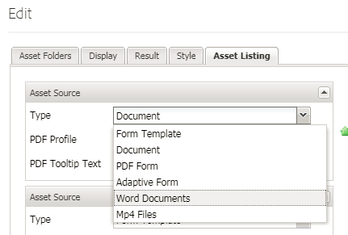

# Aangepaste elementtypen registreren {#registering-custom-asset-types}

Aangepaste elementtypen inschakelen voor aanbieding in AEMForms Portal

>[!NOTE]
>
>Zorg ervoor dat u AEM 6.3 hebt met SP1 en de bijbehorende AEM Forms Add On Geïnstalleerd. Deze functie werkt alleen met AEM Forms 6.3 SP1 en hoger

## Basispad opgeven {#specify-base-path}

Het basispad is het bovenste opslagpad dat alle elementen bevat die een gebruiker in de zoek- en listercomponent wil vermelden. Indien gewenst, kan de gebruiker specifieke plaatsen binnen de basisweg van component ook vormen uitgeven dialoog, zodat het onderzoek op specifieke plaatsen eerder dan het zoeken van alle knopen binnen de basisweg wordt teweeggebracht. Standaard wordt het basispad gebruikt als zoekpadcriteria voor het ophalen van elementen, tenzij de gebruiker een set specifieke paden configureert vanuit deze locatie. Het is belangrijk om een optimale waarde voor dit pad te hebben om een voortreffelijke zoekopdracht te kunnen uitvoeren. De standaardwaarde van het basispad blijft ongewijzigd **_/content/dam/formsanddocuments_** omdat alle AEM Forms-middelen zich bevinden in **_/content/dam/formsanddocuments._**

Stappen om het basispad te configureren

1. Aanmelden bij crx
1. Navigeren naar **/libs/fd/fp/extensions/querybuilder/basepath**

1. Klik op Overlay Node op de werkbalk
1. Zorg ervoor dat de overlaylocatie &quot;/apps/&quot; is
1. Klik op OK
1. Klik op Opslaan
1. Navigeer naar de nieuwe structuur die is gemaakt op **/apps/fd/fp/extensions/querybuilder/basepath**

1. De waarde van de eigenschap path wijzigen in **&quot;/content/dam&quot;**
1. Klik op Opslaan

Door de eigenschap path op te geven **&quot;/content/dam&quot;** u plaatst hoofdzakelijk de Weg van de Basis aan /content/dam. Dit kan worden geverifieerd door de component Search and Lister te openen.

## Aangepaste elementtypen registreren {#register-custom-asset-types}

Er is een nieuw tabblad (Lijst met elementen) toegevoegd aan de zoek- en listercomponent. Dit tabblad bevat een lijst met de elementtypen voor vakken en aanvullende elementtypen die u configureert. Standaard worden de volgende elementtypen weergegeven

1. Adaptieve Forms
1. Formuliersjablonen
1. PDF forms
1. Document (statische PDF)

**Stappen om aangepast elementtype te registreren**

1. Overlay-knooppunt maken van **/libs/fd/fp/extensions/querybuilder/assettypes**

1. De overlaylocatie instellen op &quot;/apps&quot;
1. Navigeer naar de nieuwe structuur die is gemaakt op `/apps/fd/fp/extensions/querybuilder/assettypes`

1. Maak onder deze locatie een &#39;nt:unStructured&#39; knooppunt voor het type dat moet worden geregistreerd, geef het knooppunt een naam **mp4files. De volgende twee eigenschappen toevoegen aan dit knooppunt mp4files**

   1. Voeg de eigenschap jcr:title toe om de weergavenaam van het elementtype op te geven. Stel de waarde van jcr:title in op &quot;MP4-bestanden&quot;.
   1. Voeg de eigenschap &quot;type&quot; toe en stel de waarde ervan in op &quot;videos&quot;. Dit is de waarde die we in onze sjabloon gebruiken om elementen van het type video&#39;s weer te geven. Sla uw wijzigingen op.

1. Maak een knooppunt van het type &quot;nt:unStructured&quot; onder mp4files. Noem deze knoop &quot;onderzoekscriteria&quot;
1. Voeg een of meer filters toe onder zoekcriteria. Als de gebruiker bijvoorbeeld een zoekfilter wil hebben voor het weergeven van MP4Files waarvan het mime-type &quot;video/mp4&quot; is, kunt u dit hier doen
1. Maak een knooppunt van het type &quot;nt:unStructured&quot; onder de zoekcriteria voor knooppunten. Noem deze knoop &quot;filetypes&quot;
1. Voeg de volgende 2 eigenschappen toe aan dit knooppunt &quot;filetypes&quot;

   1. name: ./jcr:content/metadata/dc:format
   1. waarde: video/mp4

1. Dit betekent dat elementen waarvan de eigenschap dc:format gelijk is aan video/mp4, worden beschouwd als activa van het type &quot;Mp4-video&#39;s&quot;. U kunt elke eigenschap die in het knooppunt &quot;jcr:content/metadata&quot; wordt vermeld, gebruiken voor de zoekcriteria

1. **Sla uw werk op**

Nadat u de bovenstaande stappen hebt uitgevoerd, wordt het nieuwe elementtype (Mp4-bestanden) weergegeven in de vervolgkeuzelijst met elementtypen van de component Zoeken en Registreren, zoals hieronder wordt weergegeven

[Als u problemen hebt om dit aan het werk te krijgen, kunt u het volgende pakket invoeren.](assets/assettypeskt1.zip) Voor het pakket zijn twee aangepaste elementtypen gedefinieerd. MP4-bestanden en WordDocuments. Stel voor dat u een blik werpt op de **/apps/fd/fp/extensions/querybuilder/assettypes**

[Het aangepaste portalpakket installeren](assets/customportalpage.zip). Dit pakket bevat een voorbeeldportalpagina. Deze pagina wordt gebruikt in deel 2 van deze zelfstudie
