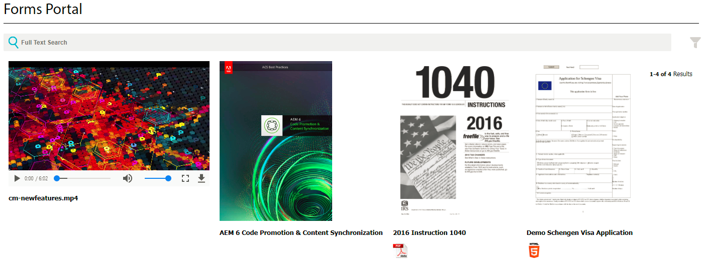

# Aangepaste assettypen aanbieden in AEM Forms {#listing-custom-asset-types-in-aem-forms}

## Aangepaste sjablonen maken {#creating-custom-template}


In het kader van dit artikel maken we een aangepaste sjabloon om de typen aangepaste elementen en de typen OOTB-elementen op dezelfde pagina weer te geven. Volg de onderstaande instructies om een aangepaste sjabloon te maken

1. Een schuine streep maken: map onder /apps. Geef het veld de naam &quot; myportalcomponent &quot;
1. Voeg een eigenschap &quot;fpContentType&quot; toe. Stel de waarde in op &quot;**/libs/fd/ fp/formTemplate&quot;.**
1. Voeg een eigenschap &quot;title&quot; toe en stel de waarde ervan in op &quot;custom template&quot;. Dit is de naam die u zult zien in de vervolgkeuzelijst van de component Search and Lister
1. Maak een &#39;&#39;template.html&#39;&#39; in deze map. Dit bestand bevat de code voor het opmaken en weergeven van de verschillende elementtypen.


De volgende code geeft een overzicht van de verschillende typen elementen die de zoek- en bibliotheekcomponent gebruiken. Er worden afzonderlijke html-elementen gemaakt voor elk type element, zoals wordt weergegeven door het gegevenstype = &quot;video&quot;-tag. Voor het elementtype &quot;video&#39;s&quot; gebruiken we de optie &lt;video> -element om de video inline af te spelen. Voor het elementtype &quot;worddocuments&quot; gebruiken we een andere HTML-markering.

```html
<div class="__FP_boxes-container __FP_single-color">
   <div  data-repeatable="true">
     <div class = "__FP_boxes-thumbnail" style="float:left;margin-right:20px;" data-type = "videos">
   <video width="400" controls>
       <source src="${path}" type="video/mp4">
    </video>
         <h3 class="__FP_single-color" title="${name}" tabindex="0">${name}</h3>
     </div>
     <div class="__FP_boxes-thumbnail" style="float:left;margin-right:20px;" data-type = "worddocuments">
       <a href="/assetdetails.html${path}" target="_blank">
           
          </a>
          <h3 class="__FP_single-color" title="${name}" tabindex="0">${name}</h3>
     </div>
  <div class="__FP_boxes-thumbnail" style="float:left;margin-right:20px;" data-type = "xfaForm">
       <a href="/assetdetails.html${path}" target="_blank">
           
          </a>
          <h3 class="__FP_single-color" title="${name}" tabindex="0">${name}</h3>
                <a href="{formUrl}"></a><p>

     </div>
  <div class="__FP_boxes-thumbnail" style="float:left;margin-right:20px;" data-type = "printForm">
       <a href="/assetdetails.html${path}" target="_blank">
           
          </a>
          <h3 class="__FP_single-color" title="${name}" tabindex="0">${name}</h3>
                <a href="{pdfUrl}"></a><p>
     </div>
   </div>
</div>
```

>[!NOTE]
>
>Regel 11 - Wijzig de afbeeldingsbron zodat deze verwijst naar een afbeelding van uw keuze in DAM.
>
>Als u Adaptief Forms in deze sjabloon wilt weergeven, maakt u een nieuw div-element en stelt u het kenmerk voor het gegevenstype in op &quot;hulplijn&quot;. U kunt de div kopiëren en plakken waarvan gegevenstype=&quot;printForm en het onlangs gekopieerde div-gegevenstype instellen op &quot;hulplijn&quot;

## De component Search en Lister configureren {#configure-search-and-lister-component}

Zodra wij het douanemalplaatje hebben bepaald, moeten wij dit douanemalplaatje met de component &quot;van het Onderzoek en van de Registratie&quot;associëren. Wijs uw browser aan [naar deze URL ](http://localhost:4502/editor.html/content/AemForms/CustomPortal.html).

Schakel over naar de ontwerpmodus en configureer het alineasysteem om de component Zoeken en registreren op te nemen in de toegestane componentengroep. De component Search en Lister maakt deel uit van de groep Document Services.

Schakel over naar bewerkingsmodus en voeg de component Zoeken en Registreren toe aan de ParSys.

Open de configuratie-eigenschappen van de component &quot;Search and Lister&quot;. Controleer of het tabblad &quot;Mappen van middelen&quot; is geselecteerd. Selecteer de mappen waaruit u de elementen in de zoek- en bibliotheekcomponent wilt weergeven. Voor de toepassing van dit artikel heb ik

* /content/dam/VideosAndWordDocuments
* /content/dam/formsanddocuments/assettypes


Tab naar het tabblad &quot;Weergave&quot;. Hier kiest u de sjabloon die u wilt weergeven in de zoekopdracht en de bibliotheekcomponent.

Selecteer &#39;aangepaste sjabloon&#39; in de vervolgkeuzelijst, zoals hieronder wordt weergegeven.


Vorm de types van activa die u in het portaal wilt een lijst maken. De typen elementen op het tabblad &quot;Lijst met elementen&quot; configureren en de typen elementen configureren. In dit voorbeeld zijn de volgende typen elementen geconfigureerd

1. MP4-bestanden
1. Word-documenten
1. Document(Dit is een OOTB-type element)
1. Formuliersjabloon (dit is een ander type OOTB-element)

Het volgende het schermschot toont u de activa die voor lijst worden gevormd


Nu u uw Onderzoek en de Kleine Component van het Portaal hebt gevormd, is het tijd om de lijst in actie te zien. Wijs uw browser aan [naar deze URL ](http://localhost:4502/content/AemForms/CustomPortal.html?wcmmode=disabled). De resultaten moeten ongeveer overeenkomen met de onderstaande afbeelding.

>[!NOTE]
>
>Als in uw portal aangepaste elementtypen worden vermeld op een publicatieserver, moet u de gebruiker &quot;read&quot; toestemming geven voor het verzenden van het knooppunt **/apps/fd/fp/extensions/querybuilder**


[Download en installeer dit pakket met pakketbeheer.](assets/customassettypekt1.zip) Dit bevat voorbeeld-MP4- en Word-documenten en xdp-bestanden die worden gebruikt als elementtypen voor het weergeven van lijsten met behulp van de component Search en List
