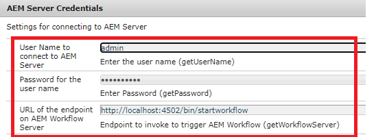
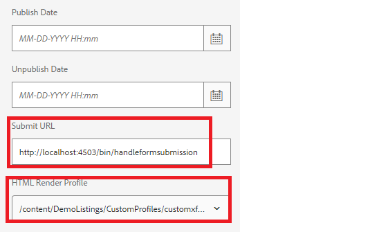

# Gebruiksscenario&#39;s voor dit gebruik aan uw systeem laten werken

>[!NOTE]
>
>De voorbeeldbestanden werken alleen op uw systeem als u toegang hebt tot een AEM Forms-auteur en een AEM Forms-publicatieexemplaar.

Ga als volgt te werk om deze kwestie van het gebruik op uw lokale systeem te laten werken:

## Het volgende implementeren op uw AEM Forms-auteurinstantie

* [De MobileFormToWorkflow-bundel installeren](assets/MobileFormToWorkflow.core-1.0.0-SNAPSHOT.jar)

* [ de Invoer het douaneprofiel ](assets/customprofile.zip) dat de gegevens van de vorm HTML5 met XDP samenvoegt en interactieve pdf terugkeert.

* [ stel het Ontwikkelen met de bundel van de Gebruiker van de Dienst ](https://experienceleague.adobe.com/docs/experience-manager-learn/assets/developingwithserviceuser.zip?lang=nl-NL) op
Voeg de volgende ingang in de Dienst van het Mapper van de Gebruiker van de Dienst van Apache Sling toe gebruikend configMgr

```
DevelopingWithServiceUser.core:getformsresourceresolver=fd-service
```

* U kunt de vormvoorlegging in een verschillende omslag opslaan door de omslagnaam in de configuratie van de Referenties van de Server van AEM te specificeren gebruikend [ configMgr ](http://localhost:4502/system/console/configMg). Als u de omslag verandert, zorg ervoor u een lancerer op de omslag creeert om de werkstroom **te teweegbrengen ReviewSubmissionPDF**


* [ voer de steekproef xdp en het werkschemapakket in gebruikend pakketmanager ](assets/xdp-form-and-workflow.zip).


## De volgende elementen implementeren in een publicatie-instantie

* [De MobileFormToWorkflow-bundel installeren](assets/MobileFormToWorkflow.core-1.0.0-SNAPSHOT.jar)

* Specificeer de gebruikersbenaming/het wachtwoord voor de auteursinstantie en een **bestaande plaats in uw bewaarplaats van AEM** om de voorgelegde gegevens in de geloofsbrieven op te slaan van de Server van AEM gebruikend [ configMgr ](http://localhost:4503/system/console/configMgr). U kunt URL van het eindpunt op de Server van het Werkschema van AEM verlaten zoals is. Dit is het eindpunt dat de gegevens uit de voorlegging in gespecificeerde knoop haalt en opslaat.
  

* [ stel het Ontwikkelen met de bundel van de Gebruiker van de Dienst ](https://experienceleague.adobe.com/docs/experience-manager-learn/assets/developingwithserviceuser.zip?lang=nl-NL) op
* [ open de configuratie van osgi ](http://localhost:4503/system/console/configMgr).
* Onderzoek naar **Apache het Verdelen Filter van de Verwijzing**. Controleer of het selectievakje Lege waarden toestaan is ingeschakeld.
* [ de Invoer het douaneprofiel ](assets/customprofile.zip) dat de gegevens van de vorm HTML5 met XDP samenvoegt en interactieve pdf terugkeert.


## De oplossing testen

* Aanmelden bij de instantie van uw auteur
* [ geeft de geavanceerde eigenschappen van w9.xdp ](http://localhost:4502/libs/fd/fm/gui/content/forms/formmetadataeditor.html/content/dam/formsanddocuments/w9.xdp) uit. Zorg ervoor dat de verzendURL en het renderprofiel op de juiste wijze zijn ingesteld, zoals hieronder wordt weergegeven.
  

* De w9.xdp publiceren
* Aanmelden voor publicatie-instantie
* [ Voorproef de w9 vorm ](http://localhost:4503/content/dam/formsanddocuments/w9.xdp/jcr:content)
* Vul verschillende velden in en klik op de knop op de werkbalk om de interactieve PDF te downloaden.
* Vul de gedownloade PDF in met Acrobat en klik op Verzenden.
* Je moet een succesbericht krijgen
* Aanmelden bij AEM Author-instantie als beheerder
* [ Controle AEM Inbox ](http://localhost:4502/aem/inbox)
* Je moet een werkitem hebben om de verzonden PDF te bekijken

>[!NOTE]
>
>In plaats van de PDF naar servlet te verzenden die op publicatieexemplaar loopt, hebben sommige klanten servlet in servlet container zoals Tomcat opgesteld. Het hangt allemaal van de topologie af de klant met.for het doel van dit leerprogramma vertrouwd is wij servlet gebruiken die bij wordt opgesteld om instantie te publiceren voor de behandeling van pdf- voorlegging wordt opgesteld.
