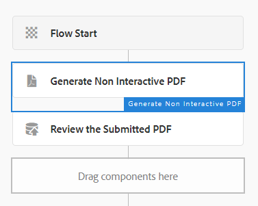

# Workflow voor het reviseren en goedkeuren van de verzonden PDF

De laatste en laatste stap bestaat uit het maken van AEM workflow die een statische of niet-interactieve PDF genereert voor revisie en goedkeuring. De workflow wordt geactiveerd via een AEM Launcher die op het knooppunt `/content/pdfsubmissions` is geconfigureerd.

In de volgende schermafbeelding worden de stappen weergegeven die bij de workflow horen.

## Niet-interactieve PDF-werkstroomstap genereren

Hier worden de XDP-sjabloon en de gegevens die met de sjabloon moeten worden samengevoegd, opgegeven. De gegevens die moeten worden samengevoegd, zijn de verzonden gegevens uit de PDF. Deze verzonden gegevens worden opgeslagen onder het knooppunt `/content/pdfsubmissions`.

De gegenereerde PDF wordt toegewezen aan de werkstroomvariabele `submittedPDF`.

### De gegenereerde pdf ter controle en goedkeuring toewijzen

De taakworkflowcomponent toewijzen wordt hier gebruikt om het gegenereerde PDF-bestand toe te wijzen voor revisie en goedkeuring. De variabele `submittedPDF` wordt gebruikt op het lusje van Forms en van Documenten van de het werkschemacomponent van de Taak toewijzen.

