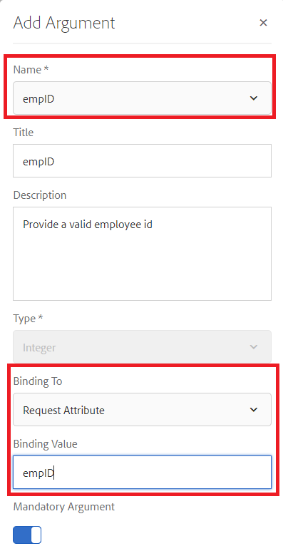

# Formuliergegevensmodel configureren

## Apache Sling Connection Pooled DataSource

De eerste stap bij het maken van een formulier met RDBMS-ondersteuning is het configureren van Apache Sling Connection Pooled DataSource. Volg onderstaande stappen om de gegevensbron te configureren:

* Wijs uw browser aan [configMgr](http://localhost:4502/system/console/configMgr)
* Zoeken naar **Apache Sling Connection Pooled DataSource**
* Voeg een nieuwe ingang toe en verstrek de waarden zoals aangetoond in het schermafbeelding.
* 
* Uw wijzigingen opslaan

>[!NOTE]
>De URI van de verbinding JDBC, de gebruikersnaam en het Wachtwoord zullen afhankelijk van uw MySQL gegevensbestandconfiguratie veranderen.

## Formuliergegevensmodel maken

* De browser naar [gegevensintegratie verwijzen](http://localhost:4502/aem/forms.html/content/dam/formsanddocuments-fdm)
* Klik op _Maken_->_Formuliergegevensmodel_
* Geef een betekenisvolle naam en titel op voor het gegevensmodel van het formulier, zoals **Werknemer**
* Klik op _Next_
* Selecteer de gegevensbron die in de vorige sectie (forums) is gemaakt
* Klik op _Maken_->Bewerken om het nieuwe formuliergegevensmodel te openen in de bewerkingsmodus
* Vouw het knooppunt _forums_ uit om het werknemerschema weer te geven. Breid de werknemersknoop uit om de 2 lijsten te zien

## Entiteiten aan uw model toevoegen

* Zorg ervoor dat het werknemersknooppunt wordt uitgebreid
* Selecteer de entiteiten waaraan u wilt toevoegen en selecteer de entiteiten waaraan u de begunstigden wilt toevoegen en klik op Geselecteerde _toevoegen_

## Lees service toevoegen aan nieuwe entiteit

* Vernieuwde entiteit selecteren
* Klik op Eigenschappen _bewerken_
* Selecteer get in de vervolgkeuzelijst Leesservice
* Klik + pictogram om parameter aan de get dienst toe te voegen
* Geef de waarden op die worden weergegeven in de schermafbeelding
* 
>[!NOTE]
> De get-service verwacht een waarde die is toegewezen aan de empID-kolom van een nieuwe entiteit. Er zijn meerdere manieren om deze waarde door te geven en in deze zelfstudie wordt de empID doorgegeven via de aanvraagparameter empID.
* Klik op _Gereed_ om de argumenten voor de get-service op te slaan
* Klik op _Gereed_ om wijzigingen in het formuliergegevensmodel op te slaan

## Koppeling toevoegen tussen 2 entiteiten

De koppelingen die zijn gedefinieerd tussen database-entiteiten, worden niet automatisch gemaakt in het formuliergegevensmodel. De koppelingen tussen entiteiten moeten worden gedefinieerd met behulp van de formuliergegevensmodeleditor. Elke nieuwe entiteit kan een of meer begunstigden hebben, we moeten een-op-een-associatie definiëren tussen de entiteiten die het liefst van de Unie en de begunstigden zijn.
De volgende stappen zullen u door het proces lopen om de één-aan-vele vereniging tot stand te brengen

* Selecteer een nieuwe entiteit en klik op Koppeling _toevoegen_
* Geef de koppeling en andere eigenschappen een betekenisvolle titel en id, zoals in de onderstaande schermafbeelding wordt getoond
   

* Klik op het pictogram _Bewerken_ onder de sectie Argumenten

* Waarden opgeven zoals deze schermafbeelding wordt weergegeven
* 
* **We koppelen de twee entiteiten met behulp van de empID-kolom van begunstigden en nieuwe entiteiten.**
* Klik op _Gereed_ om uw wijzigingen op te slaan

## Uw formuliergegevensmodel testen

Ons formuliergegevensmodel heeft nu de **_get_** -service die empID accepteert en de details van het netwerk en de begunstigden retourneert. Volg onderstaande stappen om de service voor ophalen te testen.

* Vernieuwde entiteit selecteren
* Klik op _Testmodelobject_
* Geef een geldige empID op en klik op _Testen_
* U zou resultaten moeten krijgen zoals aangetoond in het hieronder ontsproten scherm
* 
