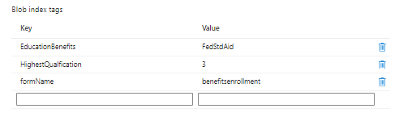

# Aangepaste verzending maken

Er is een aangepaste verzendhandler geschreven voor het verzenden van formulieren. Op een hoog niveau doet de aangepaste verzendhandler het volgende

* Extraheert de naam van het verzonden formulier.
* Extraheert de verzonden gegevens. De verzonden gegevens van een formulier op basis van een kerncomponent hebben altijd de JSON-indeling.
* Hiermee worden de formulierbijlagen opgehaald en opgeslagen in het Azure-portaal. Hiermee werkt u de ingediende JSON-gegevens bij met de URL van de bijlage.
* Hiermee maakt u blob-indexcodes. Hiermee zoekt u naar de lijst met doorzoekbare velden voor het formulier en de bijbehorende waarde van de verzonden gegevens.
* Koppelt de blob-indextags aan de verzonden gegevens en slaat deze op in de Azure-portal.

Het volgende schermschot toont u de blob indexmarkeringen in Azure portaal

De douane legt code voor is in **_StoreFormDataWithBlobIndexTagsInAzure_** en de code voor het opslaan van en het terugwinnen van gegevens van Azure is in de component **_SaveAndFetchFromAzure_**

## Volgende stappen

[Query-interface samenstellen](./part3.md)
