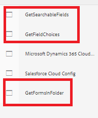

# Het voorbeeld op uw lokale server implementeren

Volg de onderstaande stappen om deze toepassing geschikt te maken voor uw lokale server. Er wordt aangenomen dat uw AEM-exemplaar wordt uitgevoerd op localhost, 4502-poort.

* [ installeer het pakket ](assets/azuredemo.all-1.0.0-SNAPSHOT.zip) gebruikend pakketmanager.

* Verstrek de Azure poortgeloofsbrieven gebruikend OSGi configMgr
  
Zorg ervoor dat de opslag-URI eindigt in slash en dat het SAS-token begint met een ?
* Navigeer aan [ AzureDemo ](http://localhost:4502/libs/fd/fdm/gui/components/admin/fdmcloudservice/fdm.html/conf/azuredemo)

* Geef de authentificatiemontages van de volgende 3 gegevensbronnen uit om uw milieu aan te passen
  

* De voorproef en legt [ vorm ContactUs ](http://localhost:4502/content/dam/formsanddocuments/azureportal/contactus/jcr:content?wcmmode=disabled) voor

* [ Vraag uw vormvoorlegging ](http://localhost:4502/content/dam/formsanddocuments/azureportal/queryformsubmissions/jcr:content?wcmmode=disabled)
