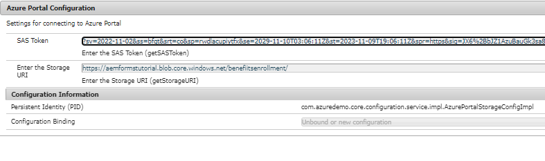

# Het voorbeeld op uw lokale server implementeren

Volg de onderstaande stappen om deze toepassing op uw lokale server te laten werken. Er wordt aangenomen dat uw AEM op localhost, 4502-poort, wordt uitgevoerd.

* [Het pakket installeren](assets/azuredemo.all-1.0.0-SNAPSHOT.zip) met pakketbeheer.

* Verstrek de Azure poortgeloofsbrieven gebruikend OSGi configMgr
  
Zorg ervoor dat de opslag-URI eindigt in slash en dat het SAS-token begint met een ?
* Navigeren naar [AzureDemo](http://localhost:4502/libs/fd/fdm/gui/components/admin/fdmcloudservice/fdm.html/conf/azuredemo)

* Geef de authentificatiemontages van de volgende 3 gegevensbronnen uit om uw milieu aan te passen
  

* Voorvertonen en verzenden [ContactU-formulier](http://localhost:4502/content/dam/formsanddocuments/azureportal/contactus/jcr:content?wcmmode=disabled)

* [Vraag uw formulierverzending](http://localhost:4502/content/dam/formsanddocuments/azureportal/queryformsubmissions/jcr:content?wcmmode=disabled)
