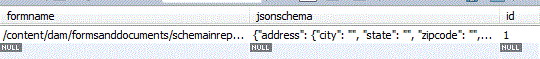

# JSON-schema opslaan in database {#storing-json-schema-in-database}


Als u een query wilt uitvoeren op de verzonden gegevens, moet u het JSON-schema opslaan dat is gekoppeld aan het verzonden formulier. Het schema JSON wordt gebruikt in de vraagbouwer om de vraag te bouwen.

Wanneer een Adaptief formulier wordt verzonden, controleren we of het bijbehorende JSON-schema zich in de database bevindt. Als het JSON-schema niet bestaat, wordt het JSON-schema opgehaald en wordt het schema in de juiste tabel opgeslagen. De formuliernaam wordt ook gekoppeld aan het JSON-schema. In de volgende schermafbeelding ziet u de tabel waarin de JSON-schema&#39;s zijn opgeslagen.



```java
public String getJSONSchema(String afPath) {
  // TODO Auto-generated method stub
  afPath = afPath.replaceAll("/content/dam/formsanddocuments/", "/content/forms/af/");
  Resource afResource = getResolver.getServiceResolver().getResource(afPath + "/jcr:content/guideContainer");
  javax.jcr.Node resNode = afResource.adaptTo(Node.class);
  String schemaNode = null;
  try {
   schemaNode = resNode.getProperty("schemaRef").getString();
  } catch (ValueFormatException e) {
   // TODO Auto-generated catch block
   e.printStackTrace();
  } catch (PathNotFoundException e) {
   // TODO Auto-generated catch block
   e.printStackTrace();
  } catch (RepositoryException e) {
   // TODO Auto-generated catch block
   e.printStackTrace();
  }
  if (schemaNode.startsWith("/content/dam")) {
   log.debug("The schema is in the dam");
   afResource = getResolver.getServiceResolver()
     .getResource(schemaNode + "/jcr:content/renditions/original/jcr:content");
   resNode = afResource.adaptTo(Node.class);
   InputStream jsonSchemaStream = null;
   try {
    jsonSchemaStream = resNode.getProperty("jcr:data").getBinary().getStream();
    Charset charset = StandardCharsets.UTF_8;
    String jasonSchemaString = IOUtils.toString(jsonSchemaStream, charset);
    log.debug("The Schema is " + jasonSchemaString);
    return jasonSchemaString;
   } catch (ValueFormatException e) {
    // TODO Auto-generated catch block
    e.printStackTrace();
   } catch (PathNotFoundException e) {
    // TODO Auto-generated catch block
    e.printStackTrace();
   } catch (RepositoryException e) {
    // TODO Auto-generated catch block
    e.printStackTrace();
   } catch (IOException e) {
    // TODO Auto-generated catch block
    e.printStackTrace();
   }
  }
  if (schemaNode.startsWith("/assets")) {
   afResource = getResolver.getServiceResolver()
     .getResource(afPath + "/jcr:content/guideContainer/" + schemaNode + "/jcr:content");
   resNode = afResource.adaptTo(Node.class);
   InputStream jsonSchemaStream = null;
   try {
    jsonSchemaStream = resNode.getProperty("jcr:data").getBinary().getStream();
    Charset charset = StandardCharsets.UTF_8;
    String jasonSchemaString = IOUtils.toString(jsonSchemaStream, charset);
    log.debug("The Schema is " + jasonSchemaString);
    return jasonSchemaString;
   } catch (ValueFormatException e) {
    // TODO Auto-generated catch block
    e.printStackTrace();
   } catch (PathNotFoundException e) {
    // TODO Auto-generated catch block
    e.printStackTrace();
   } catch (RepositoryException e) {
    // TODO Auto-generated catch block
    e.printStackTrace();
   } catch (IOException e) {
    // TODO Auto-generated catch block
    e.printStackTrace();
   }
  }

  return null;

 }
```

>[!NOTE]
>
>Wanneer u een adaptief formulier maakt, kunt u JSON-schema gebruiken dat zich in de gegevensopslagruimte bevindt, of een JSON-schema uploaden. De bovenstaande code werkt in beide gevallen.

Het opgehaalde schema wordt opgeslagen in het gegevensbestand gebruikend de standaardverrichtingen JDBC. De volgende code voegt het schema in het gegevensbestand in

```java
public void insertJsonSchema(JSONObject jsonSchema, String afForm) {
  log.debug("$$$$ in insert Schema" + afForm);
  log.debug("$$$$$ The jsonSchema is  " + jsonSchema);
  Connection con = getConnection();
  log.debug("$$$$ got connection is insertJsonSchema");
  String insertTableSQL = "INSERT INTO leads.jsonschemas(jsonschema,formname) VALUES(?,?)";
  PreparedStatement pstmt = null;
  try {

   // org.json.JSONObject jsonSchemaObj = new
   // org.json.JSONObject(jsonSchema);
   pstmt = con.prepareStatement(insertTableSQL);
   pstmt.setString(1, jsonSchema.toString());
   pstmt.setString(2, afForm);
   log.debug("Executing the insert  json schema statment  " + pstmt.executeUpdate());
   con.commit();
  } catch (SQLException e) {
   // TODO Auto-generated catch block
   e.printStackTrace();
  } finally {
   if (con != null) {
    try {
     con.close();
    } catch (SQLException e) {
     // TODO Auto-generated catch block
     e.printStackTrace();
    }
   }
  }

 }
```

Om samen te vatten hebben we tot nu toe het volgende gedaan

* Adaptief formulier maken op basis van JSON-schema
* Als het formulier de eerste keer wordt verzonden, wordt het JSON-schema opgeslagen dat aan het formulier is gekoppeld in de database.
* De gebonden gegevens van het adaptieve formulier worden opgeslagen in de database.

De volgende stappen zouden moeten gebruiken QueryBuilder om de gebieden aan onderzoek te tonen die op het Schema JSON worden gebaseerd
