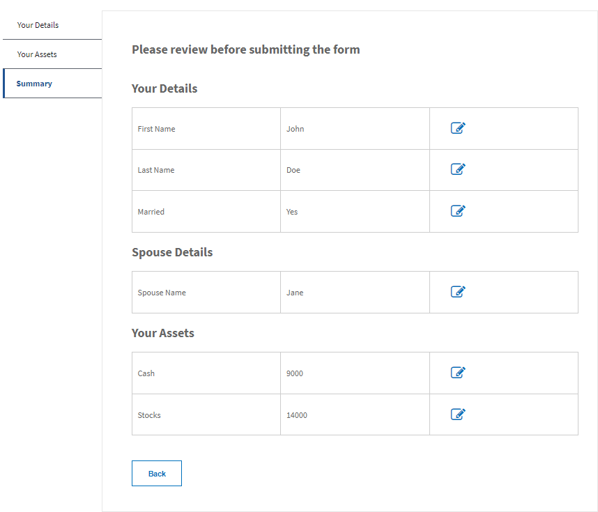

# Formuliergegevens controleren vóór verzending

Een zelfstudie met meerdere onderdelen om u door de stappen te laten lopen die nodig zijn voor het maken van een overzichtscomponent voor het reviseren en bewerken van formuliergegevens voordat u het formulier verzendt.

Als u deze zelfstudie wilt volgen, is het raadzaam het volgende te installeren:

* AEM 6.5 of hoger met de juiste addon-pakketten voor formulieren

U wordt ook aangeraden om enige mate van ontwikkelaarservaring te hebben met AEM en AEM Forms.

## Volgende stappen

[Gegevens samenvatten met behulp van aangepaste component](./create-component.md)